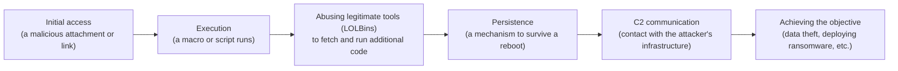

## Introduction

- **What you'll get from this article**: [Understanding How Microsoft Defender Works](/en/articles/windows-defender-guide) touched on the difference between signature-based and heuristic detection, but never got into what "getting infected with malware" actually looks like internally, step by step. This article systematically covers the sequence that unfolds behind a single action — opening a suspicious email attachment, visiting a suspicious site — **initial access → execution → persistence → external communication (C2) → achieving the objective** — and why each of these stages tends to happen without anyone noticing.
- **Intended audience**: Readers who picture "running a suspicious file triggers a script that steals your data," a somewhat oversimplified mental model, but can't concretely explain how real infections actually unfold in stages, quietly.
- **Estimated reading time**: About 18 minutes

This article is part of the [Top 1% Series — Full Article Guide](/en/sitemap), and the 6th entry in the [Windows Client Operations series](/en/sitemap#series-list). Reading [Understanding How Microsoft Defender Works](/en/articles/windows-defender-guide) first will make this article easier to follow.

## Prerequisite Knowledge

- **Signature-based detection and heuristic detection**: Covered in [Understanding How Microsoft Defender Works](/en/articles/windows-defender-guide) — the two detection approaches: matching against known patterns, versus inferring from suspicious behavior.

## Getting the Big Picture

### In a nutshell

**Real malware infection isn't a single event — "opening a suspicious file instantly triggers a dramatic script that grabs your data all at once." It's a sequence that unfolds across multiple stages: initial access, execution, persistence, external communication, and achieving the objective.** And at many points along that chain, attackers make detection difficult **not by bringing in new malicious software, but by abusing legitimate tools that already ship with Windows.**

## Deep Dive into the Fundamentals

### Initial access and execution: the attachment isn't the payload — it's the door

When you open a suspicious email attachment (an Office document, say), that document file itself is actually rarely a complete piece of malware. **More often, a macro embedded in it, or a small script fetched from a linked address, simply serves as the "door" that calls in the next stage.** At this point, it's not unusual for the real payload to not even exist on the machine yet.

### Why it looks "silent": abusing legitimate tools (LOLBins)

This is the single most important point in this article. Rather than bringing in a custom-built, suspicious executable of their own, attackers often **abuse legitimate executables that already ship with Windows, signed by Microsoft itself** — `PowerShell.exe`, `rundll32.exe`, `mshta.exe`, `certutil.exe`, and others — to carry out the next stage. This technique is called **LOLBins** (Living Off the Land Binaries).

Why LOLBins tend to slip past detection

`PowerShell.exe` and `rundll32.exe` are also tools system administrators use legitimately, every day. That means they **can never really be a target for signature-based detection in the first place** — they're not a known "bad file," they're a genuine, unmodified Microsoft file. Because they carry Microsoft's own signature, many security products' **reputation-based judgment also treats them as "trusted files."** Attackers turn the very fact that "it's a legitimate tool, so it's less likely to be suspected" against you — by feeding these tools malicious arguments or parameters, like instructions to download and execute additional code from outside, they get these tools to effectively do malware's job for them.

### Going fileless: no "suspicious file" ever exists on disk

The additional code fetched via LOLBins is sometimes **never saved as a file on disk at all — it's unpacked and run purely in memory.** This is called a **fileless** attack. Most signature-based detection assumes it's scanning the contents of a file on disk, so a fileless technique — where there's no "file" to scan in the first place — tends, by its very nature, to slip through undetected. This is exactly why you sometimes see the situation: "I opened a suspicious file, but checking the disk afterward turns up nothing suspicious at all."

### Persistence: a mechanism to survive a reboot

If an attack doesn't complete in a single run, attackers set up **persistence** — a mechanism to make sure their code runs again even after the machine reboots. Common techniques include registering an entry in a registry auto-run key, registering a suspicious task in Task Scheduler, or setting a trap using WMI (Windows Management Instrumentation) event subscriptions. Most of these, too, are simply legitimate mechanisms Windows already provides by default — which is exactly the tricky part: the mere observation "something got registered in the registry" or "there's one extra scheduled task" doesn't, on the surface, tell you whether it's a legitimate configuration or a persistence trap.

### C2 communication: ongoing contact with the attacker's external infrastructure

Once a foothold is established on the machine, many attacks periodically communicate with an external server the attacker controls, called **C2 (Command and Control)**. Much of this traffic **blends into ordinary HTTPS traffic**, so the content itself is encrypted — from the bare fact that "encrypted traffic is going somewhere external," it's genuinely difficult to tell whether that's legitimate business traffic or C2 communication. In recent years, rather than standing up their own suspicious server, some attackers have abused **legitimate cloud services (widely used file-sharing services, for example) as a relay point for C2**, attempting to slip past blocking that's based on the reputation of the destination domain itself.

## What Top-1% Engineers See

### This is where "signature-based detection alone isn't enough" clicks into place

Given everything covered so far, the reason [Understanding How Microsoft Defender Works](/en/articles/windows-defender-guide) described **multiple defensive layers working together — heuristic detection, behavioral monitoring, cloud protection, and Attack Surface Reduction (ASR) rules** — becomes concrete. LOLBins and fileless techniques are **specifically designed to slip past the exact judgment axis signature-based detection relies on: matching against a known-bad file.** That's precisely why behavior-based detection matters — watching whether a legitimate tool is doing something unusual (running with unfamiliar arguments, initiating suspicious outbound contact, and so on). It's also exactly why ASR rules take a preventive approach, banning specific behavior patterns outright — like a child process launching from an Office document — to shut off this initial-access-and-execution stage before it ever happens.

## Common Misconceptions and Pitfalls

- **Misconception 1: "Getting infected with malware immediately causes dramatic symptoms — visual glitches, a sudden slowdown, and so on."**
  Most real attacks are specifically designed to move quietly through multiple stages, from initial access all the way to achieving the objective (data theft, deploying ransomware, and so on), staying unnoticed for as long as possible.
- **Misconception 2: "If security software is installed, every technique gets reliably detected."**
  LOLBins and fileless techniques are specifically designed to slip past the judgment axis signature-based detection relies on — a combination of multiple defensive layers, including behavioral detection and cloud protection, is required.
- **Misconception 3: "If no suspicious file turns up, that's proof you weren't infected."**
  A fileless attack can unpack its additional code purely in memory without ever saving it as a file on disk, so the absence of a suspicious file on disk doesn't prove you weren't infected.

## Troubleshooting Perspective

When malware infection is suspected, most real-world investigation starts by isolating **"which of these stages — initial access, execution, persistence, C2 communication — has evidence you can actually confirm."**

1. **Unfamiliar process arguments or execution history are found**: Check execution logs for whether a legitimate tool like `PowerShell.exe` or `rundll32.exe` ran with arguments or parameters that don't match normal business usage.
2. **An unfamiliar scheduled task or registry auto-run key is found**: Trace when it was registered, by whom, and through what operation, to confirm whether it came from legitimate operations.
3. **Outbound communication is observed that shouldn't happen during normal business operations**: Check the reputation of the destination domain/IP address, and look at the timing and frequency pattern of the traffic (is there a regular, beacon-like rhythm to it?).

### Prevention and Long-Term Countermeasures

- Don't rely on signature-based detection alone — combine it with behavioral detection, cloud protection, and ASR rules.
- Where there's no legitimate business need, consider restricting execution of potential LOLBins like `PowerShell.exe` itself using a mechanism like AppLocker or WDAC.
- Retain endpoint logs (PowerShell execution logs, process-creation logs, and so on) for long enough to support after-the-fact investigation.

## Summary

- Real malware infection isn't a single event — it's a sequence unfolding across multiple stages: initial access, execution, persistence, C2 communication, and achieving the objective.
- Rather than bringing in a custom piece of malicious software, attackers try to slip past signature-based and reputation-based judgment by abusing legitimate tools that ship with Windows by default (LOLBins).
- A "fileless" technique — where additional code gets unpacked purely in memory, never saved as a file on disk — tends to slip past detection methods that assume they're scanning a file on disk.
- Most C2 traffic blends into ordinary HTTPS traffic, and combined with the content's encryption, that makes it genuinely difficult to tell apart from the outside.

**What to keep in mind starting today**
1. Drop the assumption that "no suspicious file found" means "safe" — pay attention to a legitimate tool's suspicious execution history and logs too.
2. Keep in mind the importance of combining multiple defensive layers — behavioral detection, cloud protection, ASR — rather than relying on signature-based detection alone.

## References

- [Living Off the Land Binaries (LOLBins) Explained | DeepStrike](https://deepstrike.io/blog/what-is-living-off-the-land-binaries-lolbins)
- [Living off the Land and Fileless Malware | ReliaQuest](https://reliaquest.com/blog/living-off-the-land-fileless-malware/)
- [Attack surface reduction rules overview | Microsoft Learn](https://learn.microsoft.com/en-us/defender-endpoint/attack-surface-reduction)
