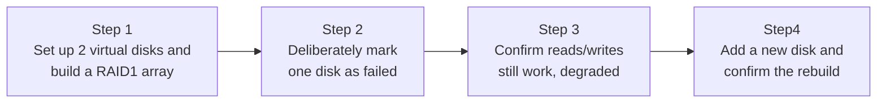

## Introduction

- **What You'll Learn From This Article**: Verify what you learned in [The Relationship Between RAID and Windows Disk Management](/en/articles/disk-raid-fundamentals-guide) by **actually building a RAID1 (mirroring) array with Linux's `mdadm`, and experiencing the entire flow from a disk failure through to a rebuild, with your own hands.**
- **Intended Audience**: Readers who understand that RAID is "a mechanism for making multiple disks redundant," but have never actually seen what state an array enters when a failure happens, or how it actually recovers.
- **Estimated Reading Time**: About 25 minutes, including the hands-on exercise

This article is part of the [Top 1% Series Complete Article Guide](/en/sitemap), and the fourth article in the [Storage Fundamentals Series](/en/sitemap#series-list). You can follow along with one of the Ubuntu Server environments set up in the [Hands-On Prep Manual](/en/articles/handson-prep-guide).

## Prerequisite Knowledge

- **RAID's Basic Role**: The fundamental idea covered in [The Relationship Between RAID and Windows Disk Management](/en/articles/disk-raid-fundamentals-guide) — that RAID combines multiple disks to add redundancy and/or speed. This article covers the simplest form, **RAID1** (mirroring), which keeps two disks' content perfectly identical.

## Getting the Big Picture

This hands-on covers four steps.



## Hands-On Steps

### Step 1: Set Up Two Virtual Disks and Build a RAID1 Array

Instead of using real physical disks, treat files as loopback devices to set up two virtual disks.

```bash
sudo apt install -y mdadm
sudo dd if=/dev/zero of=/disk1.img bs=1M count=100
sudo dd if=/dev/zero of=/disk2.img bs=1M count=100
sudo losetup /dev/loop1 /disk1.img
sudo losetup /dev/loop2 /disk2.img
```

Create a RAID1 array across your two virtual disks (`/dev/loop1` and `/dev/loop2`).

```bash
sudo mdadm --create /dev/md0 --level=1 --raid-devices=2 /dev/loop1 /dev/loop2
```

Check the array's state.

```bash
sudo mdadm --detail /dev/md0
```

**Output (relevant part):**

```
State : clean
Active Devices : 2
Working Devices : 2
Failed Devices : 0
```

**You've now built an array with `Active Devices: 2`** — both disks running normally. Create a filesystem and mount it.

```bash
sudo mkfs.ext4 /dev/md0
sudo mkdir -p /mnt/raid1
sudo mount /dev/md0 /mnt/raid1
echo "important data" | sudo tee /mnt/raid1/data.txt
```

### Step 2: Deliberately Mark One Disk as Failed

Instead of waiting for a disk to actually fail, use `mdadm`'s own feature to deliberately mark one disk as "failed."

```bash
sudo mdadm --manage /dev/md0 --fail /dev/loop2
sudo mdadm --detail /dev/md0
```

**Output (relevant part):**

```
State : clean, degraded
Active Devices : 1
Working Devices : 1
Failed Devices : 1
```

**You confirmed the array's state changed from `clean` to `clean, degraded`, with `Active Devices` dropping from 2 to 1.**

### Step 3: Confirm Reads/Writes Still Work in the Degraded State

**Confirm the service keeps serving reads and writes without interruption, even in this one-disk-down, degraded state.**

```bash
cat /mnt/raid1/data.txt
echo "still working after disk failure" | sudo tee -a /mnt/raid1/data.txt
cat /mnt/raid1/data.txt
```

**Output:**

```
important data
important data
still working after disk failure
```

**You confirmed reads and writes continue without issue, on the single remaining disk, even after one disk got marked as failed.** This is [RAID1's biggest value](/en/articles/disk-raid-fundamentals-guide) — the real-world effect of redundancy. But this degraded state is also a dangerous one: **if the one remaining disk fails too, you lose all your data.** You can feel firsthand, right here, exactly why a degraded state should never be left unattended indefinitely.

### Step 4: Add a New Disk and Confirm the Rebuild

Set up a new virtual disk and add it to the array.

```bash
sudo mdadm --manage /dev/md0 --remove /dev/loop2
sudo dd if=/dev/zero of=/disk3.img bs=1M count=100
sudo losetup /dev/loop3 /disk3.img
sudo mdadm --manage /dev/md0 --add /dev/loop3
```

Check the rebuild's progress.

```bash
cat /proc/mdstat
```

**Output (relevant part):**

```
md0 : active raid1 loop3[2] loop1[0]
      recovery = 45.2% (...) finish=0.1min speed=...
```

**You confirmed concrete progress — `recovery = 45.2%` — showing the rebuild in motion.** Once the rebuild finishes, `mdadm --detail /dev/md0` confirms it's back to `Active Devices: 2` and `State: clean`.

<details>
<summary>Why Does a Rebuild Take So Long?</summary>

A rebuild is **the process of copying the entire content of the remaining healthy disk, start to finish, onto the newly added disk.** It's not a differential copy — it covers the whole disk — so the larger the disk's capacity, the longer the rebuild takes. **And while the rebuild is running, the one remaining healthy disk carries both its normal read/write load and the extra load of being copied from.** If that disk also fails during this window, you lose your data. For configurations using more disks than RAID1 (mirroring), like RAID5 or RAID6, this exact risk — a second failure during rebuild — is why a design like RAID6, which tolerates up to two simultaneous failures, sometimes gets chosen instead.

</details>

## What a Pro Sees Here (Top 1% Understanding)

### "Having RAID" and "Noticing a Failure" Are Two Entirely Different Things

In this hands-on, you noticed the failure because you **deliberately** marked the disk as failed in Step 2. But in real-world operations, incidents repeat where **an array sits in a degraded state, unnoticed by anyone, for a very long time.** A RAID configuration like RAID1 or RAID5 genuinely keeps the service running through one failure — but **without a mechanism (monitoring and alerting) to detect that degraded state and notify someone, "it's supposed to be redundant, but is actually defenseless" can persist, completely unnoticed.** The single most important lesson from this hands-on is: whenever you build RAID, always build a regular status check or automated alerting alongside it.

## Common Misconceptions and Pitfalls

- **Misconception 1: "With RAID1, a single disk failure gets automatically repaired."**
  The degraded state persists until you replace the failed disk and run a rebuild. It never automatically returns to its original state on its own.
- **Misconception 2: "Performance in a degraded state is the same as normal."**
  A degraded state loses redundancy, and depending on the configuration, performance can degrade too. A rebuild also temporarily increases load on the remaining disk.
- **Misconception 3: "Having RAID means you don't need backups."**
  RAID is a defense against hardware failure — it does nothing against accidental deletion, ransomware, or logical data corruption. RAID and backups serve entirely separate purposes, as separate defenses.

## Troubleshooting Perspective

1. **You don't know how to check an array's state**: `cat /proc/mdstat` gives a quick status, while `mdadm --detail /dev/mdX` gives full detail.
2. **You replaced a disk, but it never gets added to the array**: You need to explicitly add it with `mdadm --manage /dev/mdX --add /dev/sdX` — it's never added automatically.
3. **The rebuild is abnormally slow**: Check the `speed` value in `/proc/mdstat`. High disk I/O load elsewhere slows down the rebuild.

## Summary

- `mdadm` lets you build and manage software RAID on Linux.
- When one disk fails, the array enters a "degraded" state — it keeps serving the service, but has lost its redundancy.
- Adding a new disk triggers a "rebuild" that copies the healthy disk's entire content, and once it finishes, the array returns to its original, redundant state.
- Without an accompanying monitoring setup to detect a degraded state, RAID risks leaving an effectively defenseless state unattended for a long time.

**Takeaways to Apply Today**
1. Whenever you build RAID, build the habit of always setting up status monitoring and alerting alongside it.
2. Rather than "I have RAID, so I'm fine," keep in mind that RAID and backups serve entirely separate purposes, as separate defenses.

## References

- [mdadm(8) Manual Page](https://man7.org/linux/man-pages/man8/mdadm.8.html)
- [Linux Software RAID | The Linux Documentation Project](https://tldp.org/HOWTO/Software-RAID-HOWTO.html)
