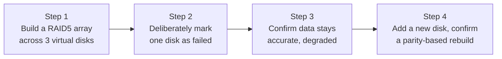

## Introduction

- **What You'll Learn From This Article**: Verify the XOR-based recovery mechanism you learned in [RAID5 and RAID6 Parity Calculation](/en/articles/raid5-parity-guide) by **actually building a RAID5 array across three virtual disks, and confirming that failing one disk still keeps data accurately recoverable from parity.**
- **Intended Audience**: Readers who've worked through [the mdadm RAID1 hands-on](/en/articles/mdadm-raid-handson-guide), but have never confirmed with their own eyes exactly how parity-based RAID5 behaves differently from mirroring.
- **Estimated Reading Time**: About 25 minutes, including the hands-on exercise

This article is part of the [Top 1% Series Complete Article Guide](/en/sitemap), and the ninth article in the [Storage Fundamentals Series](/en/sitemap#series-list). You can follow along with one of the Ubuntu Server environments set up in the [Hands-On Prep Manual](/en/articles/handson-prep-guide).

## Prerequisite Knowledge

- **RAID1's Mirroring**: The basic mdadm operations covered in [the mdadm RAID1 hands-on](/en/articles/mdadm-raid-handson-guide).
- **How Parity Works**: The XOR-based recovery principle covered in [RAID5 and RAID6 Parity Calculation](/en/articles/raid5-parity-guide).

## Getting the Big Picture

This hands-on covers four steps.



## Hands-On Steps

### Step 1: Build a RAID5 Array Across Three Virtual Disks

As in [the RAID1 hands-on](/en/articles/mdadm-raid-handson-guide), treat files as loopback devices. This time, set up three virtual disks, RAID5's minimum configuration.

```bash
sudo apt install -y mdadm
for i in 1 2 3; do
  sudo dd if=/dev/zero of=/disk$i.img bs=1M count=100
  sudo losetup /dev/loop$i /disk$i.img
done
```

Create a RAID5 array across your three virtual disks.

```bash
sudo mdadm --create /dev/md0 --level=5 --raid-devices=3 /dev/loop1 /dev/loop2 /dev/loop3
```

Check the array's state.

```bash
sudo mdadm --detail /dev/md0
```

**Output (relevant part):**

```
Raid Level : raid5
Array Size : 204800 (200.00 MiB)
Active Devices : 3
```

**You confirmed that despite having three disks, the `Array Size` (the array's real usable capacity) only comes out to about two disks' worth (200MiB), roughly twice one disk's own capacity (about 100MiB).** As [covered in the lecture](/en/articles/raid5-parity-guide), this is because, of the three disks, one disk's worth of capacity goes to parity. Create a filesystem and write some data.

```bash
sudo mkfs.ext4 /dev/md0
sudo mkdir -p /mnt/raid5
sudo mount /dev/md0 /mnt/raid5
echo "raid5 test data" | sudo tee /mnt/raid5/data.txt
```

### Step 2: Deliberately Mark One Disk as Failed

```bash
sudo mdadm --manage /dev/md0 --fail /dev/loop2
sudo mdadm --detail /dev/md0
```

**Output (relevant part):**

```
State : clean, degraded
Active Devices : 2
Failed Devices : 1
```

Just as in [the RAID1 hands-on](/en/articles/mdadm-raid-handson-guide), the array entered a degraded state.

### Step 3: Confirm Data Stays Accurately Readable, Degraded

```bash
cat /mnt/raid5/data.txt
echo "still working with 1 disk failed" | sudo tee -a /mnt/raid5/data.txt
cat /mnt/raid5/data.txt
```

**Output:**

```
raid5 test data
raid5 test data
still working with 1 disk failed
```

**You confirmed reads and writes continue accurately even after one disk got marked as failed, using the two remaining disks and the parity relationship computable from them.** Thanks to [the XOR property covered in the lecture](/en/articles/raid5-parity-guide), every read recomputes the lost disk's data on the spot, from the remaining information.

<details>
<summary>How the Degraded State's Behavior Differs From RAID1</summary>

In [the RAID1 hands-on](/en/articles/mdadm-raid-handson-guide), the degraded state was a simple one: "the other, complete duplicate still remains." **RAID5's degraded state, by contrast, rests on a more complex process: recomputing the lost data on the spot, every time, from the remaining disks' data and the parity relationship.** Because of this, reads and writes in RAID5's degraded state generally carry extra computational overhead compared to RAID1's, tending toward lower performance.

</details>

### Step 4: Add a New Disk and Confirm a Parity-Based Rebuild

```bash
sudo mdadm --manage /dev/md0 --remove /dev/loop2
sudo dd if=/dev/zero of=/disk4.img bs=1M count=100
sudo losetup /dev/loop4 /disk4.img
sudo mdadm --manage /dev/md0 --add /dev/loop4
cat /proc/mdstat
```

**Output (relevant part):**

```
md0 : active raid5 loop4[3] loop3[2] loop1[0]
      recovery = 38.1% (...) finish=0.1min speed=...
```

**You confirmed the rebuild in progress.** Once the rebuild finishes, `mdadm --detail /dev/md0` confirms it's back to `Active Devices: 3` and `State: clean`. Internally, this rebuild process **reconstructs the lost disk's data onto the new disk, using the parity calculation, from the data on the two remaining disks.** This is a fundamentally different process from [RAID1's rebuild](/en/articles/mdadm-raid-handson-guide), which simply copied the other disk's content as-is.

## What a Pro Sees Here (Top 1% Understanding)

### RAID5's "Tolerance for a Single Failure" Always Comes at the Cost of Computation

Through this hands-on, you confirmed that even though RAID5 achieves the same outcome as RAID1 — "tolerates a single failure" — **what actually happens internally is entirely different.** RAID1 simply "reads a duplicate," while RAID5 "recomputes from the remaining data and parity, every time." **When multiple implementations exist satisfying the same functional requirement (tolerating a single failure), identifying exactly what cost each implementation actually pays (computational overhead, performance impact) is essential to evaluating a design.** This shares the same underlying view as [the token bucket versus the fixed window](/en/articles/rate-limiting-handson-guide), achieving the same goal — "rate limiting" — at different implementation costs.

## Common Misconceptions and Pitfalls

- **Misconception 1: "RAID5's degraded state is internally the same process as RAID1's degraded state."**
  RAID1's degraded state simply reads the remaining duplicate, while RAID5's degraded state is a more complex process: recomputing data from parity on every read.
- **Misconception 2: "RAID5's rebuild is the same simple copy process as RAID1's rebuild."**
  RAID1's rebuild simply copies the other disk's content as-is, while RAID5's rebuild reconstructs the lost data from the remaining data, using the parity calculation.
- **Misconception 3: "A three-disk RAID5 array's real usable capacity is the sum of all three disks."**
  A three-disk RAID5 array's real usable capacity comes out to two disks' worth (n-1 disks' worth, for an n-disk array), since one disk's worth goes to parity.

## Troubleshooting Perspective

1. **RAID5's degraded state shows significantly degraded performance**: This is likely caused by RAID5's own degraded-state-specific load — recomputing from parity on every operation — and is expected behavior.
2. **RAID5's Array Size is smaller than expected**: Since one disk's worth of capacity goes to parity, `(disk count - 1) × one disk's capacity` is the correct real usable capacity.
3. **A second disk failed during the rebuild**: RAID5 only tolerates a single failure, so data is lost in this case. [RAID6](/en/articles/raid5-parity-guide) would tolerate a second failure too.

## Summary

- RAID5 is built from three or more disks, using one disk's worth of capacity for parity to balance real usable capacity against tolerance for a single failure.
- Reads and writes in RAID5's degraded state recompute data from the remaining data and parity on the spot, an internally entirely different process from RAID1's simple duplicate reads.
- RAID5's rebuild reconstructs lost data from the remaining data, using the parity calculation.
- Different implementations satisfying the same functional requirement each pay a different cost (computational overhead, performance impact), and identifying this concretely matters.

**Takeaways to Apply Today**
1. When evaluating a RAID type, check not just "what it tolerates," but "what internal process actually achieves that tolerance."
2. When you run into degraded performance during a degraded state or rebuild, first check whether it's expected behavior, given that RAID type's own mechanism.

## References

- [mdadm(8) Manual Page](https://man7.org/linux/man-pages/man8/mdadm.8.html)
- [Mathematics of RAID 6 | Wikipedia](https://en.wikipedia.org/wiki/Mathematics_of_RAID_6)
