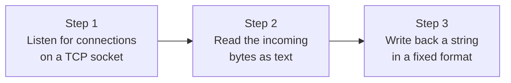

## Introduction

- **What you'll get from this article**: Instead of using a production-grade web server like IIS or Nginx, you'll **build your own HTTP server from minimal code that talks directly to a TCP socket**, and actually access it from a browser. This lets you confirm, hands-on, the idea from [Understanding How IIS and ASP.NET Work from a "Top 1%" Perspective](/en/articles/iis-fundamentals-guide) that "a website's true nature is software that can process HTTP."
- **Intended audience**: Anyone who vaguely pictures "a website" as "a collection of HTML/CSS files," or hasn't quite grasped what IIS or Apache are actually doing internally.
- **Estimated reading time**: About 16 minutes (including doing the hands-on steps)

This article is part of the [Top 1% Series: Full Article Guide](/en/sitemap), the 7th in the [Windows Server Operations Series](/en/sitemap#series-list). If you already have the Linux environment from the [Hands-On Prep Manual](/en/articles/handson-prep-guide) (or any machine with Python 3), you can do this with no additional software installation.

## Prerequisite Knowledge

- **TCP sockets**: The OS-provided "doorway for communication" that lets a program communicate over a network. See [Understanding the Network Stack from a "Top 1%" Perspective](/en/articles/network-stack-guide) for details.
- **HTTP's basic format**: Both requests and responses use a text-based format of "a first line (request line / status line) + header lines + a blank line + a body." See [What Is a RESTful API?](/en/articles/restful-api-guide) for details.

## Getting the Big Picture

Everything you'll build in this hands-on lab is just these 3 steps.



**What IIS, Nginx, and Apache do is, at its core, an extension of these same 3 steps.** The difference is that these production implementations pile on massive concurrent-connection handling, careful conformance to HTTP's many edge cases, security hardening, and performance optimization.

## Hands-On Steps

### Step 1: Write a minimal HTTP server

Create a file called `mini_server.py` in any directory and write the following code. The key point is that it uses **nothing but a raw TCP socket** — not even Python's built-in `http.server` module, let alone a web framework.

```python
import socket

HOST = "0.0.0.0"
PORT = 8080

server_socket = socket.socket(socket.AF_INET, socket.SOCK_STREAM)
server_socket.setsockopt(socket.SOL_SOCKET, socket.SO_REUSEADDR, 1)
server_socket.bind((HOST, PORT))
server_socket.listen(5)
print(f"Listening on {HOST}:{PORT} ...")

while True:
    conn, addr = server_socket.accept()
    request_bytes = conn.recv(4096)
    request_text = request_bytes.decode("utf-8", errors="replace")

    # Pull out just the first line (the request line)
    request_line = request_text.split("\r\n")[0]
    print(f"[{addr}] {request_line}")

    method, path, _ = request_line.split(" ")

    if path == "/hello":
        body = "<h1>Hello from my own HTTP server!</h1>"
    else:
        body = "<h1>It works.</h1><p>This page is served by code you wrote yourself.</p>"

    response = (
        "HTTP/1.1 200 OK\r\n"
        "Content-Type: text/html; charset=utf-8\r\n"
        f"Content-Length: {len(body.encode('utf-8'))}\r\n"
        "Connection: close\r\n"
        "\r\n"
        f"{body}"
    )
    conn.sendall(response.encode("utf-8"))
    conn.close()
```

Run it with `python3 mini_server.py`, and your terminal will show `Listening on 0.0.0.0:8080 ...`.

### Step 2: Access it from a real browser

From a browser, open `http://<the machine's IP address>:8080/`, pointing at the IP address of the machine running the server. **You'll see "It works." displayed as a page returned by the Python code you wrote yourself.** Next, visit `http://<IP address>:8080/hello`, and you'll see a different HTML response depending on the value of `path`.

Those few lines — `if path == "/hello":` — are, at their core, the most primitive version of what frameworks like ASP.NET or Express call "routing." A framework just wraps this same branching logic into something convenient — URL pattern matching, configuration files — but **the underlying substance of what's happening doesn't change.**

### Step 3: Look at the actual bytes flowing over the wire

The `-v` flag on `curl` lets you see the raw HTTP messages being sent and received.

```bash
curl -v http://<IP address>:8080/
```

In the output, lines starting with `> ` are the request you sent, and lines starting with `< ` are the response you received. **You can confirm that the `HTTP/1.1 200 OK` and `Content-Type` lines you assembled in your server code arrive at the client exactly as those literal strings.** Using the packet-capture tool covered in [How to Use Wireshark](/en/articles/wireshark-guide), you can also watch these same strings flow by, unchanged, as the TCP payload.

## The View From the Top 1% Perspective

### What this mini server is missing — why production actually uses IIS or Nginx

These few dozen lines of code are **enough to viscerally experience the idea that "any software that can process HTTP can be a web server,"** but they're missing the following elements needed for production use:

- **Handling concurrent connections**: This code can't accept a new connection until it's fully finished handling the previous one after `accept()`. IIS efficiently handles massive numbers of concurrent connections through the HTTP.sys / application pool / worker process architecture covered in [Understanding How IIS and ASP.NET Work](/en/articles/iis-fundamentals-guide).
- **Accurate conformance to the HTTP spec**: This mini server has zero support for chunked transfer encoding, keep-alive, various character encodings, or resilience against malformed requests — all things the HTTP spec carefully defines.
- **Security**: There's no input validation, no path-traversal protection, no TLS (HTTPS) support at all. Exposing this code directly to the internet as-is would be dangerous.

**"I could build this myself" and "in production, you should use a proven implementation instead of building your own" are not remotely in conflict.** In fact, being able to make the judgment that "some things are best left to the specialists" — while genuinely understanding the underlying principle — is exactly what top-1% understanding looks like.

## Common Misconceptions and Pitfalls

- **Misconception 1: "Building a website absolutely requires Apache, IIS, or a web framework"**
  Technically, the bare minimum of "code that reads and writes HTTP's text format over a TCP socket" is enough to qualify as a website. Apache and IIS exist to do that safely and quickly at a production-grade level.
- **Misconception 2: "Routing is an advanced feature that only web frameworks have"**
  At its core, it's just "branch behavior based on a path string" — a simple conditional. Frameworks just package this into a form that's manageable even in large applications.

## The Troubleshooting Perspective

1. **Can't reach it from a browser**: Check whether the firewall on the machine running the server allows inbound traffic on port 8080.
2. **Getting an `Address already in use` error**: Check whether another process is already listening on the same port (e.g. a previous run of the server that hasn't fully exited). Even with `socket.SO_REUSEADDR` set, some operating systems won't let you reuse a port immediately.

## Summary

- A website's true nature is software that can read and write HTTP's text format over a TCP socket — HTML/CSS is just one form of content returned as its response.
- Framework features like routing are, in principle, an extension of a simple conditional branch.
- Production use of implementations like IIS or Nginx exists because they pile on elements this mini server lacks entirely — concurrent connection handling, conformance to the HTTP spec, and security.

**What to Keep in Mind From Today**
1. When you see the word "website," remember that its true nature is "software that can process HTTP."
2. When you encounter a convenient framework feature, get in the habit of asking "what simple mechanism is this, in principle, an extension of?"

## References

- [Hypertext Transfer Protocol (HTTP/1.1): Message Syntax and Routing | RFC 7230](https://datatracker.ietf.org/doc/html/rfc7230)
- [socket — Low-level networking interface | Python Documentation](https://docs.python.org/3/library/socket.html)
