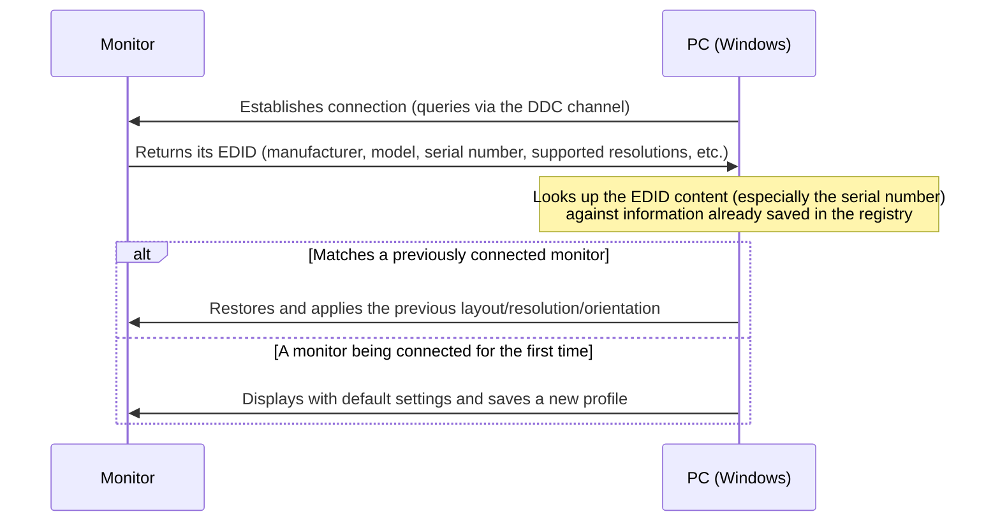

## Introduction

- **What you'll get from this article**: Understand the mechanism behind the behavior where connecting a monitor via HDMI automatically restores your previous screen split and layout settings. This covers **what EDID (Extended Display Identification Data) — a piece of identifying information unique to each monitor — actually carries, and how Windows uses it to recognize "this is that monitor I connected before,"** as well as why this mechanism can stop working reliably when going through equipment like a KVM switch.
- **Intended audience**: Readers who experience a monitor's layout settings restoring themselves just by plugging in a cable, on a daily basis, but can't concretely explain the mechanism behind it.
- **Estimated reading time**: About 13 minutes

This article is part of the [Top 1% Series — Full Article Guide](/en/sitemap), and the 8th entry in the [Windows Client Operations series](/en/sitemap#series-list).

## Prerequisite Knowledge

- **Resolution and refresh rate**: The number of pixels a monitor can display (resolution) and how many times per second it updates the screen (refresh rate). The combinations a monitor can actually support vary by model.

## Getting the Big Picture

### In a nutshell

**The instant a monitor gets connected, it sends the PC information that proves its own identity (EDID).** Windows uses this to recognize "this is that monitor I've connected before," and restores the layout, resolution, and orientation settings previously configured for it. It only "looks like" the settings come back just by plugging in a cable — **in reality, this EDID exchange and lookup happens every single time** — it isn't restored automatically by magic, doing nothing at all.

## Deep Dive into the Fundamentals

### What EDID actually carries

EDID is data pre-written, at the factory, onto a small memory chip on the monitor's own circuit board. It includes things like **the manufacturer's name, product (model) information, serial number, a list of the resolutions and refresh rates it supports, its physical screen size, and chromaticity (color) data.** The PC and the monitor exchange this EDID over a dedicated channel called **DDC** (Display Data Channel), separate from the actual video signal itself. The PC uses this information to determine the actual range of resolutions and refresh rates that monitor supports, so it can avoid sending it a setting it doesn't support.

### What, specifically, does Windows use to decide "this is the same monitor"?

Among all the information EDID carries, Windows identifies a connected monitor based specifically on **the combination of manufacturer, model, and serial number.** That identification result, along with whatever layout, resolution, and orientation settings were previously configured for that monitor, gets saved in the registry. **Even if you're running two monitors of the exact same model side by side, Windows treats them as clearly distinct monitors as long as their serial numbers differ.** So if you swap out just one of two identical-model monitors for a different unit, its differing serial number means it gets treated as "a monitor connected for the first time" — its layout settings won't be restored, and you'll need to configure it again from scratch.

Why cheap cables or adapters sometimes fail to exchange EDID correctly

The EDID exchange happens over the dedicated DDC signal line, separate from the video signal transmission. With a low-quality cable, or some cheap adapters that simply pass video through, that DDC signal line sometimes isn't wired correctly, or is more prone to noise interference — and reading the EDID itself can fail as a result. When that happens, Windows can't retrieve that monitor's EDID, and it may end up displaying only at a generic default resolution, or get recognized as "a new monitor" every single time.

## What Top-1% Engineers See

### Why settings restoration can stop working reliably through a KVM switch

In an environment using a **KVM switch** to connect multiple PCs to a single monitor, this mechanism can stop working reliably. That's because a KVM switch often **only correctly relays the monitor's EDID information to whichever PC (port) is currently selected.** From the perspective of a PC that isn't currently selected, it may not even correctly recognize whether a monitor is connected at all. This can cause problems like the monitor not being recognized every time that PC boots up, or the resolution ending up at an unintended value. **When a top-1% engineer runs into this symptom, before suspecting the monitor or the cable itself, they first check whether a relay device like a KVM switch is interfering with the EDID delivery path.** To address exactly this problem, some higher-end KVM switches include an "EDID emulation" feature: they store a copy of the EDID content in the switch itself and always return that same EDID regardless of which source PC is asking.

## Common Misconceptions and Pitfalls

- **Misconception 1: "A monitor's layout settings just come back automatically, with nothing happening, the moment you plug in the cable."**
  In reality, restoration happens through a clear mechanism: the monitor sends its EDID at every connection, and Windows looks that content up against a previously saved record.
- **Misconception 2: "Monitors of the same model are always treated as having the same settings."**
  Windows identifies an individual unit by the combination of model and serial number, not model alone, so even identical models get treated as separate monitors, with their own settings, if their serial numbers differ.
- **Misconception 3: "A monitor not being recognized, or displaying the wrong resolution, is always caused by a hardware failure in the monitor itself."**
  It's not uncommon for a cheap cable or adapter, or a relay device like a KVM switch, to be interfering with the correct delivery of EDID instead.

## Troubleshooting Perspective

1. **A monitor's layout settings don't get restored every time**: Check whether that monitor's serial number is actually changing between connections (or whether you're frequently swapping between multiple identical-model monitors).
2. **In a KVM-switch environment, a monitor isn't recognized from one specific PC only**: Check whether the KVM switch has an EDID emulation feature, and whether it's actually enabled.
3. **The resolution can only display at an unexpectedly low value**: Suspect the quality of the cable or adapter, and if possible, check whether the problem reproduces with a different cable.

### Prevention and Long-Term Countermeasures

- When setting up a multi-monitor environment, keep a record of each monitor's serial number — it makes troubleshooting much easier when swapping units later.
- When selecting a KVM switch, include whether it has an EDID emulation feature as one of your selection criteria.

## Summary

- The instant a monitor is connected, it sends the PC its EDID — identifying information including manufacturer, model, serial number, and supported resolutions.
- Windows identifies whether a monitor was previously connected specifically by the combination of manufacturer, model, and serial number within the EDID, and restores the layout, resolution, and orientation settings saved in the registry.
- Even the same model gets treated as a different monitor, with settings not restored, if the serial number differs.
- A relay device like a KVM switch may not correctly relay EDID to a PC that isn't currently selected, which can cause the monitor to go unrecognized or display at the wrong resolution.

**What to keep in mind starting today**
1. If a monitor's layout settings aren't being restored, before suspecting a hardware failure in the monitor itself, check whether EDID is actually being delivered correctly (the cable, the adapter, a KVM switch, and so on).
2. When choosing a KVM switch, check whether it has an EDID emulation feature.

## References

- [Extended Display Identification Data | Wikipedia](https://en.wikipedia.org/wiki/Extended_Display_Identification_Data)
- [Video: EDID and DDC | Adder Support Wiki](https://support.adder.com/tiki/tiki-index.php?page=Video%3A+EDID+and+DDC)
