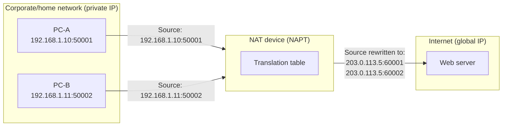
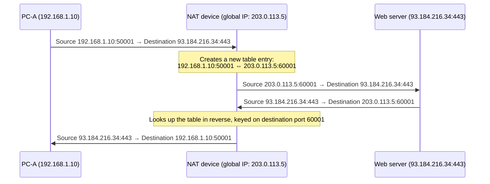
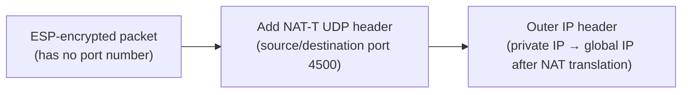
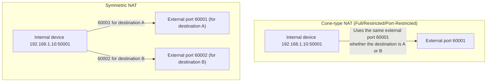

## Introduction

- **What You'll Learn From This Article**: Beyond the basic understanding that "NAT translates between private and global IP addresses," this article gives you a systematic understanding of what's actually happening inside a NAT device—what it manages internally, and specifically how it decides which client a returning packet belongs to; why a single global IP address can support simultaneous communication from multiple devices (NAPT); the "NAT type classification" that determines how easily connections can be established, based on NAT behavior; and how NAT-T is used to let protocols without port numbers, such as IPsec's ESP, traverse a NAT environment.
- **Intended Audience**: This article is aimed at infrastructure engineers who know that "NAT translates IP addresses" but can't concretely explain how the translation table is managed internally, or why devices "behind NAT" are said to have trouble connecting in VPN or VoIP scenarios.
- **Estimated Reading Time**: About 20 minutes

This article is part of the [Top 1% Series' full article guide](/en/sitemap).

## Prerequisites

- **Private IP Addresses / Global IP Addresses**: Private IP addresses (defined in RFC 1918 as `10.0.0.0/8`, `172.16.0.0/12`, and `192.168.0.0/16`) are addresses that are only valid within an organization's own network and are not subject to routing on the internet. Global IP addresses are uniquely assigned on the internet and are subject to routing.
- **TCP/UDP Port Numbers**: A 16-bit number used to identify which application (which communication session) data is destined for, on a single device that has one IP address.
- **Routing**: The process of examining a packet's destination IP address to determine which device to forward it to next.

## Getting the Big Picture

### In a Nutshell

**NAT (Network Address Translation) is a technology that rewrites the source (or destination) address in the IP header as a packet passes through.** The most widely used form is **NAPT (Network Address Port Translation, also called PAT), which rewrites the port number as well, allowing multiple devices to share a single global IP address**. This is the form of NAT that home routers and corporate internet-boundary routers almost universally perform.



The fundamental reason NAT is needed is that **the absolute supply of IPv4 addresses is insufficient to assign a global IP directly to every device**. NAT performs translation at the "boundary" between the world of private IP addresses that are freely usable within an organization and the world of global IP addresses that are valid on the internet, allowing a limited number of global IP addresses to be shared among many devices.

## Fundamentals, Thoroughly Explained

### The Three Forms of NAT: Static NAT, Dynamic NAT, and NAPT

The technology commonly lumped together under the name "NAT" actually comes in three forms that differ in the granularity of translation.

| Form | Translation Granularity | Characteristics | Primary Use |
|---|---|---|---|
| Static NAT | One private IP is fixedly mapped to one global IP | The translation rule is configured in advance by an administrator, and the pairing never changes | Publishing a server exposed to the outside world (e.g., a web server in a DMZ) that must always be reachable at the same global IP |
| Dynamic NAT | A private IP is assigned one global IP at a time from a "pool" of global IPs | No more simultaneous sessions than there are global IPs in the pool can be active (the 1:1 relationship is preserved) | Relatively small sites that can secure enough global IPs to fill the pool |
| NAPT (port translation, PAT) | A pair of private IP + port number is translated into a pair of global IP (usually a single one) + port number | Using the port number as a new axis of identification lets many devices share a single global IP simultaneously | Home routers, corporate internet boundaries (currently the most common form) |

Static NAT and Dynamic NAT both preserve a strict 1:1 relationship in which "a given private IP always corresponds, at any given moment, to exactly one global IP." NAPT breaks this relationship by **adding a new piece of information—the port number—as material for translation, achieving a "many-to-one" mapping**. Today, the vast majority of what people mean when they say "NAT" is, in effect, this NAPT. The rest of this article focuses primarily on NAPT's internal behavior.

### The NAPT Translation Table: What Is It Keyed On?

For every communication session passing through it, a NAPT device treats the combination of **"protocol type + source IP address + source port number + destination IP address + destination port number" — a set of five values known as the 5-tuple** — as the identifier for that session, and dynamically builds and manages a translation table (also called a session table or connection tracking table) keyed on this 5-tuple.



A concrete image of the translation table looks like this:

| Internal IP:Port | Protocol | Translated (IP:Port visible externally) | Destination IP:Port |
|---|---|---|---|
| 192.168.1.10:50001 | TCP | 203.0.113.5:60001 | 93.184.216.34:443 |
| 192.168.1.11:50002 | TCP | 203.0.113.5:60002 | 93.184.216.34:443 |
| 192.168.1.10:51000 | UDP | 203.0.113.5:60003 | 198.51.100.20:53 |

Because this table exists, a NAT device can **determine exactly which internal device to forward a returning packet to simply by looking at the destination port number of that packet (60001 or 60002 in this example)**. Put another way, **the external port number is effectively the identifier that distinguishes between multiple devices behind a single NAPT device**. This property is at the core of why "protocols without port numbers," discussed below, cause problems in a NAT environment.

Entries do not persist forever; entries with no traffic for a certain period (tens of seconds to a few minutes, depending on the implementation) are automatically removed from the table. This allows port numbers that are no longer in use to be reused for new sessions.

### The Problem of Protocols That Can't Traverse NAT: ESP as an Example

The NAPT translation table is designed around the assumption of TCP/UDP port numbers. However, there exist **protocols that have no concept of a port number at all**. A representative example is **ESP (Encapsulating Security Payload, IP protocol number 50)**, which IPsec uses for encryption and integrity protection.

When an ESP packet attempts to be sent from behind a NAPT device, two problems arise:

1. **Many inexpensive NAT devices don't support passthrough for IP protocol number 50 at all, and simply drop ESP packets.**
2. Even for devices that do support passthrough, **because ESP has no port number to use as a key in the translation table, the device cannot distinguish which internal device a packet is destined for when multiple internal devices attempt ESP communication simultaneously.**

This is where **NAT-T (NAT Traversal)**, described below, comes in to solve the problem. A similar problem, in a different form, also occurs with some protocols that embed port numbers inside their payload, such as VoIP devices using SIP, and each protocol uses a different workaround (for SIP, this includes STUN/TURN/ICE). This article uses IPsec ESP as a concrete example to dig into NAT-T as a representative pattern for NAT traversal mechanisms.

### How NAT-T Works Internally

**NAT-T (NAT Traversal, RFC 3947/3948)** is a mechanism for fitting protocols without port numbers, such as ESP, onto NAPT's UDP-port-based translation.

1. **NAT Detection**: During the early stage of IKE (the key exchange protocol) negotiation, both sides compute and exchange "a hash of the source IP address + port number" (the NAT-D payload). If the hash value the other side computed doesn't match the hash value computed from the source information of the packet actually received, this indicates that the address/port was rewritten by a NAT somewhere along the path.
2. **Encapsulation into UDP**: Once NAT is detected, all subsequent exchanges float (switch) to **UDP port 4500**. ESP packets are further wrapped in a UDP header (RFC 3948), which allows the NAT device to perform translation based on source/destination ports as it would for an ordinary UDP packet. Since both key-exchange messages and encapsulated ESP packets flow over the same UDP port 4500, the receiving side needs a way to distinguish between the two, which it does instantly using a **Non-ESP Marker** (a 4-byte `0x00000000` prepended to the UDP payload in the case of key-exchange messages).
3. **Keepalive**: The NAPT translation table automatically deletes entries after a period of inactivity (this is exactly where the earlier point—"table entries don't persist forever"—comes into play). Because ESP/key-exchange traffic doesn't necessarily occur continuously, many implementations send a keepalive packet with just 1 byte of payload every 20–30 seconds to prevent the translation table entry from expiring and the session from being dropped.



Once NAT-T is active, the packet as seen from outside becomes "an ordinary UDP packet addressed to UDP port 4500." From the NAT device's point of view, there's no need to care at all whether the contents are ESP—the existing NAPT mechanism (translation based on source/destination port numbers) can simply be used as-is. This is the essence of NAT-T: **"put a port-number costume on a protocol that has no port number, after the fact, so it can ride on the NAPT translation table."** This is the idea common to all technologies bearing the name "NAT-T."

**Conversely, if no NAT is detected**, this switchover does not happen. Key exchange continues on UDP port 500 as before, and ESP is sent and received **directly as IP protocol number 50 packets**, without being wrapped in UDP. There's no overhead from the extra UDP header, and no keepalive is needed—which is why NAT-T should be understood strictly as "a workaround to allow communication to work behind NAT," and is in fact not used at all in environments without NAT.

### Inside the NAT-D (NAT Detection) Payload: Why Two Hashes Are Sent

Let's go one level deeper on "1. NAT Detection" from the previous section. **NAT-D (NAT Detection, a payload type defined in RFC 3947)** is the piece of information exchanged during IKE Phase 1 messaging to determine whether a NAT is present. Its formula is as follows:

```
NAT-D = HASH( ISAKMP Cookie(Initiator) | ISAKMP Cookie(Responder) | IP address | Port number )
```

The Cookie here (also called the ISAKMP SPI) is an 8-byte random value each side generates during the very first message exchange of IKE Phase 1, and it's carried in the ISAKMP header. The reason it's included as material for the hash is **to prevent the hash value for a given IP address/port combination from being reused and compared across a different session by a third party**. Because the Cookie value changes with every session, the hash value changes every time even for the same target IP address and port.

**Why are two NAT-D payloads (two hashes) sent in a single exchange?** — that's the key to understanding this mechanism. Each IKE party includes the following two kinds of NAT-D payloads in its Phase 1 message:

1. **A hash keyed on the peer's (destination's) IP address and port**: computed using the value of "the peer's IP address and port" that this side believes it's connecting to.
2. **A hash keyed on its own (source) IP address and port**: computed using the value of the local IP address and port this side itself is aware of.

The receiving side then performs two independent comparisons:

| What's being compared | Value it's compared against | What a mismatch reveals |
|---|---|---|
| The received "1. peer(destination)-facing" hash | A hash computed from the local IP address and port this side actually has | The peer sees this side's address differently than it actually is — meaning **this side itself is behind a NAT** |
| The received "2. source-facing" hash | A hash computed from the actual source IP address and port of the packet as received (the raw value observed over the network) | The value the peer sent differs from the value that actually arrived — meaning **the peer is behind a NAT** |

Because both parties in IKE Phase 1 perform these two comparisons independently, each side can accurately determine, in both directions, "am I behind a NAT?" and "is my peer behind a NAT?" — not just one or the other. If a mismatch is detected on either side, both sides agree to float to UDP port 4500 as described above. Conversely, if both comparisons match, no NAT is judged to exist on the path, and IKE/ESP traffic continues on UDP port 500 as before.

One thing worth noting: **what NAT-D detects is strictly the fact that "the address/port was rewritten somewhere along the path"—it cannot distinguish whether that rewrite was done by a legitimate NAT device or by a malicious third party tampering with or spoofing the traffic.** NAT-D is purely a functional mechanism for deciding whether to float to UDP 4500, not a security defense mechanism. What actually prevents spoofing and tampering is, in addition to the unpredictability the Cookie brings to the hash itself, the handshake authentication that follows in IKE Phase 1 (via PSK or certificates) and ESP's per-packet integrity verification through its ICV (Integrity Check Value).

## The View from the Top 1% (What Experts See)

### NAT Type Classification by Behavior: Cone NAT and Symmetric NAT

Even among devices that are all described as "NAPT," the **rules for assigning external ports and the rules for restricting which peers are allowed to send inbound traffic** differ by implementation, and this is the root cause of the phenomenon where certain types of communication (P2P, some VPNs, VoIP) have trouble connecting "behind NAT." This behavior is broadly classified into four types (originally organized by STUN/RFC 3489).

| Type | External Port Assignment | Condition for Accepting Inbound Traffic |
|---|---|---|
| Full Cone NAT | Always assigns the same external port for a given internal source IP:port | Forwards to the corresponding internal device no matter who it comes from |
| Restricted Cone NAT | Always assigns the same external port for a given internal source IP:port | Only allows responses from an **IP address** the internal device has previously sent to |
| Port-Restricted Cone NAT | Always assigns the same external port for a given internal source IP:port | Only allows responses from an **IP address + port number** the internal device has previously sent to |
| Symmetric NAT | Assigns a **new** external port each time **the destination changes** | Only allows responses from the exact destination IP address + port number that was actually sent to |



This difference matters in practice in scenarios where **P2P communication, VoIP, or some VPN clients need to know their external port number in advance in order to "establish direct, bidirectional communication across NAT" (NAT hole punching)**. With Cone-type NAT, "once a device has sent traffic outbound even once, that external port can (as long as conditions are met) be reused for inbound traffic from other peers as well," so a device can use a STUN server to discover its own external port and share it with the peer to achieve hole punching. With **Symmetric NAT, however, the external port changes every time the destination changes**, so the external port number discovered via STUN cannot be used with the actual peer you want to communicate with, and hole punching tends not to succeed. In this case, a relay/proxy server (such as a TURN server) that relays the communication is required. A phenomenon such as "when multiple devices behind the same NAT establish VPN connections at the same time, a later-connecting device can overwrite an existing session" is also rooted in this section's topic—specifically, in implementation differences in the granularity (the full 5-tuple, or just the source IP address) at which the NAT device manages sessions.

## Common Misconceptions and Pitfalls

- **Misconception 1: "NAT is a security feature."**
  NAT's original purpose is to share and conserve IP addresses; it does not perform encryption or access control. As a side effect, the fact that "an external host cannot directly initiate a session to an internal device" can end up acting somewhat like a firewall, but this is merely a byproduct of NAPT's translation table design, which "only automatically passes return traffic for connections that originated from the inside"—it is not a substitute for explicit access control rules.
- **Misconception 2: "NAT and a firewall are the same thing."**
  NAT is address translation, and a firewall is permitting or denying traffic based on policy—these are two separate functions with different purposes. Because many home routers and UTM devices integrate both into a single box, they're often conflated, but internally they are clearly distinct mechanisms.
- **Misconception 3: "You can put an unlimited number of devices behind a single global IP."**
  NAPT can theoretically use up to 65,536 external port numbers (0–65535), but in practice, implementation constraints in the OS and router, along with reservations for well-known ports, place a realistic ceiling on the number of simultaneous sessions. At a large site, exhausting the NAPT translation table can result in "port exhaustion," where new communications can no longer be established.

## Troubleshooting Perspective

NAT-related troubles are best approached by identifying **"at which stage of the translation table the problem is occurring."**

1. **The NAT device cannot be traversed at all**: This is the case where the protocol itself (such as ESP, which has no port number) isn't supported for passthrough. Check whether IP protocol number 50 is being dropped somewhere along the path, using `tcpdump` or router counters.
2. **A session can be established, but only one direction works**: This is a mismatch between Symmetric NAT and the peer's assumptions (hole punching that assumes Cone-type NAT). A STUN client tool can be used to determine the NAT type.
3. **The connection drops some time after being established**: This is likely because the NAPT translation table entry was removed after a period of inactivity. Check whether the keepalive interval is set shorter than the NAT device's timeout period.
4. **When multiple devices behind the same global IP connect simultaneously, one of them gets disconnected**: The NAT device or the peer server's implementation may be managing sessions per source IP address rather than per full 5-tuple.

### Prevention and Long-Term Countermeasures

- For configurations using protocols without port numbers (such as ESP), confirm in advance whether a dedicated traversal mechanism (such as NAT-T) is available.
- Set the keepalive interval comfortably shorter than the NAT device's typical timeout value (tens of seconds to a few minutes).
- When using NAPT at a large site, estimate the required number of simultaneous sessions and the external port allocation limit in advance.

## Summary

- NAT comes in three forms with different translation granularity—Static NAT, Dynamic NAT, and NAPT—and today NAPT, which uses port numbers to achieve many-to-one sharing, is the dominant form.
- A NAPT device dynamically manages a translation table keyed on the 5-tuple of "protocol type + source IP:port + destination IP:port," and uniquely identifies the internal device from the external port number of a returning packet alone.
- Because protocols without port numbers, such as ESP, cannot fit onto the NAPT translation table, NAT-T makes port-based translation possible by "wrapping them inside UDP port 4500."
- NAT behavior is classified into four types—Full Cone, Restricted Cone, Port-Restricted Cone, and Symmetric—and this difference is the root cause of the "trouble connecting behind NAT" phenomenon in P2P communication and VPNs.

**Starting Today**
1. When you encounter a "communication is unstable behind NAT" problem, first determine whether it's a translation table timeout issue or a NAT type mismatch.
2. When dealing with protocols that have no port number, get in the habit of checking whether a dedicated NAT traversal mechanism (such as NAT-T) is available.

## References

- [IP Network Address Translator (NAT) Terminology and Considerations | RFC 2663](https://datatracker.ietf.org/doc/html/rfc2663)
- [Traditional IP Network Address Translator (Traditional NAT) | RFC 3022](https://datatracker.ietf.org/doc/html/rfc3022)
- [Address Allocation for Private Internets | RFC 1918](https://datatracker.ietf.org/doc/html/rfc1918)
- [STUN - Simple Traversal of UDP Through NAT | RFC 3489](https://datatracker.ietf.org/doc/html/rfc3489)
- [Negotiation of NAT-Traversal in the IKE | RFC 3947](https://datatracker.ietf.org/doc/html/rfc3947)
- [UDP Encapsulation of IPsec ESP Packets | RFC 3948](https://datatracker.ietf.org/doc/html/rfc3948)
