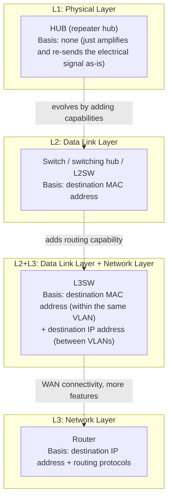
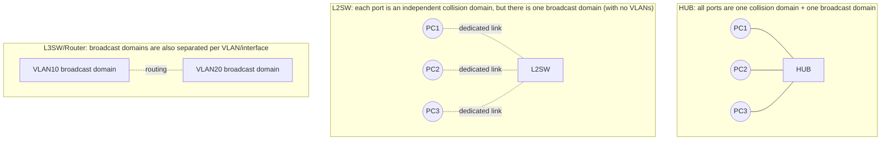
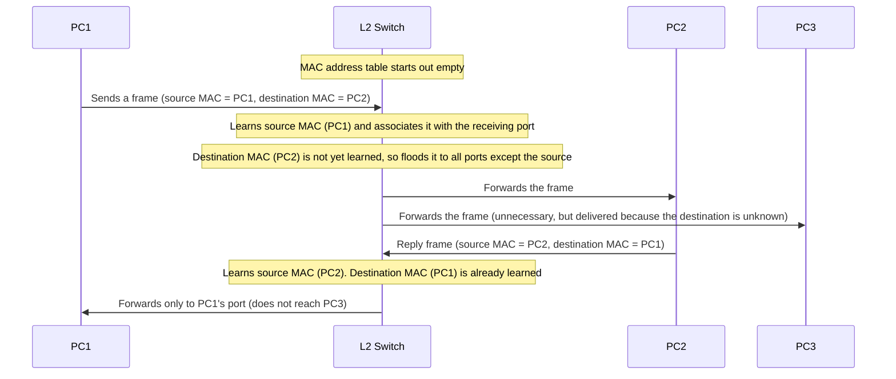
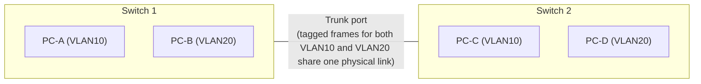
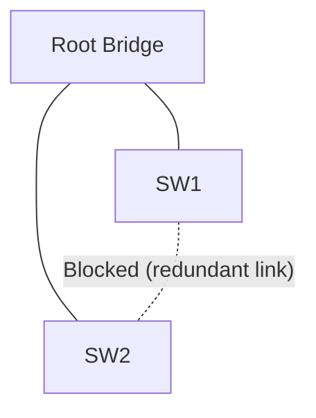
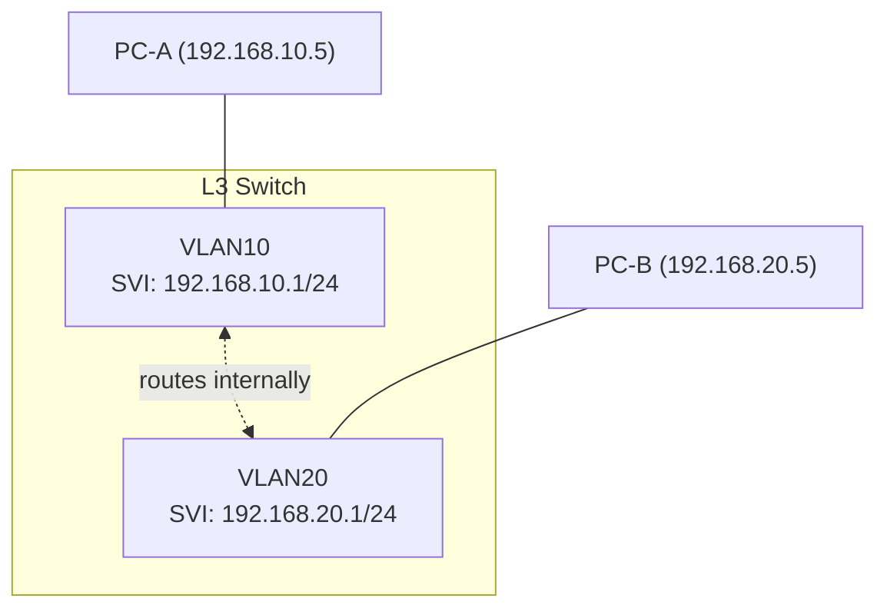

## Introduction

- **What You'll Learn From This Article**: This article organizes the difference between the device names commonly used somewhat loosely in the field — "hub," "switch," "switching hub," "L2SW," "L3SW," "router" — around a single consistent axis: "which layer of the OSI model, and which piece of information, does each one use as the basis for forwarding?" Along the way, it also gives you a systematic understanding of the difference between collision domains and broadcast domains, segment separation via VLANs, loop prevention via spanning tree, and the hardware-level differences between an L3 switch and a router.
- **Intended Audience**: This article assumes you work as an infrastructure engineer, and have a vague sense of the difference between an L2 switch, an L3 switch, and a router but can't quite explain it precisely — or have been confused by the term "switching hub" that shows up in older documentation.
- **Estimated Reading Time**: About 30 minutes

This article is part of the [Top 1% Series' full article guide](/en/sitemap). Relatedly, how packets are processed inside the OS is covered in [Understanding the Network Stack from a "Top 1%" Perspective](/en/articles/network-stack-guide), but this article can also be read standalone, with no prerequisites.

## Prerequisites

- **MAC address / IP address**: A MAC address is the 48-bit physical address assigned to a NIC; an IP address is a logical address. These are covered in more detail in [Understanding the Network Stack from a "Top 1%" Perspective](/en/articles/network-stack-guide).
- **Frame/packet**: The unit handled at the data link layer is called a "frame," and the unit handled at the network layer is called a "packet." This article also uses these two terms depending on context.
- **OSI reference model**: A model that breaks network communication down into layers by role. This article centers mainly on three layers: L1 (physical layer), L2 (data link layer), and L3 (network layer).

## Getting the Big Picture

### In a Nutshell

Hubs, switches, L2SWs, L3SWs, and routers are all "relay devices that connect multiple devices or networks," but the difference between them boils down to a single point: **"which layer of OSI information they look at, and what they use as the basis for forwarding."**

"A hub doesn't think at all — it just amplifies the electrical signal and floods it out every port." "A switch looks at the MAC address table and forwards only to the port it needs to reach." "An L3 switch or router goes further, looking at the IP address as well, and correctly forwards (routes) packets addressed to a different network to the right path." As each device gets "smarter," it consistently moves in the same direction: looking at information from progressively higher layers.

### Collision Domains and Broadcast Domains

Another axis for understanding the difference between these devices is the **collision domain** and the **broadcast domain**.

- **Collision domain**: The range within which, if multiple devices send signals at the same time, those signals collide with each other and corrupt the data.
- **Broadcast domain**: The range that a broadcast sent by one host — a frame with no specific destination, addressed to "everyone within the same segment" — can reach.

Where each of these two domain types gets split determines everything about the characteristics of each device, as discussed below.

## Fundamentals, Thoroughly Explained

### HUB (Repeater Hub): A Simple L1 Signal Relay Device

A **repeater hub** is a device that receives an electrical signal on one port and, without judging the destination at all, simply amplifies it and sends it back out every other port. Because it never looks at the contents of the frame (such as the MAC address), it operates purely at L1 (the physical layer) of the OSI reference model.

The biggest constraint of a hub is that **all ports share a single collision domain**. If two or more devices send a signal at the same instant, those electrical signals collide inside the hub and the data is corrupted. The mechanism used to detect and avoid this is called **CSMA/CD (Carrier Sense Multiple Access with Collision Detection)**.

1. **Carrier Sense**: Before transmitting, check whether the line is already in use by other communication (whether a carrier signal is present).
2. **Multiple Access**: If the line is judged to be free, begin transmission. Because multiple devices can independently judge the line to be free at the same time, this alone can't fully prevent collisions.
3. **Collision Detection**: If a collision with another signal is detected during transmission, stop transmitting immediately, wait a random amount of time, and then attempt to retransmit.

As long as CSMA/CD is in play, communication under a hub is constrained to **half duplex** — it cannot send and receive at the same time. The IEEE 802.3 standard defines both half-duplex operation via CSMA/CD and full-duplex operation (discussed below), but a hub (repeater hub) can, by its very structure, only operate in half duplex.

In today's typical office or data center LANs, a repeater hub is essentially never newly deployed. As switches became cheaper and more widespread, they completely replaced hubs, since a switch structurally eliminates collisions altogether. If you encounter the word "hub" today, it's almost always being used as shorthand for the "switching hub" described in the next section.

Are there still places today where you'd encounter something like a repeater hub?

Repeater hubs in the strict sense (pure L1 relay) have essentially disappeared from the new-equipment market, but the underlying idea lives on in a device called a "network TAP," which duplicates traffic as-is and streams it to a monitoring device. A TAP is used to split off a signal for IDS/IPS or packet capture purposes without affecting the primary communication, and shares the philosophy of "forward without judging the destination" with a repeater hub — but its purpose (monitoring) and internal structure are different from a modern repeater hub; it's a dedicated, purpose-built device.

### Switch / Switching Hub / L2SW: Why the Same Thing Has Three Names

This is where the confusion typically starts. **"Switch," "switching hub," and "L2SW" refer, in practice, to essentially the same thing.** The reason there are three different names for it comes down to the historical circumstances of the Japanese networking equipment market.

- In the 1990s, what was common in homes and offices was the repeater hub described in the previous section (simply called a "hub").
- Later, smarter devices that read a frame's destination MAC address and forward it only to the necessary port became widespread. Because these devices looked physically the same as a repeater hub (a box with several LAN ports lined up, placed at the center of a star-wired topology), the term "**switching hub**," abbreviated "**SW hub**," became established in the Japanese market as a way to distinguish the two.
- Meanwhile, among enterprise equipment and network engineers, the more general terms "**switch**" and "**L2 switch (L2SW)**" are used. The term "switching hub" is largely a Japanese consumer-market colloquialism; overseas technical documentation and vendor catalogs generally just use the term "switch."

In other words, **the internal behavior of the device these three terms currently refer to — forwarding based on a MAC address table — is identical**; the difference lies mainly in "who's calling it what, in what context (a home-market colloquialism, or technical terminology)." That said, the word "switch" can sometimes also be used more broadly, in a way that includes the L3SW discussed in the next section, so when precision matters, it's safer in practice to explicitly say "L2SW" or "L3SW" to specify the layer.

#### How Forwarding Works via the MAC Address Table

An L2 switch looks at a received frame's **destination MAC address** to decide which port to forward it to. The **MAC address table (CAM table: Content Addressable Memory)** is what it uses to make this decision.

This **MAC address learning** mechanism can be summarized as follows:

1. Upon receiving a frame, the switch records (learns) the pairing of the **source MAC address** and the port it was received on, into the MAC address table.
2. If the **destination MAC address is already learned**, the switch forwards the frame only to the corresponding port (not to any other port).
3. If the **destination MAC address is not yet learned**, or if the destination is the broadcast address, the switch forwards the frame to every port except the one it was received on. This is called **flooding**.
4. Any entry with no traffic for a certain period (around 300 seconds in typical implementations) is automatically removed from the MAC address table (**aging timer**). This ensures that when a device is unplugged/replugged or a port is reassigned — changing which MAC address maps to which port — stale information doesn't linger indefinitely.

#### Why a Switch Can Eliminate Collisions

What made the L2 switch revolutionary was that **it makes each port an independent collision domain**. Whereas all ports on a hub effectively behaved like one shared bus, a switch processes frames addressed to each port individually internally and forwards them only to the necessary port. This effectively makes the devices connected to each port behave as if they're connected "1-to-1 over a dedicated line," enabling **full-duplex communication, which can send and receive at the same time**. In full-duplex communication, send and receive are handled as separate signal paths, so the very situation of "sending at the same time and colliding" structurally cannot occur.

| Forwarding method | Behavior | Latency | Error checking |
|---|---|---|---|
| Store-and-forward | Receives the entire frame, verifies the CRC (error-detection code), and forwards only valid frames | High (proportional to frame length) | Yes (corrupted frames can be discarded before forwarding) |
| Cut-through | Reads only the leading portion containing the destination MAC address, and starts forwarding immediately without waiting for CRC verification | Low | None (corrupted frames may still be forwarded as-is) |
| Fragment-free | A compromise between the two: receives the first 64 bytes — where collisions are most likely to occur — before starting to forward | Medium | Partial (protects against corruption from early collisions) |

Most mainstream enterprise switches today adopt the store-and-forward method, which balances the reliability of being able to block error frames early against the fact that, with modern ASIC processing speeds, the latency impact is practically negligible.

#### Splitting Broadcast Domains with VLANs

With an L2 switch alone, **the broadcast domain is still just one single domain** (even though collision domains are separated per port, broadcast frames still reach every port). The mechanism for logically splitting this is **VLAN (Virtual LAN, IEEE 802.1Q)**.

VLAN is a technology that creates multiple independent logical broadcast domains inside a single physical switch. Only ports assigned the same VLAN number belong to the same broadcast domain, and frames don't cross between different VLANs (without the L3 functionality discussed below).

A **trunk port** is what's used to connect switches over a single physical link while still carrying frames from multiple VLANs. A frame passing through a trunk port has a 4-byte piece of information called the **802.1Q tag** inserted into its Ethernet header, explicitly indicating which VLAN it belongs to.

| Field | Size | Content |
|---|---|---|
| TPID (Tag Protocol Identifier) | 16 bits | A fixed value, `0x8100`, indicating the frame carries an 802.1Q tag |
| PCP (Priority Code Point) | 3 bits | QoS priority (8 levels, 0–7) |
| DEI (Drop Eligible Indicator) | 1 bit | A flag indicating whether this frame is eligible to be preferentially discarded under congestion |
| VID (VLAN Identifier) | 12 bits | VLAN number (0–4094 valid; theoretically up to 4094 VLANs can be identified) |

On the other hand, a port belonging to only a single, specific VLAN (the kind of port a regular PC or server would connect to) is called an **access port**, and frames passing through it are not given an 802.1Q tag (they're treated as untagged frames). The **native VLAN** setting determines which VLAN an "untagged frame with no explicit VLAN assignment" received on a trunk port should be treated as belonging to; if this setting differs between the two ends of a trunk, it causes trouble where frames unintentionally cross between VLANs (covered later, in "Common Misconceptions and Pitfalls").

Splitting a network into segments with VLANs isn't just a textbook exercise — it maps directly onto how real organizations design their networks. Japanese local governments, for instance, implement three segments — the My Number business segment, the LGWAN-connected segment, and the internet-connected segment — using exactly this combination of VLANs and firewalls, based on how sensitive the resident information involved is. That concrete design is covered in a deep dive: [Understanding Japanese Local Government Network Segregation and Security Clouds from a "Top 1%" Perspective](/en/articles/local-gov-network-guide).

#### Loops and the Spanning Tree Protocol (STP)

When switches are interconnected with redundant links (multiple physical links) to improve availability, this creates a **loop** in the L2 network. IP routing has TTL (Time to Live, a packet's lifespan), but **Ethernet frames have no equivalent mechanism**. So if a broadcast frame flows through a network with a loop present, that frame keeps looping forever, multiplying as it goes, and eventually causes a **broadcast storm** that consumes all available network bandwidth and exhausts the switches' CPU and MAC address table capacity.

**STP (Spanning Tree Protocol, IEEE 802.1D)** is what prevents this. STP automatically builds a logically loop-free tree structure (a spanning tree) out of the redundant links, and **logically blocks** whichever extra links would otherwise create a loop.

STP's operation can be summarized as follows:

1. **Root bridge election**: Each switch compares its **bridge ID** (a combination of priority and MAC address), and the switch with the lowest value is elected as the "root bridge." Every switch builds its tree structure based on the shortest path to this root bridge.
2. **Port role determination**: Each switch determines which port is on the shortest path to the root bridge (the root port), which port is responsible for forwarding to other segments (the designated port), and which port would otherwise create a loop and is neither of these (the non-designated port, subject to blocking).
3. **Port state transitions**: A port transitions through the states `Blocking` → `Listening` → `Learning` → `Forwarding`, in that order. `Blocking` receives BPDUs (the control frame discussed below) but does not forward data frames; `Listening` processes BPDUs to determine the port's role; `Learning` begins MAC address learning but still does not forward data frames; and only once it reaches `Forwarding` does it begin sending and receiving data frames.

Each switch periodically exchanges control frames called **BPDUs (Bridge Protocol Data Units)** to continually confirm the state of the topology with its neighbors. Under the IEEE 802.1D standard's default timers, the Hello Timer (the interval between BPDU transmissions) is 2 seconds, the Forward Delay (the time spent in each of the `Listening` and `Learning` states) is 15 seconds, and the Max Age (the maximum time a received BPDU is held valid) is 20 seconds. Because a port passes through the Forward Delay twice (Listening → Learning) on its way from `Blocking` to `Forwarding`, this results in **a theoretical convergence time of roughly 30 to 50 seconds**.

This slow convergence is a significant practical drawback, and **RSTP (Rapid Spanning Tree Protocol, IEEE 802.1w)** was developed to improve on it. RSTP simplifies port states into `Discarding`/`Learning`/`Forwarding`, and by having neighboring switches explicitly negotiate with each other, it achieves fast convergence within a few seconds when conditions allow. In newly built networks today, it's common to use RSTP (or MSTP, which can maintain a separate topology per VLAN) rather than the older STP.

### L3SW: An L2 Switch with Routing Built In

An **L3SW (Layer 3 switch)** is a device that adds **IP-address-based routing** — built into hardware — on top of an L2 switch's functionality (forwarding via the MAC address table, VLAN, STP). Its defining feature is that it can have an **SVI (Switched Virtual Interface)** — a virtual L3 interface — for each VLAN.

Communication from PC-A to PC-B is sent to VLAN10's SVI (192.168.10.1), configured as PC-A's default gateway, and the L3 switch routes it internally to the VLAN20 side to deliver it. This is called **inter-VLAN routing**.

Before L3 switches existed, inter-VLAN routing was achieved with a configuration called "**router-on-a-stick**" — connecting an L2 switch to an external router over a single trunk link, with the router configured with a sub-interface for each VLAN to perform the routing. In this configuration, every piece of inter-VLAN traffic had to travel back and forth over the single physical link between the L2 switch and the external router, and that link's bandwidth tended to become a bottleneck. By building routing functionality directly into the switch chassis, an L3 switch achieves **wire-speed routing (the theoretical line rate itself)** without needing to traverse an external link.

#### Why Wire-Speed Routing Is Possible: Hardware Forwarding via ASIC/TCAM

The reason an L3 switch can achieve wire speed is that routing decisions aren't left to software processing on a general-purpose CPU — they're handled by **dedicated hardware (an ASIC)**. Let's break this mechanism down using Cisco Express Forwarding (CEF), a widely used architecture in the industry, as an example.

1. First, the control plane builds a **RIB (Routing Information Base, the routing table in the usual sense)** from route information learned via routing protocols (static routes, OSPF, etc.).
2. This is then converted into a form optimized for fast lookup — the **FIB (Forwarding Information Base)**. The FIB reflects the RIB's contents one-to-one, but is restructured to enable fast longest-prefix-match lookups (finding the route that most specifically matches a destination IP address).
3. Information actually needed to send a frame out — such as the next hop's MAC address — is kept separately in an **Adjacency Table**.
4. The FIB, the adjacency table, and configuration such as ACLs (access control lists) and QoS are all written into a hardware memory called **TCAM (Ternary Content Addressable Memory)**. TCAM is a special kind of memory that can match multiple fields — such as a destination address — against a set of entries in parallel, in a single memory access. Every time a packet arrives, referencing this TCAM just once is enough to simultaneously determine the outgoing port, the MAC address to rewrite, and which ACL to apply.

By **clearly separating route computation (control plane) from per-packet forwarding (data plane), and processing the data plane in parallel on dedicated hardware**, modern L3 switches (and, as discussed below, routers) achieve orders-of-magnitude higher forwarding performance than the traditional "process switching" approach of having the CPU handle each packet individually.

This architecture lets an L3 switch offer high-density, low-cost inter-VLAN routing, but as explained in the next section, it generally falls short of a general-purpose router in terms of WAN interface diversity, the capacity to hold large routing tables, and features like NAT/VPN.

### Router: A General-Purpose L3 Gateway

A **router** performs IP-address-based routing just like an L3SW, but it differs from an L3 switch mainly in the following respects:

| Aspect | L3 Switch | Router |
|---|---|---|
| Primary use | Inter-VLAN routing within a campus/data center (LAN side) | Connecting different networks (WAN side, internet edge) |
| Interface types | Mostly high-density Ethernet ports | Ethernet plus a variety of WAN links (broadband Ethernet, mobile links, fiber terminations, etc.) |
| Routing table capacity | Constrained by TCAM capacity; many models can't hold the full internet routing table (900,000+ routes) | Models designed to hold large routing tables and full BGP routes exist |
| Additional features | Mostly limited to ACLs and QoS | Rich feature set: NAT, stateful firewalling, VPN termination (IPsec/L2TP, etc.), advanced QoS control |
| Cost per port | Relatively cheap, high density | Tends to be more expensive, in proportion to its feature set |

In short, the basic practical rule of thumb is: **use an L3 switch to "connect VLANs together quickly within the LAN," and use a router when you need to "connect to the outside of the LAN (WAN/internet), or need NAT, VPN, or advanced firewall functionality."**

Note that most routers today, like L3 switches, also adopt ASIC/TCAM-based hardware forwarding internally. However, home routers and small-branch-office models often use a design where a general-purpose CPU handles processing that TCAM alone can't complete — complex NAT translation, packet filtering, VPN encryption, and so on (or a design that combines hardware and software processing). The simple dichotomy "a router is always slow because it's software-based, an L3 switch is always fast because it's hardware-based" isn't accurate; it's more true to reality to think of it as **a difference in design philosophy — specializing in simple forwarding within the LAN, versus handling the full range of multi-featured processing at the WAN boundary**.

## The View from the Top 1% (What Experts See)

### The Limits of TCAM and "Punting"

The TCAM-based hardware forwarding described in the previous section has an important limitation: **not every packet can actually be processed by TCAM alone**. Packets that can't be handled by the normal forwarding path built on the routes, ACLs, and QoS settings written into TCAM (the **fast path**) — for example, packets whose TTL has hit 0 (requiring an ICMP Time Exceeded to be generated), packets with special IP header options, packets flagged for ACL logging, or packets like ARP requests that need to reach the control plane itself — fall out of the hardware fast path and are **forwarded to the CPU (control plane) — "punted" — to be handled in software**.

This punting process is orders of magnitude slower than normal hardware forwarding. In practical terms, this means aggressive traffic that generates a large volume of destination-unreachable ICMP messages, or a configuration that triggers heavy ACL logging, can unintentionally generate a flood of punts to the CPU, driving up the device's overall CPU utilization and even affecting the processing of other, legitimate traffic. The idea that "because it's forwarded in hardware, performance never degrades no matter what the traffic pattern looks like" is a misconception; understanding which kinds of traffic trigger punting, and how much load that generates, is foundational to top-1%-level troubleshooting.

### Broadcast Domain Design and the L2/L3 Boundary

Even though VLANs let you split broadcast domains finely, **that doesn't mean a single VLAN (broadcast domain) can be grown without limit**. As the number of hosts within a single VLAN grows, the absolute volume of broadcast traffic — such as ARP requests — grows with it, consuming CPU and network bandwidth on every host. Also, when an STP/RSTP topology change occurs (a link failure, adding a device, etc.), the impact spreads across the entire VLAN.

For this reason, large-scale network designs widely adopt the design philosophy of "**keep L2 as small and contained as possible, and cut things off at L3 (routing) early**." A typical campus/data center network design maps VLAN design one-to-one with IP address design (subnet design), splits VLANs/subnets along physical boundaries such as floors or racks, and interconnects them via L3 switches. Because the VLAN number itself is constrained by the 802.1Q tag's 12-bit field to a theoretical maximum of 4094, large multi-tenant environments sometimes use technologies like VXLAN to extend the VLAN ID space — but that's an advanced topic beyond the scope of this article.

### CAM Table Overflow Attacks

L2 switch MAC address learning is built on the premise that **it learns whatever source MAC address a frame claims, first-come first-served**. An attack that exploits this property is called a **CAM table overflow attack (MAC flooding attack)**. If an attacker sends a large volume of frames with fake source MAC addresses, the MAC address table's capacity gets exhausted, and from then on all legitimate frames end up being flooded as "destination unknown." Because frames that the switch would normally forward only to a narrowed-down destination port instead get sprayed to every port, the attacker can eavesdrop on communication that was never addressed to them.

The following features are commonly used in practice as countermeasures:

- **Port security**: A feature that caps how many MAC addresses can be learned per port, and takes action — such as automatically disabling the port — when that cap is exceeded.
- **DHCP snooping**: Blocks responses from any DHCP server other than a trusted one, preventing a rogue DHCP server from handing out fraudulent addresses.
- **Dynamic ARP Inspection (DAI)**: Validates whether the contents of an ARP reply are legitimate, based on the trusted IP-to-MAC mappings collected via DHCP snooping.

All of these are defensive mechanisms for protecting the L2 domain, grounded in the premise that "L2 forwarding is built on trusting a piece of information — the MAC address — that is, fundamentally, self-reported."

## Common Misconceptions and Pitfalls

- **Misconception 1: "A switching hub is basically a cousin of a repeater hub — just a fancier hub"**
  In terms of internal behavior, a switching hub is a full L2 switch that forwards based on a MAC address table, which is fundamentally different from a repeater hub that unconditionally amplifies and re-sends an electrical signal. The shared word "hub" comes from a historical, physical resemblance — both aggregate multiple cables in a star topology — not from having the same internal behavior.
- **Misconception 2: "An L3 switch and a router are either exactly the same thing, or completely different things"**
  Both extremes are wrong. They share the same core capability — IP-address-based routing — but an L3 switch is optimized mainly for high-density, low-cost inter-VLAN routing within a LAN, while a router is optimized for broader roles like WAN connectivity, NAT, VPN, and holding large routing tables. The accurate way to think about it is "the same capability, but a different product category, with designs optimized for different intended uses."
- **Misconception 3: "Since it's a switch, collisions can never happen"**
  On today's typical full-duplex links, collisions structurally cannot occur — but if a **duplex mismatch** occurs (one port set to full duplex, the other to half duplex), the half-duplex side still operates under the assumption of CSMA/CD behavior, so collisions (more precisely, late collisions) can still occur. The accurate understanding isn't "behind a switch = unconditionally collision-free" but rather "collision-free, as long as full-duplex communication is correctly established."
- **Misconception 4: "Splitting into VLANs provides complete security isolation"**
  A VLAN is merely a mechanism for logically splitting broadcast domains — it doesn't, by itself, provide encryption or access control. Misconfigured trunk ports, or a technique called VLAN hopping (discussed below), can unintentionally break the separation between VLANs, so if you actually intend to use VLANs as a security boundary, you need to pair them with ACLs and a firewall.

## Troubleshooting Perspective

Given the layered structure of these devices, failure isolation can also be organized around the axis of "**which layer's forwarding logic is broken?**"

1. **Physical connectivity problems**: If a link won't come up, or keeps flapping intermittently, first suspect a physical fault in the cable, the SFP module, or the port itself.
2. **Duplex mismatch**: If one port is set to full duplex and the other to half duplex due to a failed auto-negotiation, communication still works but throughput drops drastically, which shows up as increased late collisions or FCS (Frame Check Sequence) errors in a command equivalent to `show interfaces`.
3. **Broadcast storm**: If STP/RSTP is disabled despite redundant links being present, or configured in a way that prevents BPDUs from being sent/received (such as an incorrect BPDU filter), a loop can form undetected — showing up as a spike in CPU utilization and a surge in traffic across every port. Checking port states with a command equivalent to `show spanning-tree` (to see if every port has ended up in the Forwarding state) is the standard approach.
4. **VLAN/trunk misconfiguration**: If intended endpoints can't communicate, suspect a misconfigured VLAN number on an access port, a mismatch in the VLANs allowed on a trunk port, or a native VLAN mismatch (where one side treats a frame as properly tagged and the other side mistakenly treats it as untagged and assigns it to a different VLAN). Cross-check the configuration on both ends with commands equivalent to `show vlan` and `show interfaces trunk`.
5. **Temporary outages/performance degradation from STP topology changes**: When an STP topology changes — due to adding/removing a link, restarting a switch, etc. — the affected switches forcibly flush their MAC address table (or drastically shorten the aging timer), causing an increase in flooding for a while. If topology changes happen frequently (e.g., an unstable link flapping repeatedly), this effect becomes chronic and can show up as perceptible performance degradation.
6. **CAM table/ARP table anomalies**: If a specific device can't communicate, or communication unexpectedly reaches the wrong device, suspect an anomaly in the MAC address table (such as the CAM overflow attack described earlier) or ARP table poisoning (ARP spoofing), and check the learned entries with a command equivalent to `show mac address-table`.
7. **Reachability issues on an L3 switch/router**: If communication between VLANs, or with an external network, fails, isolate the issue — after confirming the lower layer (L2) is not the problem — by checking the state of the SVI/interface, the routing table (static routes and the state of any dynamic routing protocol), and whether an ACL is unintentionally blocking traffic.

### Prevention and Long-Term Countermeasures

- When building a redundant configuration, confirm in advance that STP/RSTP is correctly enabled and that the expected ports are actually blocked.
- Rather than relying on port auto-negotiation, explicitly match speed/duplex settings on both ends for devices where fixed settings matter.
- When configuring trunk ports, always cross-check the allowed VLAN list and native VLAN on both ends, and keep a templated configuration deployment procedure on hand.
- Enable features like port security, DHCP snooping, and Dynamic ARP Inspection by default, especially on access-layer edge switches.

## Summary

- The differences between hubs, switches, L2SWs, L3SWs, and routers can be organized around one consistent axis — "which OSI layer's information is used as the basis for forwarding": a hub simply relays electrical signals as-is (L1); an L2 switch forwards based on a MAC address table (L2); an L3 switch or router also routes based on an IP address (L3).
- "Switch," "switching hub," and "L2SW" are, in practice, just different names for essentially the same device, and their internal behavior (MAC address learning and flooding) is shared.
- Collision domains are split per switch port, but broadcast domains are only split by VLANs. In redundant configurations where loops exist, loop prevention via STP/RSTP is essential.
- Both L3 switches and routers perform IP-address-based hardware forwarding (ASIC/TCAM), but they're separate product categories optimized for different purposes: L3 switches for inter-VLAN routing within a LAN, and routers for WAN connectivity, NAT, VPN, and holding large routing tables.

**Starting Today**
1. When you hear a device name (hub/switch/L3SW/router), get in the habit of first asking "which OSI layer's information is it using to forward?"
2. When isolating a network failure, make "is this an L2 problem (MAC address table, VLAN, STP), or an L3 problem (routing, ACLs)?" your first step.

**Deep Dive**
- How VLAN-based segmentation is applied in practice, using Japanese local government network segregation as an example: [Understanding Japanese Local Government Network Segregation and Security Clouds from a "Top 1%" Perspective](/en/articles/local-gov-network-guide)

## References

- [IEEE Standard for Ethernet (802.3)](https://standards.ieee.org/ieee/802.3-REVam/3568/)
- [IEEE 802.1Q-2022 (Bridges and Bridged Networks / VLAN)](https://standards.ieee.org/ieee/802.1Q/10323/)
- [Understand Rapid Spanning Tree Protocol (802.1w) | Cisco](https://www.cisco.com/c/en/us/support/docs/lan-switching/spanning-tree-protocol/24062-146.html)
- [Understand Cisco Express Forwarding | Cisco](https://www.cisco.com/c/en/us/support/docs/routers/12000-series-routers/47321-ciscoef.html)
