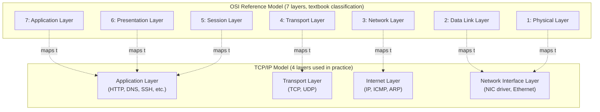
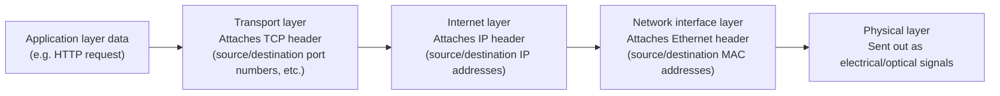
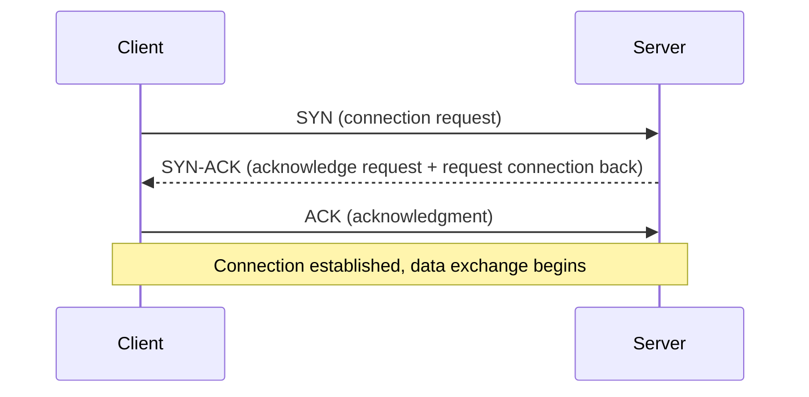
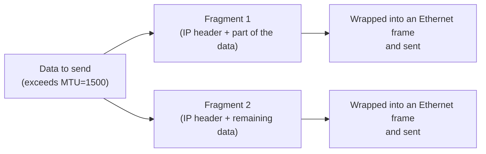

## Introduction

- **What You'll Learn From This Article**: What's actually inside the term "network stack" — what each layer (the NIC driver, IP, TCP/UDP, and the application) does, why it's layered in the first place, and why communication stops working the moment the OS freezes. This article walks through all of it systematically.
- **Intended Audience**: This article assumes you work as an infrastructure engineer, can handle "ping works / doesn't work" or "the port is open / closed" reasonably well, but can't quite explain the layered structure underneath.
- **Estimated Reading Time**: About 20 minutes

This article is part of the [Top 1% Series' full article guide](/en/sitemap).

"If the OS freezes, communication stops too" is a phenomenon everyone has experienced firsthand. The reason is that the communication process itself is implemented as a software-layered structure called the OS's "network stack." This article digs into how many layers that "network stack" is made of, and what each layer actually does.

## Prerequisites

- **Packet/Frame**: A unit of data exchanged over a network. The name changes by layer — "frame," "packet," "segment" — but in this article we sometimes use "packet" as a generic term for all of them.
- **Layer**: A way of thinking about network communication as a stack of layers, each responsible for a specific role. Each layer only talks to the layer directly above and below it.

## Getting the Big Picture

### In a Nutshell

The network stack is "**a layered mechanism for conversion and delivery that progressively transforms the data an application wants to send into a form that can be physically transmitted as electrical signals, and then reconstructs the original data on the receiving side by reversing the process, step by step**."

### The OSI Reference Model and the TCP/IP Model

The OSI reference model is a textbook model that classifies networking into a detailed 7 layers, while the TCP/IP model is the practical 4-layer model actually used in the design of the internet and LANs. In practice, people almost always talk about "NIC driver → IP → TCP/UDP → application," the 4-layer TCP/IP model, so this article proceeds on that basis as well.

## Fundamentals, Thoroughly Explained

### Encapsulation: How Data Descends Through the Layers

When an application wants to send data such as "hello," that data isn't sent as-is. Instead, at each layer, a "header" (control information such as destination information) specific to that layer is attached, and the data is passed down to the layer below. This is called **encapsulation**.

On the receiving side, the reverse happens: the signal that arrived at the physical layer is peeled one layer at a time (**decapsulation**), until it's finally reconstructed into the original data the application can understand. The key to this design is the separation of concerns: each layer reads and processes only its own header, and passes the contents (the upper layer's data) untouched to the next layer.

### The Network Interface Layer: The Role of the NIC Driver

A NIC (Network Interface Card) is the hardware that converts data into electrical or optical signals for physical transmission and reception. The **NIC driver** is the software that bridges the OS and this hardware, and it has the following roles:

- Converting data handed off from the OS (an Ethernet frame) into a form the NIC understands, and passing it to the hardware
- Passing data received by the NIC up to the OS's upper layer (the IP layer)
- Transferring data efficiently while keeping CPU load down, using interrupt handling and DMA (Direct Memory Access)

An Ethernet frame contains the source and destination **MAC addresses** (48-bit physical addresses assigned to a NIC), which are used to identify the delivery destination within the same LAN. When you push further into questions like "if we already know the destination IP address, why do we need separate delivery via MAC address?" or "what exactly are interrupt handling and DMA doing?", you arrive at the deepest layer of the Linux kernel's network processing — and whether you understand this area is precisely what separates the "top 1%" from everyone else. Because this is a large, self-contained topic, it's covered in exhaustive depth in a separate article, "[Understanding NIC Drivers and Linux Kernel Networking from a \"Top 1%\" Perspective](/en/articles/nic-driver-internals-guide)." Note that "how IP addresses map to MAC addresses" (ARP) is covered in the very next section.

### The Internet Layer: IP Addresses and ARP

**IP (Internet Protocol)** is the layer responsible for delivery — getting a packet to its destination IP address. An IP address is a logical address, which is what makes routing across networks possible.

This raises a question: "how do an IP address (a logical address) and a MAC address (a physical address) get tied together?" This is resolved by **ARP (Address Resolution Protocol)**. When communicating within the same LAN, the sender broadcasts a query asking "who has this IP address?" (an ARP request), and the corresponding host replies with its own MAC address (an ARP reply), resolving the correspondence between the IP address and the MAC address. This mapping is cached in the OS as an **ARP table**.

Communication destined for a different network (subnet) isn't resolved directly via ARP. Instead, it's first sent to the **default gateway (router)**, and from there it's forwarded to the next hop based on the routing table.

### The Transport Layer: The Difference Between TCP and UDP

The transport layer identifies "**which application (process) the data is addressed to**" using a **port number** (a number from 0 to 65535), and it's the layer that offers a choice of how much reliability to guarantee for the data. Port numbers are actually stored as "source port number" and "destination port number" fields inside the TCP/UDP header that this layer attaches. It helps to understand the division of labor between layers this way: the IP header specifies "which host it's addressed to," while the TCP/UDP header specifies "which application within that host it's addressed to" — each header handling its own separate concern.

| Characteristic | TCP (Transmission Control Protocol) | UDP (User Datagram Protocol) |
|---|---|---|
| Connection | Connection-oriented (establishes a connection in advance via a 3-way handshake) | Connectionless (sends immediately, with no setup) |
| Reliability | Delivery confirmation (ACK) and retransmission control; packet order is also guaranteed | No delivery confirmation; neither delivery nor ordering is guaranteed |
| Speed/overhead | Higher overhead due to reliability guarantees | Low overhead, fast |
| Congestion control | Yes (adjusts send rate based on network congestion) | No |
| Typical uses | Web access (HTTP), SSH, email, file transfer, and other uses where data loss is unacceptable | Video/audio streaming, DNS queries, gaming, and other uses that prioritize speed over occasional loss |

**TCP's 3-Way Handshake**

Before starting communication, TCP uses this 3-step exchange to confirm both sides are ready, and only then begins actually sending and receiving data. After that, it keeps confirming with ACKs (acknowledgments) that data arrived correctly one piece at a time, and retransmits any packet that didn't arrive. UDP has none of this machinery, which gives it its characteristic trait: "fast, but no guarantee of delivery."

### The Application Layer: Sockets and the Division of Protocols

The application layer is where protocols suited to specific purposes — HTTP, DNS, SSH, and so on — run. As explained in the previous section, the port number itself is information held by the transport layer (the TCP/UDP header), but the combination of "**IP address + port number**" is called a **socket**, and this is the smallest addressable unit of a network communication destination (e.g., `192.0.2.10:443` is that server's HTTPS socket). The division of labor with the transport layer becomes clear once you understand it this way: application-layer protocols (HTTP, DNS, SSH, etc.) define how to interpret the actual contents of the data that arrives (the format of a request, the format of a response, etc.) after delivery down to "which socket it's addressed to" — the transport layer's job — has already completed.

### Why the Entire Network Stack Stops Working When the OS Freezes

Every layer we've looked at so far — the NIC driver, IP, TCP/UDP, and the application — is **all processed by the OS kernel and the software running on top of the OS**. In other words, this "network stack" itself is implemented as part of the OS software. If the OS freezes due to a kernel panic or a hang, the software performing this processing stops as well, and communication processing grinds to a halt right along with it.

What exactly is happening during a "kernel panic" or a "hang"?

Both result in "the OS stops responding," but what's happening internally is different.

**Kernel Panic**

This is a state where the kernel — the core of the OS — decides on its own that "it's no longer safe to keep processing" and deliberately halts all processing. The typical visible behavior is the screen Windows calls the "Blue Screen (BSOD)" and Linux calls a "Kernel Panic." Common causes include:

- **A buggy device driver** reading or writing to an invalid region of kernel-space memory (NIC drivers and storage drivers run in kernel space, so bugs in them are especially likely to affect the entire OS)
- The kernel detecting a **hardware failure** (an uncorrectable ECC memory error, an internal CPU error, etc.) and halting immediately to prevent data corruption from spreading
- The kernel detecting **an inconsistency in its own internal data structures** (a state that should never occur) and judging that continuing is dangerous

A kernel panic is, in a sense, the OS's self-defensive way of saying "rather than keep running broken and let the damage spread, stop right here."

**Hang (Freeze)**

Unlike a kernel panic, which explicitly declares a halt, a hang is a state where processing effectively can't move forward and nothing responds from the outside. Unlike a kernel panic, keyboard input and display output may still technically be alive. Common causes include:

- **Deadlock**: Multiple kernel threads each wait forever for a lock (an exclusion-control key) held by the other, and processing never advances
- **Infinite loop**: A bug causes a loop that should normally terminate to keep running because its exit condition is never met (if the loop holds an important lock while stuck, other processing stalls along with it)
- **Resource exhaustion**: System-wide processing slows to a crawl due to out-of-memory (OOM) conditions, or the disk/network processing queue backs up completely under a flood of I/O waits

In every case, what's common is that the kernel code path responsible for network stack processing can no longer keep executing (halted in the case of a panic, effectively stuck in the case of a hang), and as a result, communication processing stops too.

This is also the core reason why out-of-band management (a BMC) like Dell's iDRAC can "communicate and operate no matter how badly the OS has frozen." iDRAC (a BMC) communicates using **hardware and a software stack entirely separate** from the NIC driver, IP stack, and TCP/UDP stack that the host OS uses (a small, dedicated embedded system inside iDRAC has its own independent network stack). That's precisely why communication and operations directed at iDRAC continue to work unaffected, no matter how severely the host OS has frozen.

## The View from the Top 1% (What Experts See)

### MTU and Fragmentation

**MTU (Maximum Transmission Unit)** is "the upper size limit of an IP packet (the IP header plus its contents) before it's placed onto an Ethernet frame" (typically 1500 bytes). In other words, it's accurate to think of it as "the upper size limit on data before encapsulation via a MAC address (attaching the Ethernet header)." If the IP packet you want to send exceeds this MTU, the IP layer has to split it into multiple pieces — this is called **fragmentation**.

Fragmentation comes with the following costs and risks:

- **Increased processing cost**: The sender has to split the data, and the receiver has to perform the additional work of reassembly.
- **Deliverability problems**: If even one fragment is lost somewhere along the path, the receiver waits for the remaining fragments and ultimately fails to reassemble the packet (TCP will retransmit, but with UDP, the lost data is simply gone). Some firewalls are configured to block fragmented packets outright, because it's hard to inspect the contents of a fragmented packet.

In environments using VPNs or tunneling technologies (IPsec, VXLAN, GRE, etc.), an additional tunnel header is wrapped around the outside of the original packet, which shrinks the "actual usable payload size (effective MTU)" by that much. For example, if you encapsulate traffic with VXLAN (roughly 50 bytes of overhead) over a path with an original MTU of 1500 bytes, the effectively usable size shrinks to around 1450 bytes. If the sender is unaware of this and keeps sending data at an MTU of 1500, the entrance to the tunnel may need to fragment it further, or — in environments where the PMTUD mechanism described below doesn't work — the packet may simply be silently dropped.

A real-world example: why "can't scan from a multifunction printer on a different VLAN to a file server" was fixed by changing the MTU

"Scanning to a file server (scan-to-file) from a multifunction printer on a different VLAN doesn't work, and lowering the MTU on the printer side from 1500 fixed it" is one classic pattern of MTU-related trouble. Here, we'll dig into the mechanism behind the most likely cause: a phenomenon called a **"PMTUD black hole."**

**What Is Path MTU Discovery (PMTUD)?**

If even a single segment along the communication path has an MTU smaller than what the sender assumes, packets will get stuck there. To avoid this, IP has **Path MTU Discovery**, a mechanism for discovering the smallest MTU along a path in advance. It works as follows:

1. The sender sends a packet with the **DF (Don't Fragment) flag** set in the IP header (a signal meaning "please don't fragment this packet along the way").
2. If a router along the path determines that the MTU of the segment ahead of it is smaller than the packet size, it doesn't fragment the packet (since DF is set) — instead, it sends back to the sender an **ICMP "Fragmentation Needed" error message**. This message includes information about the actual maximum size that can pass through.
3. Once the sender receives this ICMP message, it starts sending packets at or below that size from then on.

**Why a "PMTUD Black Hole" Happens**

The problem arises when this ICMP message gets blocked somewhere along the path — by a firewall that uniformly blocks ICMP for security reasons, certain VPN appliances, older routers, and the like. In this case, the sender never receives any feedback that "the size is too large," and large packets with the DF flag set keep getting silently dropped somewhere along the route. This is the state known as a **PMTUD black hole**.

Scanning from a multifunction printer to a file server tends to show this symptom because of a combination of factors:

- Ordinary pings (ICMP Echo) or small exchanges like displaying a login screen go through fine (small packets don't need to be fragmented and never hit the MTU constraint in the first place).
- Scan data transfer, on the other hand, involves sending a large payload of image data over TCP, so it tends to use large packets right up against the MTU.
- If there's a segment somewhere along the path crossing VLANs — due to VLAN tagging, tunneling, VPN appliances, etc. — where the effective MTU is slightly reduced, a PMTUD notification becomes necessary there; but if ICMP is blocked along the way, that notification never arrives, and only the large packets get silently dropped.

The typical symptom is that "logging in works (small communication succeeds), but only large data transfers time out or stall partway through."

**Why Lowering the MTU from 1500 Fixes It**

If you deliberately lower the MTU setting on the multifunction printer side — say, to 1400 bytes — the printer simply stops generating "large packets right up against the 1500-byte limit" in the first place. Even if the effective MTU somewhere along the path is slightly reduced, the packets are already sent out at a smaller size with margin to spare from the start, so there's no need to rely on a PMTUD notification (an ICMP round trip), and the black hole caused by ICMP blocking never comes into play. That's the logic behind the fix. As a permanent countermeasure, it's preferable to properly allow ICMP along the path (so PMTUD actually works), but when you can't freely touch the devices along the route, lowering the MTU on the endpoint side — so it simply never generates large packets in the first place — is a practical workaround widely used in the field.

Note that this is just one of the most likely typical causes; in practice, the real cause could also be overhead from the VLAN tag itself, a mismatch in jumbo frame settings, a bug in a specific device along the path, or something else. The basic approach to isolating the cause is to use a command like `ping -M do -s <size>` (on Linux, sending an ICMP packet of an arbitrary size with the DF flag set) to check, from both ends and ideally from points along the path as well, at what size connectivity starts failing — measuring the actual effective MTU directly.

### Differences Between Congestion Control Algorithms

TCP has a mechanism called **congestion control** that adjusts the send rate based on network congestion. Naively, you might think "just send at whatever rate the receiver can accept" would be enough, but in reality you also need to consider whether **the queues of network devices (switches, routers) along the path between sender and receiver** are overflowing — and that's exactly what congestion control algorithms handle.

- **CUBIC** (Linux's long-standing default): This algorithm gradually increases the send rate until packet loss occurs (treated as a sign of congestion), sharply cuts the send rate once loss is detected, then ramps it back up along a cubic curve. Because this is a passive approach — "only learn about congestion once loss has already occurred" — it can efficiently use up available bandwidth on high-quality links where loss almost never happens, but it has a weakness in environments where loss and congestion don't necessarily correlate (discussed below): it struggles to reach its true potential.
- **BBR (Bottleneck Bandwidth and RTT)**: An algorithm developed by Google that, rather than waiting for packet loss, directly estimates "the maximum rate that can currently be sent without buildup along the path" from a model built on measured **bandwidth and round-trip time (RTT)**, and decides the send rate from that. It's said to achieve higher throughput than CUBIC in environments where packet loss tends to occur independently of congestion — such as wireless segments (Wi-Fi, mobile networks) — and on high-latency, high-bandwidth paths (intercontinental links, satellite links).

**The limitation of the "keep increasing until loss occurs" approach** becomes especially apparent on high-latency, high-bandwidth paths. When RTT is long, the feedback loop — from increasing the send rate to finding out the result (whether loss occurred) — also takes a long time, so a trial-and-error algorithm like CUBIC takes a long time to reach the bandwidth that's actually available. Model-based algorithms like BBR calculate the target send rate directly from measured data, which makes them resilient to this slow ramp-up.

In practice, you can check the currently active algorithm with `sysctl net.ipv4.tcp_congestion_control` and change it with something like `sysctl -w net.ipv4.tcp_congestion_control=bbr` (the kernel needs to have that algorithm's module built in). Large-scale content delivery platforms that use intercontinental backbone links, CDN operators, and similar organizations have actively adopted BBR precisely because this "improved throughput in high-latency, high-bandwidth environments" translates directly into a practical benefit.

### NIC Offload Features and Kernel Bypass

Modern NICs have "offload" features where the NIC hardware itself — rather than the CPU — handles work like TCP checksum calculation and segmentation processing (TSO: TCP Segmentation Offload). Furthermore, in environments demanding extreme performance (such as financial trading systems), a technology called **kernel bypass** (e.g., DPDK) is used, where the user-space application operates the NIC directly, bypassing the OS kernel's network stack entirely. This is a design that shaves latency down to the absolute limit, built on the premise that "processing that goes through the OS's network stack carries unavoidable overhead." The internal workings of offload features, and the mechanics and trade-offs of kernel bypass, are covered in further depth in "[Understanding NIC Drivers and Linux Kernel Networking from a \"Top 1%\" Perspective](/en/articles/nic-driver-internals-guide)."

## Common Misconceptions and Pitfalls

- **Misconception 1: "As long as the IP address is correct, communication will work"**
  Even if the IP address is correct, communication can stall at some layer for reasons like an ARP resolution failure, incorrect routing configuration, a firewall along the way blocking traffic, or a closed destination port. "The IP is correct" is only one of several necessary conditions for successful communication.
- **Misconception 2: "TCP is more reliable, so it's always better than UDP"**
  Higher reliability is a trade-off against overhead. For use cases that prioritize low latency and speed over some data loss (real-time video/audio, DNS), UDP is the appropriate choice. This isn't a matter of "superior vs. inferior" — it's a matter of choosing the right tool for the use case.
- **Misconception 3: "If ping works, communication is fine"**
  `ping` is a connectivity check that uses the ICMP protocol, and it doesn't guarantee whether communication will succeed on a specific TCP/UDP port. Cases where ICMP gets through but a specific TCP port is closed happen frequently in practice.

## Troubleshooting Perspective

The standard approach to isolating network failures is to **check layer by layer, from the lowest layer up to the highest**.

1. **Physical layer / network interface layer**: Check with `ip a` whether the interface is `UP`, and whether the link is established (via `ip link` status). A disconnected cable or a faulty switch port is a problem at this layer.
2. **Internet layer**: Check the routing table with `ip route`, and verify connectivity with `ping`. If ARP resolution isn't working, check with `ip neigh`.
3. **Transport layer**: Check reachability to the relevant port with `ss -tunp` or `telnet <host> <port>` (or `nc -zv <host> <port>`). Firewall blocking shows up as a symptom at this layer.
4. **Application layer**: If the port is reachable but the application isn't responding as expected, check the application's own logs and error messages.

Keeping this "bottom-up" pattern of isolation in mind lets you mechanically narrow down which layer is at fault, even for seemingly complex failures like "ping works, but the site doesn't load."

### Prevention and Long-Term Countermeasures

- Implement separate liveness monitoring for each layer with your monitoring tools (interface link state, ICMP reachability, TCP port health checks, application-level health checks).
- When making network changes (routing changes, firewall rule changes, etc.), build a procedure into your operations to verify connectivity at each layer before and after the change.
- In environments where MTU mismatches are suspected, intentionally send oversized packets to verify fragmentation behavior in advance.

## Summary

- The network stack is a mechanism that progressively transforms and delivers an application's data through the NIC driver, IP, TCP/UDP, and application layers, encapsulating on send and decapsulating on receive.
- The correspondence between an IP address (logical address) and a MAC address (physical address) is resolved via ARP, and communication addressed to a different network is delivered via routing.
- TCP and UDP are protocols built on different design philosophies, trading off reliability against speed.
- Because the network stack is implemented as part of the OS software, communication processing stops in a chain reaction when the OS freezes. Out-of-band management like iDRAC sidesteps this constraint by having its own independent stack.

**Starting Today**
1. When you run into a network failure, get in the habit of isolating it in order: "physical layer → IP layer → transport layer → application layer."
2. Get comfortable with commands like `ss -tunp` and `tcpdump` that make the state of each layer visible.

The interrupt handling, DMA, offload features, and kernel bypass that the NIC driver performs are covered in further depth in a separate article, "[Understanding NIC Drivers and Linux Kernel Networking from a \"Top 1%\" Perspective](/en/articles/nic-driver-internals-guide)."

## References

- [Internet Protocol | RFC 791](https://datatracker.ietf.org/doc/html/rfc791)
- [Transmission Control Protocol | RFC 9293](https://datatracker.ietf.org/doc/html/rfc9293)
- [User Datagram Protocol | RFC 768](https://datatracker.ietf.org/doc/html/rfc768)
- [Address Resolution Protocol (ARP) | RFC 826](https://datatracker.ietf.org/doc/html/rfc826)
- [tcpdump/libpcap public repository](https://www.tcpdump.org/)
- [iproute2 (ip, ss commands) | Linux man-pages](https://man7.org/linux/man-pages/man8/ip.8.html)
