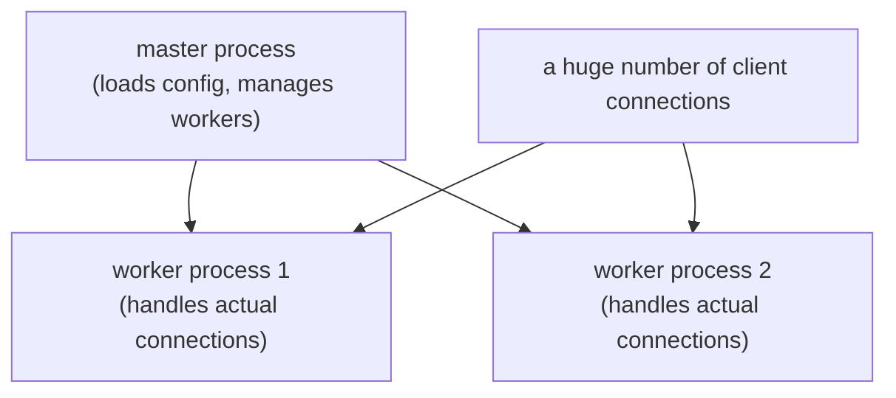

## Introduction

- **What You'll Learn From This Article**: Nginx has shown up over and over, as a given via `sudo apt install nginx`, in articles like [The Top 1% Hands-On for Launching an EC2 Instance and Publishing a Web Server](/en/articles/aws-ec2-webserver-handson-guide). This article gives you a systematic understanding of what this software actually does — the event-driven architecture that sets it apart from Apache's design philosophy, the division of labor between the master and worker processes, and the config file structure behind its two faces: "web server" and "reverse proxy."
- **Intended Audience**: Readers who've installed `nginx` and displayed a web page, but can't explain what's happening underneath, or why it's the standard choice in so many real-world environments.
- **Estimated Reading Time**: About 18 minutes

This article is part of the [Top 1% Series Complete Article Guide](/en/sitemap), the 16th article in the [Linux/OS Fundamentals Series](/en/sitemap#series-list).

## The Big Picture



## A Thorough, Grounds-Up Explanation

### Why Nginx Can Handle So Many Connections With So Few Resources

Apache, the long-established, widely-used web server software, is designed by default to **assign one process (or thread) per connecting client.** This approach is easy to understand, but once the connection count reaches the thousands or tens of thousands, the overhead of creating and switching between processes (or threads) becomes impossible to ignore.

Nginx, by contrast, adopts an entirely different architecture: **event-driven** (non-blocking I/O). A small number of **worker processes** each efficiently juggle a huge number of client connections within a single process. By switching to processing a different connection "while waiting on this one," it handles far more simultaneous connections than Apache's approach, using far less memory and CPU. This is the single biggest reason Nginx is the standard choice in environments handling large-scale traffic.

### The Master/Worker Process Structure

Start Nginx, and what's actually running is one **master process** and multiple **worker processes.**

- **The master process**: Handles loading the config file, and starting, monitoring, and restarting worker processes. It never handles an actual client connection itself.
- **Worker processes**: The ones actually doing the work — accepting client connections and processing requests.

**`nginx -s reload`, which you need after changing the config file, tells the master process "reload the config, and swap in worker processes carrying the new config."** An old worker process finishes whatever request it's currently handling, then quietly exits. This mechanism lets you apply a config change with zero downtime, without ever stopping the service as a whole.

### Config File Structure: Its Dual Identity as a Web Server and a Reverse Proxy

Nginx's config is structured as multiple `server` blocks (each corresponding to one virtual host), nested inside an `http` block.

```nginx
server {
    listen 80;
    server_name example.com;

    location / {
        root /var/www/html;
    }

    location /api/ {
        proxy_pass http://127.0.0.1:3000;
    }
}
```

**Notice that a setting directly serving a static file, like `location /`, and a `proxy_pass` setting forwarding a request to a different server, like `location /api/`, can coexist within the same `server` block.** This means Nginx can play two roles at once, in a single piece of software: "a web server serving static files" and "a reverse proxy forwarding a request to a separate backend." In real-world work, a common setup has Nginx directly and quickly serve static files (HTML, CSS, images), while only requests needing dynamic processing get forwarded via `proxy_pass` to an application server behind it (like a Node or Python app).

## What a Pro Sees Here (Top 1% Understanding)

### sites-available/sites-enabled: a Debian-family convention

Install Nginx on Ubuntu/Debian, and it sets up two directories: `/etc/nginx/sites-available/` (where config files live) and `/etc/nginx/sites-enabled/` (where symlinks to the configs actually enabled live). **This isn't a feature of Nginx itself — it's an operational convention Debian-family packaging adopted on its own.** You can keep every site's config stored in `sites-available`, and enable or disable each site purely by whether a symlink for it exists in `sites-enabled`. This is a convenient mechanism for temporarily disabling a site without ever deleting the config file itself.

## Common Misconceptions and Pitfalls

- **Misconception 1: "Nginx is simply higher-performance than Apache."**
  The performance difference comes from the architecture (event-driven vs. process/thread model) — it's not simply better or worse, it's a difference in the workload each excels at.
- **Misconception 2: "Nginx can only be used as a web server serving static files."**
  With `proxy_pass`, it can simultaneously play the role of a reverse proxy, forwarding a request to a separate backend.
- **Misconception 3: "After changing the config file, you always have to restart Nginx itself."**
  In most cases, a zero-downtime config reload with `nginx -s reload` is enough. A full restart is only needed in limited cases, like upgrading Nginx's own version.

## Troubleshooting Perspective

1. **`nginx -s reload` errors out after a config change**: Run `nginx -t` first, to check for a syntax error in the config file.
2. **A request supposedly forwarded via `proxy_pass` fails**: Check whether the backend server it forwards to is actually running, and whether the port number matches.
3. **More (or fewer) worker processes are running than expected**: Check the `worker_processes` setting's value. Specify `auto`, and it's automatically determined based on the number of CPU cores.

## Summary

- Nginx's event-driven architecture lets it handle a huge number of simultaneous connections using few resources.
- The master process handles config management and monitoring worker processes; worker processes handle actual request processing.
- `nginx -s reload` applies a config change without ever stopping the service.
- Nginx can play two roles at once, within a single config: a web server serving static files, and a reverse proxy via `proxy_pass`.

**Takeaways to Apply Today**
1. Whenever you change a config file, build the habit of running `nginx -t` for a syntax check before `nginx -s reload`.
2. When you see a `location` block, read it consciously — is it serving a static file, or acting as a reverse proxy via `proxy_pass`?

## References

- [Nginx: Beginner's Guide](https://nginx.org/en/docs/beginners_guide.html)
- [Nginx: Understanding nginx HTTP proxying, load balancing, buffering](https://docs.nginx.com/nginx/admin-guide/web-server/reverse-proxy/)
