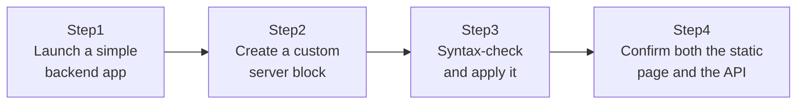

## Introduction

- **What You'll Learn From This Article**: Using the knowledge from [Understanding How Nginx Works From a "Top 1%" Perspective](/en/articles/nginx-fundamentals-guide), you'll move past Nginx's default page, **create your own server block (virtual host)**, and actually build a **reverse proxy** to a simple backend application.
- **Intended Audience**: Readers who've run `apt install nginx` before, but have never written their own config file from scratch, or actually used `proxy_pass`.
- **Estimated Reading Time**: About 20 minutes (about 35 minutes if you build along with the hands-on)

This article is part of the [Top 1% Series Complete Article Guide](/en/sitemap), the 17th article in the [Linux/OS Fundamentals Series](/en/sitemap#series-list).

## Prerequisite Knowledge

- [Understanding How Nginx Works From a "Top 1%" Perspective](/en/articles/nginx-fundamentals-guide): The master/worker processes, the `server` block, and the idea behind `proxy_pass` are all prerequisites for this article.

## The Big Picture

This hands-on consists of four steps.



## Hands-On Steps

### Step 1: Launch a simple backend application

Launch a simple HTTP server, running purely on Python's standard library, as the target for `proxy_pass`.

```bash
mkdir -p ~/backend-app && cd ~/backend-app
echo '{"message": "Hello from the backend app"}' > response.json
python3 -m http.server 3000
```

**Leave this application running in a separate terminal (or a `screen`/`tmux` session).** Continue the steps below from your original terminal.

### Step 2: Create a custom server block

Install Nginx if you haven't already, then create a new config file under `sites-available`.

```bash
sudo apt update
sudo apt install -y nginx
sudo nano /etc/nginx/sites-available/lab-app
```

```nginx
server {
    listen 80;
    server_name lab.example.test;

    location / {
        root /var/www/html;
        index index.html;
    }

    location /api/ {
        proxy_pass http://127.0.0.1:3000/;
    }
}
```

**`root /var/www/html` serves static files, and `proxy_pass http://127.0.0.1:3000/` forwards to the backend app you launched in Step 1.** Two `location`s with different roles coexist inside a single `server` block.

Next, symlink this config file into `sites-enabled`.

```bash
sudo ln -s /etc/nginx/sites-available/lab-app /etc/nginx/sites-enabled/
```

### Step 3: Syntax-check it, then apply it

Before applying a config, always run a syntax check.

```bash
sudo nginx -t
```

**Success looks like `syntax is ok` and `test is successful`.** If it errors out here, don't restart or reload Nginx itself. Fix the config file using the filename and line number shown in the error message. Once the syntax check passes, apply the config with zero downtime.

```bash
sudo nginx -s reload
```

### Step 4: Confirm both the static page and the API

First, place a static file in the directory specified by `root`.

```bash
echo "<h1>Hello from Nginx static file</h1>" | sudo tee /var/www/html/index.html
```

Use `curl` to access both the top page and the API, and confirm each one goes through a different processing path.

```bash
curl http://localhost/
curl http://localhost/api/response.json
```

**The first command has Nginx itself directly returning `/var/www/html/index.html`.** **The second command has Nginx forward the request straight to the backend app (port 3000), and return whatever response comes back from there, as-is.** You've directly confirmed that the same Nginx, on the same port 80, routes a request down two entirely different processing paths depending on its `location` configuration.

## What a Pro Sees Here (Top 1% Understanding)

### location Block Matching Order — a Common Real-World Gotcha

This hands-on only used simple prefix-match patterns, `location /` and `location /api/`, but in real-world work you'll run into `location`s using regular expressions, and more complex configs where multiple `location`s could match at once. **When multiple `location`s match simultaneously, Nginx doesn't simply pick the one written first in the config file — it decides which one to apply based on the rule "prefer the longer, more specific matching pattern."** Without accurately understanding this rule, you can't pin down the cause of a genuinely common real-world headache: "I wrote a config meant for `/api/`, but somehow the `/` config is what's being applied."

### Why the Backend App Isn't Published Directly to the Internet

The backend app launched in Step 1 is bound only to `127.0.0.1` (localhost), and can't be reached directly from outside. **This setup — publishing only Nginx externally, while keeping the backend that actually runs the application logic reachable only through Nginx's forwarding — is an extremely common real-world pattern.** It concentrates concerns like TLS termination, static-file caching, and rate limiting at one single front door (Nginx), letting the backend application server focus purely on business logic without ever having to worry about any of that.

## Common Misconceptions and Pitfalls

- **Misconception 1: "Placing a config file in sites-available alone enables it."**
  Unless you create a symlink into `sites-enabled`, Nginx never loads that config file.
- **Misconception 2: "Even if nginx -t shows an error, running reload anyway sometimes fixes it."**
  Run `reload` while a syntax error exists, and it either fails, or, in the worst case, the worker processes keep running with the old config intact. Always make sure `nginx -t` succeeds before running `reload`.
- **Misconception 3: "When multiple locations match, they apply in the order written in the config file."**
  Nginx decides the applying order by its own rule: preferring the longer, more specific matching pattern.

## Troubleshooting Perspective

1. **`curl http://localhost/api/response.json` fails**: Check whether the Step 1 backend app (`python3 -m http.server 3000`) is actually still running.
2. **You created the config file, but it's not taking effect**: Check with `ls -la /etc/nginx/sites-enabled/` whether the symlink into `sites-enabled` actually exists.
3. **`nginx -t` reports a syntax error**: Check the filename and line number shown in the error message, for mismatched `{}` or a missing semicolon.

## Summary

- Place a config file in `sites-available`, then create a symlink into `sites-enabled` to enable it.
- The correct procedure is syntax-checking with `nginx -t`, then applying it with zero downtime via `nginx -s reload`.
- A single `server` block can hold both a static-file-serving `location` and a reverse-proxying `location` via `proxy_pass`, side by side.
- When multiple locations match, Nginx prefers the longer, more specific matching pattern.

**Takeaways to Apply Today**
1. Whenever you change a config file, always follow the order `nginx -t` → `nginx -s reload`.
2. Make it standard design practice to keep a backend application reachable only through Nginx (for example, binding it to localhost).

## References

- [Nginx: How nginx processes a request](https://nginx.org/en/docs/http/request_processing.html)
- [Nginx: ngx_http_core_module (location)](https://nginx.org/en/docs/http/ngx_http_core_module.html#location)
