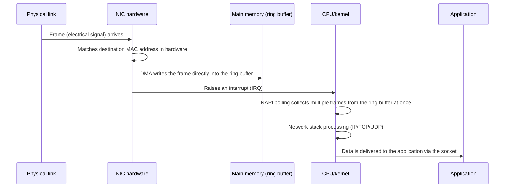

## Introduction

- **What You'll Learn From This Article**: This article goes beneath the surface-level understanding of "the NIC driver bridges the OS and the hardware" — what the CPU is actually doing when a packet arrives (interrupt handling), the mechanism for transferring data without going through the CPU (DMA), the processing the NIC itself takes over (offload features), and the technology that bypasses the OS's network stack entirely for extreme speed (kernel bypass). It gives you a systematic understanding of the deepest layers of Linux networking.
- **Intended Audience**: Readers who've encountered terms like "NIC driver," "interrupt," and "DMA," but can't quite explain "what the CPU is and isn't doing, in the end." This article focuses not on the networking layer structure itself (IP, TCP/UDP, application), but on **the Linux kernel and NIC hardware implementation that supports it from the very bottom**.
- **Estimated Reading Time**: About 25 minutes

This article is part of the [Top 1% Series' full article guide](/en/sitemap).

## Prerequisites

- **IRQ (Interrupt Request)**: The mechanism by which hardware notifies the CPU that "there's something that needs handling." The CPU temporarily suspends whatever it's currently doing and runs the handler (interrupt handler) corresponding to that notification.
- **DMA (Direct Memory Access)**: A mechanism that lets peripheral devices (such as a NIC) read and write directly to main memory without going through the CPU.
- **Kernel space / user space**: Linux separates the privileged region where the OS's own core processing (device control, etc.) runs (kernel space) from the region where ordinary applications run (user space).
- **IRQ affinity**: The mapping of which CPU core handles a given interrupt (IRQ), and the setting used to specify it. By default the OS or driver assigns this automatically, but it can also be manually pinned to a specific core.
- **NUMA (Non-Uniform Memory Access)**: On servers with multiple CPU sockets, each CPU socket has "its own dedicated memory" physically located nearby. Accessing memory directly attached to your own socket is fast, but accessing memory hanging off a neighboring socket incurs extra latency from traversing the inter-socket interconnect. This configuration — where the distance to memory is not uniform across sockets — is called NUMA, and the pairing of one CPU socket with its directly attached memory is called a **NUMA node**.

## Getting the Big Picture

### In a Nutshell

What the NIC driver is responsible for is a design aimed at keeping CPU load to an absolute minimum: "**rather than invoking the CPU every single time a packet arrives, delegate as much work as possible to the hardware (the NIC) and memory (DMA), and only involve the CPU at the truly necessary minimum moments**."

### The Big Picture of Packet Reception

## Fundamentals, Thoroughly Explained

To understand what's happening inside a NIC driver, we first need to look at how the NIC decides which arriving frames to keep and which to discard. The key to that is the MAC address.

### Why Ethernet Frames (MAC Addresses) Are Necessary, and Why IP Alone Isn't Enough

The question "if we already know the destination IP address, why do we need a whole separate mechanism — MAC addresses, Ethernet frames — on top of that?" cuts right to the heart of the division of responsibility between L2 (data link layer) and L3 (internet layer). The short answer: the two are **fundamentally different in the scope of responsibility they carry**.

- **An IP address is a "logical, end-to-end address."** No matter how many routers a packet passes through between the source host and the final destination host, the destination IP address written in the packet's IP header itself never changes.
- **A MAC address is "a physically local address, valid only within the one physical wire (LAN segment) it's currently on."** Every time a packet crosses a router, the MAC addresses (both source and destination) in the Ethernet frame are **rewritten each time**.

There are two decisively important practical reasons for this.

**1. Because multiple hosts share the same wire, a separate mechanism for specifying the physical destination is needed**

A LAN is a state where multiple hosts share the same physical wiring (the medium electrical signals flow through) via switches or hubs. An IP address indicates "which host it's logically addressed to," but by itself it doesn't directly instruct which port or which cable to physically send the electrical signal down. To determine, at the end-point hardware level, "which physical NIC within this LAN segment is the signal currently flowing on this wire addressed to, right now?", you need an address tied to the physical layer — the MAC address. A switch keeps a "MAC address table" that records which MAC-addressed device sits behind each of its ports, and forwards a frame only to the matching port, based solely on the frame's destination MAC address (it never looks at the IP address or the payload contents at all).

**2. For the sake of generality, so switches and NICs can support protocols other than IP**

If there were no L2 mechanism and all delivery depended entirely on interpreting IP addresses, an intermediary device like a switch would need to be "a device that understands IP" just to function. In reality, protocols that never use an IP address at all — like ARP (discussed below) — also flow over the LAN. Because a switch doesn't care what protocol is inside and can make forwarding decisions purely on L2 information (the destination MAC address), it can act as a general-purpose relay device that handles any L3 protocol riding on top of it — IPv4, IPv6, ARP, whatever it may be — in exactly the same way.

**3. The NIC hardware itself filters by MAC address before it ever raises an interrupt**

MAC addresses also play an important role from the standpoint of interrupt handling, discussed later. NIC hardware doesn't dutifully send a CPU interrupt for every single frame it receives. **The NIC chip itself checks, at the hardware level, whether a frame's MAC address is addressed to it** (or to broadcast/multicast), and quietly discards any irrelevant frame (one flowing on the same wire but addressed to another host) without ever notifying the CPU. Without this first-pass filtering by MAC address, in an environment where every host is always receiving every other host's traffic on a shared line (a hub environment, as opposed to a switch), the CPU would have to stop what it's doing and software-check "is this addressed to me?" for every single irrelevant frame, and CPU load would spike. It's precisely because this lightweight, hardware-level filter exists that the CPU can afford to focus only on "communication that's genuinely addressed to it."

Note that the mechanism for resolving "which MAC address does this IP address actually correspond to?" (ARP: Address Resolution Protocol) is a separate matter. ARP is a protocol for "querying, within the same LAN, the MAC address of a host that holds a given IP address." Since this article focuses on the NIC driver/hardware behavior behind "why the MAC address mechanism itself is necessary" in the first place, the detailed procedure of ARP itself is out of scope here.

### Interrupt Handling (IRQ) in Detail

When a NIC receives a frame, it raises an **interrupt (IRQ)** to the CPU. However, modern Linux kernels split the handling of this interrupt into two stages:

| Stage | Name | What it does |
|---|---|---|
| Top half | Hardware interrupt handler | Acknowledges to the NIC that the interrupt arrived, and performs only the bare minimum processing immediately (aiming to finish as fast as possible) |
| Bottom half | Polling via NAPI (New API) | Performs the substantial work — actually reading the packet and passing it to the network stack — in the context of a software interrupt (softirq) |

The reason for this two-stage split is that if the interrupt handler takes too long, other interrupts (notifications from other devices, or in some cases even the next notification from the same NIC) can't be accepted during that time, and the system's overall responsiveness drops. So Linux takes the approach of "just acknowledge it in the top half, and defer the detailed work" — and then handles the actual processing in bulk in the bottom half (NAPI).

NAPI also has an important trick for **reducing the number of interrupts itself**. While traffic is light, an interrupt is dutifully raised every time a frame arrives; but as traffic increases, **the NIC stops using interrupts and switches to polling mode (actively checking the ring buffer at regular intervals)**. If "one interrupt per packet" continued under high load, the overhead of interrupt handling itself would become the bottleneck (this is called an **interrupt storm**), so by dynamically switching between "interrupt-driven" and "polling-driven" depending on traffic volume, the system can keep processing efficiently even under heavy load.

In modern multi-core CPU environments, the NIC itself also has multiple receive queues (multiqueue), and a mechanism called **RSS (Receive Side Scaling)** distributes interrupt processing across different CPU cores based on the combination of a packet's source and destination (a flow hash). If a single CPU core kept receiving all the interrupts by itself, that core would become the bottleneck, so distributing interrupt processing across multiple cores lets network processing take advantage of multi-core parallelism as well. Which core handles which queue's interrupts can be controlled by the `irqbalance` service, or manually by setting `/proc/irq/<IRQ number>/smp_affinity`.

### DMA (Direct Memory Access) in Detail

Between the moment a NIC receives a frame and the moment it sends an interrupt to the CPU, the contents of the frame have actually **already been written into main memory**. This is achieved through DMA.

Specifically, the NIC driver tells the NIC in advance about a certain range of addresses in main memory called a "**ring buffer (receive descriptor ring)**." When the NIC receives a frame, it writes the frame's data directly into this ring buffer without bothering the CPU at all (this is what "Direct" means). The CPU is not involved in this write operation whatsoever. The CPU is only invoked "after new data has finished being written into the ring buffer" — and what the interrupt handler and NAPI do is read data that's already sitting in the ring buffer (copying it, or, if zero-copy techniques are used, simply passing a pointer to it).

Without DMA, the CPU would need to read every single byte of a frame from the NIC's registers and write it into memory itself, and on fast networks (10Gbps, 100Gbps, etc.) the CPU would end up fully occupied just by this simple, repetitive task. The ability of DMA to separate "the bulk transfer of the data itself" from "control and processing by the CPU" is a precondition for high-speed networking to be viable at all.

### A Deeper Look at NIC Offload Features

Beyond DMA and interrupt control, modern NICs have numerous "offload" features that let the NIC chip's own hardware take over a portion of the computational work that would otherwise be performed by the CPU (the kernel's network stack).

| Offload feature | What it does |
|---|---|
| Checksum offload | Calculating and verifying the checksum (a validation value used to detect data corruption) for TCP/IP/UDP headers is done by the NIC chip instead of the CPU |
| TSO (TCP Segmentation Offload) | Instead of the kernel splitting data into MTU-sized chunks before sending, the kernel hands the NIC one large block as-is, and the NIC itself performs the splitting into MTU-sized pieces |
| GSO (Generic Segmentation Offload) | A software-side, general-purpose realization of the same idea as TSO, extended to protocols beyond TCP (a software fallback for when the NIC doesn't support it in hardware) |
| GRO (Generic Receive Offload) | Combines multiple small received packets into one large block before handing them up to the kernel, reducing the number of times upper layers need to process them |
| VLAN tag processing offload | Adding and removing VLAN tags is handled on the NIC side |

What all of these have in common is the goal: "offload simple, repetitive work that would otherwise consume the kernel's CPU cycles onto dedicated NIC-chip hardware, freeing the CPU to focus on higher-value processing (such as actual application work)."

Why offload features are so often the culprit behind communication problems

Offload features improve performance in the vast majority of cases, but in real-world troubleshooting, "suspect the offload features first and try disabling them" comes up surprisingly often as a first step. The reason is that offload features **hand off work that a general-purpose piece of software — the kernel — used to handle correctly and generically, to a hardware implementation specific to each individual NIC chip and driver**, and when that implementation is poorly made, bugs tend to surface. Three common patterns stand out:

**1. Checksum offload combined with an environment where packet contents are rewritten somewhere along the path**

Checksum offload works on the premise that "the sender hands the packet to the NIC without calculating the checksum, and the NIC actually computes it just before transmission." But if there's a software-based mechanism between the sender and receiver that rewrites packet contents (a virtual switch, a bridge, certain load balancers, etc.), that intermediary — unaware of the premise "the NIC is supposed to compute the checksum later" — may forward the packet with an uncalculated (or dummy-value) checksum still in place. The receiver then determines the checksum verification failed and silently drops the packet, producing symptoms where "only communication over a specific path fails for no apparent reason."

**2. Compatibility issues between VLAN tags or tunneling (VXLAN, etc.) and TSO/GSO/GRO**

TSO, GSO, and GRO perform packet splitting and combining — in hardware or in driver logic — based on certain assumptions about "what the structure of an Ethernet frame should look like" (the position and length of headers). When VLAN tagging is applied, or when additional encapsulation headers are added by tunneling technologies like VXLAN or GRE, the "assumed header structure" can shift, depending on the NIC/driver implementation, causing the splitting/combining calculations to go wrong. The result is a hard-to-pin-down bug: packet contents get subtly corrupted, or packets of a specific size cause a hang.

**3. Bugs in the NIC/driver firmware implementation itself**

Because offload features are implemented as NIC chip firmware and driver code, it's not uncommon for that code to simply contain bugs. Edge-case bugs that only manifest for a specific packet size and specific protocol combination tend to be more common in individual vendors' offload implementations — which typically don't have the same breadth of testing coverage as the kernel's own general-purpose implementation (mature, and broadly tested) — making them a comparatively fertile ground for such bugs.

When investigating an unexplained, packet-loss-like issue such as "can't scan properly from a multifunction printer on a different VLAN to a file server," the reason AI assistants and search results so often suggest "try disabling offload" is this accumulated body of experience: **these hardware-implementation-dependent bugs really do occur frequently**. Disabling offload sends all processing back through the mature, general-purpose software (kernel) path, which is the technical reason "disabling it fixes the problem" — it's no longer affected by bugs specific to a hardware implementation. Keep in mind, though, that this is "working around a hardware-implementation-dependent bug," not "identifying the root cause." As a permanent fix, prioritize updating the driver/firmware, and only keep the feature disabled in production if the issue recurs even after updating.

### A Deeper Look at Kernel Bypass

Everything covered so far — interrupts, NAPI, DMA, offloading — are all speed-up techniques that assume **going through the Linux kernel's network stack**. On the other hand, in extreme environments where even sub-microsecond latency matters — like financial trading systems — a different idea emerges: **going through the kernel's network stack at all becomes the bottleneck**. This gave rise to **kernel bypass** technology. The prime examples are **DPDK (Data Plane Development Kit)** and **AF_XDP**.

The basic idea behind kernel bypass is to "take the NIC out from under the kernel's management, and let an application running in user space directly operate the NIC's registers and ring buffer." This eliminates the following overheads entirely:

- Data copying (or context switching) between kernel space and user space
- The interrupt mechanism itself (DPDK doesn't use interrupts; it dedicates an entire CPU core to a "busy polling" approach — continuously polling without pause)
- The processing overhead inherent in the kernel's network stack being general-purpose (the cost of being able to support every protocol and every configuration)

However, this is not a free speedup. It comes with real trade-offs: the cost of permanently dedicating one or more CPU cores to busy polling (those cores become unavailable for ordinary OS tasks), and the loss of general-purpose functionality the kernel used to provide — such as `iptables` filtering or the kernel's routing capabilities (which the application then has to reimplement itself if needed). The accurate way to think about it is: kernel bypass is a deliberate, all-in design choice, made only by environments that still need to shave off latency even after accepting that "going through the kernel's network stack carries unavoidable overhead."

## The View from the Top 1% (What Experts See)

### IRQ Affinity and NUMA Awareness

As mentioned earlier, RSS distributes NIC interrupts across multiple CPU cores, but in large-scale, high-traffic environments, tuning goes one step further: taking into account **whether that core belongs to the CPU socket (NUMA node) that's physically close to the NIC**.

Specifically, on a multi-socket server, the PCIe slot the NIC is plugged into is physically and electrically wired closer to one CPU socket or the other. If interrupt processing (IRQ affinity) is assigned to "a core on the socket far from the NIC" rather than "a core on the socket near the NIC," cross-socket memory access becomes more likely when the CPU processes the received packet's data, and given the NUMA characteristics described earlier, this piles on extra latency. Conversely, if processing is kept entirely within the socket close to the NIC — and the memory directly attached to that socket — no cross-socket traffic occurs, and latency can be minimized.

Tools like `irqbalance` handle a reasonable degree of distribution automatically as part of the OS, but they often don't take NUMA topology into account. So in environments demanding extreme performance (such as high-frequency trading systems), engineers manually pin IRQs to specific cores via `/proc/irq/<IRQ number>/smp_affinity`, after confirming with `lscpu` or `numactl --hardware` that the chosen core belongs to the NUMA node close to the NIC.

### SmartNICs / DPUs as an Option

Taking offloading a step further, a product category called "SmartNIC" or "DPU (Data Processing Unit)" is also gaining adoption — these equip the NIC itself with general-purpose CPU cores and an independent Linux environment, so that packet processing, encryption, and virtual switching (such as OVS offload) can be completed entirely on the NIC. This is the offloading idea pushed to its absolute limit: "don't let network processing consume any host CPU cycles at all."

## Common Misconceptions and Pitfalls

- **Misconception 1: "Offload features are always fast, so just leave them all enabled"**
  This is correct most of the time, but certain NIC driver/firmware versions have reported communication problems (packet corruption, hangs under specific conditions, etc.) stemming from specific offload features like TSO or GRO. When isolating an unexplained, intermittent communication failure, temporarily disabling offloading to help narrow it down is a commonly used technique in practice.
- **Misconception 2: "A MAC address is basically just a lesser, backward-compatible version of an IP address"**
  IP addresses and MAC addresses aren't substitutes for each other — they're separate layers with entirely different scopes of responsibility. Without MAC addresses, physical delivery over a shared wire simply couldn't work at all.
- **Misconception 3: "Adopting kernel bypass (DPDK, etc.) will make communication faster for any use case"**
  Because it comes with the cost of permanently dedicating CPU cores and losing general-purpose functionality, outside of the narrow use cases where microsecond-level latency actually matters, the downside of increased operational complexity tends to outweigh the benefit.

## Troubleshooting Perspective

### When a Specific CPU Core Is Under Unusually High Load

Check per-core utilization with `mpstat -P ALL 1`. If `%soft` (software interrupt processing) is unusually high on one specific core, interrupts may be skewed toward that core. Check `/proc/interrupts` to see which core the relevant NIC's interrupts are concentrated on, and verify whether `irqbalance` is running and whether the number of RSS queues matches the number of CPU cores.

### When an Offload-Related Communication Issue Is Suspected

1. Check which offload features are enabled with `ethtool -k`.
2. Temporarily disable all suspicious offload features, e.g., `ethtool -K <interface> tso off gso off gro off`.
3. If the symptom no longer reproduces, you've isolated the offload feature (or its driver implementation) as the cause. As a permanent fix, prioritize updating the NIC/driver firmware, and only build offload-disabling into operations if updating isn't feasible (disabling it is a trade-off against performance).

### Prevention and Long-Term Countermeasures

- Update NIC drivers and firmware regularly, rather than leaving known offload-related bugs unaddressed.
- In environments expecting high traffic, verify at deployment time that the number of RSS queues is consistent with the number of CPU cores and the NUMA layout.

## Summary

- The essence of a NIC driver's design is minimizing, as much as possible, how often and when the CPU gets invoked. DMA performs the actual data transfer without the CPU, and interrupt handling (top half/bottom half, NAPI) controls the timing at which the CPU gets called in.
- MAC addresses and Ethernet frames are a mechanism for physical delivery, with a scope of responsibility distinct from IP addresses. They're needed for three reasons: enabling delivery in environments that share the same wire, protocol-agnostic relaying, and fast, hardware-level filtering at the NIC.
- NIC offload features are a mechanism that hands off simple work the kernel used to be responsible for onto NIC hardware, and kernel bypass takes that idea further still, shaving latency down to the absolute limit by not going through the kernel's network stack at all.

**Starting Today**
1. When you hit an unexplained network performance issue, make it a habit to check `/proc/interrupts` and `mpstat` for interrupt skew across CPU cores.
2. Get `ethtool -k`/`-K`/`-S` comfortable in your hands as your basic toolkit for checking offload feature status, isolating issues, and checking statistics.

## References

- [Linux Kernel Documentation: NAPI](https://www.kernel.org/doc/html/latest/networking/napi.html)
- [ethtool(8) | Linux man-pages](https://man7.org/linux/man-pages/man8/ethtool.8.html)
- [Scaling in the Linux Networking Stack (RSS/RPS/RFS) | Linux Kernel Documentation](https://www.kernel.org/doc/html/latest/networking/scaling.html)
- [Data Plane Development Kit (DPDK) official site](https://www.dpdk.org/)
- [AF_XDP | Linux Kernel Documentation](https://www.kernel.org/doc/html/latest/networking/af_xdp.html)
- [irqbalance(1) | Linux man-pages](https://man7.org/linux/man-pages/man1/irqbalance.1.html)
