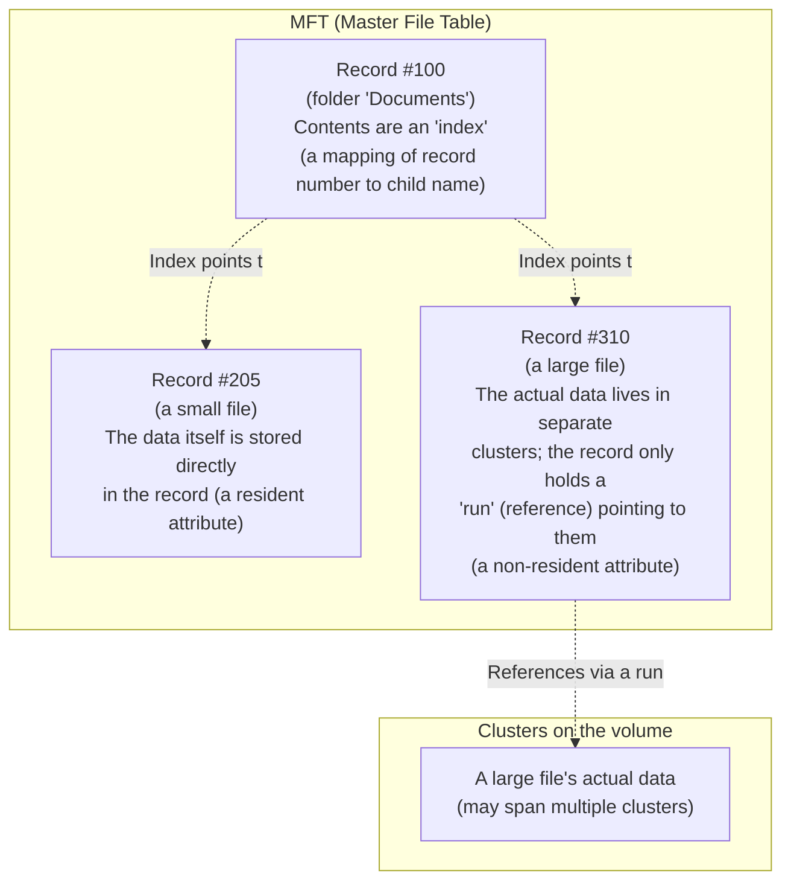

## Introduction

- **What you'll get from this article**: [Understanding the Relationship Between RAID and Windows Disk Management](/en/articles/disk-raid-fundamentals-guide) mentioned that "formatting is the operation of writing new management data structures, such as the MFT (Master File Table)," without going any further. This article systematically covers what data structure the MFT actually is, why having an MFT alone is enough to let you work in terms of "files" and "folders," the mechanism that lets a small file fit directly inside its own MFT record, and the fact that a folder is really nothing more than an index.
- **Intended audience**: Readers who understand formatting and file systems at a high level, but can't concretely explain what's actually happening inside the OS when you open a folder or read a file.
- **Estimated reading time**: About 17 minutes

This article is part of the [Top 1% Series — Full Article Guide](/en/sitemap), and the 3rd entry in the [Storage Fundamentals series](/en/sitemap#series-list). Reading [Understanding the Relationship Between RAID and Windows Disk Management](/en/articles/disk-raid-fundamentals-guide) first will make this article easier to follow.

## Prerequisite Knowledge

- **MFT (Master File Table)**: Covered in [Understanding the Relationship Between RAID and Windows Disk Management](/en/articles/disk-raid-fundamentals-guide) — the central piece of management data, created at format time, that records information for every file and folder on an NTFS volume.
- **Cluster**: The smallest unit NTFS uses to manage disk space. At format time, the entire volume gets divided up into these fixed-size units.

## Getting the Big Picture

### In a nutshell

**In NTFS, both a "file" and a "folder" are, in reality, nothing more than a single record inside the MFT, sitting on exactly the same footing.** The only difference is whether that record holds its own data (a file) or holds directions to other records — an index (a folder). Once you hold onto this one fact — "everything is a record in the MFT" — it becomes clear why the seemingly mundane operation of formatting is what makes the convenient units "file" and "folder" possible in the first place.

## Deep Dive into the Fundamentals

### The structure of an MFT record: a header plus a collection of "attributes"

A single record in the MFT consists of a **header** recording the record's own basic information, plus a collection of multiple **attributes**, each expressing some property of that file or folder. Attributes holding standard timestamps, an attribute holding the file name, and the `$DATA` attribute holding the actual data body — several such attributes are laid out in sequence inside a single record, and the record's end is marked by a specific terminator. By default, a single record is designed to fit within a relatively small, fixed size.

### Resident attributes: a small file is actually stored directly inside its own MFT record

This is the single most important point in this article. **When the `$DATA` attribute (the file's contents) is small enough to fit within the record's remaining capacity, NTFS stores that data directly inside the MFT record itself.** This is called a **resident attribute**. In other words, for a small file — anywhere from a few bytes up to a few hundred — **"reading that file" is essentially the same operation as "reading the one corresponding MFT record."** The metadata (when it was created, what its name is, and so on) and the actual content both end up captured in that same single read.

When a file is too large to fit inside its record, on the other hand, the `$DATA` attribute becomes a **non-resident attribute**. In this case, the MFT record doesn't hold the data itself — it holds a mapping (called a **run**, a sequence of start-cluster-and-length pairs) recording "which cluster on the volume, and how much length starting from there, belongs to this file's data." **Fragmentation** — where a file ends up scattered across multiple non-contiguous regions on disk — refers to exactly this: the growing number of these runs.

Why this design tends to favor NTFS when there are lots of small files

Reading a file with a non-resident attribute requires at least two separate disk accesses: first read the MFT record to get the run information, then go read the clusters that run points to. With a resident attribute, that collapses into a single step — reading the MFT record is all there is to it. In scenarios with a large number of small files, like config files or log files, this design difference can actually show up as a real difference in perceived speed.

### What a folder actually is: nothing more than an "index"

Most people picture a folder as a kind of container that physically holds files, but that's not quite accurate. **In NTFS, a folder is a special MFT record that holds index data — built as a B-tree, a structure designed for efficient searching — recording the names of the files and subfolders directly underneath it, and the MFT record number each one corresponds to.** A file's actual substance always lives in its own, independent MFT record; the folder's record does nothing more than act as a signpost pointing to those records.

While it's small, this index data fits as a resident attribute inside the folder's own MFT record. Once the number of files in the folder grows and the index itself gets larger, it expands out from the folder's MFT record into dedicated index space allocated in separate clusters. Either way, thanks to the B-tree structure, a folder can efficiently search for a target file name even with thousands of entries inside it.

### What happens, step by step, when you open a file in Explorer

Putting all of this together, you can see exactly what's happening internally when you "open `report.docx` inside the `Documents` folder on the C: drive":

1. Read the root folder's MFT record (its index), and look up the MFT record number that corresponds to the name "Documents."
2. Read the MFT record at that number (the `Documents` folder's own index), and look up the MFT record number that corresponds to the name "report.docx."
3. Read the MFT record at that number. If its `$DATA` attribute is resident, grab the data directly; if it's non-resident, follow the recorded run information to actually go read the corresponding clusters.

Behind the seemingly simple act of "opening a file" is this exact chain — walking through multiple layers of indexes and finally arriving at an MFT record — executed every single time.

## What Top-1% Engineers See

### How serious it is when the MFT itself gets corrupted

The MFT is, in effect, the table of contents for the entire volume. If part of the MFT gets corrupted, there's a real risk that all information for the files and folders tied to that record becomes completely unreachable. The reason `chkdsk` focuses so heavily on verifying the MFT's own structure, when checking and repairing file system integrity, is that the MFT serves as the entry point to every piece of data on the volume. NTFS also maintains a journaling mechanism in an area called `$LogFile`, recording metadata changes ahead of time before they're applied, so that even if metadata updates get interrupted by something like an unexpected power loss, the volume can be restored to a consistent state based on that record.

## Common Misconceptions and Pitfalls

- **Misconception 1: "A folder is a container that physically holds files."**
  A folder's actual substance is an index recording the names of the files and subfolders directly beneath it, along with their MFT record numbers. A file's actual data always lives in that file's own, independent MFT record.
- **Misconception 2: "Every file is stored in one single, contiguous region on disk."**
  When a file's size doesn't fit inside its MFT record, its data can end up scattered across multiple clusters on the volume, organized in units called "runs" — and a heavily scattered state like that is exactly what fragmentation is.
- **Misconception 3: "The MFT is just a table of contents, unrelated to a file's actual contents."**
  For a file small enough to fit inside an MFT record, the data itself is stored directly inside that record, as a resident attribute. The MFT is both a table of contents and, for small files, the actual location of the content itself.

## Troubleshooting Perspective

Trouble tied to NTFS's internal structure usually starts by isolating which layer the problem is actually in — the MFT, an index, or the actual data.

1. **A specific file throws a read error**: There may be an inconsistency between the run information recorded in that file's MFT record and the actual state of the clusters (a bad sector, for example).
2. **A folder with a large number of files displays slowly**: That folder's own index data may have grown large enough that it no longer fits as a resident attribute and has expanded out into clusters. An extremely flat structure with a huge number of files in one place is worth reorganizing into a hierarchy as a practical countermeasure.
3. **Free disk space suddenly dropped, or fragmentation is suspected**: Check the volume's overall integrity and how scattered the runs have become, using `chkdsk` and, if needed, a defragmentation tool.

### Prevention and Long-Term Countermeasures

- Avoid dumping an extremely large number of files flat into a single folder — organize into a hierarchy instead.
- When you run into unexpected file corruption, first check MFT- and index-level integrity with `chkdsk`.
- In environments prone to sudden power loss, prioritize measures — like deploying a UPS — that prevent the write interruption itself.

## Summary

- In NTFS, both a file and a folder are, in reality, nothing more than a single record inside the MFT (Master File Table).
- Data for a file small enough to fit inside its MFT record is handled as a "resident attribute," stored directly inside the record, letting a read complete in a single step. A larger file becomes a "non-resident attribute," with its actual data scattered across clusters on the volume and referenced through a mapping called a "run."
- A folder's actual substance is a B-tree index recording the names of the files and subfolders directly beneath it and their MFT record numbers — not a container that physically holds files.
- Opening a file is, internally, a stack of several reference steps: walking through multiple layers of indexes in sequence to reach an MFT record, then retrieving the data from there.

**What to keep in mind starting today**
1. Switch your mental model from "a folder is a container for files" to "a folder is an index."
2. Build the habit of avoiding an extremely flat folder structure with a huge number of files, and organize into a hierarchy instead.

## References

- [NTFS | Wikipedia](https://en.wikipedia.org/wiki/NTFS)
- [NTFS Master File Table (MFT) | NTFS.com](http://ntfs.com/ntfs-mft.htm)
- [NTFS - $I30 ($INDEX_ROOT, $INDEX_ALLOCATION, and $Bitmap) | artifacts.help](https://artefacts.help/windows_i30.html)
