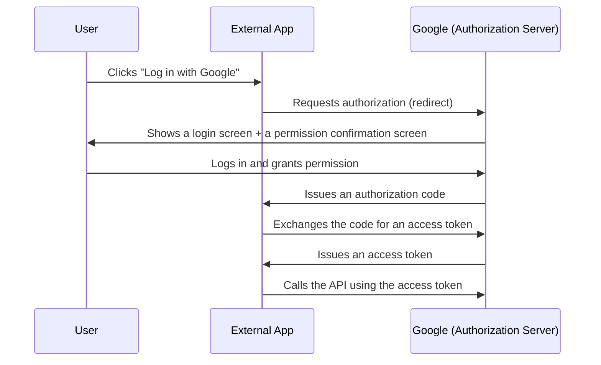

## Introduction

- **What You'll Learn From This Article**: Building on the stateless authentication mechanism (tokens) touched on in [Understanding RESTful APIs](/en/articles/restful-api-guide), a systematic understanding of exactly what exchange happens behind a button like "Log in with Google" — how **OAuth 2.0** grants access to another service **without ever handing over a password at all.**
- **Intended Audience**: Readers who've heard the word "OAuth" and used a "log in with an external service" button before, but can't explain what exchange actually happens behind it, or the difference between authentication and authorization.
- **Estimated Reading Time**: About 20 minutes

This article is part of the [Top 1% Series Complete Article Guide](/en/sitemap), and the fourth article in the [Web/API Series](/en/sitemap#series-list).

## Prerequisite Knowledge

- **Stateless Authentication and Tokens**: The method of including a token with every request, covered in ["Authentication in a Stateless World"](/en/articles/restful-api-guide) in the same article. OAuth 2.0 is the spec defining the **upstream procedure for safely obtaining that token in the first place.**

## Getting the Big Picture

### "Authentication" and "Authorization" Are Entirely Different Concepts

The first distinction to draw, in understanding OAuth 2.0, is between **Authentication** and **Authorization.**

| Term | Meaning | Example |
|---|---|---|
| **Authentication** | Confirming "who you are" | Confirming you're really you, with a password or SMS code |
| **Authorization** | Deciding "what you're allowed to do" | "Allow this app to only read your Google Calendar" |

**OAuth 2.0 isn't an authentication mechanism. It's an authorization mechanism.** What a "Log in with Google" button actually does is "authorize this app to read some of your Google account information (name, email, and similar)" — the actual authentication, confirming who you are, happens on Google's own side, behind the scenes.

## Deep Dive Into the Fundamentals

### The Authorization Code Flow: Why Is It Split Into Two Stages, "Code" and "Token"?

The flow shown in the diagram above is OAuth 2.0's most widely used variant, the **authorization code flow.** What stands out is its two-stage structure: **it never passes the access token directly through the browser — it routes through a disposable, one-time "authorization code" first.**

The reason for this two-stage structure is that **the browser redirect path is a relatively low-security route — information sticks around in the URL and browser history.** If the access token itself (a piece of information carrying real, strong power to call the API) were passed directly down this low-security path, the token itself would risk sticking around in browser history or in logs on equipment along the way. **The authorization code carries no power on its own — it's a single-use voucher, exchanged for the access token through a safer, direct back-channel connection between the app's own server and the authorization server.** This mechanism means the access token, which carries real power, never has to travel down the low-security path at all.

Why Is a "Client Secret" Needed to Exchange the Authorization Code?

When exchanging the authorization code for an access token, the external app also has to present a **client secret** — a secret string registered with the authorization server ahead of time. **This acts as a password proving "the one trying to use this authorization code is genuinely the legitimate app the user actually authorized."** The authorization code alone could, if stolen, be reused from a different (fake) app by a third party — but combining it with the client secret, something only the app's own server knows, prevents this kind of misuse.

### Access Tokens and Refresh Tokens: Why Are There Two Kinds?

OAuth 2.0 ultimately issues two kinds of tokens: the **access token** and the **refresh token.**

- **Access token**: Used to actually call the API, with a short lifespan (tens of minutes to a few hours).
- **Refresh token**: Used to get a new access token reissued **without ever forcing the user to log in again**, once the access token expires. It has a longer lifespan.

**Keeping the access token's lifespan short limits the damage, in time, if it ever gets leaked.** But if the lifespan stayed that short across the board, users would be forced to log in again constantly, hurting usability. To satisfy both demands — security and usability — at once, the design splits the roles into **a "short-lived but freely usable access token," and a "long-lived refresh token that's only ever good for reissuing a new access token."**

## What a Pro Sees Here (Top 1% Understanding)

### OAuth 2.0 Isn't "a Way to Authenticate" — Authentication Gets Layered on Top, Separately (OpenID Connect)

A very common real-world mix-up is believing "OAuth 2.0 can be used for user authentication." **OAuth 2.0 itself is purely an authorization mechanism — deciding what to allow. A standardized way of conveying "who you are" is a separate thing entirely.** That's **OpenID Connect** (OIDC). OIDC achieves authentication by layering an additional token, the `ID Token`, carrying the user's identity information, on top of OAuth 2.0's own mechanism. "Log in with Google" actually works as a login (authentication) because OIDC is used alongside OAuth 2.0 behind the scenes — OAuth 2.0 alone, strictly speaking, never achieves a "login."

## Common Misconceptions and Pitfalls

- **Misconception 1: "OAuth 2.0 is a mechanism for user authentication (logging in)."**
  OAuth 2.0 is an authorization mechanism. Authentication is realized by a separate spec, OpenID Connect (OIDC).
- **Misconception 2: "Passing the access token directly through the browser would make the process simpler."**
  Passing an access token directly risks it sticking around in browser history or logs. Routing through a disposable authorization code avoids this risk.
- **Misconception 3: "A refresh token can be used the same way as an access token, to call the API directly."**
  A refresh token can only ever be used to get a new access token reissued. It can never be used to call the API directly.

## Troubleshooting Perspective

1. **An error like "this app is invalid" occurs when exchanging the authorization code**: Check whether the client secret's value is correct, and whether the registered redirect URL exactly matches the actual URL.
2. **The access token expired, and API calls suddenly started failing**: Check whether the access-token reissue process, using the refresh token, is implemented correctly.
3. **Users are unexpectedly forced to log in again frequently**: Check whether the refresh token itself has expired, or whether there's a problem in how the refresh token is being stored and reused.

## Summary

- OAuth 2.0 is a mechanism for authorization (what you're allowed to do), not authentication (who you are).
- The authorization code flow is a two-stage design that routes through a disposable, single-use authorization code, so the powerful access token never travels directly through the low-security browser redirect path.
- The access token (short-lived) and the refresh token (long-lived, reissue-only) are designed with split roles, to satisfy both security and usability.
- Achieving user authentication (a login) requires a separate spec, OpenID Connect (OIDC), layered on top of OAuth 2.0.

**Takeaways to Apply Today**
1. Whenever you see the word "OAuth," build the habit of first distinguishing whether it's being used for authentication or authorization.
2. When implementing an integration with an external service, confirm you're handling the access token and refresh token correctly, matched to each one's own role.

## References

- [RFC 6749 - The OAuth 2.0 Authorization Framework](https://datatracker.ietf.org/doc/html/rfc6749)
- [OpenID Connect Core 1.0](https://openid.net/specs/openid-connect-core-1_0.html)
