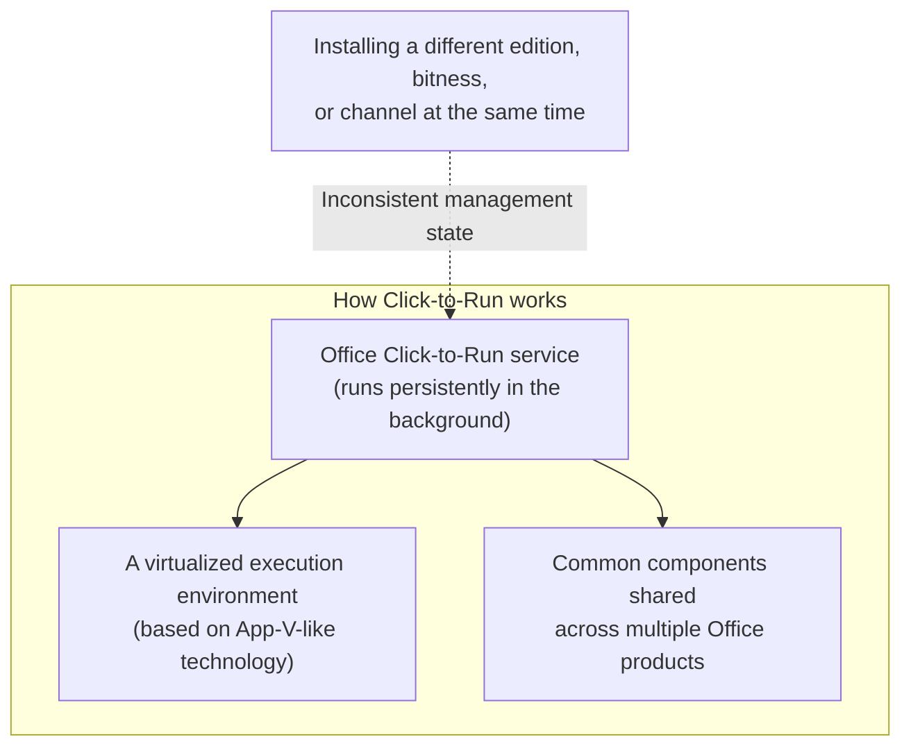

## Introduction

- **What you'll get from this article**: A real-world headache: a different edition of Microsoft Office gets accidentally installed on a corporate PC, an ordinary uninstall through Control Panel can't cleanly remove it, and the situation ends with replacing the machine entirely. This article systematically covers **how Click-to-Run (C2R) — the distribution method current Office uses — actually works**, why an ordinary uninstall tends not to be enough, and **how conflicts arise in an environment managed through Intune.**
- **Intended audience**: Readers managing Office deployment through something like Intune, but who can't concretely explain how Office's own installation format works, or why an edition conflict makes it so hard to uninstall.
- **Estimated reading time**: About 16 minutes

This article is part of the [Top 1% Series — Full Article Guide](/en/sitemap), and the 10th entry in the [Windows Client Operations series](/en/sitemap#series-list).

## Prerequisite Knowledge

- **MSI installer**: Windows's traditional installation format, bundling the files and registry changes for an install into a single package. Office used to be distributed this way.

## Getting the Big Picture

### In a nutshell

**Current Office doesn't use the traditional MSI installer — it uses an entirely different distribution and execution method called Click-to-Run (C2R).** C2R is a mechanism where a dedicated background service manages Office's deployment, updates, and virtualization. **When different editions, different bitness (32-bit/64-bit), or different distribution channels of Office coexist on the same PC, this management mechanism itself can end up in conflict, leaving a state an ordinary uninstall can't fully resolve.**

## Deep Dive into the Fundamentals

### What Click-to-Run actually is

**Click-to-Run** is the distribution and execution method Microsoft uses for its current Office products (Microsoft 365 Apps, perpetually licensed Office 2021/2024, and so on). Where the traditional MSI installer treats "unpacking every file to disk in one go" as the completion of installation, C2R is designed so that **a dedicated background service (the Office Click-to-Run service) streams and unpacks the components it needs on an ongoing basis, built on virtualization technology similar to App-V, while handling Office's overall state management and automatic updates.**

### Why coexisting editions cause problems

Office, distributed via C2R, comes in multiple editions — **Microsoft 365 Apps for enterprise, Microsoft 365 Personal (formerly Office 365 Home), and perpetually licensed versions (Office 2021/2024)** — and also splits into **32-bit and 64-bit** variants. These are designed to share a certain amount of common components internally, but **trying to install a different edition or bitness of Office on top of an existing one on the same PC can create an inconsistency in that shared component's management state (version information, license binding, and so on).** Once that happens, running an ordinary removal through Control Panel's "Uninstall a program" **often doesn't fully clean up the internal state information the Click-to-Run service manages, leaving a half-resolved, conflicting configuration behind.**

32-bit and 64-bit Office simply can't coexist on the same PC in the first place

Microsoft officially **does not support running a 32-bit and a 64-bit version of Office side by side on the same PC.** If one is installed and you try to install the other, the specification requires you to fully remove the first one before the second can install correctly. This is different from what's covered in [Understanding the Difference Between x64 and x86 Installers](/en/articles/windows-install-media-guide), where WoW64 absorbs the mismatch for ordinary applications — **Office itself is deliberately designed to prohibit coexisting installs of different bitness**, which is worth understanding as its own separate fact.

### When an ordinary uninstall isn't enough, what should you use instead?

Microsoft provides a dedicated diagnostic and repair tool specifically to resolve this kind of Click-to-Run Office conflict that an ordinary uninstall can't fix: **Microsoft Support and Recovery Assistant** (SaRA). SaRA has a command-line variant, `SaRAcmd.exe`, and running it with the `OfficeScrubScenario` scenario **forcibly and completely removes everything an ordinary uninstaller can't get to — Click-to-Run's shared components, registry entries, Task Scheduler registrations, and more.** If you find yourself in a state that ordinary methods can't handle — "I uninstalled it, but reinstalling doesn't work right" or "multiple editions are conflicting and neither one launches correctly" — trying a full removal with this tool first is the standard playbook.

### How conflicts arise in an environment managed through Intune

When an organization manages Office deployment through Intune, it's usually configured as the **"Microsoft 365 Apps"** app type, which internally uses an Office Deployment Tool (ODT) configuration file (XML) to **centrally specify which edition, channel, and languages to install.** If a user (or an accidental operation) **manually installs a different edition of Office than what Intune is managing** on a device under this management, the configuration Intune expects and the configuration actually present on the device end up out of sync. If Intune then tries to reapply its configuration or push an update in this state, **the manually installed version and the version Intune is trying to manage can end up in conflict, leaving both uninstall processes only half-completed** — a genuinely tricky situation. In an environment managing Office deployment at the organizational level, **explicitly including a `Remove` element in the ODT configuration file, to remove any existing Office before installing**, is a practical measure to prevent this kind of conflict.

## What Top-1% Engineers See

### Replacing the machine may not have actually been the last resort

Responding to a situation like this — "the uninstall didn't work, so we ended up replacing the machine" — is a reasonable call under time pressure. But a top-1% engineer would **consider a full removal via `SaRAcmd.exe` as one option before replacing the machine.** Replacing a machine carries additional costs — data migration, interrupting the user's work — while a full removal via SaRA usually completes in a few minutes to tens of minutes, letting you keep using the same machine as-is. It's worth knowing this dedicated tool exists, simply to have more options the next time a similar situation comes up.

## Common Misconceptions and Pitfalls

- **Misconception 1: "Office can be completely removed through Control Panel, just like any other ordinary application."**
  Current Office uses the dedicated Click-to-Run distribution and execution method, with a dedicated background service managing its state, so an ordinary uninstall alone may not fully clean up the shared component's state.
- **Misconception 2: "32-bit and 64-bit Office can coexist on the same PC, just like most ordinary applications."**
  Microsoft officially does not support running 32-bit and 64-bit Office side by side on the same PC.
- **Misconception 3: "If Office is managed through Intune, a user manually installing a different Office is simply impossible in the first place."**
  Deployment management through Intune is fundamentally a mechanism that provides the default installation method — it doesn't necessarily technically prevent a user from installing Office through some other route (a manual download, for instance). Preventing this requires additional measures, such as explicitly configuring the ODT configuration file to remove any existing installation beforehand.

## Troubleshooting Perspective

1. **Office was supposedly uninstalled, but reinstalling it doesn't complete correctly**: An ordinary Control Panel uninstall likely wasn't enough — try a full removal with `SaRAcmd.exe`.
2. **Multiple Office editions are conflicting and neither launches correctly**: Check the edition and bitness of every Office product currently installed, and confirm whether an unintended coexistence has occurred.
3. **The Office managed through Intune has ended up as an unintended edition**: Check whether an Office outside Intune's management scope was manually installed on the device, and if needed, add a `Remove` element to the ODT configuration file.

### Prevention and Long-Term Countermeasures

- When managing Office deployment at the organizational level, explicitly include a setting in the ODT configuration file to remove any existing Office before installing.
- Build a full removal via `SaRAcmd.exe` into your standard response checklist for when an Office uninstall doesn't go smoothly.
- Where possible, combine this with application execution control (like AppLocker) or a policy that only permits installation through a software center, to prevent users from manually installing Office themselves.

## Summary

- Current Office uses Click-to-Run (C2R), not the traditional MSI installer, with a dedicated background service handling its state management.
- When different editions or different bitness of Office conflict on the same PC, an inconsistency can arise in the shared component's management state, which an ordinary uninstall alone can't always fully clean up.
- A full removal via Microsoft Support and Recovery Assistant (SaRA), particularly its command-line variant `SaRAcmd.exe`, is effective against this kind of conflict.
- In an environment managed through Intune, including a setting to remove any existing Office beforehand in the ODT configuration file is a preventive measure against this kind of conflict.

**What to keep in mind starting today**
1. When you run into an Office uninstall/reinstall that isn't going smoothly, consider a full removal via `SaRAcmd.exe` as an option before replacing the machine.
2. When managing Office deployment at the organizational level, consider including a setting to remove any existing Office beforehand in the ODT configuration file.

That's all 10 articles in the Windows Client Operations series. If you'd like to review the whole thing by ear during a commute or while doing chores, check out [[Listen] The Windows Client Operations Series, Fully Recapped](/en/articles/windows-client-audio-review-guide).

## References

- [Use the Support and Recovery Assistant to uninstall Office | Microsoft Learn](https://learn.microsoft.com/en-us/microsoft-365/troubleshoot/administration/assistant-office-uninstall)
- [Overview of the Office Deployment Tool | Microsoft Learn](https://learn.microsoft.com/en-us/microsoft-365-apps/deploy/overview-office-deployment-tool)
