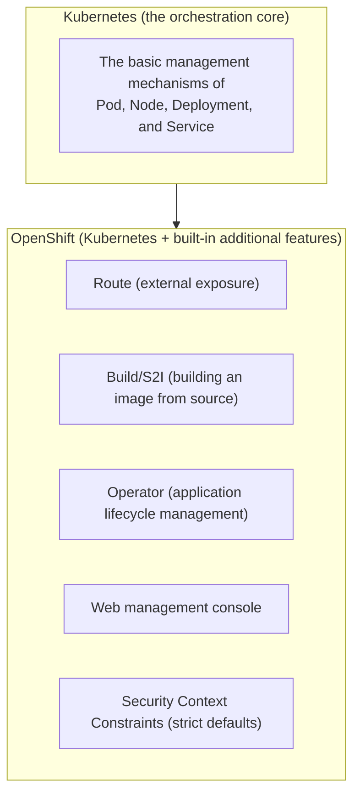

## Introduction

- **What You'll Learn From This Article**: Starting from "I've heard of OpenShift, but I don't understand its relationship to Kubernetes," this article systematically explains **how OpenShift relates to Kubernetes**, and **what functionality OpenShift adds by default, beyond plain Kubernetes.** It's structured to be followable even if your container/Kubernetes knowledge is still light, building up the necessary foundation as it goes.
- **Intended Audience**: This article is aimed at engineers who've heard the name OpenShift but have barely touched containers or Kubernetes, and want to grasp the big picture first.
- **Estimated Reading Time**: About 20 minutes

This article is part of the [Top 1% Series' full article guide](/en/sitemap), and the first article in a new series on OpenShift. If you want to get hands-on and actually try it, continue to [A "Top 1%" Hands-On Lab: Running a Container Application on OpenShift Local](/en/articles/openshift-handson-guide).

## Prerequisites

- **The difference between a virtual machine and a container**: The virtual machine covered in [What Is Proxmox VE? Understanding KVM/QEMU Virtualization from the "Top 1%" Perspective](/en/articles/proxmox-internals-guide) is a technology that reproduces the hardware itself in software, running an entire guest OS on top of it. **A container is virtualization taking a different approach** — on a single host machine, it **shares just one OS kernel**, while isolating the execution environment (file system, networking, process space, and so on) at the process level. Since there's no need to boot a guest OS of its own, this makes containers **faster to start and lighter on resource overhead** than virtual machines.

## Getting the Big Picture

### OpenShift Is a "Derivative" of Kubernetes, Not a "Competitor"

**OpenShift is a container platform provided by Red Hat, built on top of Kubernetes.** It's not a competing product that replaces Kubernetes itself — it's easier to understand as, in effect, **a "finished car" that adds many features enterprises actually need for real-world operation, standard, on top of the core (Kubernetes) that provides orchestration.**

**Plain Kubernetes only provides the "core" — how to place and manage containers.** To actually operate a container platform in an enterprise, you need a registry to store container images, a mechanism for building images from source code, a way to expose services externally, monitoring and log collection, security policies, and many other surrounding pieces of functionality — all of which **you'd otherwise have to individually select and integrate yourself.** **OpenShift's most fundamental value proposition is providing these surrounding pieces of functionality already selected, integrated, and bundled in by default.**

## Fundamentals, Explained Thoroughly

### A Quick Recap of Kubernetes's Basic Concepts

As a prerequisite for understanding OpenShift, here's a brief organization of Kubernetes's basic terminology.

| Term | Meaning |
|---|---|
| **Pod** | The smallest unit of execution Kubernetes manages — a group of one or more containers. |
| **Node** | The physical or virtual machine on which a Pod actually runs. |
| **Cluster** | A collection of multiple Nodes — the whole that Kubernetes manages. |
| **Deployment** | A resource declaratively describing the desired state — "how many of this Pod I want kept running." Kubernetes continuously and automatically adjusts the actual Pod count to match that declaration. |
| **Service** | A mechanism that consolidates access to multiple Pods behind a single, stable address. Individual Pods come and go frequently, but a Service's address stays the same. |

### The Main Functionality OpenShift Bundles In by Default

On top of Kubernetes's basic concepts, OpenShift adds the following functionality by default:

- **Project**: This is Kubernetes's **Namespace** (a unit for logically isolating resources within a cluster), with default resource quotas (limits on usable CPU and memory) and RBAC (permissions defining who can do what) policies baked in ahead of time.
- **Route**: OpenShift's own implementation, equivalent to Kubernetes's **Ingress** (a mechanism routing traffic from outside the cluster to a Service). It supports TLS termination (turning traffic into HTTPS via a certificate) by default, routing to different applications by host name, in a similar spirit to the binding configuration covered in [Understanding How IIS and ASP.NET Work from a "Top 1%" Perspective](/en/articles/iis-fundamentals-guide).
- **Build / BuildConfig (Source-to-Image, S2I)**: A mechanism that automatically builds a container image for an application just by pointing it at the source code in a Git repository. Developers don't need to think about the container image build process itself.
- **Web console**: A built-in management screen for checking a cluster's state and performing operations like deploying or scaling an application, from a GUI.
- **Operator**: A mechanism that automates a series of operational tasks — installation, upgrades, backups, disaster recovery — for an application (particularly complex, stateful software like a database). Plain Kubernetes has the same concept (the Operator Pattern) too, but OpenShift comes with **OperatorHub**, a built-in catalog of pre-packaged Operators.
- **Security Context Constraints (SCC)**: A stricter set of container security policies than Kubernetes's defaults. For example, it builds in a constraint preventing containers from running as root by default.

## The View From the Top 1% Perspective

### Why Enterprises Choose OpenShift Over Plain Kubernetes

Using plain Kubernetes requires individually selecting the surrounding functionality mentioned above (registry, CI/CD, monitoring, security policy, and so on) from different open-source software or cloud services, and building it out while checking compatibility between them. This offers high flexibility, but **demands specialized knowledge and effort to build and maintain.** OpenShift already does this integration work ahead of time, providing it alongside **a support contract from Red Hat**, offering enterprises the option to **"buy a finished car and start using it right away," rather than "gather the parts and assemble it yourself."**

## Common Misconceptions and Pitfalls

- **Misconception 1: "OpenShift is a competing product to Kubernetes, and you have to choose one or the other"**
  OpenShift is a derivative product (a distribution) built on top of Kubernetes — Kubernetes's basic concepts (Pod, Deployment, Service, and so on) carry over directly.
- **Misconception 2: "Using OpenShift eliminates the need for any Kubernetes knowledge at all"**
  Understanding Kubernetes's basic concepts remains important as a prerequisite for understanding OpenShift's own features (Route, Build, Operator, and so on).
- **Misconception 3: "A container is just a lightweight version of a virtual machine"**
  A virtual machine is a technology that reproduces the hardware itself, running an entire guest OS; a container is a fundamentally different-approach technology that shares the OS kernel while isolating the environment at the process level.

## The Troubleshooting Perspective

This article is an overview covering OpenShift's big picture, so hands-on operations and troubleshooting perspectives are covered concretely in [A "Top 1%" Hands-On Lab: Running a Container Application on OpenShift Local](/en/articles/openshift-handson-guide).

## Summary

- OpenShift isn't a competing product to Kubernetes — it's a derivative product (a distribution) that bundles in functionality enterprises need for real-world operation, on top of the Kubernetes core.
- Kubernetes's basic concepts (Pod, Node, Deployment, Service) carry over directly into OpenShift.
- The main functionality OpenShift adds by default includes Project, Route, Build (S2I), the web console, Operator, and SCC.
- The reason enterprises choose OpenShift is that it pre-integrates the surrounding functionality you'd otherwise have to combine yourself with plain Kubernetes, providing it alongside a support contract.

**What to Keep in Mind From Today**
1. When you encounter the term OpenShift, remember it's a derivative of Kubernetes, not a competitor.
2. When you encounter one of OpenShift's own features, consciously map it back to the corresponding Kubernetes basic concept (Namespace, Ingress, and so on).

## References

- [Red Hat OpenShift Documentation](https://docs.openshift.com/)
- [Kubernetes Documentation: Concepts](https://kubernetes.io/docs/concepts/)
- [Understanding builds | Red Hat OpenShift Documentation](https://docs.openshift.com/container-platform/latest/cicd/builds/understanding-image-builds.html)
