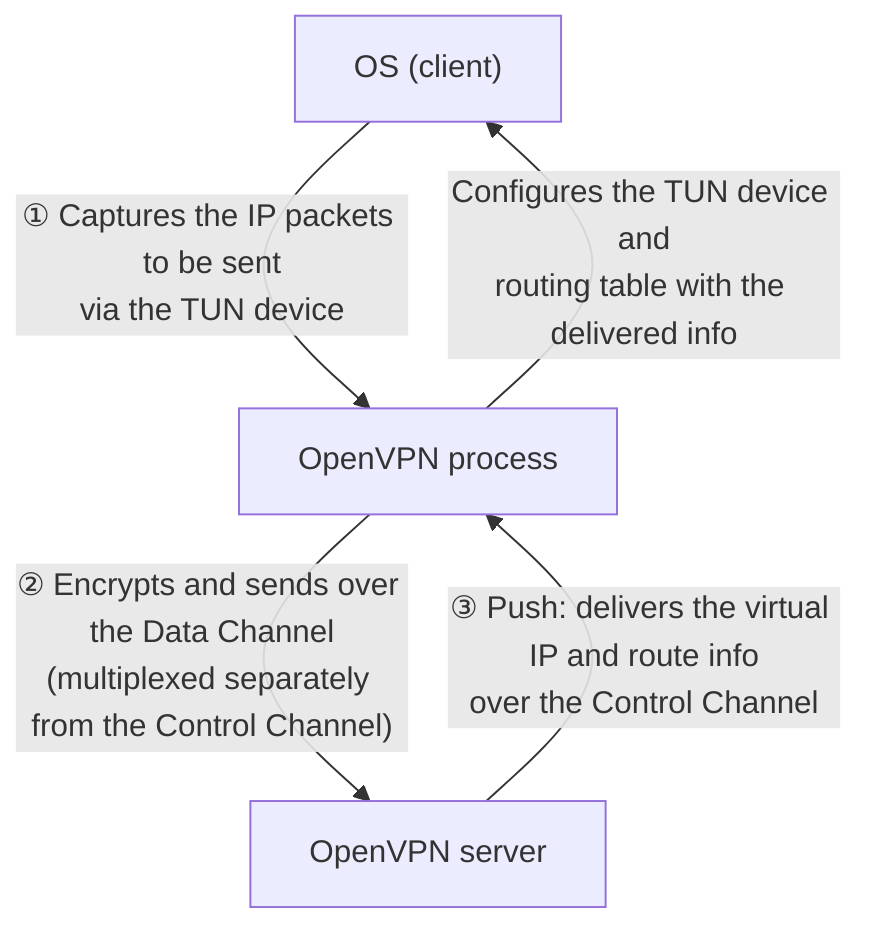
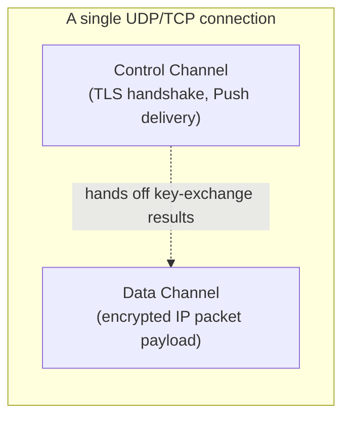
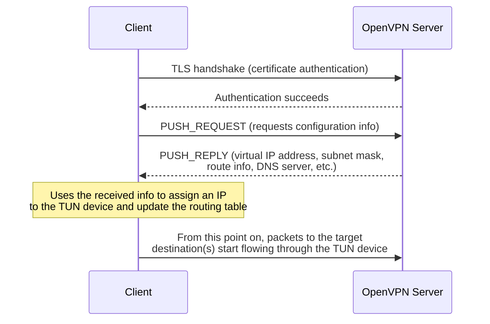

## Introduction

- **What You'll Learn From This Article**: Beyond understanding that "OpenVPN encrypts IP packets with TLS," you'll get a systematic answer to the question of **why that alone amounts to a VPN connection** — through three mechanisms: the division of labor between the Control Channel and the Data Channel, IP packet capture via the [TUN device](/en/articles/linux-user-kernel-space-guide), and delivering the virtual IP address and route information through the Push mechanism.
- **Intended Audience**: This article is aimed at readers who already understand OpenVPN's high-level story — reusing TLS, falling back to TCP port 443 — from [Comparing L2TP/IPsec to Modern VPN Protocols](/en/articles/vpn-protocols-comparison-guide), and want to know exactly what happens between "encrypting with TLS" and "a VPN connection is established."
- **Estimated Reading Time**: About 17 minutes

This article is part of the [Top 1% Series' full article guide](/en/sitemap).

## Prerequisites

- **TLS (Transport Layer Security)**: A protocol combining key exchange, authentication, and encryption, widely used for things like HTTPS web traffic. Covered in depth in [How PKI and Digital Certificates Work](/en/articles/pki-guide).
- **TUN/TAP Device**: A virtual network interface provided by the Linux kernel that lets a user-space program directly read and write IP packets to and from the kernel's network stack. Covered in depth in [User Space, Kernel Space, and TUN/TAP Devices](/en/articles/linux-user-kernel-space-guide).
- **Routing Table**: The lookup table the OS uses to decide which network interface to send a packet through, based on its destination.

## Getting the Big Picture

### In a Nutshell

**Between "encrypting IP packets with TLS" and "a VPN connection is actually established," there are, in fact, three necessary stages.** (1) In the first place, how does OpenVPN even get its hands on "the IP packets that should be sent through the tunnel" from the OS (the TUN device)? (2) Within a single encrypted TLS connection, how does it distinguish control exchanges like key negotiation from actual payload data (the separation of the Control Channel and Data Channel)? (3) After the connection is up, how does the client learn the IP address and route information it needs in order to actually start sending packets toward the tunnel (the Push mechanism)? Only once all three pieces are in place does mere "encrypted TLS traffic" become a "VPN connection."

## Fundamentals, Thoroughly Explained

### ① The TUN Device: How Does It Receive "the Packets That Should Go Through the Tunnel"?

The first thing OpenVPN does is create a **TUN device** (a virtual network interface) on the OS. Once this TUN device is registered in the OS's routing table as a network interface, **the routing rule "packets addressed to the remote VPN segment should go out through this TUN device" becomes active, and only the packets an application sends that match that rule get handed to the OpenVPN process.** OpenVPN encrypts them as-is and sends them over the actual physical network to the VPN server (the detailed mechanics of how a TUN device hands packets to a user-space program are covered in [User Space, Kernel Space, and TUN/TAP Devices](/en/articles/linux-user-kernel-space-guide)).

Looked at from this stage alone, "traffic encrypted with TLS" is no different from a web browser's HTTPS traffic. **The only difference is what's being poured into that TLS connection: not data a specific application wants to send (an HTTP request, say), but arbitrary IP packets handed over via the TUN device based purely on the OS's routing decision.**

### ② Separating the Control Channel from the Data Channel

Internally, OpenVPN splits into two logical channels with different jobs.

- **Control Channel**: Carries the control messages involved in establishing and maintaining the connection — the TLS handshake (key exchange, certificate authentication), and delivering options through the Push mechanism (covered below).
- **Data Channel**: Carries the actual IP packets captured via the TUN device, encrypted using the keys established through the Control Channel's key exchange.

Aside: In UDP mode, the control channel needs its own reliability layer

A TLS handshake is designed on the assumption that it runs over a **reliable** transport, like TCP — one that guarantees packet ordering and retransmission. Yet OpenVPN's standard recommendation, for performance reasons, is to run over UDP (covered in more depth in the "TCP-over-TCP meltdown" section of [Comparing L2TP/IPsec to Modern VPN Protocols](/en/articles/vpn-protocols-comparison-guide)). Since UDP has no built-in acknowledgment, retransmission, or ordering guarantees, **OpenVPN implements its own lightweight reliability layer, specifically for the Control Channel (acknowledgment packets and retransmission).** This reliability layer applies only to Control Channel messages (the individual stages of the TLS handshake) — not to the actual IP packets flowing through the Data Channel. Retransmission of the IP packets themselves is left to whatever is riding inside the tunnel (the user's own TCP stack, if it's TCP traffic) — if the tunnel layer also tried to retransmit on top of that, it would reintroduce exactly the same kind of problem as the "TCP-over-TCP meltdown."

Because the Control Channel and Data Channel are separated, OpenVPN can **renegotiate keys periodically (rotating the Data Channel's keys) purely on the Control Channel side, without ever interrupting traffic on the Data Channel.**

### ③ The Push Mechanism: Telling the Client "Send Traffic to This Tunnel"

Just creating a TUN device and establishing an encrypted channel isn't enough — the client-side OS still doesn't know which destinations' packets should go out through that TUN device. That's where the **Push mechanism** comes in.

Once a client's TLS handshake authentication succeeds, the server sends it a message called **PUSH_REPLY** over the Control Channel. This includes the virtual IP address and subnet mask to assign to the client's TUN device, route information — which networks' traffic should go through this tunnel (an option like `redirect-gateway` can route all traffic through the tunnel, or a narrower setting can route only specific subnets) — and the DNS server address, among other things. Only at this exact moment does the client-side OpenVPN process take the actions of **assigning an IP address to its own TUN device and adding routes to the OS's routing table**, based on this delivered information.

**Only once all three of these stages are in place does "traffic encrypted with TLS" become "a VPN connection."** Without the TUN device, there's no IP packet to carry in the first place. Without separating the Control Channel from the Data Channel, key exchange and payload data couldn't be safely multiplexed together. And without the Push mechanism, the client would have no way of ever learning what it's actually supposed to send through the tunnel.

## The View from the Top 1% (What Experts See)

### The Server Can Decide "What Goes Through the Tunnel" After the Fact

The important consequence of the Push mechanism is that **"what the client sends over the VPN" isn't fixed in a pre-connection configuration file — the server can dynamically dictate it at connection time, every time.** Configuring it to route all traffic through the VPN (`redirect-gateway`) achieves what's called a **full tunnel** — every packet from a remote device gets funneled through the VPN before going out. Configuring it to push only routes for internal-network subnets instead achieves a **split tunnel** — everything else (ordinary web browsing, for instance) goes straight out over the client's local connection unchanged. The fact that this switch can be made purely by changing the server-side Push configuration, with no client-side config file edit required, is the source of a lot of operational flexibility.

### Why OpenVPN's Implementation Tends to Have More Code Than IPsec's

OpenVPN has this characteristic: the TLS handshake, its own custom reliability layer, option delivery via the Push mechanism, TUN/TAP device control — **it implements, at the application layer, functionality that isn't part of the TLS specification on its own.** This is a different kind of complexity from the one L2TP/IPsec carries by combining separate standards (IKE, L2TP, PPP). Where IPsec integrates network-layer encryption directly into the OS kernel, OpenVPN, as a user-space application, implements "everything needed to function as a VPN" itself from scratch — which is why its implementation tends to end up with a larger codebase than IPsec-family implementations.

## Common Misconceptions and Pitfalls

- **Misconception 1: "Since it's encrypted with TLS, OpenVPN is technically identical to ordinary HTTPS traffic."**
  The encryption mechanism itself does reuse TLS, but there's additional machinery — IP packet capture via the TUN device, the separation of the Control Channel and Data Channel, delivery of routing information via the Push mechanism — that has no counterpart in HTTPS traffic. TLS is the raw material; the part that actually assembles it into a "VPN" is OpenVPN's own custom implementation.
- **Misconception 2: "The Push mechanism handles security concerns, like certificate authentication."**
  What the Push mechanism handles is delivering connection configuration — IP address, routes, DNS. Authentication itself is handled by the Control Channel's TLS handshake (certificate authentication or PSK authentication). The Push mechanism is purely a configuration-delivery step that happens after authentication succeeds.
- **Misconception 3: "Whether it's a full tunnel or split tunnel is a client-side setting."**
  Thanks to the Push mechanism, this switch is fundamentally controlled by the server-side configuration (what it chooses to push). A client-side config can ignore part of what the server pushes (via `--pull-filter`, for instance), but the default behavior is decided on the server side.

## Troubleshooting Perspective

Troubleshooting an OpenVPN connection issue starts with isolating **whether the problem is at the TLS handshake stage, or at the stage after Push delivers configuration.**

1. **The TLS handshake itself fails**: Typical causes include an expired certificate, a mismatched CA certificate, or the UDP/TCP port being blocked by a firewall. Check both the server's and client's logs to see exactly which stage of the handshake (certificate validation, key exchange) is failing.
2. **The handshake succeeds, but traffic through the tunnel doesn't work**: Check whether the PUSH_REPLY contents (route information) actually got reflected in the client's routing table. It helps to check the OS's routing table display command (`route` or `ip route`) to confirm a route to the TUN device has actually been added.
3. **Only some destinations are unreachable**: Check the scope of the routes the server is pushing (full tunnel vs. split tunnel). A common cause is a configuration mistake where the destination you expected wasn't included in the pushed routes.

### Prevention and Long-Term Countermeasures

- Monitor the expiration of the CA certificate, server certificate, and client certificates separately, and build an operational process to renew each before it expires.
- Decide your full-tunnel-vs-split-tunnel policy ahead of time, weighing security requirements (do you want to monitor a remote device's general internet traffic through the VPN too?) against link load, and manage it centrally through the server's Push configuration.
- If connections are unstable in UDP mode, prepare a TCP fallback configuration (`proto tcp` on port 443) ahead of time to ensure connectivity from restrictive networks.

## Summary

- Between "encrypting IP packets with TLS" and "establishing a VPN connection," three mechanisms are required: packet capture via the TUN device, separation of the Control Channel and Data Channel, and delivery of routing information via the Push mechanism.
- The Control Channel handles the TLS handshake and option delivery via Push; the Data Channel handles encrypting and forwarding the actual IP packets. In UDP mode, an additional custom reliability layer is implemented specifically for the Control Channel.
- Thanks to the Push mechanism, the server can dynamically decide, at each connection, exactly which destinations the client actually sends over the VPN (full tunnel vs. split tunnel).
- Because OpenVPN implements functionality the TLS spec doesn't provide on its own (TUN control, a custom reliability layer, the Push mechanism) at the application layer, it carries a different kind of complexity and codebase size than IPsec-family implementations.

**Things to Keep in Mind Starting Today**
1. When you hit an OpenVPN connection problem, start by isolating whether it's at the TLS-handshake stage or the post-Push stage, and check the logs and configuration appropriate to that stage.
2. When designing full-tunnel vs. split-tunnel behavior, keep in mind that it's the server's Push configuration — not the client — that actually determines the behavior.

## References

- [OpenVPN Community Resources](https://openvpn.net/community-resources/)
- [OpenVPN Protocol Overview | Official OpenVPN documentation](https://openvpn.net/community-resources/openvpn-protocol/)
- [The Transport Layer Security (TLS) Protocol Version 1.3 | RFC 8446](https://datatracker.ietf.org/doc/html/rfc8446)
