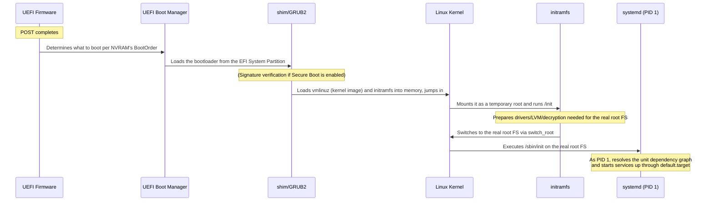

## Introduction

- **What You'll Learn From This Article**: A systematic understanding of what happens between a server's POST (Power-On Self-Test) completing and the OS actually becoming usable — the chain of handoffs from the UEFI boot manager, to the bootloader (GRUB2), to the kernel, to initramfs, to the real root filesystem, and finally to systemd (PID 1) — along with security mechanisms like Secure Boot and measured boot, and how to triage boot failures in practice.
- **Intended Audience**: Infrastructure engineers who know that "turning on a server makes the OS boot," but can't explain exactly what runs between POST completing and a login prompt appearing.
- **Estimated Reading Time**: About 15-20 minutes

This article is part of the [Top 1% Series' full article guide](/en/sitemap).

The way a server's PSU switches its output from the standby rail to the main power rail, and how POST runs once power has stabilized, was covered in a separate article, [Understanding Server Power Design from a "Top 1%" Perspective](/en/articles/idrac-power-guide). This article picks up right where that one left off, focusing on **what happens after POST finishes**. POST completing is often treated as little more than "the signal that the OS is starting up," but in reality, it's followed by a multi-stage boot process in which several programs hand control off to one another in sequence.

## Prerequisites

- **Firmware (BIOS/UEFI)**: The foundational software built into the motherboard that runs before the OS does. Modern servers and PCs mostly use UEFI (Unified Extensible Firmware Interface).
- **Bootloader**: A program that bridges control from the firmware to the OS kernel. GRUB2 is widely used on Linux.
- **Kernel**: The core program of an OS, responsible for hardware control, process management, memory management, and more.
- **Root filesystem**: The storage area (mounted as `/`) that holds the complete set of files an OS needs to actually run.

## Getting the Big Picture

### In a Nutshell

The OS boot process after POST is "**a chained sequence of handoffs — firmware → bootloader → kernel → initramfs → real root filesystem → PID 1 (systemd) — in which each program decides 'which program to run next, and from where' before passing control along**." No single program does everything; instead, each stage does the minimum it's capable of and then hands off, until you finally arrive at a state with a usable login prompt and running services.

### The Full Flow of the Boot Process

This article focuses specifically on the intermediate stages that tend to get overlooked: why a bootloader is needed at all, why a temporary environment called initramfs gets inserted into the middle of the process, and what exactly systemd is doing as PID 1.

## Fundamentals, Thoroughly Explained

### How the UEFI Boot Manager Picks the First Program to Run

Once POST completes, a firmware feature called the **UEFI boot manager** kicks in. The boot manager reads a priority list called `BootOrder`, stored in the motherboard's non-volatile memory (NVRAM), along with the individual entries it references (`Boot0000`, `Boot0001`, and so on), to determine "which program, on which partition of which disk, should be run."

The "which program" in question is a `.efi` executable file stored on a small, dedicated, FAT32-formatted partition called the **EFI System Partition (ESP)**. On a typical Linux server, this is where the executable for GRUB2 (or shim, used for signature verification, discussed below) lives.

How is this different under the legacy BIOS/MBR scheme?

Under the older scheme that predates UEFI (legacy BIOS), the very first thing executed is an extremely small program (bootstrap code) that fits within just 446 bytes inside the first 512 bytes of the disk — the **MBR (Master Boot Record)**. Because there's no room in that tiny program for anything complex, its job is really just to bridge further — "load and run a slightly larger, second-stage program located elsewhere on the disk" (such as GRUB's stage 1.5 or stage 2). The UEFI boot manager does away with this inconvenience of "bridging step by step from a severely size-constrained MBR to progressively larger programs," offering a more flexible scheme where you can place a `.efi` program of any size on the ESP and reference it directly.

### The Role of the Bootloader (GRUB2) and Secure Boot

Once the boot manager runs the bootloader (GRUB2, on most Linux distributions), it reads its own configuration file, lets the user pick which kernel to boot, and then **loads two things into memory — the kernel image (`vmlinuz`) and the initramfs discussed below — before jumping to the kernel's entry point**. At that point, the bootloader's job is done; from here on, control belongs entirely to the kernel.

**Signature verification via Secure Boot**

In an environment with Secure Boot enabled, GRUB2 isn't invoked directly by the boot manager — instead, a small intermediary program signed by Microsoft, called **shim**, is invoked first. Shim verifies GRUB2's signature using a distro certificate embedded within itself (or a key individually enrolled in a separate NVRAM variable called `MokList` — the so-called MOK, or Machine Owner Key) and only runs GRUB2 if verification succeeds. GRUB2, in turn, verifies the signature of the kernel it's about to load in the same way. Note that the NVRAM-stored key data the firmware itself holds — `PK` (Platform Key), `KEK` (Key Exchange Key), `db` (the allow list), and `dbx` (the deny list) — is a separate mechanism from the MOK that shim manages individually. This chain — firmware → shim → GRUB2 → kernel, each stage verifying the next one's signature — is what lets Secure Boot **block, partway through the chain, the execution of any unsigned (i.e., potentially tampered) program**.

There's also a more "direct" boot scheme that skips GRUB2 entirely

More recently, simpler configurations have started to emerge that skip a general-purpose bootloader like GRUB2 altogether — bundling the kernel and initramfs into a single `.efi` executable ahead of time (a UKI: Unified Kernel Image) and booting it directly from the UEFI boot manager, as with `systemd-boot`. With fewer variable pieces to worry about — no bootloader-side configuration parsing or module loading — verifying and managing the boot path becomes simpler. Whether a given server uses GRUB2 or systemd-boot/UKI depends on the distro and installation choices, so it's worth checking which scheme a server you manage uses, via `bootctl status` (for systemd-boot) or by inspecting the contents under `/boot/efi`.

### Why a "Temporary Environment" Called initramfs Is Needed

Once the kernel decompresses itself from `vmlinuz` and finishes its basic initialization, it would like to go straight to finding the real root filesystem (`/`) — but this is where a **"chicken and egg" problem** arises.

- If the real root filesystem sits behind an NVMe/RAID controller, is built on LVM (Logical Volume Manager), or is encrypted with LUKS, you need the drivers or tools to handle that (assembling LVM, prompting for a decryption passphrase, etc.).
- But those very drivers and tools are normally located inside the real root filesystem you're trying to load in the first place — a circular dependency.

**initramfs** is what solves this problem. initramfs is a small, cpio-formatted compressed archive, loaded into memory ahead of time by the bootloader alongside the kernel image itself, packed with just enough drivers, tools, and boot scripts to locate the real root. Right after starting up, the kernel mounts this initramfs as a temporary root filesystem in memory (tmpfs) and runs the `/init` script inside it. This `/init` locates the real root filesystem's device (using clues such as a UUID or an LVM logical volume name), loads whatever drivers are needed, decrypts it if necessary, and only then finally mounts the actual real root filesystem.

Why "switch_root" is used instead of "pivot_root"

Back in the days of the older `initrd` scheme (a block-device-backed RAM disk), a system call called `pivot_root` was used to "set aside the current root while switching to the new one." However, the `initramfs` used today is a root filesystem unpacked directly onto tmpfs, and since there's no "parent mount to set aside" in the first place, `pivot_root` can't be used. Instead, modern initramfs implementations like dracut and initramfs-tools use a dedicated helper command called **`switch_root`**, which `mount --move`s `/proc`, `/dev`, `/sys`, and `/run` under the new root, then `chroot`s and execs the actual init program on the new root (systemd, discussed next). In the process, `switch_root` discards the memory that initramfs had been using — the difference from `pivot_root` being that this is "discard and hand off," rather than "set aside."

### From Kernel Initialization to systemd (PID 1)

Once `switch_root` completes the switch to the real root filesystem, initramfs runs `/sbin/init` on that real root and its own job is done. On today's major Linux distributions, `/sbin/init` is a symlink to **systemd**, which then starts running as **PID 1** — the first process spawned, and the ancestor of every process that follows.

systemd reads a large number of **unit** files (the units of things it starts — services, mount points, sockets, and so on) located under `/etc/systemd/system/` and `/usr/lib/systemd/system/`, and builds a dependency graph from the `Before=`/`After=` (ordering) and `Wants=`/`Requires=` (dependency) directives written into each one. It then starts whatever units are needed to reach the default target (`default.target` — typically `multi-user.target` for a server, or `graphical.target` for a GUI environment), **running units in parallel wherever the dependency graph allows it**.

| Startup approach | Startup order | Representative example |
|---|---|---|
| Legacy SysV init | Scripts defined per runlevel, run **sequentially** in numeric order | Scripts under `/etc/init.d/` |
| systemd | Resolves a dependency graph between units; units with no dependency on each other start **in parallel** | Units such as `.service`, `.mount`, `.socket` |

This ability to start things in parallel is one major reason systemd can boot faster than the old SysV init approach.

## The View from the Top 1% (What Experts See)

### Secure Boot and Measured Boot Are Not the Same Thing

Secure Boot, discussed above, is a mechanism that **blocks the execution** of unsigned or tampered programs. It's often confused with a different mechanism that serves a different purpose: **measured boot**.

Measured boot is a scheme in which each stage — firmware, bootloader, kernel, and so on — records the hash of the next program it's about to run into a region called a **PCR (Platform Configuration Register)**, inside a security chip called a **TPM (Trusted Platform Module)**, **before** running it (more precisely, via an operation called "extend," which combines the new hash with the existing value rather than overwriting it). Because PCRs accumulate rather than get overwritten, earlier records can't be tampered with after the fact.

The key point is that measured boot **does not block execution**. Even an unsigned program will run normally, as long as it gets measured. What measured boot provides is "a tamper-proof record of what actually ran" — used for things like **remote attestation** (proving to an outside verifier that "this server booted with the expected configuration") or sealing a disk-encryption key so it can only be decrypted "if the machine booted with the expected configuration" (e.g., TPM integration via `clevis` or `systemd-cryptenroll`). In short, **Secure Boot is a mechanism that "stops things at the door," while measured boot is a mechanism that "records things so they can be verified afterward"** — and it's only by combining both that you get real defense in depth: guaranteeing what ran at boot time, while also refusing to run anything unexpected in the first place.

Which stages get measured into which PCRs?

Which PCR number records which stage is determined by spec and implementation convention. Representative examples include PCR0 (a measurement of the firmware itself), PCR1 (firmware configuration data), PCR4 (the chain-loaded bootloader binaries, such as GRUB2 or shim), and PCR8/PCR9 (the commands GRUB executed, and the kernel/initramfs it loaded). More recent systemd-boot/UKI setups also use a systemd-specific convention across PCR11/12/13/15 (corresponding to the kernel image itself, the kernel's boot command line, additional configuration extensions, and system identity, respectively). Servers equipped with a BMC (such as iDRAC) can sometimes collect and audit these measurements from outside the OS — meaning that even if the OS itself has been tampered with, the boot-time record alone can still be trusted, which is exactly the kind of value that out-of-band management brings to the table.

### Comparing This to Windows' Boot Process

Windows follows the same basic idea as Linux, passing through multiple stages on the way to the OS.

| Stage | Linux | Windows |
|---|---|---|
| First program invoked by the boot manager | shim (with Secure Boot) / GRUB2 | `bootmgfw.efi` (the Windows Boot Manager) |
| OS loader | GRUB2 loads the kernel image | `winload.efi` loads the kernel (`ntoskrnl.exe`), the HAL, and boot-critical drivers |
| Earliest user-mode process | `/init` inside initramfs | The Session Manager (`smss.exe`) |
| The process equivalent to PID 1 | systemd | The Service Control Manager (`services.exe`) oversees starting the set of services |

The internal names and implementations differ, but the underlying structure of staged handoffs — firmware → boot manager → OS loader → kernel → initial process → services — is shared between the two.

## Common Misconceptions and Pitfalls

- **Misconception 1: "Once POST completes, the OS is basically booted"**
  POST completing only means the initial hardware diagnostics are done and control is about to be handed to the boot manager — it's the **starting line**, not the finish line. It takes the whole multi-stage handoff described above before the OS actually becomes usable.
- **Misconception 2: "initramfs (initrd) is a lightweight OS"**
  initramfs is a disposable, temporary environment that exists solely to get you to the real root filesystem. It isn't a persistent area — its contents are discarded the moment `switch_root` runs.
- **Misconception 3: "Enabling Secure Boot lets you detect malware at boot time"**
  What Secure Boot does is block the execution of unsigned or tampered programs via signature verification. "Recording what actually ran, so it can be verified afterward" is the job of measured boot. The two are complementary, and neither one alone accomplishes what the other is for.

## Troubleshooting Perspective

With boot failures, the single most important first step is **identifying which stage things are stuck at**. "It won't boot" can mean wildly different things depending on the stage, each with a different cause and a different fix.

### If You Land at a GRUB Rescue Prompt (`grub rescue>`)

This is a failure at the pre-kernel stage — **the bootloader itself can't find its own configuration file or the modules it needs**. Typical causes include a UUID changing after cloning a disk or resizing a partition, or a filesystem driver GRUB needs failing to load. Use the `ls` command to see what devices GRUB recognizes, and try recovering by manually entering commands like `set root=`, `set prefix=`, and `insmod`.

### If You Drop Into the initramfs Emergency Shell (the `(initramfs)` prompt)

This is a post-kernel, pre-OS failure — **the kernel itself has started up fine, but initramfs can't locate or mount the real root filesystem**. Typical causes include an incorrect UUID specified for the real root, an LVM logical volume that hasn't been assembled, or a failed decryption passphrase entry. Check the root device specification passed to the kernel with `cat /proc/cmdline`, cross-reference it against what's actually recognized with `ls /dev/disk/by-uuid/`, and, if needed, manually run `vgscan`/`vgchange -ay` (for LVM) or `cryptsetup luksOpen` (for encryption) before typing `exit` — this can sometimes let the boot continue.

### If a Kernel Panic Occurs

This is a more serious failure — **the kernel itself has hit an unrecoverable, fatal error**, either after switching to the real root FS or at some point after. Check whether a driver loaded just before the crash, or a kernel parameter passed at boot, might be responsible, and, if `kdump` is configured, capture a crash dump to analyze the cause.

### Triaging a Slow Boot

If the boot process completes but is simply slow, `systemd-analyze blame` (which units are taking the most time) and `systemd-analyze critical-chain` (the critical path of the boot timeline) can help pinpoint where the bottleneck lies, even amid parallel startup.

## Summary

- POST completing is the starting line, not the finish line — it's followed by a multi-stage handoff: firmware → boot manager → bootloader → kernel → initramfs → real root FS → systemd (PID 1).
- The bootloader's job is simply to load the kernel and initramfs into memory and jump in; initramfs is a disposable, temporary environment that solves the "chicken and egg" problem of reaching the real root FS.
- Secure Boot blocks unsigned/tampered programs from running; measured boot records what actually ran in a tamper-proof way — the two serve different purposes.
- With boot failures, the first step is figuring out which stage you're stuck at: a GRUB rescue prompt (bootloader stage), the initramfs emergency shell (after the kernel starts, before the real OS), or a kernel panic (after the real OS has started).

**Starting Today**
1. Check whether a server you manage boots via GRUB2 or systemd-boot (UKI), for example with `bootctl status`.
2. When you run into a boot failure, build the habit of first identifying whether it's a GRUB rescue prompt, an initramfs emergency shell, or a kernel panic.

## References

- [UEFI Specification 2.10, Section 3: Boot Manager | UEFI Forum](https://uefi.org/specs/UEFI/2.10/03_Boot_Manager.html)
- [initramfs/More | Debian Wiki](https://wiki.debian.org/initramfs/More)
- [Secure Boot | Ubuntu Server Documentation](https://documentation.ubuntu.com/security/security-features/platform-protections/secure-boot/)
- [TPM2_PCR_MEASUREMENTS | systemd](https://systemd.io/TPM2_PCR_MEASUREMENTS/)
- [Fallback.efi and the fallback boot path | Rod Smith](https://www.rodsbooks.com/efi-bootloaders/fallback.html)
