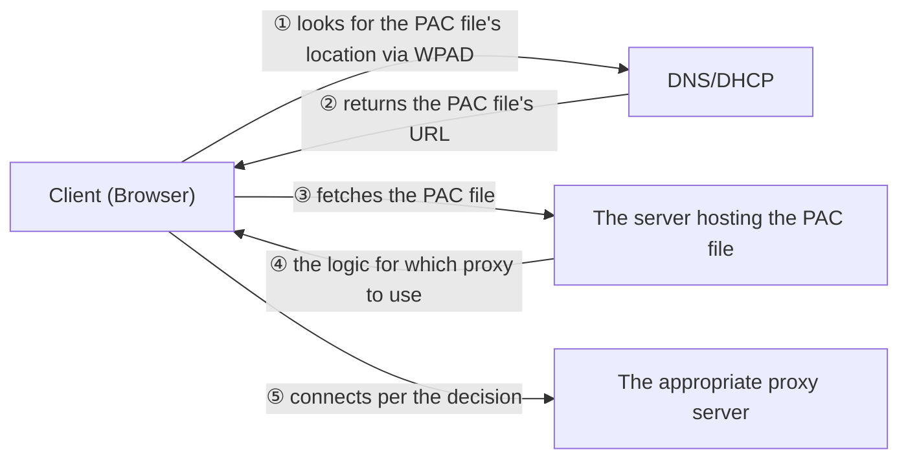

## Introduction

- **What You'll Learn From This Article**: Building on explicit proxying (specifying a proxy server on the client side), covered in [When to Use a Proxy vs. a Firewall](/en/articles/proxy-firewall-guide), a systematic understanding of two mechanisms that let you **avoid manually distributing proxy settings to every single machine in a company**: the **PAC (Proxy Auto-Config) file** and **WPAD (Web Proxy Auto-Discovery).**
- **Intended Audience**: Readers who've seen an "automatic proxy detection" option in a company's network settings, but can't explain exactly what gets detected, or how.
- **Estimated Reading Time**: About 16 minutes

This article is part of the [Top 1% Series Complete Article Guide](/en/sitemap), and the fourth article in the [Web Proxy/Caching Fundamentals Series](/en/sitemap#series-list).

## Prerequisite Knowledge

- **Explicit Proxying**: The approach, covered in [When to Use a Proxy vs. a Firewall](/en/articles/proxy-firewall-guide), where the client side holds a setting saying "use this proxy server." PAC and WPAD are mechanisms for distributing and discovering this setting automatically, rather than by hand.

## Getting the Big Picture

With explicit proxying, the client (the browser) fundamentally needs to be configured with "which proxy server to use." **Doing this by hand, across hundreds or thousands of machines in a company, isn't realistic.** This gets solved in two stages: **consolidating "the logic for deciding which proxy to use" into a single file (PAC)**, and **a mechanism (WPAD) that lets the client automatically discover where that file lives.**



## Deep Dive Into the Fundamentals

### A PAC File: Just a Single Function, Written in JavaScript

A PAC file is, in reality, just a plain-text JavaScript file holding a single function, `FindProxyForURL(url, host)`. For every URL it's about to access, the browser calls this function, and **decides which proxy to use based on the string it gets back.**

```javascript
function FindProxyForURL(url, host) {
  // Access to an internal domain goes directly, bypassing the proxy
  if (shExpMatch(host, "*.internal.example.test")) {
    return "DIRECT";
  }
  // Everything else routes through the company's own proxy server
  return "PROXY proxy.example.test:8080";
}
```

**The value of this mechanism is that it lets you freely express complex branching logic — "switch proxies based on a pattern in the URL or hostname" — as actual program logic.** Decisions that a simple config file struggles to express — "only this domain should go direct," "use a different proxy only during this time window" — can be written flexibly as JavaScript conditionals.

<details>
<summary>Why Does a "DIRECT" Option Exist at All?</summary>

**Routing access to an internal domain or local network through an external-facing proxy server too creates a pointless detour, slowing communication down.** `DIRECT` is a special return value instructing the client to "connect directly, bypassing the proxy entirely." Being able to separate internal traffic from internet-bound traffic, as logic within the same PAC file, is one of PAC's main real-world uses.

</details>

### WPAD: Automatically Discovering Where the PAC File Itself Lives

Once a PAC file exists, your proxy-decision logic lives in one place. But a problem remains: **the client side still doesn't know where that PAC file actually is.** This is exactly what **WPAD (Web Proxy Auto-Discovery Protocol)** solves.

WPAD mainly finds the PAC file's location (its URL) through two methods.

- **Via DHCP**: When the DHCP server hands out an IP address, it also communicates the PAC file's URL through an extension field called option 252.
- **Via DNS**: The client first tries accessing a fixed, conventionally-named URL, `http://wpad.<your own domain>/wpad.dat`. If DNS can resolve this hostname correctly, it fetches the PAC file from that URL.

**Which of these two methods is actually active depends on OS and browser settings.** In many environments, the DHCP-based method takes priority, falling back to the DNS-based method if that fails.

## What a Pro Sees Here (Top 1% Understanding)

### The Very Name "WPAD" Has Historically Been a Target for Abuse

WPAD's design — automatically querying a guessable hostname, `wpad.<your domain>` — creates the foundation for a real risk: **an attacker who registers that same guessable hostname first (maliciously) can get a client to load a forged PAC file they control, letting them intercept traffic.** This is a different context from the "abusing a guessable DNS name" idea covered in [how GSLB works](/en/articles/load-balancing-gslb-guide), but it's a textbook example of a universal tension: **a mechanism automated for convenience has an automation procedure that's equally predictable to an attacker.** Real-world practice counters this by explicitly registering the name `wpad` (with a harmless value) on the internal DNS, closing off that exact predictability.

## Common Misconceptions and Pitfalls

- **Misconception 1: "A PAC file is just a plain list of configuration values."**
  A PAC file is, in reality, executable logic written in JavaScript. It can express far more flexible branching than a simple config file.
- **Misconception 2: "WPAD only ever uses a single method to find the PAC file."**
  WPAD combines multiple methods — via DHCP and via DNS — to locate the PAC file.
- **Misconception 3: "Configuring a PAC file makes WPAD configuration unnecessary."**
  A PAC file is "the decision logic," and WPAD is "the mechanism that finds where that file lives" — two separate roles. If you distribute the PAC file's URL to clients by hand, the PAC file itself still works fine without WPAD.

## Troubleshooting Perspective

1. **Automatic proxy configuration fails on only some machines**: Check whether that machine is finding the PAC file via DHCP or via DNS.
2. **You updated the PAC file, but the old decision logic is still in effect**: The browser side may be caching the PAC file itself.
3. **The PAC file's `FindProxyForURL` function returns an unintended proxy**: Check the JavaScript logic itself for a branching mistake. Verify `shExpMatch`'s pattern actually covers the range you intended, against individual URLs.

## Summary

- A PAC file expresses, in a single JavaScript function called `FindProxyForURL`, the logic for switching between proxies based on URL or hostname.
- A `DIRECT` return value instructs a direct connection, bypassing the proxy entirely.
- WPAD automatically discovers the PAC file's own location through multiple methods — via DHCP and via DNS.
- WPAD's guessable hostname has historically been a target for abuse, which is why explicit countermeasures on the internal DNS matter in real-world practice.

**Takeaways to Apply Today**
1. When you run into a problem with automatic proxy configuration, first isolate whether it's "a problem in the PAC file's logic" or "a problem in WPAD's discovery."
2. When reviewing your internal DNS design, confirm the name `wpad` is never left in a state a third party could unintentionally abuse.

## References

- [Proxy Auto-Configuration (PAC) file | MDN Web Docs](https://developer.mozilla.org/en-US/docs/Web/HTTP/Proxy_servers_and_tunneling/Proxy_Auto-Configuration_PAC_file)
- [RFC Draft - Web Proxy Auto-Discovery Protocol (WPAD)](https://datatracker.ietf.org/doc/html/draft-ietf-wrec-wpad-01)
