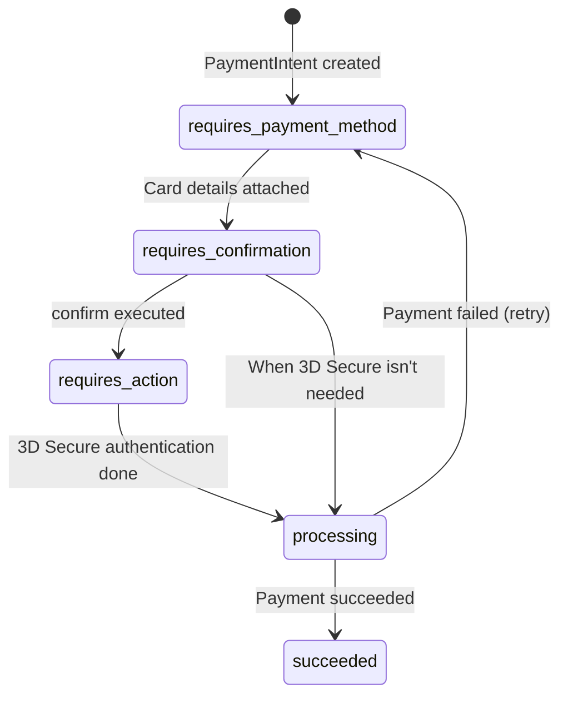
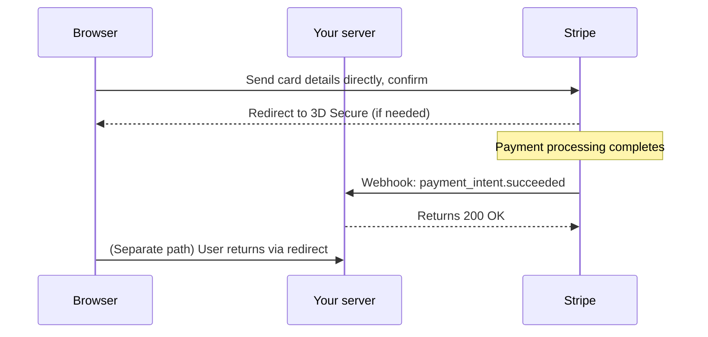

## Introduction

- **What You'll Learn From This Article**: This article digs deeper into payment APIs (Stripe and similar), briefly touched on in [Understanding RESTful APIs from a "Top 1%" Perspective](/en/articles/restful-api-guide). You'll systematically understand why a payment API isn't designed as "one API call and you're done," the **webhook** mechanism used to correctly detect that a payment actually completed, and the design that keeps sensitive card data from ever touching your own server at all (for PCI DSS compliance) — all through the concrete example of Stripe.
- **Intended Audience**: Readers who've integrated a payment feature into an app before, but couldn't explain why a single "execute payment" API call doesn't finish the job, or why a separate mechanism called a webhook is needed at all.
- **Estimated Reading Time**: About 20 minutes

This article is part of the [Top 1% Series' full article guide](/en/sitemap).

## Prerequisites

- [Understanding RESTful APIs from a "Top 1%" Perspective](/en/articles/restful-api-guide): This article assumes you're already familiar with idempotency keys (Idempotency-Key) and stateless authentication mechanisms.

## The Big Picture

### Why doesn't "one API call" complete a payment?

The first surprise in a payment API's design is that **"hand over the card details, execute the payment" doesn't complete in a single API call.** On top of the inherent complexity of payment processing itself, this is because a step like **3D Secure (the extra authentication required under regulations like the EU's SCA)** can be inserted partway through, temporarily redirecting the user to an authentication screen hosted by their card-issuing bank. To represent this "stateful process spanning multiple steps," Stripe centers its design around an object called a **PaymentIntent.**



A `PaymentIntent` is **an object representing the entire lifetime of a single payment**, moving through states from the moment it's created until it reaches `succeeded`: `requires_payment_method` → `requires_confirmation` → (if needed) `requires_action` → `processing` → `succeeded`.

## The Full Breakdown

### Step 1: Create a PaymentIntent

Payment processing starts on the server side, by creating a `PaymentIntent` with a specified amount and currency.

```bash
curl https://api.stripe.com/v1/payment_intents \
  -u sk_test_...: \
  -d amount=2000 \
  -d currency=usd \
  -d "automatic_payment_methods[enabled]"=true
```

This request doesn't move any money — it's simply **registering the intent that "a payment of this amount is about to happen."** The response includes a `client_secret` that uniquely identifies this payment, which you pass to the browser (the frontend).

### Step 2: Entering card details and confirming

**This is the single most important point in a payment API's design.** The card number itself never passes through your own server at all — it's sent **directly from the browser to Stripe's servers, via a JavaScript UI component Stripe provides (Stripe Elements).** Your own server never once receives, stores, or logs the card number. Once the card details are entered and confirmed on the browser side, the `PaymentIntent` moves from `requires_confirmation` to its next state.

<details>
<summary>Why this design matters (PCI DSS)</summary>

The credit card industry has a strict security standard imposed on any business that handles card data: **PCI DSS (Payment Card Industry Data Security Standard).** If your own server directly handles card numbers — receiving, storing, or even just passing them through — your business takes on PCI DSS's heavy compliance burden (regular audits, encryption standards for the communication path, and more). **By using a tool like Stripe Elements, where the card number is sent directly from the browser to Stripe, your server never touches the card number even once, which keeps your PCI DSS compliance scope dramatically smaller.** This is one of the biggest practical benefits of using a payment API at all.

</details>

### Step 3: When 3D Secure (SCA) is required

For transactions the card-issuing bank judges as higher risk, or cases where it's mandated by regulation (EU-issued cards, for example), the `PaymentIntent` enters a `requires_action` state. Here, the user is temporarily redirected to an authentication screen provided by the issuing bank (entering a one-time passcode sent by SMS, for example), and once identity is confirmed, the intent moves on to `processing`. **Keep in mind that since this step's necessity can't be determined ahead of time (it's the issuing bank's call), a payment API can't be designed around "authentication is always required" or "authentication is never needed" — it has to be a design built around state transitions instead.**

### Step 4: Correctly detecting the payment result — why webhooks are necessary

At this point in the flow, it's tempting to write frontend code that says "show this screen once the payment succeeds." But **you must never treat the frontend's redirect completing as definitive proof the payment succeeded.** Consider these scenarios:

- Right after completing 3D Secure authentication, the user closes their browser (no redirect back to your site ever happens)
- The payment itself succeeds, but the response conveying that result never reaches the frontend due to a network hiccup

In other words, **"whether the payment actually succeeded" and "whether that result reached the frontend" are two independent events that can each fail on their own.** This is why payment APIs use a **webhook** mechanism: every time a payment's state changes, Stripe sends an HTTP request (a notification) directly to your own server.



**This webhook is the one and only source of truth for the payment result.** The frontend redirect is purely a display update for the user's benefit — the actual order-confirmation processing (reserving stock, issuing a shipping instruction, and so on) **must always be triggered by receiving this webhook.**

<details>
<summary>Preventing webhook spoofing: signature verification</summary>

A webhook arrives at your server as an ordinary HTTP request from the outside (Stripe). That means, in principle, **if a malicious third party simply learns your webhook receiving endpoint's URL, they could send a forged request claiming "the payment succeeded."** To prevent this, Stripe attaches an **HMAC signature** to every webhook request's headers, computed with a secret key shared only at setup time. The receiving side recomputes that same signature independently, using the same secret key, and only treats the request as legitimate once the signatures match. Skip this signature verification, and your webhook endpoint becomes a real vulnerability that anyone can exploit to fake a successful payment.

</details>

## What a Pro Sees Here (Top 1% Understanding)

### Why idempotency keys matter especially for payment APIs

The idempotency key (Idempotency-Key) covered in [Understanding RESTful APIs from a "Top 1%" Perspective](/en/articles/restful-api-guide) matters especially for payment APIs. If a `PaymentIntent` creation request times out and the client decides "it might not have gone through" and retries, without an idempotency key you risk creating a second, duplicate `PaymentIntent` — and, in the worst case, a duplicate charge. Stripe supports safe retries by including an `Idempotency-Key: <unique string>` header in the request: if a request with the same key has already been processed, it returns the same result as before instead of processing it again.

### Test mode and test cards

Payment APIs maintain a separate **test mode** from production, letting you use dedicated **test card numbers** (Stripe's `4242 4242 4242 4242`, for example) to reproduce scenarios like a successful payment, a failed payment, or a 3D Secure challenge — without moving any real money. When building payment features in practice, it's critical to never mix up your production key (`sk_live_...`) with your test-mode key (`sk_test_...`) — never accidentally leave a live key in a test environment's config file.

## Common Misconceptions and Pitfalls

- **Misconception 1: "A payment API completes in one API call once you hand over the card details."**
  Because extra authentication like 3D Secure can be inserted, the design routes through a `PaymentIntent` object with state transitions, across multiple steps.
- **Misconception 2: "It's fine to treat the frontend's redirect coming back as confirmation the payment succeeded."**
  Since the redirect reaching your frontend is never guaranteed, actual order-confirmation processing must always be triggered by receiving the webhook.
- **Misconception 3: "Since a webhook is just an incoming HTTP request from outside, it's fine to trust whatever content arrives."**
  A webhook should only be treated as legitimate after its signature has been verified.

## Troubleshooting Perspective

1. **The payment appears to have succeeded, but order-confirmation processing never runs**: Check whether your webhook receiving endpoint is configured correctly, and whether it's being rejected by signature verification — check the actual delivery results (status codes) in Stripe's dashboard "Webhook logs."
2. **The same order gets charged twice**: Check whether an idempotency key is correctly set on the `PaymentIntent` creation request.
3. **The user never comes back from the 3D Secure screen, and the payment never completes**: The user may have closed the screen after being redirected. Even so, if the payment itself succeeded in the background, the webhook still gets sent correctly — as long as your processing is webhook-based, this isn't a practical problem.

## Summary

- Because extra authentication like 3D Secure can be inserted, payment APIs are designed around a `PaymentIntent` object with state transitions, spanning multiple steps.
- Card numbers never pass through your own server — using a component like Stripe Elements to send them directly from the browser to the payment provider keeps your PCI DSS compliance scope small.
- Since the frontend redirect reaching the user is never guaranteed, actual order-confirmation processing must be triggered by receiving the webhook — the one reliable source of truth.
- A webhook should only be treated as legitimate after its signature has been verified.

**Takeaways to Apply Today**
1. When implementing a payment feature, always keep "what the frontend displays" and "actual order-confirmation processing" driven by separate triggers — a screen transition for the former, a webhook for the latter.
2. When implementing a webhook endpoint, never skip signature verification.

## References

- [Stripe API Reference: PaymentIntents](https://stripe.com/docs/api/payment_intents)
- [Stripe: Webhooks](https://stripe.com/docs/webhooks)
- [Stripe: Strong Customer Authentication (SCA)](https://stripe.com/docs/strong-customer-authentication)
