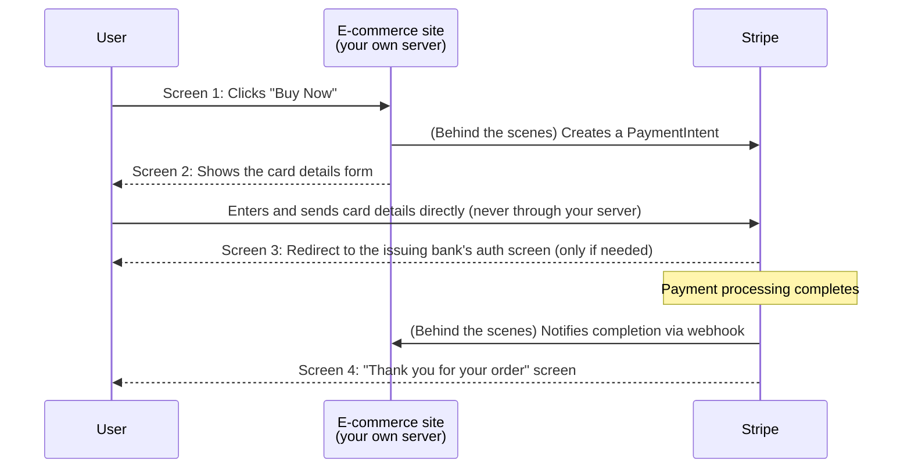
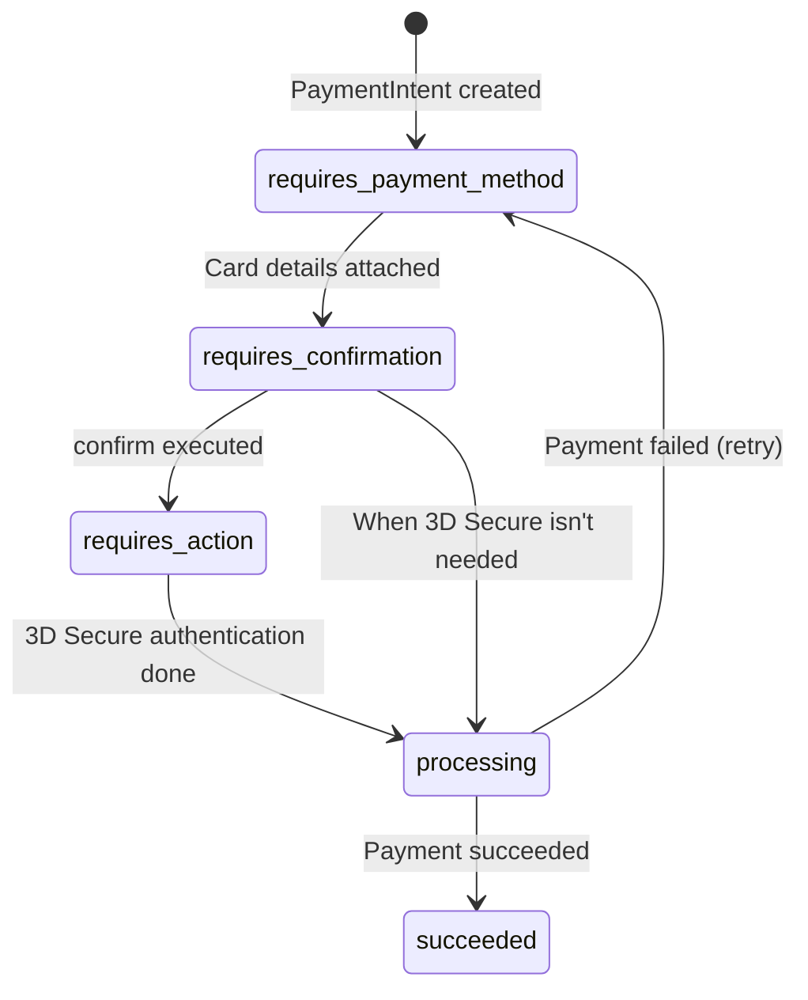
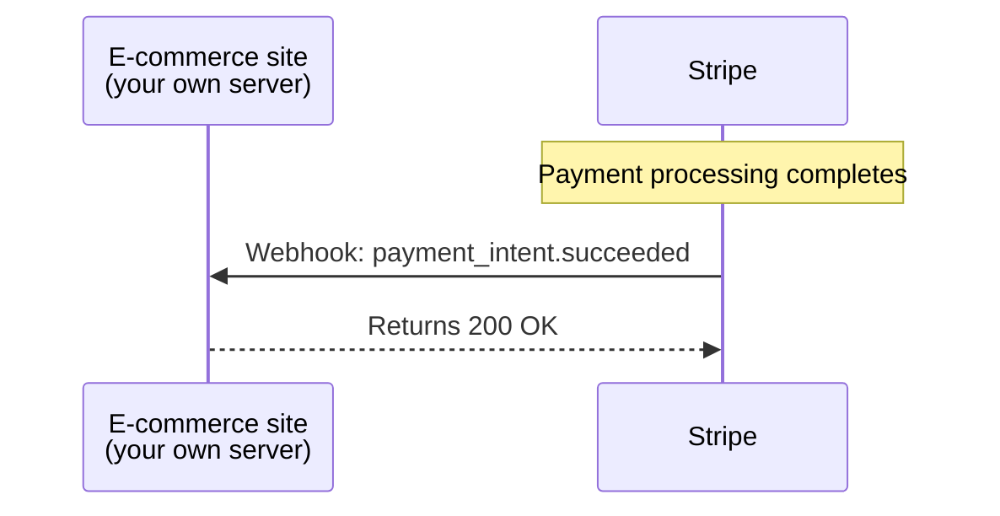

## Introduction

- **About This Article**: This article is **an explainer, not a hands-on.** You don't need to create a Stripe account or write any code. We'll trace, step by step, what's happening behind the scenes of the payment screens a user actually sees while shopping on an e-commerce site.
- **What You'll Learn From This Article**: This article digs deeper into payment APIs (Stripe and similar), briefly touched on in [Understanding RESTful APIs from a "Top 1%" Perspective](/en/articles/restful-api-guide). You'll systematically understand why a payment API isn't designed as "one API call and you're done," the **webhook** mechanism used to correctly detect that a payment actually completed, and the design that keeps sensitive card data from ever touching your own server at all (for PCI DSS compliance) — all through the concrete example of Stripe.
- **Why This Article Matters in the Web/API Series**: Building a payment feature is an extremely common task most web developers run into at some point in their career. And a payment API is a dense, high-value subject for learning: the concepts covered in [Understanding RESTful APIs from a "Top 1%" Perspective](/en/articles/restful-api-guide) — idempotency, authentication, webhooks — all get tested at once, in a context where getting any of them wrong has a concrete, real-world cost: a duplicate charge, or a lost order.
- **Intended Audience**: Readers who've integrated a payment feature into an app before, but couldn't explain why a single "execute payment" API call doesn't finish the job, or why a separate mechanism called a webhook is needed at all — or readers who've never used a service like Stripe and can't yet picture concretely how a payment screen actually works.
- **Estimated Reading Time**: About 25 minutes

This article is part of the [Top 1% Series' full article guide](/en/sitemap).

## Prerequisites

- [Understanding RESTful APIs from a "Top 1%" Perspective](/en/articles/restful-api-guide): This article assumes you're already familiar with idempotency keys (Idempotency-Key) and stateless authentication mechanisms.
- **On the phrase "your own server"**: This article repeatedly uses the phrase "your own server," which refers to **the server run by the merchant integrating the payment feature — the e-commerce site the user is buying from, for example.** It's a completely separate thing from Stripe's own servers, and keeping the two distinct is the key to understanding this whole article.

## The Big Picture: The Four Screens a User Actually Sees

Diving straight into APIs and code makes a payment API hard to picture concretely, so let's first trace **the four screens a user actually sees while shopping on an e-commerce site.**


```mermaid
sequenceDiagram
    participant User
    participant Site as E-commerce site<br/>(your own server)
    participant Stripe

    User->>Site: Screen 1: Clicks "Buy Now"
    Site->>Stripe: (Behind the scenes) Creates a PaymentIntent
    Site-->>User: Screen 2: Shows the card details form
    User->>Stripe: Enters and sends card details directly (never through your server)
    Stripe-->>User: Screen 3: Redirect to the issuing bank's auth screen (only if needed)
    Note over Stripe: Payment processing completes
    Stripe->>Site: (Behind the scenes) Notifies completion via webhook
    Stripe-->>User: Screen 4: "Thank you for your order" screen
```

We'll now dig into what's happening behind each of these four screens, one at a time.

## A Thorough, Grounds-Up Explanation

### Screen 1: What Happens on Your Server the Instant "Buy Now" Is Clicked

When the user clicks "Buy Now," they're not aware of it at all, but behind the scenes, **your own server** sends an API request to Stripe, registering the amount and currency for the payment about to happen.

```bash
curl https://api.stripe.com/v1/payment_intents \
  -u sk_test_...: \
  -d amount=2000 \
  -d currency=usd \
  -d "automatic_payment_methods[enabled]"=true
```

**It's your own server sending this API request — not the user's browser.** It's server-to-server communication, invisible to the user. This request doesn't move any money — it's simply **registering the intent that "a payment of this amount is about to happen."** The object representing this intent is a **PaymentIntent.**


```mermaid
stateDiagram-v2
    [*] --> requires_payment_method: PaymentIntent created
    requires_payment_method --> requires_confirmation: Card details attached
    requires_confirmation --> requires_action: confirm executed
    requires_action --> processing: 3D Secure authentication done
    requires_confirmation --> processing: When 3D Secure isn't needed
    processing --> succeeded: Payment succeeded
    processing --> requires_payment_method: Payment failed (retry)
```

A `PaymentIntent` is **an object representing the entire lifetime of a single payment**, moving through the states shown in this diagram from the moment it's created until it reaches `succeeded`. The response includes a `client_secret` that uniquely identifies this payment, and passing that to the user's browser (the frontend) sets the stage for Screen 2.

### Screen 2: What's Really Happening in the Card Details Form

To the user, this looks like an ordinary card details form. But **this form's input fields aren't created directly by your own site's HTML/JavaScript.** A JavaScript component Stripe provides, called **Stripe Elements**, is embedded into your site's page as an `<iframe>`, and the card number the user types goes directly into that `iframe` — territory managed by Stripe itself.

**Once the user enters their card number and confirms it, that keystroke data is sent directly from the browser to Stripe's servers — never passing through your own server, or even your own site's JavaScript code.** What your own server receives isn't the card number at all — it's just a tokenized reference indicating it's okay to use for this payment.

<details>
<summary>Why this design matters (PCI DSS)</summary>

The credit card industry has a strict security standard imposed on any business that handles card data: **PCI DSS (Payment Card Industry Data Security Standard).** If your own server directly handles card numbers — receiving, storing, or even just passing them through — your business takes on PCI DSS's heavy compliance burden (regular audits, encryption standards for the communication path, and more). **By using a component like Stripe Elements, where the card number is sent directly from the browser to Stripe "without ever passing through your own code at all," neither your server nor even your own JavaScript code ever touches the card number, keeping your PCI DSS compliance scope down to the lightest possible tier (SAQ A).** This is one of the biggest practical benefits of using a payment API at all.

</details>

Once the card details are entered and confirmed on the browser side, the `PaymentIntent` moves from `requires_confirmation` to its next state.

### Screen 3: When the Issuing Bank's Authentication Screen (3D Secure/SCA) Appears

For transactions the card-issuing bank judges as higher risk, or cases where it's mandated by regulation (EU-issued cards, for example), the user is temporarily redirected to **an authentication screen provided by the bank that issued their card** (entering a one-time passcode sent by SMS, for example). During this, the `PaymentIntent` sits in a `requires_action` state. Once identity is confirmed, the user is sent back to the original e-commerce site, and the intent moves on to `processing`.

**Whether this extra step happens at all is the issuing bank's call — your own server can never determine it ahead of time.** Keep in mind that this is why a payment API can't be designed around "authentication is always required" or "authentication is never needed" — it has to be a design built around state transitions instead.

### Screen 4: The "Thank You for Your Order" Screen, and What a Webhook Actually Is

The user eventually sees a screen confirming their order is complete. But **you must never treat this screen appearing as definitive proof the payment succeeded.**

First, let's understand what a **webhook** actually is. In ordinary API use, the relationship is one-directional: "the client asks, and the server answers." **A webhook inverts this relationship.** Instead of your own server repeatedly asking Stripe "is the payment done yet?" (polling), **Stripe itself proactively sends an HTTP request to your own server the instant the payment's state changes.** Picture it like this: instead of repeatedly checking your mailbox, the delivery person calls you on the phone the moment your package arrives.

Why is this webhook necessary? Consider these scenarios:

- Right after completing 3D Secure authentication, the user closes their browser (no redirect back to your site ever happens)
- The payment itself succeeds, but the response conveying that result never reaches the user's browser due to a network hiccup

In other words, **"whether the payment actually succeeded" and "whether that result was displayed to the user as Screen 4" are two independent events that can each fail on their own.** Screen 4 appearing is purely a display update for the user's benefit — the actual order-confirmation processing (reserving stock, issuing a shipping instruction, and so on) **must always be triggered by receiving a webhook.**


```mermaid
sequenceDiagram
    participant Site as E-commerce site<br/>(your own server)
    participant Stripe

    Note over Stripe: Payment processing completes
    Stripe->>Site: Webhook: payment_intent.succeeded
    Site-->>Stripe: Returns 200 OK
```

**This webhook is the one and only source of truth for the payment result.**

<details>
<summary>Preventing webhook spoofing: signature verification</summary>

A webhook arrives at your server as an ordinary HTTP request from the outside (Stripe). That means, in principle, **if a malicious third party simply learns your webhook receiving endpoint's URL, they could send a forged request claiming "the payment succeeded."** To prevent this, Stripe attaches an **HMAC signature** to every webhook request's headers, computed with a secret key shared only at setup time. The receiving side recomputes that same signature independently, using the same secret key, and only treats the request as legitimate once the signatures match. Skip this signature verification, and your webhook endpoint becomes a real vulnerability that anyone can exploit to fake a successful payment.

</details>

## What a Pro Sees Here (Top 1% Understanding)

### Why idempotency keys matter especially for payment APIs

The idempotency key (Idempotency-Key) covered in [Understanding RESTful APIs from a "Top 1%" Perspective](/en/articles/restful-api-guide) matters especially for payment APIs. If a `PaymentIntent` creation request times out and your own server decides "it might not have gone through" and retries, without an idempotency key you risk creating a second, duplicate `PaymentIntent` — and, in the worst case, a duplicate charge. Stripe supports safe retries by including an `Idempotency-Key: <unique string>` header in the request: if a request with the same key has already been processed, it returns the same result as before instead of processing it again.

### Test mode and test cards

Payment APIs maintain a separate **test mode** from production, letting you use dedicated **test card numbers** (Stripe's `4242 4242 4242 4242`, for example) to reproduce scenarios like a successful payment, a failed payment, or a 3D Secure challenge — without moving any real money. When building payment features in practice, it's critical to never mix up your production key (`sk_live_...`) with your test-mode key (`sk_test_...`) — never accidentally leave a live key in a test environment's config file.

## Common Misconceptions and Pitfalls

- **Misconception 1: "A payment API completes in one API call once you hand over the card details."**
  Because extra authentication like 3D Secure can be inserted, the design routes through a `PaymentIntent` object with state transitions, across multiple steps.
- **Misconception 2: "It's fine to treat Screen 4 (the order-complete screen) appearing as confirmation the payment succeeded."**
  Since Screen 4 reaching the user is never guaranteed, actual order-confirmation processing must always be triggered by receiving the webhook.
- **Misconception 3: "Since a webhook is just an incoming HTTP request from outside, it's fine to trust whatever content arrives."**
  A webhook should only be treated as legitimate after its signature has been verified.

## Troubleshooting Perspective

1. **The payment appears to have succeeded, but order-confirmation processing never runs**: Check whether your webhook receiving endpoint is configured correctly, and whether it's being rejected by signature verification — check the actual delivery results (status codes) in Stripe's dashboard "Webhook logs."
2. **The same order gets charged twice**: Check whether an idempotency key is correctly set on the `PaymentIntent` creation request.
3. **The user never comes back from the 3D Secure screen, and the payment never completes**: The user may have closed the screen after being redirected. Even so, if the payment itself succeeded in the background, the webhook still gets sent correctly — as long as your processing is webhook-based, this isn't a practical problem.

## Summary

- Because extra authentication like 3D Secure can be inserted, payment APIs are designed around a `PaymentIntent` object with state transitions, spanning multiple steps.
- Card numbers never pass through your own server, or even your own JavaScript code — using a component like Stripe Elements to send them directly from the browser to the payment provider keeps your PCI DSS compliance scope small.
- A webhook is the inverse of ordinary API use: the server proactively sends a notification the moment its state changes.
- Since the screen visible to the user (the frontend redirect) reaching them is never guaranteed, actual order-confirmation processing must be triggered by receiving the webhook — the one reliable source of truth.

**Takeaways to Apply Today**
1. When implementing a payment feature, always keep "what the frontend displays" and "actual order-confirmation processing" driven by separate triggers — a screen transition for the former, a webhook for the latter.
2. When implementing a webhook endpoint, never skip signature verification.

## References

- [Stripe API Reference: PaymentIntents](https://stripe.com/docs/api/payment_intents)
- [Stripe: Webhooks](https://stripe.com/docs/webhooks)
- [Stripe: Strong Customer Authentication (SCA)](https://stripe.com/docs/strong-customer-authentication)
