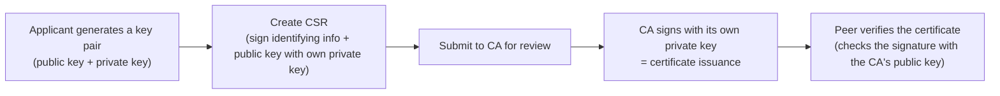
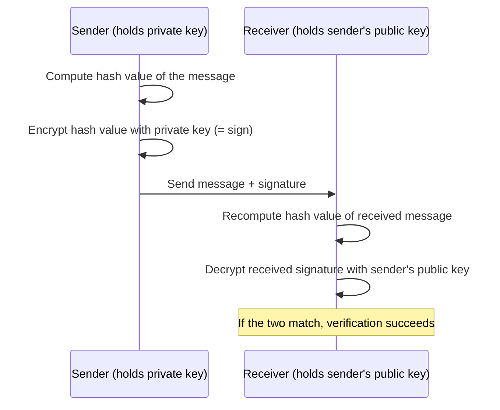
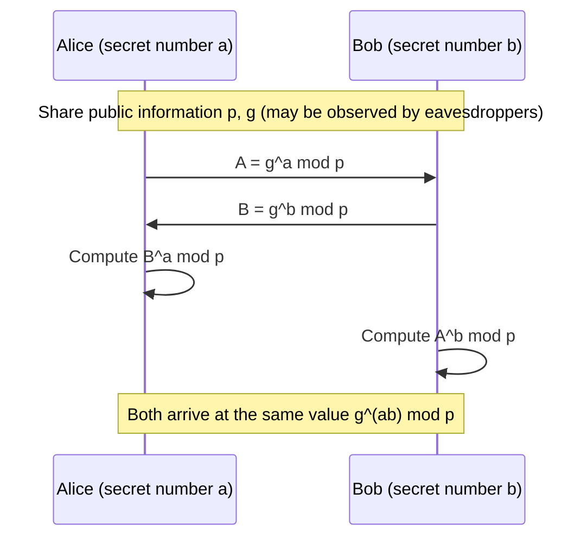
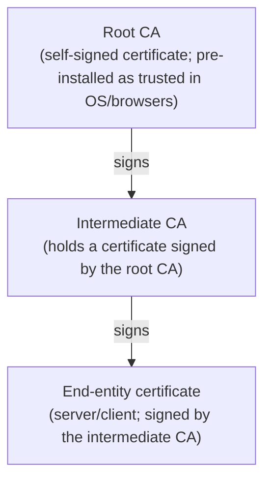

## Introduction

- **What You'll Learn From This Article**: What's actually inside the word "certificate" — why public-key cryptography works with "two keys," how Diffie-Hellman key exchange creates a shared secret value even over a path an eavesdropper can observe, exactly what steps a digital signature goes through to prove "this was created by the claimed party and has not been tampered with," what's inside a CSR (Certificate Signing Request), what actually happens when a CA (Certificate Authority) issues a certificate, and precisely what certificate chain verification confirms. You'll come away with a systematic understanding of all of it.
- **Intended Audience**: Infrastructure engineers who have dealt with troubles like "the certificate expired" but can't explain the underlying mechanisms — public-key cryptography, digital signatures, and certificate chain verification.
- **Estimated Reading Time**: About 20 minutes

This article is part of the [Top 1% Series' full article guide](/en/sitemap).

The padlock icon in your browser's address bar, certificate-based authentication when connecting to a VPN, SSH public-key login — the words "certificate" and "public key" show up in all kinds of contexts, but the mechanism underneath is shared across all of them. This article digs into PKI (Public Key Infrastructure), the foundation these technologies are built on, starting from the fundamentals of cryptography.

## Prerequisites

- **Hash function**: A function that takes data of arbitrary length as input and always produces a fixed-length output (a hash value). The same input always produces the same output, but changing even a single bit of the input produces a completely different hash value (designed to be collision-resistant), and it's impossible to work backward from a hash value to the original input (one-way property). SHA-256 is a representative example.
- **Symmetric-key encryption**: An encryption scheme that uses the same key for both encryption and decryption. AES is a representative example, and it's characterized by lower computational cost compared to public-key cryptography (discussed below).

## Getting the Big Picture

### In a Nutshell

PKI (Public Key Infrastructure) is **the entire mechanism by which a trusted third party (a CA) guarantees, in the form of a certificate, that the owner of a given public key really is who they claim to be (or that a given server really is what it claims to be)**.

A certificate itself is a bundle of data consisting of "public key + identifying information + the CA's signature," and the party verifying it can confirm that "a trusted third party — the CA — guarantees this particular combination of public key and identifying information."

### The Asymmetry of Public-Key Cryptography

Public-key cryptography (RSA, ECDSA, etc.) uses a mathematically paired **public key** and **private key**. The public key can be handed to anyone, but the private key is kept under strict lock and key by its owner alone. This key pair has two uses with different purposes.

| Use | Who encrypts / generates | Who decrypts / verifies | Purpose |
|---|---|---|---|
| Encryption (confidentiality) | Encrypt with the recipient's **public key** | Only the recipient decrypts with their **private key** | Ensure "no one but the holder of that private key can read this" |
| Digital signature | Sender signs with their own **private key** | Anyone can verify with the sender's **public key** | Prove "this was definitely created by the holder of that private key" |

**The understanding "encrypt with the private key, decrypt with the public key" is wrong** — to be precise, the direction the keys are used in flips depending on the purpose. The mechanism central to certificates is the latter of these two uses: the **digital signature**.

## Fundamentals, Thoroughly Explained

### How Digital Signatures Work

A digital signature simultaneously proves two things — "this was created by the claimed party" and "it has not been tampered with" — through the following steps.

1. The sender computes the hash value of the data (message) they want to send.
2. The sender encrypts that hash value with their own **private key**. This is the "signature."
3. The sender bundles the original message together with this signature and sends it to the recipient.
4. The recipient recomputes the hash value from the message as received, while separately decrypting the received signature with the sender's **public key**.
5. If the two match, it simultaneously proves that "this message was indeed signed by the holder of the private key (authenticity), and has not been altered by even a single bit since it was signed (integrity)."

The reason the signature is applied to the hash value rather than the entire message is that public-key cryptography has a high computational cost, making it inefficient to encrypt an entire body of data. By signing only the fixed-length hash value, the signing operation itself stays a constant cost regardless of how large the original data is.

### Key Exchange: How Diffie-Hellman (DH) Works

The "encryption" and "digital signature" uses covered in the table above both assumed that the parties already had a key pair from the start. Separate from these, there's another important mechanism built on the ideas of public-key cryptography: **key exchange**. Key exchange is a procedure for "creating a new shared secret value known only to the two parties involved, even if an eavesdropper has observed the entire communication." It's the starting point of nearly every encryption protocol used in practice, including TLS and IKE (the key agreement protocol for IPsec).

The most fundamental scheme is **Diffie-Hellman (DH) key exchange**. The procedure is as follows.

1. In advance, both parties share, as public information, a large prime **p** and a number **g** (a primitive root, or generator) that serves as the starting point for computation in that group (it's fine if this is observed by an eavesdropper).
2. Each party privately and randomly selects a secret number (**a**, **b**) that they never reveal to anyone else.
3. Each party computes a public value using their own secret number and sends it to the other.
   - Alice: computes and sends `A = g^a mod p`
   - Bob: computes and sends `B = g^b mod p`
4. When each party raises the other's received public value to the power of their own secret number, both arrive at the same value.
   - Alice: `B^a mod p = g^(ba) mod p`
   - Bob: `A^b mod p = g^(ab) mod p`
   - Since `g^(ba) mod p` and `g^(ab) mod p` are exactly the same value under the laws of exponents, **both parties independently arrive at the identical shared secret value**.

An eavesdropper can see all of p, g, A, and B, but to compute the shared secret value `g^(ab) mod p` from these, they would need to work backward from `A = g^a mod p` to recover a. This is known as the **discrete logarithm problem**, and the security of DH rests on the fact that, given sufficiently large p and g, this cannot be solved in a practical amount of time (it exploits the asymmetry that multiplication and exponentiation are easy, while recovering the original exponent from the result is extremely hard).

**What decisively separates DH from public-key encryption and digital signatures** is that DH has no concept of "encrypting" or "signing" at all. All DH produces is "raw material for a shared key that will be used to encrypt the communication about to begin" — it provides no guarantee whatsoever about whether the other party is actually who they claim to be (guaranteeing that identity is precisely the role of the digital signatures and certificates this article covers). In real protocols (IKE, TLS, etc.), it's only by combining two mechanisms — generating a shared key via DH, and simultaneously verifying the peer's identity via a digital signature (or a pre-shared key) — that "sharing a secure key with a secure peer" is actually achieved.

Elliptic Curve DH (ECDH) and Perfect Forward Secrecy (PFS)

In practice, rather than the naive DH described above (based on multiplication and exponentiation mod p), the more efficient **Elliptic Curve DH (ECDH)** is widely used. The mathematical foundation shifts to operations over elliptic curves, but the basic structure — "both sides exchange public values and combine them with their own secret number to reach the same value" — remains unchanged.

The practice of **discarding the secret numbers (a, b) used in DH after every single communication** is called **Ephemeral DH (DHE, or ECDHE for the elliptic curve variant)**. By generating a throwaway key via DH for that session alone, separate from the long-lived private key used for signing, even if that long-term key is ever compromised in the future, past communications that were recorded or eavesdropped on cannot later be decrypted. This property is called **Perfect Forward Secrecy (PFS)**, and the practice of performing an additional DH key exchange in IKE Phase 2 (Quick Mode) — enabling PFS — exists specifically to obtain this property.

### What's Inside a CSR (Certificate Signing Request), and How It's Created

An applicant (a server or client) wanting to obtain a certificate first goes through the following steps.

1. Generate their own public/private key pair.
2. Create a **CSR (Certificate Signing Request)** that bundles together "their own identifying information (an identifier such as a domain name or username)" and "their own public key."
3. **Sign the entire CSR** with the applicant's own **private key**.

This third step — the self-signature — is crucial. By verifying the CSR's signature using the public key contained within the CSR itself, the CA can confirm that "the applicant submitting this CSR genuinely possesses the private key corresponding to this public key" (Proof of Possession). Without this verification, anyone could submit a CSR using someone else's public key, creating a risk of impersonation.

### Certificate Issuance by a CA, and the Certificate Chain

In addition to verifying the CSR's signature, the CA performs identity verification of the applicant (such as confirming domain ownership, with the level of rigor varying by validation level), and then **signs the content of the CSR (identifying information + public key) with the CA's own private key**, issuing it as a certificate. At this point, the certificate becomes data that means "this CA guarantees this particular combination of identifying information and public key."

CAs typically don't operate as a single flat layer, but instead form a hierarchical structure like the following.

**Why insert an intermediate CA**: The root CA's private key is an extremely critical key — if it's ever compromised, the trustworthiness of every certificate that relies on that root collapses. For this reason, the root CA's private key is normally kept completely offline and under strict physical security, while day-to-day certificate issuance is delegated to intermediate CAs. Even if an intermediate CA's key were compromised, only that particular intermediate CA needs to be revoked, sparing the root CA itself from any damage.

### The Certificate Chain Verification Procedure

A party verifying a certificate received from a peer confirms its validity through the following steps.

1. Trace the chain from the received certificate (the end-entity certificate) through the intermediate certificates that follow it.
2. Verify the signature of each certificate using the **public key** contained in the certificate one level up in the hierarchy (the end-entity certificate's signature is verified with the intermediate CA's public key, the intermediate CA certificate's signature is verified with the root CA's public key, and so on up the chain).
3. Confirm whether the root CA certificate ultimately reached is included in the verifier's own **trust store** (the set of trusted root CA certificates pre-installed in the OS or browser).
4. Confirm that none of the certificates in the chain have expired or been revoked (discussed below).
5. Confirm that the hostname/identifying information expected of the peer matches the CN (Common Name) or SAN (Subject Alternative Name) recorded in the certificate.

If even one of these checks fails, certificate verification results in an error.

## The View from the Top 1% (What Experts See)

### Why TLS Uses Both Public-Key and Symmetric-Key Cryptography

Public-key cryptography has a considerably higher computational cost than symmetric-key cryptography, making it unsuited to encrypting large volumes of actual data. For that reason, real-world protocols (TLS, and IKE/IPsec as well) adopt the following **hybrid approach**.

1. At the start of the communication, use public-key cryptography (or a key-exchange algorithm built on it) to securely agree on a symmetric key.
2. For all subsequent exchange of actual data, use lower-cost symmetric-key cryptography (such as AES).

The design of "use the expensive public-key cryptography only for the initial key agreement, then switch to lightweight symmetric-key cryptography for everything else" is the standard playbook for capturing the benefits of both — the security of public-key cryptography and the speed of symmetric-key cryptography.

### Certificate Revocation Checking: CRL vs. OCSP

Even a certificate that's still within its validity period can be **revoked** by the CA — for reasons such as a compromised private key or an error in the recorded information. There are two ways to check this revocation status.

- **CRL (Certificate Revocation List)**: The verifier downloads a "list of revoked certificates (a list of serial numbers)" that the CA publishes periodically, and checks whether the certificate in question appears on it. As the list grows larger, the cost of distributing and downloading it increases.
- **OCSP (Online Certificate Status Protocol)**: For each individual certificate, the verifier queries the CA's response server in real time with "is this certificate valid?" There's no need to hold an entire list, but a query to the OCSP server is generated on every connection, and how to handle the case where that server can't respond (fail closed, or allow the connection) becomes an operational question. To avoid this round trip, **OCSP Stapling** — where the server presents an OCSP response it obtained in advance alongside its certificate, so the verifier doesn't need to make an individual query — is also widely used.

### The Difference Between RSA and ECDSA (Elliptic Curve Cryptography)

Alongside the long-established RSA, **ECDSA** (Elliptic Curve Digital Signature Algorithm) has become widely used for certificate public-key cryptography in recent years. The practical advantage of ECDSA is that it achieves security comparable to RSA with a much shorter key length (a shorter key length reduces certificate data size and the computational cost of signing and verification). Both share the same basic structure — "verify with the public key, sign with the private key" — differing only in the underlying mathematical computation: RSA relies on the difficulty of factoring large numbers, while ECDSA relies on the difficulty of the discrete logarithm problem over elliptic curves.

Why a Large Key Length Is Needed (Using RSA as an Example)

RSA's security rests on the mathematical difficulty of "factoring an enormous number cannot be solved in a practical amount of time." The public key is constructed from "the product of two large prime numbers," and if that product could be factored back into the original two primes, the private key could be reconstructed — but the larger the key length (the bit length of the product), the more astronomically long factorization takes, no matter how powerful the computer used. Conversely, as computational power improves, the key length required to maintain the same level of security keeps growing. The current recommendation of 2048 bits or more for RSA key length is based on this balance against available computational power.

## Common Misconceptions and Pitfalls

- **Misconception 1: "As long as there's a certificate, the communication is automatically encrypted"**
  A certificate by itself is a tool for "guaranteeing identity" — it doesn't perform encryption on its own. The public key contained in the certificate is used to securely exchange a symmetric key at the start of the communication, and the actual data encryption is handled by that symmetric key (symmetric-key cryptography). There are also configurations that perform encryption alone, using authentication methods that don't rely on certificates at all (such as pre-shared keys).
- **Misconception 2: "Self-signed certificates have weaker cryptographic strength"**
  The strength of the cryptographic algorithm itself (key length, cipher scheme) is completely unrelated to whether a CA has signed the certificate. The fundamental problem with a self-signed certificate is a matter of **trust** — it's "a certificate whose identity is not vouched for by a third party" — not a matter of cryptographic strength. A certificate issued by an internal (private) CA is likewise treated as an "untrusted certificate" unless that CA has been added to the client's trust store.
- **Misconception 3: "Encrypt with the private key, decrypt with the public key"**
  As covered above, the direction reverses depending on the purpose. For confidentiality-oriented encryption, it's "encrypt with the public key → decrypt with the private key"; for signature purposes, it's "sign with the private key → verify with the public key." Conflating these two makes the entire mechanism of certificate-based authentication hard to understand.

## Troubleshooting Perspective

The basic approach to certificate-related errors is to **isolate which step of the verification procedure is failing**.

1. **Expired**: The certificate falls outside its NotBefore/NotAfter range — the simplest case.
2. **Incomplete certificate chain**: The server has forgotten to present the intermediate certificate (sending only the end-entity certificate). Some clients, such as browsers, can sometimes fill in the gap using an intermediate certificate cached by the OS, but many clients (especially API clients and mobile apps) don't fill it in and simply fail.
3. **Hostname mismatch**: The hostname being connected to doesn't match the certificate's CN/SAN.
4. **Untrusted root CA**: A self-signed certificate or an internal CA's certificate isn't registered in the client's trust store.
5. **Revocation**: The certificate is determined to be revoked via CRL/OCSP.
6. **Clock skew on the client side**: If the client's clock is significantly off due to an NTP synchronization issue, even a certificate that's within its validity period can be incorrectly judged as "expired." This is an unglamorous but surprisingly common cause in practice.

The standard approach for investigation is to use `openssl s_client -connect <host>:443 -showcerts` to see the certificate chain actually being presented, and `openssl x509 -in <certificate file> -text -noout` to inspect the contents of a certificate (validity period, CN/SAN, issuer, etc.).

### Prevention and Long-Term Countermeasures

- Adopt automated certificate renewal (such as Let's Encrypt, which uses the ACME protocol) so expiration itself becomes far less likely to happen.
- Monitor certificate expiration dates and build alerting into operations that fires a set amount of time before expiry.
- Always deploy the full chain, including intermediate certificates, on servers.
- Enforce time synchronization via NTP on both clients and servers.

## Summary

- PKI is the entire mechanism that ties a public key to the identity of its owner, via the signature of a trusted third party — the CA.
- Diffie-Hellman key exchange is a mechanism by which two parties can independently derive the same shared secret value even over an eavesdropped path; it provides no identity guarantee at all, its sole role being to "produce the material for a secure key."
- A digital signature works in the direction of "created with the private key, verified with the public key," simultaneously proving both authenticity and integrity.
- A CSR doubles as proof of possession of a public key, since the applicant self-signs it with their own private key.
- Certificate chain verification only succeeds once the chain of signatures has been traced up to the root CA and the trust store, expiration, revocation, and hostname match have all been confirmed.

**Starting Today**
1. When you run into a certificate error, first isolate which of the following it is: expired / incomplete chain / hostname mismatch / revoked / root not in trust store.
2. Build the habit of using `openssl s_client` and `openssl x509` to inspect the actual contents of the certificate being presented with your own eyes.

## References

- [Internet X.509 Public Key Infrastructure Certificate and CRL Profile | RFC 5280](https://datatracker.ietf.org/doc/html/rfc5280)
- [PKCS #10: Certification Request Syntax Specification | RFC 2986](https://datatracker.ietf.org/doc/html/rfc2986)
- [X.509 Internet PKI Online Certificate Status Protocol (OCSP) | RFC 6960](https://datatracker.ietf.org/doc/html/rfc6960)
- [The Transport Layer Security (TLS) Protocol Version 1.3 | RFC 8446](https://datatracker.ietf.org/doc/html/rfc8446)
- [Automatic Certificate Management Environment (ACME) | RFC 8555](https://datatracker.ietf.org/doc/html/rfc8555)
