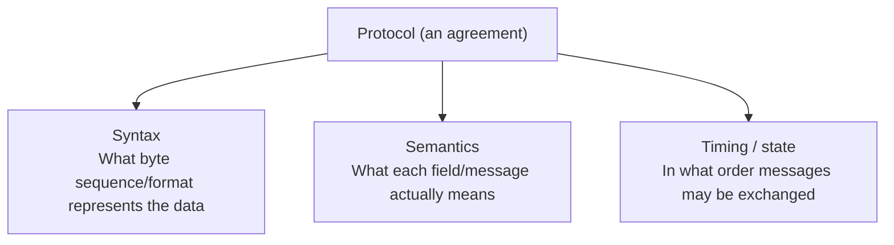

## Introduction

- **What You'll Learn From This Article**: Starting from the understanding that "a protocol is an agreement standardizing the data format used to exchange information for a given communication purpose or service function," this article systematically breaks down **what elements that agreement is actually made of.** It also covers the difference between text-based and binary protocols, **why you can design your own custom protocol**, and how an unencrypted custom protocol can end up being reverse-engineered.
- **Intended Audience**: This article is aimed at engineers who know how to use individual protocols like HTTP, DNS, or SMB, but who can't systematically explain what the concept of "a protocol" actually refers to, or where the design differences between protocols come from.
- **Estimated Reading Time**: About 19 minutes

This article is part of the [Top 1% Series' full article guide](/en/sitemap), and the first article in a new series on protocol fundamentals. It assumes you understand protocol layering (encapsulation) from [Understanding the Network Stack from a "Top 1%" Perspective](/en/articles/network-stack-guide).

## Prerequisites

- **Encapsulation**: The mechanism of wrapping one protocol's entire data as the "payload (data portion)" of another protocol. See [Understanding the Network Stack from a "Top 1%" Perspective](/en/articles/network-stack-guide) for details.

## Getting the Big Picture

### The Three Elements a Protocol Is Made Of

**A protocol's "agreement" can, in practice, be broken down into three elements.**

Communication only succeeds once all three of these elements exactly match between the two communicating parties. **Conversely, as long as these three elements match between them, it functions as "a protocol," no matter what the data looks like, or who defined it.** This is the most essential answer to the question, covered later, of "can you design your own custom protocol?"

## Fundamentals, Explained Thoroughly

### Syntax: How Data Gets Laid Out

**Syntax** is the rule defining exactly what byte sequence represents the data being communicated. Protocol syntax design broadly splits into two directions.

| Kind | Characteristics | Representative examples |
|---|---|---|
| **Text-based** | Represents data as a string, directly readable by a human eye | HTTP (request lines and headers as newline-delimited strings), SMTP, the FTP control channel |
| **Binary** | A byte sequence with each field's position and length fixed in advance, optimized for machine processing | SMB (CIFS), TLS's record layer, the IP/TCP/UDP headers themselves |

**A text-based protocol is easy to visually inspect and debug even without a tool like Wireshark, and easy to extend later — such as adding a new header field.** A binary protocol, on the other hand, has the advantage of **representing the same information in fewer bytes, and parsing it much faster.** Which of "ease of use for humans" and "efficiency for machines" to prioritize when designing a protocol is a clear design decision, determined by that protocol's intended use.

Even within syntax, there are further variations in how variable-length data gets represented

For data that can't be represented with fixed-length fields alone (such as an HTTP URL, whose length varies each time), a protocol's syntax mainly has two approaches. The **delimiter approach** treats everything up to a specific character (for HTTP, the newline `CRLF`) as one piece of data. The **length-prefix approach** places a numeric field indicating the data's length before the data itself (adopted by many binary protocols). The delimiter approach pairs well with text-based protocols, and the length-prefix approach pairs well with binary protocols.

### Semantics: What a Field Actually Means

**Semantics** is the rule defining what an individual field or message, carved out by the syntax, concretely means. For example, HTTP's status code `200` has no inherent meaning of its own as a number. **Only once both communicating parties share the convention (the semantics) that "the number 200 means success" ahead of time** does this number function as a message.

### Timing / State: In What Order Things Are Exchanged

**Timing (state)** is the rule defining which messages may be exchanged at which point, and in what order. This ties into viewing a protocol as a **finite state machine.**

- **A stateless protocol**: One where individual messages are independent, with no need to remember the state of past exchanges (such as a single DNS query and response).
- **A stateful (connection-oriented) protocol**: One with state-transition rules, such as "establish a connection first, exchange data, then disconnect at the end." TCP's three-way handshake and the actual reality of that connection as a state machine are covered in detail in [Understanding the Relationship Between TCP/UDP "Sessions" and Port Numbers from a "Top 1%" Perspective](/en/articles/tcp-udp-session-port-guide).

### Why Do Protocols Have "Layers"?

The layered structure (encapsulation) covered in [Understanding the Network Stack from a "Top 1%" Perspective](/en/articles/network-stack-guide) isn't an absolute necessity, like a physical law — it's **a design choice for divide-and-conquer of complexity.** Each layer's protocol only interprets its own header portion, and passes along the content that follows (the payload) as-is, on the premise that "I don't need to understand this, but the next layer will handle it correctly." This **division of responsibility** keeps each individual protocol's design and implementation simple.

Not every protocol sits neatly on top of the transport layer

As covered in [Understanding the Relationship Between TCP/UDP "Sessions" and Port Numbers from a "Top 1%" Perspective](/en/articles/tcp-udp-session-port-guide), protocols like ICMP, ESP, AH, and GRE **don't sit on top of a port-based transport-layer protocol like TCP/UDP — they're positioned directly under IP, roughly on par with IP itself.** Not every piece of communication fits neatly into the "application layer → transport layer → network layer" hierarchy — an important premise for understanding protocols as a whole. The next article digs into ICMP, the most common representative example of this.

## The View From the Top 1% Perspective

### Why You Can Design Your Own Custom Protocol

Coming back to the understanding above — "a protocol is an agreement that holds as long as three elements (syntax, semantics, timing) match between both parties" — **the answer becomes clear. Approval by a standards body like the IETF isn't a required condition for something to function as a protocol.** A protocol published and standardized as an RFC is simply **"a shared, publicly agreed-upon convention that lets anyone in the world interoperate with anyone else"** — nothing more. A private, unpublished set of syntax, semantics, and timing rules independently agreed upon by two communicating parties (say, a client and server within some company's internal system) also functions as a technically legitimate "protocol," as long as it matches between those two parties. **In fact, many companies' internal systems use protocols that communicate in an unpublished, proprietary binary format.**

### How an Unencrypted Custom Protocol Gets Analyzed

Even for a custom protocol, **if it isn't encrypted**, anyone can observe its raw byte sequence with a packet capture tool like Wireshark. Even if the syntax and semantics aren't published, **reverse engineering (analysis)** is attempted through approaches such as:

- **Observing differences tied to known operations**: Comparing the byte sequences immediately before and after a specific operation (logging in, clicking a specific button, and so on), and inferring a field's meaning from what changed.
- **Using recurring patterns as clues**: Using a structure that looks like a fixed-length header, or a specific magic number (a fixed identifying byte sequence indicating that protocol), as a clue to infer where syntax boundaries fall.

**A custom protocol has "secrecy" in the sense of not being publicly documented, but that doesn't guarantee its content can't be read or analyzed, unless it's encrypted.** If you want to prevent a third party from reading the content of communication, you need to separately incorporate encryption (such as TLS), independent of whether the protocol itself is custom.

## Common Misconceptions and Pitfalls

- **Misconception 1: "A protocol always sits on top of TCP or UDP"**
  Many protocols, such as ICMP, ESP, AH, and GRE, operate directly under IP, without going through the transport layer at all.
- **Misconception 2: "Official standardization by a body like the IETF is required for something to function as a protocol"**
  Standardization is just one means of ensuring worldwide interoperability. As long as syntax, semantics, and timing match between the two communicating parties, an unpublished, custom protocol functions just as legitimately, technically.
- **Misconception 3: "A custom protocol means no one else can read its content"**
  Whether a custom protocol's syntax and semantics are unpublished, and whether the communication is encrypted, are entirely separate matters. Without encryption, there's a risk of its content being analyzed via reverse engineering.

## The Troubleshooting Perspective

Investigation stalling due to a shallow understanding of protocols can be prevented by **always being conscious of "which layer's, which protocol's header am I looking at right now."**

1. **You look at a packet capture but can't judge what's happening**: Using the display filters covered in [How to Use Wireshark](/en/articles/wireshark-guide), narrow down to just the protocol at the layer you want to focus on first (IP, TCP, a specific application-layer protocol, and so on), and confirm that layer's syntax and semantics one at a time.
2. **You need to investigate communication using an unknown custom protocol**: Capture traffic before and after a known operation, and try to infer syntax and semantics by comparing the differences.

### Preventive Measures and Permanent Fixes

- When encountering a new protocol or its implementation, build the habit of breaking it down into syntax, semantics, and timing to understand it.
- When adopting a custom protocol for an internal system, document its specification (even if confidential internally), so successors don't have to rely on reverse engineering.

## Summary

- A protocol is an agreement between two communicating parties, made up of three elements: syntax (the data's representation format), semantics (what each field means), and timing (the order and state transitions of the exchange).
- Syntax has two directions — text-based and binary — each with a different advantage: ease of use for humans, or efficiency for machines.
- A protocol's layered structure isn't an absolute necessity — it's a design choice for divide-and-conquer of complexity, and protocols like ICMP, ESP, and AH exist that don't fit neatly into the layering.
- A protocol holds as long as syntax, semantics, and timing match between the two communicating parties, so a custom protocol without formal standardization functions just as technically legitimately — but that's a separate matter from encryption, which needs care.

**What to Keep in Mind From Today**
1. When you encounter a new protocol, build the habit of breaking it down into syntax, semantics, and timing to understand it.
2. Rethink the word "protocol" as a broader agreement, not limited only to things that sit on top of TCP/UDP.

## References

- [Requirements for Internet Hosts -- Communication Layers | RFC 1122](https://datatracker.ietf.org/doc/html/rfc1122)
- [The Internet Standards Process | RFC 2026](https://datatracker.ietf.org/doc/html/rfc2026)
- [Hypertext Transfer Protocol (HTTP/1.1): Message Syntax and Routing | RFC 7230](https://datatracker.ietf.org/doc/html/rfc7230)
