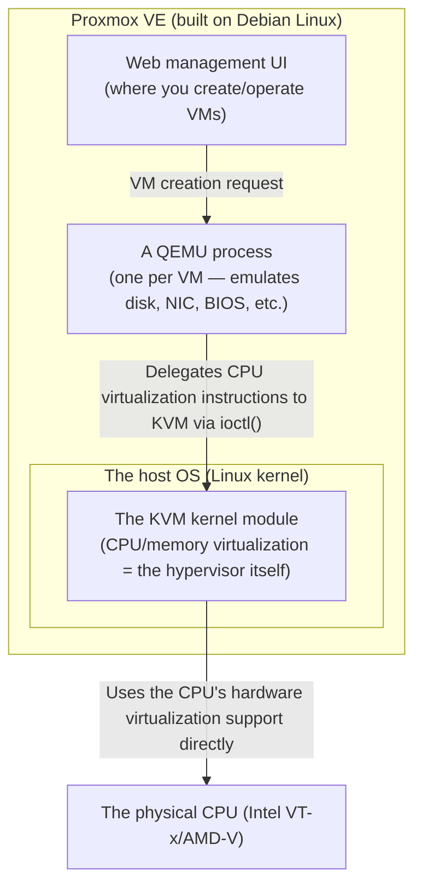
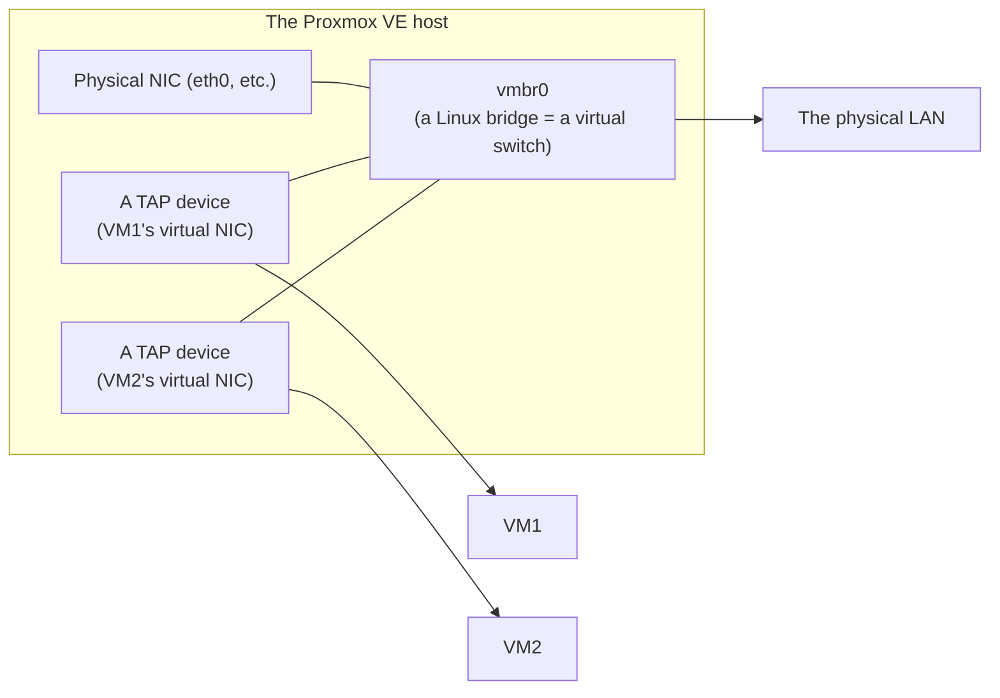

## Introduction

- **What You'll Learn From This Article**: What actually happens behind the scenes when you create a VM from Proxmox VE's management UI — the distinct roles KVM and QEMU play and how they cooperate, how a VM gets onto the network (the virtual bridge), and how a VM's disk is stored and its snapshots actually work.
- **Intended Audience**: Infrastructure engineers who can create a VM from Proxmox VE's UI, but can't explain what "virtualization" is actually implemented by, or the difference in role between the terms KVM and QEMU — and who are about to work through a Proxmox-based hands-on lab.
- **Estimated Reading Time**: About 16 minutes

This article is part of the [Top 1% Series' full article guide](/en/sitemap). A separate article covers the step-by-step operations manual for readers new to Proxmox VE ([Hands-On Prep: From Creating a VM in Proxmox VE to Installing an OS](/en/articles/handson-prep-guide)). This article focuses specifically on how Proxmox works under the hood.

## Prerequisites

- **Kernel space and user space**: The separation between the OS's privileged core processing and the region where ordinary applications run. Covered in [User Space, Kernel Space, and TUN/TAP Devices](/en/articles/linux-user-kernel-space-guide).
- **Daemons**: Processes that stay resident in the background. Covered in [What Is a Daemon?](/en/articles/linux-daemon-guide).

## Getting the Big Picture

### In a nutshell

**Proxmox VE is a "virtualization platform" — Debian Linux with a web-based management layer on top — and the thing actually running your VMs is two separate components: `KVM`, which turns the Linux kernel itself into a hypervisor, and `QEMU`, which reproduces in software every piece of virtual hardware other than the CPU.** Proxmox itself doesn't implement a new virtualization engine — it wraps Linux's existing virtualization machinery with a usable management UI (a web dashboard) and cluster management features.

## Fundamentals, Thoroughly Explained

### KVM: the module that turns the Linux kernel itself into a hypervisor

**KVM (Kernel-based Virtual Machine)** is a kernel module you load into the Linux kernel, and loading it **turns the Linux kernel itself into a hypervisor capable of running guest OSes (VMs)**. KVM exposes a special device file, `/dev/kvm`, and a userspace program issuing `ioctl()` system calls against this device can directly invoke the CPU's hardware virtualization support (Intel VT-x, AMD-V) — switching the CPU's execution mode into virtualized mode, running a guest OS's instructions, and so on.

Because of this design, KVM-based virtualization is classified as a "**Type 1 (bare-metal) hypervisor**." Hearing "Proxmox VE runs on top of Debian Linux" might make it sound like a Type 2 setup (like VMware Workstation or VirtualBox), where dedicated VM software runs on top of an ordinary host OS. But because **the Linux kernel itself takes on the hypervisor's role via KVM**, it's effectively treated as Type 1 — directly controlling the hardware.

### QEMU: reproducing every piece of "hardware" besides the CPU, in software

KVM only handles virtualizing the CPU and memory — actually executing instructions. **QEMU** is what reproduces everything else a VM needs — the disk controller, network card, graphics card, BIOS/UEFI firmware, all of it.

When you boot a single VM in Proxmox VE, the host spins up **one dedicated `qemu-system-x86_64` process for that VM**. This QEMU process software-emulates everything the guest OS sees as its "motherboard," "disk," and "NIC." For the CPU-instruction-execution part alone, instead of QEMU doing slow software emulation itself, it delegates that work to KVM (effectively, the physical CPU) via `/dev/kvm`, achieving close-to-native speed. **The reason you often see the combined notation "QEMU/KVM" is exactly this clear division of labor: QEMU reproduces the hardware in general, KVM accelerates CPU execution.**

Can QEMU run without KVM at all?

Yes. QEMU is fundamentally an independent virtualization program that can fully emulate CPU instructions purely in software, with no acceleration support like KVM (this mode is called TCG: Tiny Code Generator). But because it interprets and translates CPU instructions one at a time in software, it's dramatically slower. QEMU's standalone TCG mode gets used as a fallback where KVM isn't available (a CPU with virtualization support disabled, an environment without nested virtualization), or to emulate a different CPU architecture entirely (running ARM binaries on an x86 host, for instance).

### The virtual bridge (vmbr): making a VM a full member of the physical LAN

Proxmox VE's default networking setup uses a **Linux bridge** (a software-based virtual switch) to put VMs on the same segment as the physical LAN. The `vmbr0` you often see in the management UI is exactly this virtual bridge.

Each VM's virtual NIC shows up on the host side as a **TAP device** — the variant of the TUN/TAP devices covered in [User Space, Kernel Space, and TUN/TAP Devices](/en/articles/linux-user-kernel-space-guide) that handles raw Ethernet frames — and this gets plugged into the `vmbr0` virtual switch. Since the physical NIC is plugged into that same `vmbr0`, **a VM can obtain an IP address via DHCP or talk directly to other devices on the LAN, exactly as if it were physically wired into the network.** This is the mechanism behind the behavior described in the L2TP/IPsec hands-on lab: "in a configuration bridged directly to `vmbr0`, the VM gets an IP address directly from your home router."

### Storage backends and snapshots: what's actually behind a VM's "disk"

A VM's virtual disk is stored as either a file or a block device, in whichever of Proxmox VE's supported storage backends you chose.

| Storage backend | What it actually is | Snapshot efficiency |
|---|---|---|
| Directory (local) | An image file in `qcow2` or `raw` format | qcow2 supports software-level differential storage (relatively slow) |
| LVM-thin | A thin-provisioned logical volume | Supports fast copy-on-write snapshots |
| ZFS | A ZFS dataset | Supports fast copy-on-write snapshots; also includes compression and checksums by default |

Snapshots can be taken quickly because most of these backends use **copy-on-write**. Instead of duplicating the entire disk's contents at snapshot time, only the blocks that change **after** the snapshot get written to a new location — the original blocks keep being referenced as-is until they're actually modified. That's how a several-hundred-GB disk can have a snapshot taken in seconds.

## The View from the Top 1% (What Experts See)

### "Virtualization" and "containers" on Proxmox VE, distinguished by whether the kernel is separate

Beyond the KVM-based VMs covered so far (full virtualization, each guest running its own independent kernel), Proxmox VE also offers **LXC (Linux Containers)**, an OS-level virtualization mechanism. LXC containers share the host's Linux kernel across multiple containers, while using Linux kernel features — `namespaces` (isolating process, network, and filesystem namespaces) and `cgroups` (limiting CPU, memory, and other resources) — to make each one look like a separate OS. **A VM has more overhead in exchange for complete hardware-level isolation (an independent kernel per guest); a container is lighter because it shares the kernel, at the cost of weaker isolation than a VM.** Understanding this trade-off lets you correctly judge whether a VM or an LXC container is the right choice for a given hands-on lab (for something like the L2TP/IPsec lab, where you want to observe the kernel's own network stack and IPsec/XFRM behavior, a VM with its own independent kernel, isolated from the host, is the better fit).

### QEMU's process isolation doubles as a security boundary protecting the host

Each VM running as its own independent `qemu-system-x86_64` process isn't just a performance consideration — it also functions as a **security isolation boundary**. If a guest OS crashes inside a given VM, or a vulnerability is exploited in a process running inside the guest, the impact is essentially contained to that one QEMU process, without directly affecting the host or other VMs (though there are real, documented cases of "VM escape" — crossing this boundary via a vulnerability in QEMU itself or the KVM hypervisor layer — which is exactly why staying current on hypervisor updates matters).

## Common Misconceptions and Pitfalls

- **Misconception 1: "Proxmox VE is a dedicated OS with its own proprietary virtualization engine."**
  Proxmox VE is, at its core, Debian Linux, and the heart of its virtualization is KVM/QEMU, which comes standard with Linux. What's Proxmox-specific is the "layer that makes it usable" — the web management UI, cluster management, backup features, and so on.
- **Misconception 2: "KVM and QEMU are two names for the same thing."**
  KVM is a kernel module handling CPU/memory virtualization; QEMU is a userspace program that software-reproduces everything else. They're distinctly different pieces of software with clearly separate roles.
- **Misconception 3: "Every VM snapshot you take adds the full disk size to your storage usage."**
  A copy-on-write snapshot only stores the blocks that change afterward, so the increase in disk usage right after taking a snapshot is minimal (differential data accumulates over time as the original VM's contents keep changing).

## Common Sticking Points (Troubleshooting)

1. **A VM boots or runs unusually slowly**: Check whether `/dev/kvm` is actually being used — whether the host CPU's virtualization support (Intel VT-x/AMD-V) is enabled, and hasn't been disabled in BIOS/UEFI settings. If KVM isn't available and QEMU has fallen back to software emulation (TCG), performance drops noticeably.
2. **A VM can't reach the network**: Check, in Proxmox's network settings, whether the VM's virtual NIC is attached to the correct `vmbr`, and whether that bridge is correctly linked to the physical NIC.
3. **Disk usage is running out faster than expected**: Check whether a snapshot has been left in place for a long time. The longer the original VM's data keeps changing, the more copy-on-write differential data accumulates, sometimes consuming far more disk space than expected.

### Prevention and Long-Term Fixes

- Make it a rule to periodically clean up snapshots on lab VMs and delete ones you no longer need.
- Include "is CPU virtualization support (VT-x/AMD-V) enabled in BIOS/UEFI?" on your checklist when provisioning a new physical server.
- When planning production-equivalent testing, decide in advance whether an LXC container is sufficient or whether you actually need full virtualization (a KVM-based VM), based on whether you need to observe kernel-level behavior.

## Summary

- Proxmox VE is a platform built on Debian Linux with a web UI and cluster features layered on top; the core of its virtualization is two separate Linux-standard components — KVM (CPU/memory virtualization) and QEMU (everything else, reproduced in software).
- Using KVM lets the Linux kernel itself act as the hypervisor, classifying it as Type 1 virtualization.
- A VM's network connectivity is achieved via a Linux bridge (vmbr); its virtual NIC, represented as a TAP device, joins the physical LAN's segment through this bridge.
- A VM's disk is stored as a qcow2 file or a ZFS/LVM-thin volume, depending on the storage backend, and most of these achieve fast snapshots via copy-on-write.

**Starting Today**
1. If a VM feels sluggish, get in the habit of first suspecting whether `/dev/kvm` is actually in use — whether virtualization support is enabled.
2. Remember that a snapshot isn't a "cheap" operation but one whose differential data keeps accumulating — clean them up periodically.

## References

- [Proxmox VE Administration Guide](https://pve.proxmox.com/pve-docs/)
- [KVM — Linux kernel documentation](https://www.kernel.org/doc/html/latest/virt/kvm/index.html)
- [QEMU Documentation](https://www.qemu.org/docs/master/)
