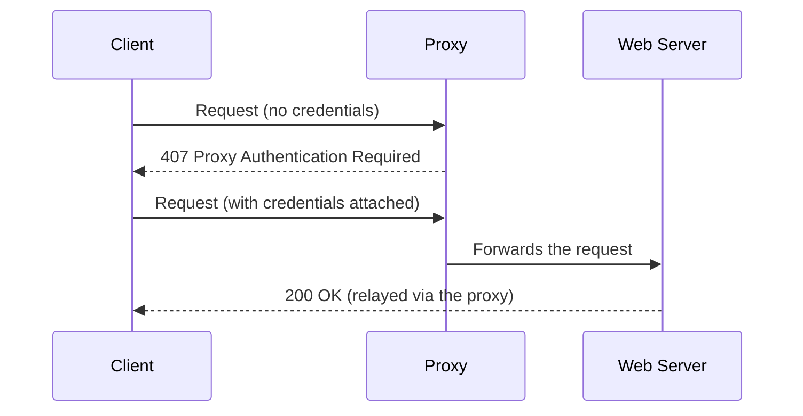

## Introduction

- **What You'll Learn From This Article**: Building on explicit proxying, covered in [When to Use a Proxy vs. a Firewall](/en/articles/proxy-firewall-guide), a systematic understanding of three different proxy authentication methods — **Basic, NTLM, and Kerberos** — that decide "who's allowed to use this proxy." You'll also cover why a separate status code, **407 Proxy Authentication Required**, exists apart from 401, specifically to signal an authentication failure.
- **Intended Audience**: Readers who've seen the terms NTLM and Kerberos used as proxy authentication methods, but can't explain exactly how they differ from each other.
- **Estimated Reading Time**: About 18 minutes

This article is part of the [Top 1% Series Complete Article Guide](/en/sitemap), and the fifth article in the [Web Proxy/Caching Fundamentals Series](/en/sitemap#series-list).

## Prerequisite Knowledge

- **Explicit Proxying**: The approach, covered in [When to Use a Proxy vs. a Firewall](/en/articles/proxy-firewall-guide), where the client side specifies a proxy server. This article covers the mechanism that decides who's allowed to use that proxy.

## Getting the Big Picture

### Why Does Status Code 407 Exist, Instead of Just 401?

When the web server itself requires authentication, it returns **401 Unauthorized.** But when a **proxy** sits between the client and the web server, the client needs to be able to distinguish whether the authentication request is coming from "the ultimate destination web server" or from "the proxy itself, somewhere along the path." **For exactly this distinction, when the proxy itself demands authentication, it uses a separate status code from 401: 407 Proxy Authentication Required.**

## Deep Dive Into the Fundamentals

### Basic Authentication: the Simplest, but Never Encrypted

**Basic authentication** is the simplest method: it joins a username and password with a colon, Base64-encodes the result, and sends it in a `Proxy-Authorization` header. **Base64 is encoding, not encryption, so unless the communication path itself is encrypted, the username and password are, for all practical purposes, traveling in plaintext.** It's only safe to use when the connection to the proxy itself is encrypted via HTTPS.

### NTLM Authentication: Challenge-Response, With Authentication Maintained Per TCP Connection

**NTLM authentication** never sends the password itself. Instead, it uses a **challenge-response** scheme: the proxy sends a **challenge** (a random value), and the client responds with a value it derives from the password. This keeps the password itself from ever traveling over the network.

**NTLM authentication's major distinguishing trait is that authentication state is maintained per "TCP connection," not per "HTTP request."** Once the challenge-response exchange completes on the very first request within one TCP connection, every subsequent request on that same connection never needs to repeat the authentication exchange.

What Real-World Problem Does This "Per-Connection" Authentication Cause?

**This mechanism breaks down if yet another load balancer sits between the client and the proxy, routing each request to a different backend proxy server.** The ordinary load-balancing idea covered in [load balancing algorithms](/en/articles/load-balancing-algorithms-guide) — that any request can be processed by any server — collides head-on with NTLM authentication's premise of maintaining state per connection. Fixing this requires the mechanism of **session persistence (sticky sessions)**, pinning connections from the same client to always route to the same backend proxy. This mirrors the structure of [session persistence](/en/articles/load-balancing-algorithms-guide), needed whenever the backend side holds session information in its own memory.

### Kerberos Authentication: Never Sending the Password Itself Over the Network at All

**Kerberos authentication** is a ticket-based method, commonly used in Active Directory environments. A client obtains a ticket from an authentication server (the KDC) ahead of time, and **presents that ticket, instead of the password itself**, when accessing the proxy. Kerberos's major distinguishing trait is that **it never sends even a value derived from the password over the network, across the entire challenge-response exchange.**

| Authentication Method | Handling of the Password | Authentication Granularity |
|---|---|---|
| **Basic** | Just Base64-encoded — for all practical purposes, plaintext | Per request |
| **NTLM** | Only a value derived from the password (challenge-response) | Per TCP connection |
| **Kerberos** | Only a ticket (neither the password nor a derived value ever travels) | Per ticket lifetime |

## What a Pro Sees Here (Top 1% Understanding)

### Choosing an Authentication Method Is a Design Decision About How Much You're Willing to Expose on the Network

The difference between Basic, NTLM, and Kerberos becomes clear once you understand it as **a staged design decision: how much of the password, a piece of sensitive information, are you willing to let appear on the network at all.** Basic exposes it effectively in plaintext; NTLM exposes a value derived from it; Kerberos exposes nothing about the password at all — a clear progression. **This shares the exact same underlying idea as [never letting a card number touch the merchant's own server at all, in a payment API's design](/en/articles/payment-api-guide).** The idea of replacing sensitive information itself with a different (safer) representation — a token, a ticket, a hash value — as early as possible, recurs again and again across entirely different domains.

## Common Misconceptions and Pitfalls

- **Misconception 1: "Base64 encoding is a form of encryption."**
  Base64 is mere encoding, not encryption — anyone can trivially decode it back to the original string. This is exactly why Basic authentication is only safe over HTTPS.
- **Misconception 2: "NTLM authentication re-authenticates on every single request."**
  NTLM authentication maintains state per TCP connection. As long as the same connection stays open, the authentication exchange only happens once, on the first request.
- **Misconception 3: "There's no security difference between which authentication method you choose."**
  The three methods differ sharply in exactly how much of the password itself ever appears on the network.

## Troubleshooting Perspective

1. **You're getting a 407 error even though you're sending what should be the correct credentials**: Check whether the authentication method in use (Basic/NTLM/Kerberos) matches between the client and the proxy.
2. **In an NTLM setup, authentication errors keep recurring on a proxy sitting behind a load balancer**: Check whether the load balancer is configured to pin a given client's connections to the same backend proxy (session persistence).
3. **Kerberos authentication only fails for access coming from outside the company**: Kerberos assumes reachability to the KDC (typically a domain controller), so check whether external clients can even reach the KDC at all.

## Summary

- 407 Proxy Authentication Required is a status code, separate from 401, signaling that the entity demanding authentication is the proxy itself along the path, not the ultimate web server.
- Basic authentication is the simplest method, merely Base64-encoding credentials — effectively plaintext unless sent over HTTPS.
- NTLM authentication uses a challenge-response scheme, maintaining authentication state per TCP connection, which needs care around compatibility with a load-balanced setup.
- Kerberos authentication is ticket-based, and never lets any information about the password travel over the network at all.

**Takeaways to Apply Today**
1. When you run into a proxy authentication problem, first check whether you're seeing 407 or 401, isolating which layer is actually demanding authentication.
2. When designing an environment that uses NTLM authentication behind a load balancer, never forget to configure session persistence.

## References

- [RFC 7235 - HTTP/1.1 Authentication, Section 3.2 (407 Proxy Authentication Required)](https://datatracker.ietf.org/doc/html/rfc7235#section-3.2)
- [Microsoft NTLM | Microsoft Learn](https://learn.microsoft.com/en-us/windows-server/security/kerberos/ntlm-overview)
