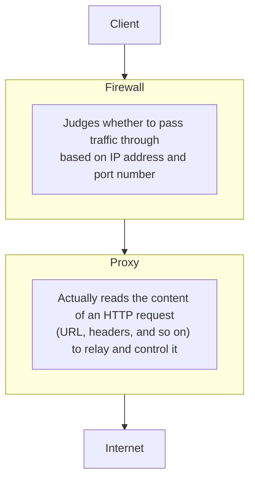

## Introduction

- **What You'll Learn From This Article**: This article answers the question "a proxy and a firewall both sound like mechanisms for controlling traffic, but what's actually different between them," by looking at **which layer of communication each controls, and at what granularity.** It also organizes **the difference between an explicit proxy and a transparent proxy**, what the frequently mentioned **cloud proxy (SWG, Secure Web Gateway)** actually refers to, and how it relates to zero trust, covered in [What Is ZTNA (Zero Trust Network Access) from a "Top 1%" Perspective](/en/articles/ztna-guide).
- **Intended Audience**: This article is aimed at engineers who work with configuring or operating a proxy or firewall but can't explain the difference in their roles, or what the term cloud proxy concretely refers to.
- **Estimated Reading Time**: About 18 minutes

This article is part of the [Top 1% Series' full article guide](/en/sitemap), and the first article in a new series on web proxy and caching fundamentals.

## Prerequisites

- **OSI reference model layers**: A way of thinking about communication as divided into several layers, from the physical layer up to the application layer. Firewalls and proxies mainly differ in which layer they control.

## Getting the Big Picture

### A Proxy and a Firewall Differ in Which Layer, and What Granularity, They Control

**A firewall is a mechanism that controls traffic — allowing or blocking it — mainly based on IP address and port number (and, in some cases, protocol type). A proxy is a mechanism that actually understands the content of the communication itself (particularly an application-layer protocol like HTTP), and relays, transforms, or controls it based on that content.**

## Fundamentals, Explained Thoroughly

### What a Firewall Controls

A firewall fundamentally controls traffic using a **relatively simple criterion — "allow/deny traffic to this IP address and port number."** The content of the communication itself (such as what URL an HTTP request targets) isn't something a basic firewall's functionality alone can judge.

### What a Proxy Controls

A proxy sits between the client and the internet, **interpreting the content of an application-layer protocol like HTTP itself.** This enables kinds of control a firewall can't judge, such as:

- **URL-level access control**: Allowing or denying access only to a specific URL path, even on the same web server (same IP address).
- **Content inspection**: Inspecting the content of requests and responses themselves, to detect and block the download of a file containing malware.
- **Caching**: Saving content once retrieved, speeding up subsequent access to the same content (this role is covered in detail in [Understanding the Relationship Between HTTPS Adoption and Proxy Caching from a "Top 1%" Perspective](/en/articles/http-caching-cdn-guide)).

### The Difference Between an Explicit Proxy and a Transparent Proxy

There are two approaches to a proxy, differing in **whether the client explicitly knows it's using that proxy.**

| Approach | Behavior |
|---|---|
| **Explicit Proxy** | The client's (browser's) configuration explicitly specifies the proxy server's address. The client communicates aware that "I'm going through a proxy." |
| **Transparent Proxy** | No configuration change is made on the client side at all — network equipment (such as a router) automatically redirects traffic to the proxy. The client is unaware the proxy exists. |

A transparent proxy has the operational advantage of not requiring an individual configuration change on many client devices, but if you want to inspect the content of HTTPS traffic, separate technical work is needed — such as distributing certificates for SSL inspection, covered below.

### What Is a Cloud Proxy (SWG: Secure Web Gateway)?

A **cloud proxy** refers to providing the functionality traditionally deployed as an on-premises proxy server as **a cloud-hosted service** instead. The term frequently used in this context is **SWG (Secure Web Gateway)**, which typically provides an integrated set of functionality beyond simple relaying — malware inspection, URL filtering, and data loss prevention (DLP).

**The background behind cloud proxies becoming important is the growing number of opportunities for employees to access the internet directly from outside the office (home, while traveling).** A traditional on-premises proxy was designed on the premise that traffic routes through the corporate network, but a cloud proxy **routes an employee's device through the cloud-hosted proxy first, no matter where they are**, letting a consistent security policy apply regardless of location.

## The View From the Top 1% Perspective

### If a proxy can inspect traffic content, why is a firewall still necessary?

It's a natural question to ask: "if a proxy can inspect traffic content in much more detail, is a firewall — which only judges by IP address and port — even necessary anymore?" In practice, though, there are at least four reasons why **the two are complementary, not substitutes for each other.**

1. **A proxy only understands a limited set of protocols**: A proxy can generally only relay and inspect **the application-layer protocols it's actually built to handle**, like HTTP/HTTPS. Meanwhile, a real organization's network carries a huge volume of traffic a web proxy has no involvement with at all — DNS, email (SMTP), database connections, SSH, RDP, SMB file sharing, VPN traffic, and more. A firewall is a **protocol-agnostic, general-purpose control layer** that can decide to allow or block all of this traffic, regardless of protocol type.
2. **A proxy can only see traffic that's actually routed through it**: A proxy only does its job when **a client's traffic is actually configured or forced to go through it.** Server-to-server traffic inside the organization (east-west traffic), or any traffic that simply isn't subject to the proxy configuration, never crosses the proxy's line of sight. A firewall, by contrast, sits at **boundaries between network segments** — like the kind covered in [Understanding Japanese Local Government Network Segregation and Security Clouds](/en/articles/local-gov-network-guide) — and covers traffic paths a proxy never touches.
3. **A division of labor by processing cost**: A firewall's IP-address/port-based decision only looks at packet headers — a lightweight operation that can process huge volumes of traffic at low latency. Application-layer inspection by a proxy is, by comparison, a relatively expensive operation. **Trying to route all traffic indiscriminately through a proxy wouldn't be realistically performant, so it makes sense to have the firewall do a coarse first pass, then let the proxy do deep inspection only where it's actually needed.**
4. **What it means as Defense in Depth**: As covered in [Understanding Practical Security Measures for Building and Operating Servers](/en/articles/practical-server-security-measures-guide), relying on a single countermeasure leaves you exposed the moment that countermeasure is bypassed or defeated. Even if the proxy is misconfigured, or some traffic finds a way around it, **having a separate layer of control — the firewall — still in place limits how far the damage can spread.**

**In other words, a firewall is "a lightweight, general-purpose first gate for all traffic," while a proxy is "a heavyweight, specialized deep inspection for a specific protocol"** — they operate at entirely different layers with entirely different roles, and neither can substitute for the other.

### The Relationship Between Cloud Proxies and Zero Trust

As covered in [What Is ZTNA (Zero Trust Network Access) from a "Top 1%" Perspective](/en/articles/ztna-guide), zero trust is a design philosophy of "not using being inside the network itself as a basis for trust." **A cloud proxy (SWG) can be positioned as one element that realizes this zero trust idea on the "outbound" side of traffic to the internet.** While ZTNA mainly handles "access to internal applications (a more inbound-oriented idea)," SWG handles "protecting an employee when accessing resources on the internet (a more outbound-oriented idea)." The broader concept integrating both is **SASE (Secure Access Service Edge)**, touched on in [Understanding SD-WAN and Edge Router Selection from a "Top 1%" Perspective](/en/articles/sdwan-edge-router-guide).

### The Technical Wall of SSL Inspection

Since most communication today is HTTPS (encrypted), a proxy wanting to inspect the content of communication needs a technology called **SSL inspection (decrypting the traffic once, inspecting it, then re-encrypting it).** This is a mechanism where the proxy sits between the client and server, establishing a separate TLS session with each — and realizing it requires configuring the client side to trust the certificate the proxy uses (installing that certificate). The technical details of this mechanism can be understood as an application of certificate chain verification, covered in [Understanding PKI and Digital Certificates from a "Top 1%" Perspective](/en/articles/pki-guide).

## Common Misconceptions and Pitfalls

- **Misconception 1: "Deploying either a proxy or a firewall alone is sufficient"**
  Because the two control different layers and granularities, most practical environments combine both, having each handle the area it's suited for.
- **Misconception 2: "A transparent proxy can automatically inspect the content of HTTPS traffic without any client-side configuration at all"**
  Inspecting HTTPS content requires additional setup, such as distributing certificates for SSL inspection, regardless of whether the proxy is transparent or explicit.
- **Misconception 3: "A cloud proxy is just a proxy server relocated to the cloud"**
  A cloud proxy (SWG) typically refers to a broader set of functionality — beyond simple relaying, it commonly integrates malware inspection, URL filtering, DLP, and more.

## The Troubleshooting Perspective

For proxy/firewall-related issues, the basic approach is to **isolate which layer the traffic is being blocked at.**

1. **Only a specific website is inaccessible**: Check whether it's being caught by the proxy's URL filtering rules, rather than the firewall's IP address/port-level control.
2. **A certificate error occurs when accessing an HTTPS site**: Check whether the certificate for the proxy performing SSL inspection is correctly trusted on the client side.
3. **Security policy isn't applied only for access from outside the office (such as from home)**: Check whether traffic is routing through the cloud proxy, and check the client-side configuration (proxy settings, or whether an agent is installed).

### Preventive Measures and Permanent Fixes

- Clearly design the scope of control each of the firewall and proxy should handle, avoiding overlap or gaps in responsibility.
- If performing SSL inspection, establish an organized mechanism for distributing and renewing certificates.
- In an environment with a lot of access from outside the office, consider adopting a cloud proxy to apply a consistent policy regardless of location.

## Summary

- A firewall controls whether traffic passes through, based on IP address and port number; a proxy understands the content of an application-layer protocol like HTTP itself, to relay and control it.
- A proxy only supports a limited set of protocols and only sees traffic actually routed through it, so it complements — rather than substitutes for — a firewall, which covers every protocol and path. The division of processing cost and defense in depth are both reasons both layers are needed.
- There are two approaches to a proxy: an explicit proxy, configured on the client, and a transparent proxy, automatically redirected by network equipment.
- A cloud proxy (SWG) provides proxy functionality traditionally hosted on-premises as a cloud-hosted service, letting a consistent security policy apply regardless of location.
- A cloud proxy (SWG) is an element realizing the zero trust idea on the outbound side of traffic, and the broader concept integrating it with ZTNA is SASE.

**What to Keep in Mind From Today**
1. When you encounter the terms proxy and firewall, keep in mind the difference in the layer and granularity of communication each controls.
2. When you need to inspect HTTPS content, design with the additional work of distributing certificates for SSL inspection in mind.

## References

- [What Is a Proxy Firewall? | Fortinet](https://www.fortinet.com/resources/cyberglossary/proxy-firewall)
- [What Is a Secure Web Gateway (SWG)? | Gartner](https://www.gartner.com/en/information-technology/glossary/secure-web-gateway-swg)
- [Hypertext Transfer Protocol (HTTP/1.1): Caching | RFC 7234](https://datatracker.ietf.org/doc/html/rfc7234)
