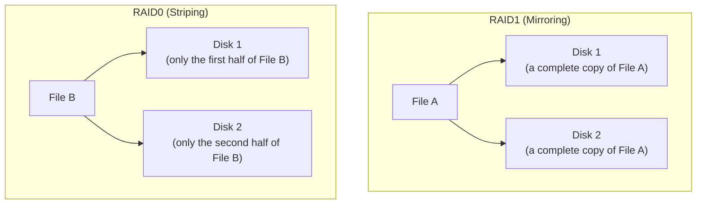

## Introduction

- **What You'll Learn From This Article**: Systematically understand **RAID0 (striping)**, a mechanism holding **an entirely opposite design philosophy** from the redundancy-via-mirroring covered in [the mdadm RAID1 hands-on](/en/articles/mdadm-raid-handson-guide). You'll correct the assumption that "it must be safe in some way, since it's RAID," and learn the counterintuitive mechanism where **adding more disks actually raises the array's overall failure probability.**
- **Intended Audience**: Readers who understand how RAID1 and RAID5 achieve redundancy, but can't explain concretely what "RAID0 has zero redundancy at all" actually means, or why.
- **Estimated Reading Time**: About 16 minutes

This article is part of the [Top 1% Series Complete Article Guide](/en/sitemap), and article 4.1 in the [Storage Fundamentals Series](/en/sitemap#series-list).

## Prerequisite Knowledge

- [The Relationship Between RAID and Windows Disk Management](/en/articles/disk-raid-fundamentals-guide): The premise that RAID combines multiple physical disks into one logical disk.
- [The mdadm RAID1 Hands-On](/en/articles/mdadm-raid-handson-guide): The basics of redundancy via mirroring are a prerequisite.

## Getting the Big Picture

RAID1 was a mechanism for redundancy, protecting data with the remaining disk if one fails, by **duplicating the same data across multiple disks.** **RAID0 holds an entirely opposite idea.** It exists purely to **raise throughput by splitting (striping) a single file across multiple disks and reading/writing them in parallel** — redundancy is never considered at all.

## Deep Dive Into the Fundamentals

### In RAID0, Losing One Disk Means Losing All the Data

**In RAID0, a single file's own content is split and written across multiple disks.** In other words, **no single disk ever holds a file's complete content at all, to begin with.** Because of this, **even if just one disk among those making up the array fails, every single file on that array gets lost, unrecoverably.** This is an entirely opposite behavior from [RAID1, where a failed disk still left the remaining disk holding a complete copy](/en/articles/mdadm-raid-handson-guide).

Why Does Losing Just One Disk Lose What Was Stored on the Others Too?

**The filesystem splits a file's content into units called stripes, writing them alternately — disk 1, disk 2, disk 1, disk 2, and so on.** So if disk 2 fails, disk 1 ends up holding only a scattered, moth-eaten fragment of the file's beginning, middle, and end. Data in that moth-eaten state generally can't be recovered in any practically meaningful sense at all. This is the concrete identity behind "one disk failing means losing the entire array's data."

### The Counterintuitive Mechanism Where More Disks Raises the Array's Overall Failure Probability

**The intuition "it's RAID, so adding more disks should make it safer" doesn't apply to RAID0 at all.** In RAID0, **the entire array loses its data the moment even one disk among those making it up fails.** Say each individual disk has, independently, a 5% failure probability — **the more disks you add, the probability that "at least one of them fails" actually keeps rising.** The math works out such that a 2-disk RAID0 array is less likely to fail overall than a 4-disk one. **You need to concretely hold onto the idea that the very choice "add more disks to raise performance" simultaneously carries the cost "raise the array's overall failure probability."**

## What a Pro Sees Here (Top 1% Understanding)

### Always Pair RAID0 With the Premise "It's Fine if This Data Gets Lost"

RAID0 gets used in real-world practice only in scenarios with the premise: **"performance is the top priority, and losing this data wouldn't be business-critical."** Typical examples include a video-editing scratch area (with the actual source material stored elsewhere) or storage for regenerable cache data. **Where [thin provisioning](/en/articles/thin-provisioning-guide) and [RAID5's parity](/en/articles/raid5-parity-guide) were designs balancing capacity efficiency against redundancy, RAID0 is the opposite extreme: completely abandoning redundancy, pursuing only speed and capacity efficiency.** **If you need both speed and redundancy, you need to consider a more complex setup, like RAID10 (1+0), combining RAID0 with RAID1.** A top-1% engineer, when choosing a RAID method, always designs with a clear awareness of which of the three axes — "speed," "capacity efficiency," and "redundancy" — gets prioritized, and which gets explicitly given up.

## Common Misconceptions and Pitfalls

- **Misconception 1: "It has the name RAID, so it must be redundant in some way."**
  RAID0 has zero redundancy at all. The name RAID simply refers to the general technology of "treating multiple physical disks as one logical disk" — whether an individual RAID method actually has redundancy differs entirely, method by method.
- **Misconception 2: "If one disk fails in RAID0, at least the files stored on the remaining disks can still be read."**
  Since a single file's content is split across multiple disks in RAID0, losing one disk means losing every single file on the array.
- **Misconception 3: "Adding more disks makes RAID0 safer too."**
  In RAID0, the more disks you add, the array's overall failure probability actually rises.

## Troubleshooting Perspective

1. **One disk failed in a RAID0 array**: Treat the data stored on the remaining disks as practically unrecoverable too, and immediately consider recovery from a backup.
2. **You're unsure whether to adopt RAID0**: Before adopting it, always confirm whether losing the data stored on that volume would actually be business-critical.
3. **You need both speed and redundancy**: Rather than RAID0 alone, consider a setup combining multiple RAID methods, like RAID10.

## Summary

- RAID0 raises throughput by splitting a single file across multiple disks in stripes, but holds zero redundancy at all.
- In RAID0, losing just one disk among those making up the array loses every single file on that array, practically unrecoverably.
- RAID0 has the counterintuitive property that adding more disks actually raises the array's overall failure probability.
- RAID0 should always be used paired with the premise "performance is the top priority, and losing this data wouldn't be business-critical."

**Takeaways to Apply Today**
1. When choosing a RAID method, always make explicit which of "speed," "capacity efficiency," and "redundancy" gets prioritized, and which gets given up.
2. Never judge safety purely by the name "RAID" — whether redundancy exists differs entirely, method by method.

## References

- [RAID (redundant array of independent disks) | Wikipedia](https://en.wikipedia.org/wiki/RAID)
- [Understanding RAID5 and RAID6 Parity Calculation From a Top 1% Perspective](/en/articles/raid5-parity-guide)
