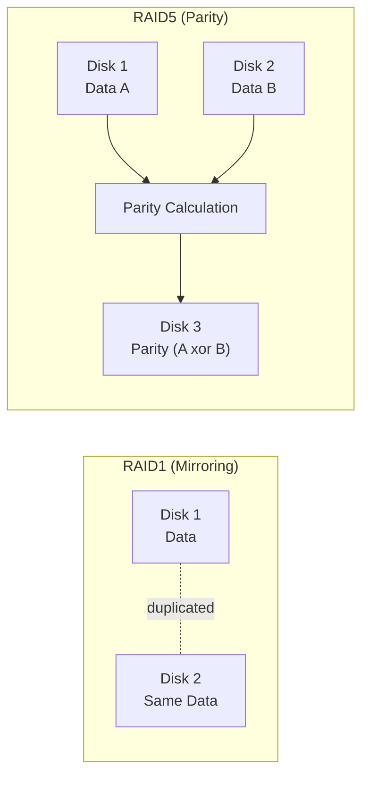

## Introduction

- **What You'll Learn From This Article**: Building on the approach that fully duplicates a disk, covered in [the mdadm RAID1 hands-on](/en/articles/mdadm-raid-handson-guide), a systematic understanding of **exactly what calculation (XOR) derives the "parity" mechanism RAID5 and RAID6 rely on, and how a disk failure actually gets recovered from it.**
- **Intended Audience**: Readers who know RAID5 "tolerates losing one disk," but can't explain exactly what calculation underlies "parity," the core of that mechanism.
- **Estimated Reading Time**: About 18 minutes

This article is part of the [Top 1% Series Complete Article Guide](/en/sitemap), and the sixth article in the [Storage Fundamentals Series](/en/sitemap#series-list).

## Prerequisite Knowledge

- **RAID1's Mirroring**: The approach, covered in [the mdadm RAID1 hands-on](/en/articles/mdadm-raid-handson-guide), of keeping two disks' content perfectly identical. This article covers RAID5 and RAID6, which take an entirely different approach.

## Getting the Big Picture

RAID1 secures redundancy by **fully duplicating** the same data onto two disks. This is a reliable approach, but it carries an efficiency downside: **half of your disk capacity is spent purely on duplication.** RAID5 solves this efficiency problem with an entirely different idea: **instead of "duplicating the data itself once more," it "computes a smaller value from the original data, just enough to enable recovery (parity), and stores that on a separate disk."**

## Deep Dive Into the Fundamentals

### What Parity Actually Is: a Recoverable "Summary Value" via XOR

RAID5's parity gets computed using **XOR** (exclusive OR), an operation. XOR compares two values and simply returns "1 if they differ, 0 if they match."

| Data A | Data B | Parity (A xor B) |
|---|---|---|
| 1 | 0 | 1 |
| 1 | 1 | 0 |
| 0 | 0 | 0 |

**XOR's single most important property is that "knowing the parity plus either one of the two data values lets you back-calculate the other."** In the table above, `A xor B = parity` always implies that `B xor parity = A` and `A xor parity = B` hold true just as consistently. **This is the mathematical truth behind RAID5's "can recover from a single disk failure" property.** Even if the disk holding Data A fails, computing `B xor parity`, from the remaining Data B and the parity, accurately recovers the lost Data A.

With Three or More Disks, How Is Parity Actually Distributed?

A real-world RAID5 setup typically uses three or more disks. **Parity never stays fixed on one dedicated disk — it rotates, striped across different disks, for each stripe (the unit data gets split into).** The reason is that if parity were fixed on one dedicated disk, every write would concentrate the parity recalculation and write load entirely onto that one disk, turning it into a bottleneck. Distributing parity spreads the write load evenly across every disk in the array.

### RAID6: Two Kinds of Parity, Tolerating Two Simultaneous Failures

RAID5 tolerates a single disk failure, but **as covered in [the mdadm rebuild hands-on](/en/articles/mdadm-raid-handson-guide), a second failure during the rebuild loses your data.** RAID6 addresses this exact risk — a double failure during rebuild — by **holding two kinds of parity, computed by different methods, instead of a single simple XOR parity.** Having two independent parities lets you recover both lost disks' worth of data, from the remaining data plus both parities, even if two disks fail simultaneously.

| RAID Type | Simultaneous Failures Tolerated | Disk Capacity Efficiency |
|---|---|---|
| **RAID1** | 1 (the mirror) | Low (half the capacity goes to duplication) |
| **RAID5** | 1 | High (only one disk's worth goes to parity) |
| **RAID6** | 2 | Slightly lower than RAID5 (two disks' worth go to parity) |

## What a Pro Sees Here (Top 1% Understanding)

### Parity Is a Different Idea From Compression: "Store Less Information, Recompute It Later"

RAID5's parity looks, on the surface, like it's compressing data, but **its real essence is an efficiency idea: instead of holding a complete copy of the original data, hold only a smaller piece of information (differential information) — just enough and no more to recover the original.** This shares the same underlying idea as [webhook deduplication via an idempotency key](/en/articles/webhook-signature-handson-guide), which judged "has this already been processed" by holding only the minimum necessary information, rather than the sent data itself. **"Holding a complete copy" and "holding the minimum information needed to reconstruct the original" are often equivalent in outcome — but the latter is far more efficient.** This view recurs again and again across distributed systems in general, not just RAID.

## Common Misconceptions and Pitfalls

- **Misconception 1: "Parity is just a direct copy of part of the original data."**
  Parity is never the original data itself — it's a recovery value derived through a calculation like XOR. Looking at parity alone tells you nothing about the original data's content.
- **Misconception 2: "RAID5 is always safer than RAID1."**
  RAID5 is more capacity-efficient, but it can't tolerate a second failure during a rebuild. On this point, RAID6, tolerating two simultaneous failures, or even RAID1 depending on the configuration, can be the safer choice.
- **Misconception 3: "RAID6 is just RAID5's parity, simply stored twice."**
  RAID6 doesn't hold two copies of the same parity — it holds two independent parities, each computed by a different method.

## Troubleshooting Perspective

1. **One disk failed in a RAID5 array, entering a degraded state**: As covered in [the mdadm hands-on](/en/articles/mdadm-raid-handson-guide), add a new disk and respond quickly — a second failure during the parity-based rebuild would be catastrophic.
2. **A second disk failed during a RAID6 rebuild**: RAID6 tolerates up to two simultaneous failures, so data isn't lost until a third disk fails. The rebuild can still proceed with the remaining disks.
3. **Parity computation is taking time and hurting write performance**: Parity-based RAID recalculates parity on every write, which inherently tends toward lower write performance than mirroring.

## Summary

- RAID5 trades duplicating the data itself for storing a "parity" value, computed via XOR, on a separate disk, improving capacity efficiency while still tolerating a single failure.
- XOR's own properties mean that knowing the parity plus the remaining data lets you accurately recover lost data.
- RAID6 holds two independent kinds of parity, tolerating two simultaneous failures, at a slightly lower capacity efficiency than RAID5.
- Parity is based on an efficiency idea — holding the minimum information needed for recovery, rather than a complete duplicate.

**Takeaways to Apply Today**
1. When choosing a RAID type, deliberately weigh "how many simultaneous failures do I want to tolerate" against "disk capacity efficiency."
2. Whenever you see the word "parity," remember it's a recovery value derived through calculation, never a copy of the original data.

## References

- [RAID (redundant array of independent disks) | Linux Software RAID HOWTO](https://tldp.org/HOWTO/Software-RAID-HOWTO.html)
- [Mathematics of RAID 6 | Wikipedia](https://en.wikipedia.org/wiki/Mathematics_of_RAID_6)
