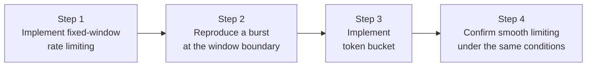

## Introduction

- **What You'll Learn From This Article**: Deepen your understanding of rate limiting, touched on briefly in [Understanding RESTful APIs](/en/articles/restful-api-guide), by **actually implementing two different algorithms (fixed window and token bucket) yourself and comparing their behavior.**
- **Intended Audience**: Readers who understand rate limiting as "a mechanism that caps the number of requests within a given time window," but don't know different implementations behave differently, and have never seen a concrete defect firsthand.
- **Estimated Reading Time**: About 22 minutes, including the hands-on exercise

This article is part of the [Top 1% Series Complete Article Guide](/en/sitemap), and the eighth article in the [Web/API Series](/en/sitemap#series-list). You can follow along with one of the Ubuntu Server environments set up in the [Hands-On Prep Manual](/en/articles/handson-prep-guide).

## Prerequisite Knowledge

- **Rate Limiting's Basic Role**: The mechanism, touched on briefly in [Understanding RESTful APIs](/en/articles/restful-api-guide), of capping excessive requests from the same client. This article covers the concrete algorithmic differences behind implementing that cap.

## Getting the Big Picture

This hands-on covers four steps.



## Hands-On Steps

### Step 1: Implement Fixed-Window Rate Limiting

**The fixed-window approach** is the simplest: it carves time into fixed intervals (windows), like "up to 10 requests per minute," and counts requests within each window. Save this as `fixed_window.py`.

```python
import time
from http.server import BaseHTTPRequestHandler, HTTPServer

LIMIT = 10
WINDOW_SECONDS = 2
window_start = [time.time()]
request_count = [0]

class Handler(BaseHTTPRequestHandler):
    def do_GET(self):
        now = time.time()
        if now - window_start[0] >= WINDOW_SECONDS:
            window_start[0] = now
            request_count[0] = 0

        request_count[0] += 1
        if request_count[0] > LIMIT:
            self.send_response(429)
            self.end_headers()
            self.wfile.write(b'{"error": "rate limit exceeded"}')
            return

        self.send_response(200)
        self.end_headers()
        self.wfile.write(f'{{"count": {request_count[0]}}}'.encode())

HTTPServer(('0.0.0.0', 8000), Handler).serve_forever()
```

```bash
python3 fixed_window.py &
```

### Step 2: Reproduce a Burst at the Window Boundary

With the window length set to 2 seconds, **send 10 requests right at the end of the first window, then send another 10 right after the window flips over.**

```bash
for i in {1..10}; do curl -s -o /dev/null -w "%{http_code}\n" http://localhost:8000/; done
sleep 1.9
for i in {1..10}; do curl -s -o /dev/null -w "%{http_code}\n" http://localhost:8000/; done
```

**Output:**

```
200
200
200
200
200
200
200
200
200
200
200
200
200
200
200
200
200
200
200
200
```

**Despite being configured for "up to 10 per minute," all 20 requests, sent within under two seconds, went through.** This is the **boundary burst** defect that plagues the fixed-window approach. Sending 10 requests right at the end of one window, and another 10 right after the window flips over, abuses the exact moment the counter resets — letting roughly double the real intended limit through in a short span of time.

### Step 3: Implement the Token Bucket Algorithm

**The token bucket** algorithm works on a different idea: a "bucket" gets refilled with tokens at a steady rate, and every request consumes one token. If no tokens remain, the request gets rejected. Save this as `token_bucket.py`.

```python
import time
from http.server import BaseHTTPRequestHandler, HTTPServer

CAPACITY = 10
REFILL_RATE = 5  # refills 5 tokens per second
tokens = [CAPACITY]
last_refill = [time.time()]

class Handler(BaseHTTPRequestHandler):
    def do_GET(self):
        now = time.time()
        elapsed = now - last_refill[0]
        tokens[0] = min(CAPACITY, tokens[0] + elapsed * REFILL_RATE)
        last_refill[0] = now

        if tokens[0] < 1:
            self.send_response(429)
            self.end_headers()
            self.wfile.write(b'{"error": "rate limit exceeded"}')
            return

        tokens[0] -= 1
        self.send_response(200)
        self.end_headers()
        self.wfile.write(f'{{"tokens_left": {tokens[0]:.1f}}}'.encode())

HTTPServer(('0.0.0.0', 8001), Handler).serve_forever()
```

```bash
python3 token_bucket.py &
```

**The core of this implementation is the calculation `elapsed * REFILL_RATE`.** Rather than resetting a counter at a fixed interval, like the fixed-window approach, **every single request calculates "how much time has passed since last time," and continuously refills tokens matched to that elapsed time.**

### Step 4: Confirm Smooth Limiting Under the Same Conditions

Try the exact same conditions as Step 2 (10 requests, a short wait, then 10 more) against the token-bucket endpoint.

```bash
for i in {1..10}; do curl -s -o /dev/null -w "%{http_code}\n" http://localhost:8001/; done
sleep 1.9
for i in {1..10}; do curl -s -o /dev/null -w "%{http_code}\n" http://localhost:8001/; done
```

**Output (relevant part, the second batch of 10):**

```
200
200
200
200
200
200
200
200
200
429
```

**The first batch of 10 requests consumed all 10 tokens originally in the bucket. During the roughly 1.9-second wait, about 9.5 tokens got refilled at the rate of 5 per second (capped at 10), but of the second batch of 10 requests, the very last one got rejected with a 429.** Where the fixed-window approach let all 20 requests through, the token bucket approach **only ever lets you consume however many tokens actually got refilled, enforcing a smoother limit much closer to the real intended one.**

## What a Pro Sees Here (Top 1% Understanding)

### Choosing an Algorithm Is Itself a Statement of "What You Actually Need to Enforce Precisely"

The fixed-window approach is extremely simple to implement, but carries the boundary-burst defect you just confirmed. **This isn't simply a case of the fixed-window approach being "worse," though.** When implementation simplicity itself has real value (an internal tool where a rough cap is good enough, say), the fixed-window approach can be entirely sufficient. On the other hand, for something like a public API, where a malicious client might deliberately exploit this boundary burst, a stricter algorithm like the token bucket becomes necessary. **The core point of this hands-on is a habit: not just checking "did I implement rate limiting," but verifying, under concrete boundary conditions, "does this algorithm genuinely enforce the limit I actually intended."**

## Common Misconceptions and Pitfalls

- **Misconception 1: "Implementing rate limiting gets you the same effect no matter which algorithm you pick."**
  As confirmed in this hands-on, the fixed-window approach has a defect that lets through roughly double the real intended limit, right at the window boundary.
- **Misconception 2: "The token bucket approach can only ever process requests one at a time, at a perfectly even interval."**
  The token bucket approach tolerates processing a burst of requests all at once, as long as tokens remain in the bucket. That's not a defect — it's a deliberately allowed burst. The fixed-window approach's problem is that its burst happens "beyond the intended limit."
- **Misconception 3: "The stricter you set the rate limit, the safer it always is."**
  Too strict a limit ends up blocking legitimate users' normal usage too. Choosing the algorithm and tuning the limit's value need to be weighed as a trade-off between security and usability.

## Troubleshooting Perspective

1. **Rate limiting is configured, but more requests than expected are getting through**: If you're using the fixed-window approach, check whether the boundary burst confirmed in this hands-on is occurring.
2. **The token bucket approach returns a 429 error sooner than expected**: Check that `CAPACITY` (the bucket's maximum size) and `REFILL_RATE` (the refill speed) match your actually intended limit.
3. **Rate limiting doesn't work correctly once distributed across multiple servers**: If each server manages its own counter or token count independently, the effective limit loosens by a factor equal to the number of servers. Real-world practice requires centralizing the counter or token count in a shared store, like Redis.

## Summary

- The fixed-window approach is simple to implement, but carries a boundary-burst defect — crossing a window boundary lets through roughly double the real intended limit.
- The token bucket approach continuously refills tokens, enforcing a smoother limit much closer to the intended one.
- Which algorithm to choose is a judgment call weighing implementation simplicity against enforcement strictness.
- Distributing rate limiting across multiple servers requires centralizing the counter or token count in a shared store.

**Takeaways to Apply Today**
1. When implementing rate limiting, build the habit of actually testing against the concrete condition of a window boundary.
2. Keep in mind that "having rate limiting" and "the intended limit being accurately enforced" are two separate things.

## References

- [Rate Limiting Strategies and Techniques | Google Cloud](https://cloud.google.com/architecture/rate-limiting-strategies-techniques)
