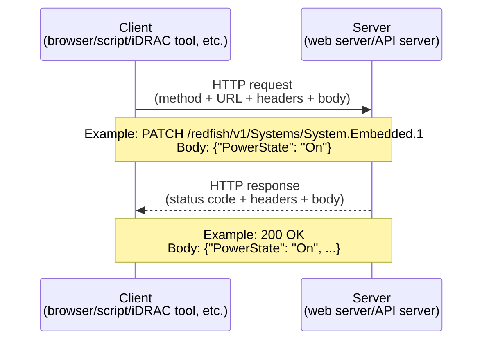
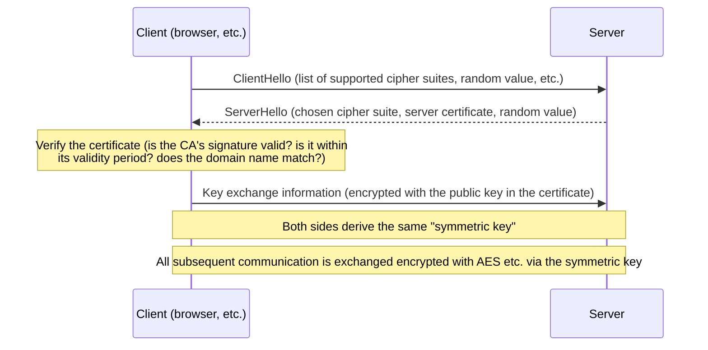
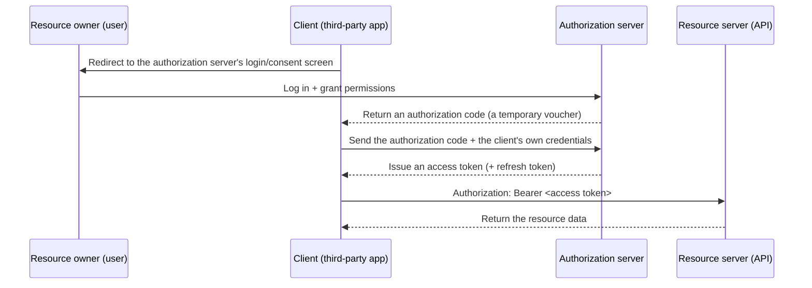

## Introduction

- **What You'll Learn From This Article**: A systematic understanding of terms you see constantly but struggle to explain on the spot — "RESTful API," "HTTPS," "JSON" — covering everything from the fundamentals of HTTP, through REST design philosophy, to practical, real-world design topics like authentication, idempotency, and versioning.
- **Intended Audience**: Working infrastructure engineers who understand APIs at the level of "you GET/POST against a URL," but can't explain why that design exists the way it does, or what it actually takes for something to be called RESTful.
- **Estimated Reading Time**: About 20 minutes

This article is part of the [Top 1% Series' full article guide](/en/sitemap).

Behind the understanding that "an API is something you GET/POST against a URL" lies a "same communication method" that this article digs into in detail — that is, what HTTP, REST, and JSON are actually doing.

## Prerequisites

- **API (Application Programming Interface)**: A window and set of conventions through which pieces of software exchange functionality and information with each other.
- **Client/server model**: A communication model in which roles are split between the party making requests (the client) and the party responding to them (the server). The relationship between a browser and a web server is the classic example.
- **Protocol**: A set of rules governing the procedures and format to be followed during communication. HTTP is one type of protocol.

<details>
<summary>What's the Difference Between a "Protocol" and an "API"?</summary>

These are two distinct concepts operating at different layers — **an API is built on top of a protocol**.

- A **protocol** refers to the "rules of procedure and format" that two devices or pieces of software must follow when communicating — the grammar and etiquette of communication itself, so to speak: "requests and responses are exchanged in this order, in this format." HTTP and TCP are representative examples of protocols — general-purpose rules that don't depend on any particular piece of software and can be used in common by any combination of client and server.
- An **API** refers to the individual window and set of conventions that a piece of software (a server) exposes externally, announcing "here's what operations you can perform against me." "GET this URL and you can retrieve user information," "POST to this URL and you can create a user" — these are conventions specific to that particular service, and differ from the API of any other service.

To use an analogy: a protocol is like "the etiquette of how to make and conduct a phone call" (identify yourself when the other party answers, state your business, and so on), while an API is like "the specific extensions you can reach when you call a particular company" (press this digit for order intake, that digit for returns). The etiquette (the protocol) is shared across companies, but the contents of the extensions (the API) differ from company to company. The accurate way to understand a RESTful API is as the combination of "individual services each exposing their own API (window), following the etiquette laid down by the protocol called HTTP."

</details>

## Getting the Big Picture

### In a Nutshell

A RESTful API is "**a unified set of conversational rules between pieces of software that uses the exact same mechanism as viewing a website (HTTP), specifies the target of an operation via a URL, and expresses what to do using verbs like GET/POST/PUT/DELETE**." Just as opening `https://example.com/users/123` in a browser displays the page for user 123, an API expresses an operation by combining a URL like `https://api.example.com/users/123` with a verb such as "GET" (view) or "DELETE" (remove).

### The Big Picture of Requests and Responses



An API sounds complicated, but in reality it's just "a program performing, on a human's behalf, the exact same form of communication a browser has with a server."

## Fundamentals, Thoroughly Explained

### What Is HTTP?

HTTP (HyperText Transfer Protocol) is a protocol that defines a single round-trip exchange: the client sends a request, and the server returns a response.

**Components of a request**

| Element | Content | Example |
|---|---|---|
| Method | A verb expressing what you want to do | `GET`, `POST`, `PUT`, `PATCH`, `DELETE` |
| URL (path) | The location of the target resource | `/redfish/v1/Systems/System.Embedded.1` |
| Headers | Metadata (authentication info, data format, etc.) | `Authorization: Basic xxxx`, `Content-Type: application/json` |
| Body | The actual data being sent (usually empty for GET) | `{"PowerState": "On"}` |

**Components of a response**

| Element | Content |
|---|---|
| Status code | A 3-digit number expressing the result of the request (discussed below) |
| Headers | Metadata (data format, cache directives, etc.) |
| Body | The returned data itself (typically in JSON format) |

**Reading Status Codes**

| Range | Meaning | Representative examples |
|---|---|---|
| 2xx | Success | `200 OK` (success), `201 Created` (creation succeeded), `204 No Content` (success but no body) |
| 3xx | Redirection | `301 Moved Permanently` (a permanent new location exists) |
| 4xx | Client-side issue | `400 Bad Request` (the request itself is malformed), `401 Unauthorized` (no or invalid credentials), `403 Forbidden` (authenticated, but insufficient permission), `404 Not Found` (the resource doesn't exist), `429 Too Many Requests` (too many requests) |
| 5xx | Server-side issue | `500 Internal Server Error` (an internal server error), `503 Service Unavailable` (temporarily unable to process) |

`404 Not Found` is classified as a "client-side issue" because it stems from the request itself — from the specification of a path or ID that doesn't exist. That said, it's worth noting that this doesn't necessarily mean "the client is at fault, in the sense of a bug or improper operation." For example, consider the case where "a resource that existed just moments ago was deleted by someone else, and access happened right after" — this too returns a `404`, but the cause here isn't really a client implementation mistake — it's that "the information the client was holding (the premise that the resource still existed) became stale due to a state change on the server side." Either way, the accurate way to think about it is that "the server-side processing completed normally; the requested resource simply doesn't exist in the server's current state" — and from a response-classification standpoint, this consistently falls under 4xx (client-caused).

**HTTPS (HTTP + TLS)**

HTTPS is HTTP communication with its content encrypted using a mechanism called TLS (Transport Layer Security). It's a mechanism to prevent eavesdropping and tampering even if an attacker gets in the middle of the communication path, and it's an essential prerequisite for API communication that exchanges authentication credentials or configuration-changing commands.

<details>
<summary>What TLS Actually Does (Inside the Handshake)</summary>

What TLS does for HTTP communication breaks down broadly into two things: "confirming there's no impersonation (authentication)" and "establishing a path that can't be eavesdropped on or tampered with (encryption)." The preparation for achieving both of these happens in the brief initial moment when communication begins — the **TLS handshake**.



1. **Authentication via the server certificate**: The server presents the client with a "certificate" issued by a Certificate Authority (CA) — the server's public key together with a digital signature by which the CA guarantees that domain name. The client verifies whether this certificate was signed by a trusted CA built into the browser/OS, whether it's within its validity period, and whether the domain name it's connecting to matches what's recorded in the certificate. If this verification fails, a warning such as "this connection is not private" is displayed.
2. **Key exchange**: Once certificate verification passes, the client and server use "public-key cryptography" (a scheme that exploits the one-directional property that only the server holding the corresponding private key can decrypt something encrypted with the public key in the certificate) to securely share a **symmetric key** (a key for symmetric-key cryptography, known only to both parties) that will be used to encrypt all subsequent communication. Public-key cryptography is secure but computationally expensive, so it isn't used for the actual exchange of data — it's used solely to securely hand over the symmetric key at the start.
3. **Encrypted communication via the symmetric key**: All subsequent actual HTTP requests and responses are exchanged encrypted using symmetric-key cryptography (such as AES, which processes faster than public-key cryptography) with this symmetric key.

Because of this sequence, even if an attacker inserts themselves into the communication path along the way, certificate verification lets any "impersonation" be detected, and even if the communication data is intercepted, it appears as nothing but ciphertext to a third party who doesn't know the symmetric key — providing double protection.

</details>

### What Is REST? (Design Philosophy)

REST stands for "REpresentational State Transfer," a Web API design style proposed in Roy Fielding's 2000 doctoral dissertation. Its representative principles are as follows.

| Principle | Content |
|---|---|
| Client/server separation | Separates the concerns of UI and data management, so each can evolve independently of the other |
| Stateless | The server doesn't retain client state between requests; each request must contain, entirely on its own, all the information needed to process it |
| Cacheability | Makes explicit whether a response can be cached, enabling performance optimization |
| Uniform interface | Uniquely identifies resources via URLs, and unifies operations around a limited set of verbs such as GET/POST/PUT/DELETE |
| Layered system | The client doesn't need to know whether it's communicating directly with the server, or whether a load balancer or proxy sits in between |

"Stateless" is particularly important. It means the server side doesn't retain, as a session, per-client state such as "whether this client is currently logged in." As a result, authentication information (such as a token) must be included with every single request (discussed below).

**Uniform Interface (the Meaning of HTTP Methods and Idempotency)**

| Method | Meaning | Idempotency (does sending the same request repeatedly produce the same result?) |
|---|---|---|
| GET | Retrieve a resource | Idempotent (state doesn't change no matter how many times it's executed) |
| POST | Create a new resource | Non-idempotent (a new resource can be created each time it's executed) |
| PUT | Replace a resource in its entirety | Idempotent (sending the same content repeatedly produces the same result) |
| PATCH | Update only part of a resource | Implementation-dependent (it's desirable to design it to be idempotent) |
| DELETE | Delete a resource | Idempotent (deleting an already-deleted resource again doesn't change its state) |

<details>
<summary>"REST" vs. "RESTful," and APIs That Don't Actually Strictly Satisfy REST's Principles</summary>

"REST" refers to the design principles themselves described above, while "RESTful" is the adjective describing an API designed in line with those principles. In practice, however, much of what's called a "RESTful API" out in the world doesn't strictly satisfy the principles defined in Fielding's original dissertation (particularly HATEOAS: the principle that a response should include links to the operations that can be taken next). Many implementations only practice the part that says "represent resources via URLs, use HTTP methods appropriately, and exchange data as JSON" — making them "REST-like" APIs in a looser sense. This is rarely treated as a problem in practice, and it's closer to the truth to say that the term "RESTful API" is used with the loose understanding of roughly "an API that's JSON over HTTP, with a resource-oriented URL design."

</details>

### What Is JSON?

JSON (JavaScript Object Notation) is a notation for representing data as text in the form `{"key": "value"}`. It can express hierarchical data by combining collections of key-value pairs (objects) with ordered sequences of values (arrays).

```json
{
  "PowerState": "On",
  "Model": "PowerEdge R760",
  "Processors": {
    "Count": 2,
    "Model": "Intel Xeon"
  }
}
```

JSON is widely used because, compared to XML (once the dominant format for SOAP APIs), its structure is simpler and more readable to humans, it has strong affinity with JavaScript, and parsing support for it is standard across most programming languages.

### Authentication in a Stateless World: The Token Mechanism

Because of REST's "stateless" principle, the server doesn't remember "this client logged in a moment ago." As a result, authentication information must be **included with every single request**. The representative schemes are as follows.

| Scheme | Overview |
|---|---|
| Basic authentication | Base64-encodes the username and password and includes them in the `Authorization` header. Simple, but effectively equivalent to plaintext, so it must always be paired with HTTPS |
| API key | Includes a fixed key string issued by the server in a header or query parameter |
| Bearer token (session token) | Issues a temporary token during a login-like process, then includes it in the `Authorization: Bearer <token>` header on subsequent requests. iDRAC's Redfish API also adopts this scheme, creating a session on the first call and issuing an X-Auth-Token |
| OAuth 2.0 | A mechanism for delegating only a limited set of permissions to a third-party service without ever handing over the user's own password. Widely used in large-scale API ecosystems |

<details>
<summary>A Closer Look at How OAuth 2.0 Works (the Authorization Code Flow)</summary>

OAuth 2.0 involves four parties.

| Party | Role |
|---|---|
| Resource owner | The actual owner of the data (e.g., you, currently logged into a service) |
| Client | The third-party app that wants to access the data on the resource owner's behalf |
| Authorization server | The server that presents the login/consent screen and issues tokens |
| Resource server | The API server that actually holds the data (sometimes the same implementation as the authorization server) |

The most representative flow, the "authorization code flow," proceeds as follows.



The key point is that **the client (the third-party app) never receives the user's password**. The user logs in and grants consent directly on the authorization server's own screen, and all the client ever receives is a voucher (the authorization code) meaning "you may act on behalf of this user, within this scope of permission" and the **access token** subsequently issued in exchange for it. Access tokens are typically given a short validity period, and it's a common design to pair them with a long-lived **refresh token**, so they can be renewed without requiring the user to log in again after they expire.

</details>

### Redfish as a Real-World Example of a "RESTful API"

With everything covered so far in mind, here's how iDRAC's Redfish API can be interpreted.

- `GET https://<iDRAC IP>/redfish/v1/Systems/System.Embedded.1` → "retrieves" the resource representing the server's state (power state, model name, etc.)
- `PATCH https://<iDRAC IP>/redfish/v1/Systems/System.Embedded.1` (with `{"PowerState": "On"}` in the body) → "updates" part of the resource representing the server's state
- The response comes back in JSON format, as key-value pairs like `PowerState` and `Model`
- Authentication is done via a session-based token (the `X-Auth-Token` header) or initial Basic authentication

You should now have a concrete picture of how "remotely operating a server" — something that seems like a special case at first glance — is actually built on the exact same HTTP and JSON framework as viewing a website.

## The View from the Top 1% (What Experts See)

### Why Idempotency Matters in Practice

Networks can't always be trusted — you can send a request and then hit a timeout without ever receiving a response. Idempotency is the criterion for judging "is it okay to send the same request again?" in that situation. `PUT` and `DELETE` are idempotent, so they can be safely retried, but `POST` is non-idempotent, so a naive retry risks creating the same resource twice. When designing large-scale API integrations or retry logic, this distinction around idempotency is the foundation for avoiding accidents.

Consider a concrete scenario: you send a transfer request for 10,000 yen via `POST /transfers` to a money-transfer API, but it times out before a response comes back. At this point, the client can't tell which of the following actually happened.

1. The network dropped before the request reached the server (the transfer was never executed)
2. The server completed the transfer, but the network dropped before the completion response reached the client (the transfer was already executed)

If you naively send the `POST` again just because "it might not have arrived," in scenario 2 the transfer ends up executed twice. This is the concrete meaning of "since POST is non-idempotent, a naive retry is dangerous." In practice, the client issues a unique **idempotency key** for each request (an Idempotency-Key header containing something like a UUID), and the server is implemented so that when it receives a request with a key it has already processed, it returns the same result as before rather than processing it as new — giving even an inherently non-idempotent operation like `POST` a way to be retried safely. This is a design standard adopted by many payment APIs (such as Stripe).

### How Pagination Works

APIs that handle large numbers of resources (such as a Redfish API returning a list of hundreds of servers) commonly return results split across pages, using query parameters like `?page=2&limit=50`, rather than returning everything at once — this is called "pagination." The key point here is that **"the rest of the data" isn't something the server proactively sends — it's only returned once the client explicitly requests the next page**. Because REST is a stateless mechanism, the server doesn't remember "this client hasn't been sent page 2 yet." The server is simply computing and returning "the data corresponding to page 2" each time, in response to the client's specific request for `?page=2`.

There are two representative implementation approaches for pagination.

| Approach | Mechanism | Strengths/Weaknesses |
|---|---|---|
| Offset-based | Specifies "how many items in, how many items" — e.g. `?page=2&limit=50` | Simple to implement, and lets you jump directly to a specific page. However, if data is added or removed while retrieving results, the page boundaries can shift, causing the same item to appear twice or be skipped entirely |
| Cursor-based | Specifies "how far you got last time" — e.g. `?after=<ID of the last item from before>` | Resistant to shifting even when data is added or removed, and behaves stably against large amounts of data. However, operations like "jump directly to page N" are difficult |

In large-scale environments like a Redfish API listing hundreds of servers, where the underlying data can change constantly (servers being added and decommissioned on a routine basis), the cursor-based approach tends to be preferred in practice.

### Rate Limiting

To protect the API server, it's common to put a "rate limit" on the number of requests within a given time window, returning `429 Too Many Requests` when that limit is exceeded. When writing large-scale automation (such as a script that hits the Redfish API in bulk across hundreds of iDRACs), implementing retry/wait logic (backoff) that respects rate limits is essential.

### API Versioning

Since API specifications can change in the future, it's common to include a version number in the URL (such as `/v1/`), or to specify the version via the `Accept` header. This is a critically important design consideration in practice, preventing older clients from suddenly breaking when a new API specification is introduced.

## Common Misconceptions and Pitfalls

- **Misconception 1: "As long as it exchanges JSON, it's a RESTful API"**
  Even when data is exchanged in JSON format, plenty of APIs exist where the URL design isn't resource-oriented (e.g., embedding a verb into the URL, as in `/doSomething?action=delete&id=1`) — effectively RPC (remote procedure calls) wearing an HTTP costume. Adopting JSON and adopting REST's design principles are two separate matters.
- **Misconception 2: "As long as it's HTTPS, the API is secure"**
  HTTPS guarantees encryption of the communication path (preventing eavesdropping and tampering), but authentication (who's accessing it) and authorization (what that person is allowed to do) are separate layers entirely. Even over HTTPS, anyone can impersonate a user if authentication credentials are leaked.
- **Misconception 3: "Stateless means the server doesn't save any data at all"**
  What "stateless" refers to is that the server doesn't retain the context of its dialogue with the client (session state) — it does not mean the server doesn't persist the state of resources in a database (the actual data the server manages). It's important not to conflate the two.

## Troubleshooting Perspective

### Isolating the Cause When an API Doesn't Respond as Expected

1. First check the status code. `4xx` primarily points to the request side; `5xx` primarily points to the server side.
2. If `401`/`403` is returned, suspect an expired authentication token, insufficient permissions, or a typo in a header name.
3. If `429` is returned, it's a rate limit being exceeded. Wait a while and retry, or reduce your request frequency.
4. If a timeout occurs, it could be a network path issue, or heavy processing on the server side (such as retrieving a large volume of data). Use `curl` with the `-v` (verbose) option to check exactly where things are stalling, from TCP connection establishment through to receiving the response.

### Prevention and Long-Term Countermeasures

- Implement rate limiting, timeouts, and retries (idempotent methods only) appropriately on the client side.
- Confirm your compatibility policy in advance for when the API version changes (such as how long backward compatibility is maintained).
- Don't let the mechanism for authentication token expiration and renewal (refresh) fall through the cracks in your implementation.

## Summary

- A RESTful API is a design style built on the same HTTP mechanism as viewing a website, where resources are specified via URLs and operations are expressed via HTTP methods.
- Due to the stateless principle, authentication information must be included with every single request, which is why token-based authentication schemes are widely used.
- Much of what's called a "RESTful API" out in the world is a loose implementation that doesn't strictly satisfy the principles of Fielding's original dissertation, and this itself isn't treated as a problem in practice.
- Idempotency, pagination, rate limiting, and versioning are the practical knowledge needed to use APIs safely at scale.

**Starting Today**
1. Make a habit of consciously checking the HTTP method and status code of the APIs you work with day to day.
2. When writing an automation script, be conscious of whether each API call is idempotent, and implement retry logic accordingly, safely.

## References

- [Hypertext Transfer Protocol (HTTP/1.1): Semantics and Content | RFC 9110](https://datatracker.ietf.org/doc/html/rfc9110)
- [Architectural Styles and the Design of Network-based Software Architectures (Roy Fielding's dissertation, Chapter 5: REST)](https://ics.uci.edu/~fielding/pubs/dissertation/rest_arch_style.htm)
- [HTTP | MDN Web Docs](https://developer.mozilla.org/en-US/docs/Web/HTTP)
- [JSON | MDN Web Docs](https://developer.mozilla.org/en-US/docs/Glossary/JSON)
- [Redfish Specification | DMTF](https://www.dmtf.org/standards/redfish)
- [iDRAC: Redfish API with Dell Integrated Remote Access Controller | Dell US](https://www.dell.com/support/kbdoc/en-us/000178045/redfish-api-with-dell-integrated-remote-access-controller)
