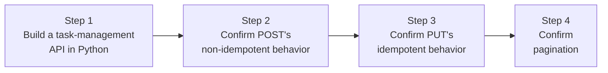

## Introduction

- **What You'll Learn From This Article**: Verify what you learned in [Understanding RESTful APIs From a Top 1% Perspective](/en/articles/restful-api-guide) — the meaning of HTTP methods, idempotency, pagination — by **actually building a RESTful API yourself and sending requests with curl to observe its behavior.** You'll confirm the difference between POST's and PUT's idempotency not as a lecture explanation, but as the actual content of a response.
- **Intended Audience**: Readers who understand RESTful APIs in theory, but have never built an API server themselves, and want to get hands-on with concepts like idempotency and pagination.
- **Estimated Reading Time**: About 20 minutes, including the hands-on exercise

This article is part of the [Top 1% Series Complete Article Guide](/en/sitemap), and the third article in the [Web/API Series](/en/sitemap#series-list). You can follow along with one of the Ubuntu Server environments set up in the [Hands-On Prep Manual](/en/articles/handson-prep-guide).

## Prerequisite Knowledge

- **The Meaning of HTTP Methods and Idempotency**: The meaning of GET/POST/PUT/PATCH/DELETE, and the difference in idempotency between them, covered in ["Unified Interface (The Meaning of HTTP Methods and Idempotency)"](/en/articles/restful-api-guide) in the same article.
- **Pagination Fundamentals**: The mechanism for returning a large set of resources in pieces rather than all at once, covered in "How Pagination Works" in the same article.

## Getting the Big Picture

This hands-on covers four steps.



## Hands-On Steps

### Step 1: Build a Task-Management API Using Only Python's Standard Library

On your Ubuntu Server, save the following Python script as `api_server.py`. It's an in-memory task-list API server using nothing but the standard library's `http.server` — no external dependencies at all.

```python
import json
from http.server import BaseHTTPRequestHandler, HTTPServer
from urllib.parse import urlparse, parse_qs

tasks = {}
next_id = [1]

class Handler(BaseHTTPRequestHandler):
    def _send(self, code, body):
        self.send_response(code)
        self.send_header('Content-Type', 'application/json')
        self.end_headers()
        self.wfile.write(json.dumps(body).encode())

    def do_GET(self):
        parsed = urlparse(self.path)
        if parsed.path == '/tasks':
            qs = parse_qs(parsed.query)
            page = int(qs.get('page', ['1'])[0])
            limit = int(qs.get('limit', ['2'])[0])
            all_items = list(tasks.values())
            start = (page - 1) * limit
            page_items = all_items[start:start + limit]
            self._send(200, {
                'page': page, 'limit': limit,
                'total': len(all_items), 'items': page_items,
            })
        else:
            self._send(404, {'error': 'not found'})

    def do_POST(self):
        length = int(self.headers.get('Content-Length', 0))
        body = json.loads(self.rfile.read(length))
        task_id = next_id[0]
        next_id[0] += 1
        tasks[task_id] = {'id': task_id, 'title': body.get('title')}
        self._send(201, tasks[task_id])

    def do_PUT(self):
        parsed = urlparse(self.path)
        task_id = int(parsed.path.split('/')[-1])
        length = int(self.headers.get('Content-Length', 0))
        body = json.loads(self.rfile.read(length))
        tasks[task_id] = {'id': task_id, 'title': body.get('title')}
        self._send(200, tasks[task_id])

    def do_DELETE(self):
        parsed = urlparse(self.path)
        task_id = int(parsed.path.split('/')[-1])
        tasks.pop(task_id, None)
        self._send(204, {})

HTTPServer(('0.0.0.0', 8000), Handler).serve_forever()
```

```bash
python3 api_server.py &
```

### Step 2: Confirm POST's Non-Idempotent Behavior

**Send the exact same POST request body, twice in a row.**

```bash
curl -s -X POST http://localhost:8000/tasks -d '{"title": "Buy milk"}'
curl -s -X POST http://localhost:8000/tasks -d '{"title": "Buy milk"}'
```

**Output:**

```json
{"id": 1, "title": "Buy milk"}
{"id": 2, "title": "Buy milk"}
```

**Even though you sent the exact same request content twice, you got two separate resources, with `id` 1 and 2.** This is the moment POST's "non-idempotent" property, [covered in the lecture](/en/articles/restful-api-guide), shows up concretely as an actual response. You can now feel firsthand the real-world risk that accidentally sending a POST twice creates two unintentionally duplicated tasks.

### Step 3: Confirm PUT's Idempotent Behavior

**Send the exact same PUT request body, twice in a row, to the same ID.**

```bash
curl -s -X PUT http://localhost:8000/tasks/1 -d '{"title": "Buy milk and eggs"}'
curl -s -X PUT http://localhost:8000/tasks/1 -d '{"title": "Buy milk and eggs"}'
```

**Output:**

```json
{"id": 1, "title": "Buy milk and eggs"}
{"id": 1, "title": "Buy milk and eggs"}
```

**This time, both responses came back for the same `id: 1`, with the same content.** No matter how many times you repeat it, the server's state converges to the exact same single state: "task id 1 has this title." This is PUT's "idempotent" property. Even in an unstable network, where a client ends up retransmitting a request, PUT gives you the peace of mind that a retransmission never triggers an unintended side effect — like the duplicate creation you confirmed in Step 2.

### Step 4: Confirm Pagination

With a few tasks added, use the `limit` parameter to fetch the list in pieces.

```bash
curl -s -X POST http://localhost:8000/tasks -d '{"title": "Task A"}' > /dev/null
curl -s -X POST http://localhost:8000/tasks -d '{"title": "Task B"}' > /dev/null
curl -s "http://localhost:8000/tasks?page=1&limit=2"
curl -s "http://localhost:8000/tasks?page=2&limit=2"
```

**Output (relevant parts):**

```json
{"page": 1, "limit": 2, "total": 4, "items": [...2 items...]}
{"page": 2, "limit": 2, "total": 4, "items": [...the remaining 2 items...]}
```

**You confirmed `total`, a field stating the full count, and `items`, the data for just that one page, come back as separate fields.** The client side can look at that `total` value to decide how many more pages it needs to fetch. You got to feel firsthand exactly what response structure [the pagination mechanism covered in the lecture](/en/articles/restful-api-guide) actually gets implemented as.

## What a Pro Sees Here (Top 1% Understanding)

### Idempotency Is a Designer's Intent — Never Something an HTTP Method Automatically Guarantees

The PUT behavior you implemented in this hands-on **is idempotent only because the server side deliberately implements "overwrite with the same content, for the same ID."** If the server instead internally added a new task every time it received a PUT request, it would end up non-idempotent even while using PUT. **Idempotency is never something the HTTP spec forces onto the server — it's an implicit agreement between the designer and the caller: "use this method, and this is the behavior you'll get."** As an API developer implementing a PUT, the habit of actually confirming "is this genuinely idempotent," by sending the exact same request twice, the way you just did in this hands-on, is essential.

## Common Misconceptions and Pitfalls

- **Misconception 1: "Idempotency is something the HTTP method itself automatically guarantees."**
  Idempotency is realized through the server's own implementation. Using a method named PUT doesn't prevent it from ending up non-idempotent, depending on how it's implemented.
- **Misconception 2: "Sending POST twice gets detected and prevented by the server side automatically."**
  As confirmed in this hands-on, POST is deliberately designed to be non-idempotent, so a duplicate-prevention mechanism (like an idempotency key) needs to be implemented separately, in the application itself.
- **Misconception 3: "A pagination response's total field is a mandatory part of the spec."**
  Whether to include a total field is entirely the API designer's call. For an enormous resource count, computing the total itself can be costly, so some real-world designs deliberately leave it out.

## Troubleshooting Perspective

1. **You sent one POST, but two tasks got created**: Check whether a client-side retry mechanism (an automatic resend on timeout, and similar) is unintentionally sending the POST twice.
2. **A task you updated with PUT still comes back with its old content**: Check whether the `id` you specified is correct, and whether the server's implementation genuinely overwrites.
3. **Pagination returns duplicate or missing data**: Check whether another client added or removed data while you were fetching pages. Pagination over data that changes in real time needs this issue addressed at the design stage too.

## Summary

- POST is deliberately non-idempotent — sending the same request twice creates two separate resources.
- PUT is deliberately idempotent — sending the same request any number of times always converges the server's state to the exact same single result.
- Idempotency isn't something the HTTP spec automatically guarantees — it's a design agreement realized through the server's own implementation.
- A pagination response typically returns the full-count information and that page's data as two separate fields.

**Takeaways to Apply Today**
1. When implementing an API, build the habit of confirming "is this method genuinely idempotent" by actually sending the same request twice.
2. When implementing retry logic on the client side, distinguish between methods safe to resend (idempotent ones) and methods that should never be resent (like POST).

## References

- [RFC 7231 - HTTP/1.1 Semantics and Content, Section 4.2 (Common Method Properties)](https://datatracker.ietf.org/doc/html/rfc7231#section-4.2)
