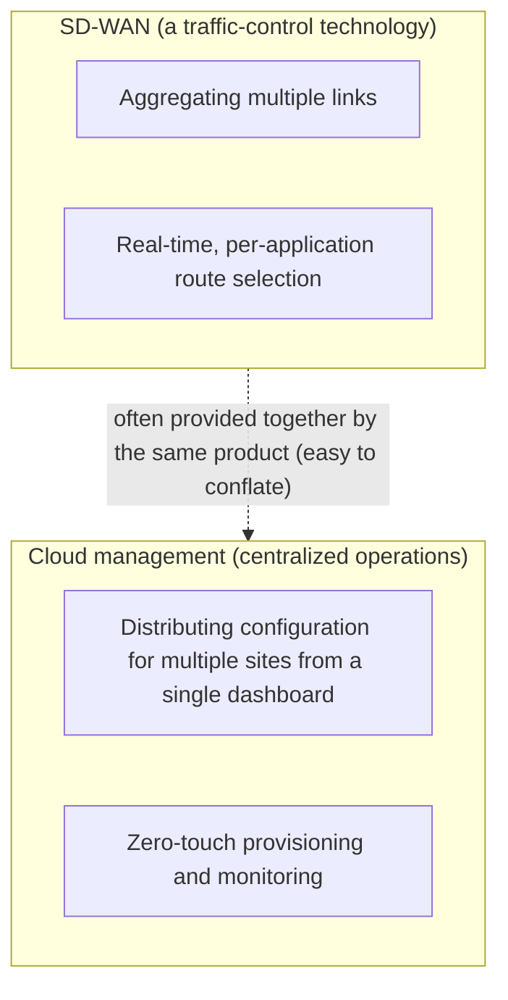
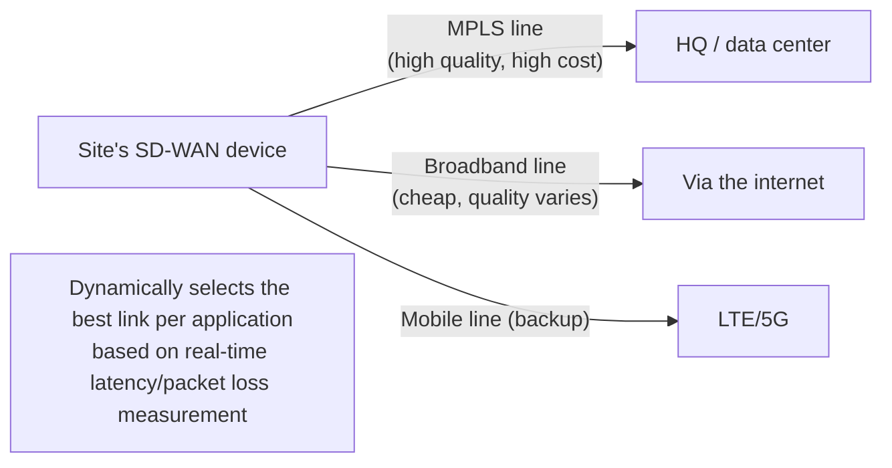

## Introduction

- **What You'll Learn From This Article**: When you run into a scenario like "configuring SD-WAN for link redundancy," this article answers **what SD-WAN actually refers to as a technology**, and the question "is SD-WAN the same thing as the ability to centrally manage multi-site configuration in the cloud, like with Meraki?" It **clearly separates two concepts that are often conflated — SD-WAN (a traffic-control technology) and cloud management (a centralized operations mechanism)** — and then systematically explains the differences between, and pros and cons of, **FortiGate, Yamaha, and Meraki**, three products frequently compared and evaluated in real site-to-site VPN work.
- **Intended Audience**: This article is aimed at engineers who've been involved in selecting site network equipment or configuring SD-WAN, but who can't concretely explain what the term SD-WAN actually refers to, including its relationship to cloud management.
- **Estimated Reading Time**: About 19 minutes

This article is part of the [Top 1% Series' full article guide](/en/sitemap), and the third article in the [Site-to-Site VPN Series](/en/sitemap#series-list). It assumes you understand general site-to-site VPN mechanics from [Understanding Site-to-Site VPN from a "Top 1%" Perspective](/en/articles/site-to-site-vpn-guide).

## Prerequisites

- **WAN (Wide Area Network)**: The wide-area network connecting multiple sites, or connecting a site to a data center or the cloud. Dedicated lines (such as MPLS) and broadband internet connections are the typical means of realizing one.
- **Site-to-site VPN**: A technology for protecting communication between sites by encrypting it, typically with IPsec. See [Understanding Site-to-Site VPN from a "Top 1%" Perspective](/en/articles/site-to-site-vpn-guide) for details.

## Getting the Big Picture

### In a Nutshell

**SD-WAN (Software-Defined WAN) is "a traffic-control technology that dynamically uses whichever of a site's multiple links (MPLS, broadband, mobile, and so on) fits, based on the communication quality (latency, packet loss, and so on) needed for each application."** By contrast, the ability to "centrally manage the configuration of multiple sites' devices from the cloud" is **not SD-WAN itself — it's a separate concept: an operational mechanism (a cloud management console).** **Because many products (Meraki, FortiGate, and so on) offer both at the same time, the two are easy to conflate** — that's the real source of confusion in practice.

## Fundamentals, Explained Thoroughly

### The Problem SD-WAN Solves

Traditionally, **MPLS (Multi-Protocol Label Switching)** — a bandwidth-guaranteed dedicated-line service provided by telecom carriers — has been widely used to guarantee communication quality between sites. While MPLS is highly reliable, it comes with challenges: **the cost of procuring a circuit is high, and the lead time to turn up a new one is long.**

SD-WAN addresses this by having site equipment **simultaneously aggregate a dedicated line like MPLS alongside cheaper, faster-to-provision broadband internet connections and mobile links (LTE/5G, and so on), and dynamically choose, per type of traffic (application), whichever link currently offers the best quality to send it over.**

Concretely, an SD-WAN device continuously measures each link's **latency, jitter (variation in latency), and packet loss rate** in real time, and dynamically switches which link it sends packets over based on pre-configured policy (such as "prioritize the lowest-latency link for voice calls" or "ordinary web access can use the cheaper link"). This is the main economic rationale behind adopting SD-WAN: **lower cost than depending on a single dedicated line, combined with more flexible reliability than simple backup failover.**

### SD-WAN and Cloud Management Are Separate Concepts

Let's return to the question, **"isn't SD-WAN just Meraki-style cloud-based centralized configuration?"** The answer is: **"the traffic-control technology itself, called SD-WAN, and the operational mechanism called cloud management, are separate concepts."**

- **SD-WAN (traffic control)**: A capability where an individual site's device dynamically uses whichever of that site's multiple links fits, based on real-time quality. This capability itself can be achieved (to a limited extent) purely through a device's local configuration, even without a cloud-based management console.
- **Cloud management (centralized operations)**: A mechanism for pushing configuration, monitoring, and updating firmware for devices deployed across many sites, all from a single cloud-based dashboard. In practice, SD-WAN policy settings themselves are often distributed from this cloud management console too, but **the mechanism of cloud management itself is an independent axis, separate from whether SD-WAN functionality is present.**

**The reason these two get conflated in practice is that many modern networking products (Meraki, FortiGate, and so on) offer both SD-WAN functionality and cloud management functionality at the same time**, making them look like a single feature. To summarize:

| Concept | What it controls |
|---|---|
| SD-WAN | Route selection for traffic itself — **which of the site device's multiple links to use** |
| Cloud management | **How and from where the configuration, monitoring, and operation itself** of many site devices are handled |
| SASE (Secure Access Service Edge) | A broader concept that integrates SD-WAN with cloud-based security functionality (secure web gateways, [ZTNA](/en/articles/ztna-guide), and so on). An umbrella term that's come up frequently in recent years |

## The View From the Top 1% Perspective

### The Differences Between FortiGate, Yamaha, and Meraki, and How to Choose

Here's a breakdown of three representative products/product lines frequently compared and evaluated in real site-to-site VPN / SD-WAN work.

| Product | Characteristics | Strengths | Weaknesses / caveats |
|---|---|---|---|
| **FortiGate (Fortinet)** | Integrates UTM (Unified Threat Management — a firewall combined with IPS, antivirus, web filtering, and so on) with SD-WAN functionality, all in a single device's OS (FortiOS). Cloud management via FortiManager/FortiCloud | Comprehensive security functionality makes it easy to combine site security hardening with WAN optimization in a single device. Advanced customization via CLI is also possible | Given its rich functionality, initial setup and operation require a certain level of specialized knowledge. The licensing structure can get complicated |
| **Yamaha (RTX series)** | A router/VPN device line with a strong track record domestically, especially for small and mid-sized businesses. Strong at simple VPN and routing functionality | High cost-performance, with rich domestic support and technical information (community, manuals). High transparency of individual settings, favored by engineers skilled with CLI control | Many models don't offer as advanced large-scale SD-WAN functionality (dynamic, quality-based selection across multiple links) as FortiGate/Meraki, so large-scale or complex requirements may need to be combined with another product |
| **Meraki (Cisco)** | A product line designed around a cloud management dashboard as its core premise. Integrates SD-WAN functionality too (Auto VPN, automatic aggregation of multiple links) | Ease of multi-site deployment and centralized management is its biggest strength. Zero-touch provisioning makes deployment easy even without specialized knowledge at the site | Requires a subscription-based license, incurring ongoing cost. Fine-grained CLI customization is more limited compared to FortiGate or Yamaha |

**Which one is "recommended" depends on your requirements.**

- **If you have many sites and prioritize deployment speed, or operation that doesn't depend on specialized knowledge at each site**: Meraki's ease of cloud management is a major advantage.
- **If you want to combine security functionality (UTM) with WAN optimization in a single device, while also weighing cost**: FortiGate is a strong candidate.
- **If cost is the top priority, requirements stay a simple site-to-site VPN/routing use case, or domestic support matters most**: Yamaha is a strong candidate.

### Why "Dependence on Cloud Management" Can Be a Risk

Depending on a cloud management console comes with a trade-off worth considering in practice. **Whether a site's device can keep operating on its existing local configuration, or has its management functionality restricted, if communication with the cloud management console (over the internet) is cut off for some reason** varies by product and design. Many products are designed so that traffic processing based on the existing configuration continues even if the connection to the cloud drops, but **new configuration changes and real-time monitoring aren't possible until the cloud connection is restored.** This is easier to understand through the same lens as out-of-band management, covered in [What Is iDRAC? Understanding Its Mechanism from a "Top 1%" Perspective](/en/articles/idrac-guide) — the perspective of "does the management path itself risk going down together with the path it's supposed to manage?"

## Common Misconceptions and Pitfalls

- **Misconception 1: "SD-WAN is a term that refers to Meraki-style cloud management itself"**
  SD-WAN is a traffic-control technology, and cloud management is a mechanism for centralizing operations — they're separate concepts. They're just easy to conflate because many products offer both.
- **Misconception 2: "Adopting SD-WAN makes a dedicated line like MPLS completely unnecessary"**
  SD-WAN is a technology for combining and using multiple links together, and depending on requirements, it's often realistic to keep using a high-quality dedicated line like MPLS for some critical traffic while combining it with other links via SD-WAN.
- **Misconception 3: "One of FortiGate, Yamaha, or Meraki is absolutely superior"**
  Each has a different design philosophy and different strengths, and the optimal choice varies with the number of sites, budget, required security level, and operational structure.

## The Troubleshooting Perspective

For SD-WAN/edge router trouble, the basic approach is to **isolate whether it's a traffic-control (SD-WAN) issue or an operations (cloud connectivity) issue.**

1. **A specific application's communication quality is poor**: Check the SD-WAN policy settings (which link is prioritized under which condition), and whether each link's actual latency and packet loss measurements are being correctly obtained.
2. **Link failover is slower than expected, or happens too frequently**: Review the quality-judgment thresholds (the allowed range for latency and packet loss rate). If the thresholds are too strict, even a temporary quality fluctuation can trigger frequent switching.
3. **A site's device becomes invisible from the cloud management console**: Check whether there's a problem with that site's internet connection itself. In many cases, traffic processing based on the existing configuration continues, but monitoring and configuration changes become unavailable.

### Preventive Measures and Permanent Fixes

- Periodically review SD-WAN policy settings in light of actual link quality trends (such as congestion at certain times of day).
- When choosing a product that depends on cloud management, also consider the redundancy of the connection path to the management console itself (connecting over multiple links).
- When selecting equipment, comprehensively evaluate the number of sites, budget, security requirements, and operational structure, rather than deciding based on a single metric like price or brand alone.

## Summary

- SD-WAN is a traffic-control technology that dynamically uses multiple links based on the communication quality needed for each application.
- Cloud management is an operational mechanism for centrally handling the configuration, monitoring, and operation of many site devices from a single dashboard — a separate concept from SD-WAN. They're just easy to conflate because many products offer both at once.
- FortiGate's strength is combining security functionality with SD-WAN; Yamaha's is cost-performance and a simple configuration; Meraki's is ease of cloud management — and the choice should match the requirements.
- In a configuration that depends on cloud management, the availability of the connection path to the management console itself needs to be considered through the same lens as out-of-band management.

**What to Keep in Mind From Today**
1. When you encounter the term "SD-WAN," consciously distinguish whether it's talking about the traffic-control technology or about cloud management.
2. When selecting an edge router, comprehensively evaluate the number of sites, budget, security requirements, and operational structure — not just a single product's name recognition.

## References

- [What Is SD-WAN? | Fortinet](https://www.fortinet.com/resources/cyberglossary/sd-wan)
- [FortiGate SD-WAN Overview | Fortinet Documentation](https://docs.fortinet.com/document/fortigate/latest/administration-guide/955826/sd-wan)
- [Meraki Auto VPN | Cisco Meraki Documentation](https://documentation.meraki.com/MX/Site-to-site_VPN/AutoVPN%3A_A_Technical_Overview)
- [What is SASE (Secure Access Service Edge)? | Gartner](https://www.gartner.com/en/information-technology/glossary/secure-access-service-edge-sase)
