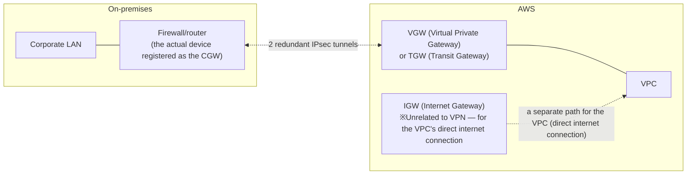

## Introduction

- **What You'll Learn From This Article**: This article organizes what each of the gateways that show up when connecting an on-premises firewall to AWS via IPsec VPN — **IGW (Internet Gateway), VGW (Virtual Private Gateway), CGW (Customer Gateway), and TGW (Transit Gateway)** — actually represents within AWS's network architecture. It also answers the question "does site-to-site VPN traffic really travel over the ordinary public internet, or through a dedicated AWS network," and systematically covers the realistic architecture, how to think about pricing, and the flow of the build process.
- **Intended Audience**: This article is aimed at engineers who've considered or built a VPN connection between an on-premises firewall and AWS, but who can't concretely explain the role of each gateway or the real shape of the communication path.
- **Estimated Reading Time**: About 20 minutes

This article is part of the [Top 1% Series' full article guide](/en/sitemap), and the second article in the [Site-to-Site VPN Series](/en/sitemap#series-list). General site-to-site VPN mechanics — IPsec tunnel mode, traffic selectors — are covered in [Understanding Site-to-Site VPN from a "Top 1%" Perspective](/en/articles/site-to-site-vpn-guide); this article focuses specifically on AWS's gateway architecture.

## Prerequisites

- **VPC (Virtual Private Cloud)**: A logically isolated, private network space you create within an AWS account. It's easiest to understand by thinking of it as the equivalent of a single on-premises network segment.
- **IPsec tunnel mode**: The commonly used method in site-to-site VPN, where an entire original IP packet is encapsulated inside a new IP packet. See [Understanding Site-to-Site VPN from a "Top 1%" Perspective](/en/articles/site-to-site-vpn-guide) for details.

## Getting the Big Picture

### In a Nutshell

**A Site-to-Site VPN connection with AWS is a configuration where two redundant IPsec tunnels are established between "configuration information representing the on-premises device" (the CGW) and "the gateway on the AWS side that terminates the VPN connection" (a VGW or TGW).** The first thing to sort out here is that **the four terms IGW, VGW, CGW, and TGW each play an entirely different role.**

## Fundamentals, Explained Thoroughly

### The Difference in Role Between the Four Gateways

| Term | What it actually is | Role |
|---|---|---|
| **IGW (Internet Gateway)** | A gateway attached to a VPC for direct internet connectivity | The entry/exit point letting resources within a VPC communicate directly with the ordinary internet. **Unrelated to VPN** — a gateway serving an entirely different purpose |
| **VGW (Virtual Private Gateway)** | A gateway attached to a VPC that terminates VPN connections | The window on the AWS side that receives an IPsec VPN connection from on-premises |
| **CGW (Customer Gateway)** | **Not a physical device — a "piece of configuration information (a resource)" registered in AWS** | Configuration information registering the on-premises VPN device's (firewall or router's) **public IP address and BGP ASN (Autonomous System Number)** with AWS |
| **TGW (Transit Gateway)** | A hub gateway that consolidates multiple VPCs, VPN connections, and Direct Connect | While a VGW is tied to a single VPC in a one-to-one relationship, TGW is the consolidation point when you want to connect multiple VPCs or accounts together |

**CGW in particular is easy to misunderstand.** Because it's named a "gateway," it sounds like some new device or service gets provisioned in AWS — but **CGW's true identity is just configuration information (a resource); the actual physical device performing VPN termination is, on-premises, your own firewall or router.** It's easiest to think of CGW as a registration ledger — a record of "this is the IP address and ASN of the on-premises device you're connecting to" that the AWS side keeps.

### Does Site-to-Site VPN Traffic Really Travel Over the Internet?

**In a standard AWS Site-to-Site VPN, traffic between the on-premises device (the CGW) and AWS's VGW/TGW actually travels, as encrypted IPsec packets, over the ordinary public internet.** This is only natural, given that site-to-site VPN is, at its core, a technology for building a secure communication path over an untrusted network (the internet) through encryption.

**AWS also offers a separate option that uses a "dedicated network,"** however: **AWS Direct Connect**. Direct Connect is a service providing a **dedicated physical connection** (via an interconnection point called an AWS Direct Connect location) from an on-premises site to an AWS Region, bypassing the internet entirely. If the intuition "AWS must have a dedicated network too" is pointing at this separate service, Direct Connect, then **that intuition is correct.**

Combining Direct Connect and VPN

Direct Connect itself is a dedicated physical line, and traffic isn't encrypted on it by default (a design that's acceptable precisely because it's a segment confined within AWS's own network). **For higher security requirements, you can also build an IPsec VPN on top of a Direct Connect circuit — a configuration called "VPN over Direct Connect."** In this setup, traffic physically travels over the Direct Connect dedicated line while also being protected, logically, as an encrypted VPN tunnel — achieving a defense-in-depth of sorts. It's also common in practice to use Direct Connect as the primary path while keeping an internet-based Site-to-Site VPN as a backup, in case that circuit ever becomes unavailable — a high-availability design frequently adopted in real deployments.

**It's worth noting that traffic between AWS Regions and Availability Zones, or between AWS services within the same Region, travels over a dedicated global backbone network that AWS itself owns.** In other words, it's accurate to understand this as a **two-stage structure**: "the entry point from on-premises into AWS (between the CGW and VGW)" generally travels over the internet, while "the part after entering AWS, moving around inside AWS" travels over AWS's own dedicated network.

### VGW or TGW: Which Should You Use?

A VGW is a simple configuration, **tied to a single VPC in a one-to-one relationship.** If you only have one VPC, or just a few, a VGW is fully sufficient for your requirements.

If, on the other hand, **you're running multiple VPCs (or multiple AWS accounts) and want to connect each of them to on-premises**, preparing a separate VGW and VPN connection per VPC not only increases what you have to manage — it also means you need to separately design the communication path between VPCs. This is where **TGW (Transit Gateway)** comes in. TGW consolidates multiple VPCs, VPN connections, and Direct Connect into a single hub, achieving a **star-shaped (hub-and-spoke) network architecture.**

VPN CloudHub: a classic way to connect multiple on-premises sites through a single VGW

Before TGW existed, there was a more limited feature called **VPN CloudHub**. This is a configuration where **multiple CGWs (i.e., multiple on-premises sites) connect to a single VGW, and dynamic routing (BGP) is used to relay traffic between the on-premises sites through AWS as well.** This can be a viable option for a narrow requirement of just interconnecting multiple sites with each other, but for broader requirements — connecting multiple VPCs, integrating with Direct Connect — a TGW-based design is the mainstream choice today.

### The Typical Flow of the Build Process

The actual build process broadly proceeds as follows:

1. **Create the CGW (Customer Gateway)**: Register the on-premises device's (firewall/router's) public IP address, and — if using BGP — its ASN, with AWS.
2. **Create the VGW (or TGW) and attach it to the VPC**: Prepare the termination point on the AWS side.
3. **Create the Site-to-Site VPN connection**: Specify the CGW and VGW (or TGW), and choose the routing method (static routes, or dynamic routing via BGP). At this point, **two tunnels** (each with a different AWS-side endpoint) are automatically configured for redundancy.
4. **Download the configuration file and load it onto the on-premises device**: AWS can generate a configuration file templated for the specific vendor you specify (major devices such as Cisco, FortiGate, and Yamaha are supported). Load this onto the on-premises device as-is, or with some adjustment.
5. **Confirm route propagation**: For static routes, confirm they've been reflected in the VPC's route table; for BGP, confirm the neighbor relationship has been established and routes are being correctly exchanged.
6. **Confirm both tunnels are established, and test failover**: Don't stop at just one of the two tunnels being established — confirm both are healthy, and that deliberately dropping one correctly fails over to the other.

### How to Think About Pricing

AWS Site-to-Site VPN pricing is broadly a combination of **a charge for the VPN connection's active hours** and **a charge for the volume of data transferred out of AWS via the VPN** (if using a TGW-based configuration, charges for the TGW's own active hours and data processed are added on top). Since specific pricing rates can change, it's practically important to always check AWS's current pricing page before building. Compared to Direct Connect, Site-to-Site VPN's own operating cost is low, but it comes with the trade-off of no bandwidth guarantee (SLA) — latency and bandwidth can fluctuate depending on internet conditions.

## The View From the Top 1% Perspective

### Choosing Between Static Routes and BGP Dynamic Routing

There are two routing methods for a VPN connection: **static routes** (fixed routing of only the pre-specified destination ranges), and **BGP dynamic routing** (the on-premises side and AWS side exchange route information via BGP, automatically reflecting changes).

In an environment with a simple site/VPC configuration where destination ranges rarely change, the simplicity of static routes is an operational benefit. But for **a configuration involving multiple sites or multiple VPCs, or when you want fine-grained control over the priority between the two tunnels via route attributes**, BGP is more flexible. In particular, if you want to prefer one of the two tunnels (an active/standby configuration), BGP attributes like AS_PATH length or local preference let you explicitly control route priority.

### The Importance of Keeping Both Tunnels Active

AWS's Site-to-Site VPN connection is configured with two tunnels by default for redundancy, but in practice, **it's far from rare for an on-premises device's configuration to end up with only one tunnel actually established (the other left standby, or never established due to a misconfiguration).** In this state, if AWS performs maintenance and switches the endpoint of the currently established tunnel, the redundancy you assumed you had doesn't kick in, and a connection outage occurs. After building the connection, it's important to build the habit of always confirming in the AWS Management Console **that both tunnels' status is "UP."**

## Common Misconceptions and Pitfalls

- **Misconception 1: "CGW is a new physical device or service provisioned within AWS"**
  CGW's actual identity is configuration information (a resource); the actual device performing VPN termination is on-premises.
- **Misconception 2: "Establishing a site-to-site VPN connection gives you the same bandwidth guarantee and low latency as a dedicated line"**
  A standard Site-to-Site VPN travels over the ordinary internet, so there's no bandwidth guarantee (SLA). Consider Direct Connect if a bandwidth guarantee is required.
- **Misconception 3: "Creating a VPN connection means both tunnels are automatically used"**
  The tunnels themselves are configured as two on the AWS side, but whether the on-premises device is actually configured to establish and maintain both is a separate matter. Confirming this after the build is essential.

## The Troubleshooting Perspective

For issues with a site-to-site VPN connection to AWS, the basic approach is to **isolate whether the cause lies on the AWS side or the on-premises side.**

1. **A tunnel won't establish at all**: Check whether the on-premises device's IKE/IPsec parameters (encryption algorithm, DH group, and so on) match what AWS requires. Whether the public IP address registered on the CGW matches the on-premises device's actual IP address is also a basic thing to check.
2. **The tunnel is established, but communication doesn't work**: For static routes, check whether it's reflected in the route table; for BGP, check the neighbor state and route exchange. Also check security groups, ACLs, and firewall rules on both the on-premises and AWS sides.
3. **A communication outage occurred when one tunnel dropped**: As noted above, check whether the other tunnel was actually being kept active.
4. **The on-premises device's IP address was changed**: Update the CGW's registered information, re-download the new configuration file, and apply it to the on-premises device.

### Preventive Measures and Permanent Fixes

- Periodically monitor that both tunnels' status is "UP" after building the connection.
- If a bandwidth guarantee or low latency is a hard requirement, consider Direct Connect rather than a standalone Site-to-Site VPN.
- If using BGP, explicitly design route priority (AS_PATH, local preference, and so on) and confirm the intended route is actually being used.

## Summary

- IGW is for a VPC's direct internet connection, VGW/TGW are AWS-side VPN termination gateways, and CGW is configuration information registering the on-premises device — each plays an entirely different role.
- Standard Site-to-Site VPN traffic travels over the ordinary internet, but AWS also separately offers Direct Connect, a dedicated-line service, and the two can be combined.
- A VGW is a simple, one-to-one configuration tied to a single VPC; a TGW is a hub-style configuration consolidating multiple VPCs, VPN connections, and Direct Connect.
- Two tunnels are configured for redundancy, but whether both are actually established and maintained needs to be confirmed after the build.

**What to Keep in Mind From Today**
1. When considering a VPN configuration with AWS, first clearly distinguish the roles of IGW, VGW, CGW, and TGW.
2. After building a VPN connection, always confirm both tunnels' status is "UP," and verify the intended redundancy is actually functioning.

## References

- [What is AWS Site-to-Site VPN? | AWS Documentation](https://docs.aws.amazon.com/vpn/latest/s2svpn/VPC_VPN.html)
- [Customer gateway options for your Site-to-Site VPN connection | AWS Documentation](https://docs.aws.amazon.com/vpn/latest/s2svpn/cgw-options.html)
- [What is a transit gateway? | AWS Documentation](https://docs.aws.amazon.com/vpc/latest/tgw/what-is-transit-gateway.html)
- [AWS Direct Connect | AWS Documentation](https://docs.aws.amazon.com/directconnect/latest/UserGuide/Welcome.html)
