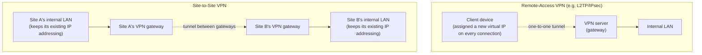
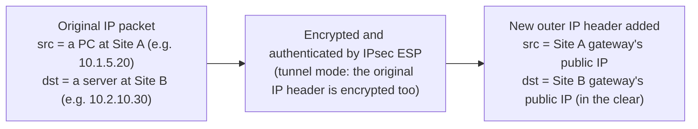

## Introduction

- **What You'll Learn From This Article**: How a remote-access VPN (like L2TP/IPsec, where an individual client connects to a VPN server) differs from a site-to-site VPN (where two entire site networks are connected to each other), and — for the common real-world case of connecting equipment from different vendors, such as a Cisco device at a Japanese office and a WatchGuard device at an overseas branch — what has to line up for the IPsec tunnel to come up, and what typically breaks it.
- **Intended Audience**: Infrastructure engineers who already have a working understanding of remote-access VPN mechanics (IKE/ESP, authentication via PSK or certificates) but can't yet explain concretely how a site-to-site VPN differs, or what to watch for when connecting equipment from different vendors.
- **Estimated Reading Time**: About 25 minutes

This article is part of the [Top 1% Series' full article guide](/en/sitemap).

## Prerequisites

- **VPN (Virtual Private Network)**: A general term for technology that creates a logical communication path over a public network like the internet, functioning as if it were a dedicated line.
- **IKE (Internet Key Exchange)**: A protocol for safely agreeing on encryption keys and authenticating the two parties. It uses UDP port 500 (or 4500 when traversing NAT). IKE comes in two versions, IKEv1 and IKEv2; the design differences between them (EAP authentication, Configuration Payload, MOBIKE, and more) are covered in detail in [Comparing L2TP/IPsec with Modern VPN Protocols from a "Top 1%" Perspective](/en/articles/vpn-protocols-comparison-guide).
- **ESP (Encapsulating Security Payload)**: The protocol that uses the key agreed on via IKE to actually encrypt data and detect tampering. It's handled as IP protocol number 50.
- **SA (Security Association)**: A uniquely-identified set of agreed-upon parameters — encryption algorithm, keys, lifetime, and so on — used in an IKE or IPsec exchange. There are two kinds: the **IKE SA**, established during IKE Phase 1, which protects the control channel itself, and the **IPsec SA**, established during IKE Phase 2, which ESP uses to protect the actual data. Encrypted communication only works once both are in place.
- **Pre-Shared Key (PSK) / Certificate Authentication**: The two representative ways IKE negotiation proves "the other party is who they claim to be." A PSK is a secret string both sides share in advance; certificate authentication uses a certificate issued by a CA (Certificate Authority).
- **ACL (Access Control List)**: A set of rules that permits or denies packets based on conditions like source/destination IP address. Routers and firewalls also use ACLs to declare which traffic should be treated specially, not just to allow or block it.

## Getting the Big Picture

### In a Nutshell

**The single biggest difference between a site-to-site VPN and a remote-access VPN is the connection topology itself — who is being connected to whom.** A remote-access VPN connects an individual client device to a VPN server (gateway) one-to-one, handing the client a new virtual IP address on every connection. A site-to-site VPN, by contrast, connects Site A's network to Site B's network wholesale, over a tunnel between their gateways, while both sites keep their existing IP addressing untouched.



Breaking the two down side by side:

| Aspect | Remote-Access VPN (e.g. L2TP/IPsec) | Site-to-Site VPN |
|---|---|---|
| Who connects to whom | Individual client device ⇔ VPN server | A site's VPN gateway ⇔ another site's VPN gateway |
| IPsec mode used | Transport mode (when something else, like L2TP, already builds the tunnel) | Tunnel mode (IPsec itself wraps the entire original packet in a new outer IP header) |
| User authentication | Present (per-user username/password authentication, typically at the PPP layer) | Typically absent (only gateway-level authentication via PSK or certificate) |
| How traffic is identified | The virtual IP address assigned after connecting (one per client) | The **traffic selectors** negotiated in IKE Phase 2 (below), declaring which local-subnet/remote-subnet pairs are allowed through |
| Typical use case | An individual off-site device accessing internal resources | An always-on connection between HQ and a branch, or on-premises and cloud |

### Why Site-to-Site VPNs Use Tunnel Mode

In a remote-access VPN like L2TP/IPsec, the L2TP protocol itself already does the job of building a virtual one-to-one link between the client and the server, so IPsec only needs **transport mode** — keeping the original IP header intact and protecting just the payload (this history is covered in detail in [Understanding How L2TP/IPsec Works from a "Top 1%" Perspective](/en/articles/l2tp-ipsec-guide)).

A site-to-site VPN, however, has no equivalent of L2TP dedicated to building the tunnel. IPsec has to shoulder that job — building the tunnel between the two gateways — entirely on its own. That's what **tunnel mode** is for.



The decisive difference from transport mode is that **the original IP header itself is included in what gets encrypted.** In transport mode, the original source and destination IP addresses remained visible to anything along the path. In tunnel mode, the original IP header — often addresses from each site's private, non-routable internal range — disappears into the encrypted payload, and all that's visible on the wire is the newly added pair of public gateway IP addresses. This lets the two sites' internal addressing stay hidden from the outside world while the internet, a public network, carries the bridge between them.

### The Concept of Traffic Selectors (Proxy IDs)

A remote-access VPN identifies "who is connecting" via a username and password at the PPP layer. A site-to-site VPN has no such notion of per-user authentication at all. Instead, what it identifies is **which combination of local subnet and remote subnet is allowed through this tunnel.** This information is exchanged during the IKE Phase 2 negotiation and is called a **traffic selector** (or **proxy ID**).

For example, if Site A uses `10.1.0.0/16` and Site B uses `10.2.0.0/16`, the traffic selector is declared to both gateways as "local: `10.1.0.0/16`, remote: `10.2.0.0/16`." Phase 2 negotiation only succeeds if both gateways propose an exactly matching combination. **A mismatch in this traffic selector is, by far, the most common cause of trouble when troubleshooting a site-to-site VPN** — covered in detail later, in "Troubleshooting Perspective."

## Fundamentals, Thoroughly Explained

### The Authentication Model of a Site-to-Site VPN: Authenticating the Device, Not the Person

During IKE Phase 1, a site-to-site VPN authenticates using a pre-shared key (PSK) or a certificate, just like the IPsec layer of a remote-access VPN. But a site-to-site VPN has **no equivalent** of the PPP-layer authentication a remote-access VPN uses — there's no mechanism to confirm "specifically who is using this."

This isn't a design gap; it follows directly from what a site-to-site VPN fundamentally is. What it connects isn't "someone at Site A" — it's "Site A's network itself." Whether an individual user, once past the tunnel, is allowed to reach a particular internal server is not the site-to-site VPN's job at all; it's handed off to some other mechanism beyond the tunnel — the existing internal firewall, Active Directory permissions, authentication on the internal server itself. It helps to think of a site-to-site VPN as providing nothing more than a "secure pipe" bridging two site networks, with everything else left to what's on the other side of it.

### Policy-Based VPN vs. Route-Based VPN

Site-to-site VPN implementations broadly split into two approaches.

| Approach | How it works | How it decides what traffic to protect |
|---|---|---|
| **Policy-based VPN** | The traffic itself (an ACL or traffic selector) determines what gets encrypted. Each local/remote subnet pair gets its own, independent IPsec SA | Only the combinations explicitly declared in the ACL or selector |
| **Route-based VPN** | The tunnel is treated as a single virtual network interface (a tunnel interface), and the routing table determines what gets encrypted | Whatever normal routing sends that way — static routes, or a dynamic routing protocol like OSPF/BGP |

With a **policy-based VPN**, if Site A has 5 subnets and Site B has 3, and every combination needs to communicate, that's, in principle, 5×3 = 15 independent IPsec SAs (one per traffic-selector combination). As subnets are added, both the configuration and the SA count grow combinatorially — a real operational burden at scale across many sites.

A **route-based VPN** creates a tunnel interface — a genuine, single virtual interface — and lets a routing entry (or a dynamic routing protocol like OSPF/BGP) pointed at it decide what flows into the tunnel. The IPsec SA itself can be established just once, with a broad selector (potentially `0.0.0.0/0`), leaving the actual decision of what traffic goes through the tunnel to the routing table. That makes it far more scalable across many sites and subnets, and it means a dynamic routing protocol can run directly over the tunnel — so as sites are added, routes propagate automatically.

### The Typical Real-World Setup: One VPN Gateway at the Site Boundary

Even when a site has multiple internal segments, the common real-world pattern is **not** one VPN router per segment. Instead, a single VPN gateway sits at the boundary where the site meets the internet (the WAN side), and that one gateway handles every internal segment. Deploying a separate physical VPN router per segment is impractical in terms of hardware count and operational cost — in most environments, the existing firewall or router doubles as the VPN gateway.

How that single gateway handles multiple segments differs between the two approaches:

- With a **policy-based VPN**, the VPN gateway remains one physical device, but as described above, an independent IPsec SA is established for every (local segment, remote segment) pair. It helps to picture one physical box that logically bundles together as many virtual tunnels as there are segment-pair combinations.
- With a **route-based VPN**, the single gateway's tunnel interface is left open to traffic from any internal segment, and which segment's traffic actually flows into the tunnel is decided by routing inside the site — static routes, or a dynamic routing protocol like OSPF/BGP.

<details>
<summary>How Cisco and WatchGuard each support this</summary>

Cisco supports both the traditional, ACL-defined **crypto map** (policy-based) approach and a route-based configuration using a **VTI (Virtual Tunnel Interface)**. Because a VTI behaves like any ordinary Cisco IOS interface, a dynamic routing protocol such as OSPF or BGP can run directly over the tunnel — a major advantage. Note also that a dynamic VTI (DVTI) configuration with IKEv2 is only supported within the FlexVPN framework.

A WatchGuard Firebox's basic building block is the **manual BOVPN (Branch Office VPN)**, combining a Gateway (Phase 1) with a Tunnel (Phase 2, where local/remote networks are explicitly listed as routes) — this is effectively policy-based. Separately, WatchGuard also offers a **BOVPN virtual interface**, which treats the tunnel as a virtual interface and controls traffic on a routing basis; it's used for connecting to cloud-based virtual networks or when dynamic routing is needed.

</details>

### Case Study: Building an IPsec Tunnel Between Cisco (Japan) and WatchGuard (Overseas)

In practice, mismatched hardware between sites is common — a merger or acquisition can leave different vendors' gear in place from before, or a head office and its overseas branches may simply procure through different channels — and organizations often end up building a site-to-site VPN between different vendors' equipment: Cisco⇔Fortinet, Palo Alto⇔Juniper, Cisco⇔WatchGuard, and so on. As one example among many such mixed-vendor patterns, let's walk through Cisco equipment at a Japanese head office connected to a WatchGuard Firebox at an overseas branch by a site-to-site IPsec VPN. The first wall you hit when connecting equipment from different vendors is that **the terminology is completely different from vendor to vendor.** The same underlying setting is named differently in Cisco's documentation than in WatchGuard's, so the first order of business is mapping the terms to each other.

| Role | Cisco's term | WatchGuard Firebox's term |
|---|---|---|
| Overall Phase 1 (IKE SA) configuration | crypto ikev2 policy / crypto isakmp policy | Gateway (Phase 1 settings) |
| Phase 1 encryption/authentication proposal | crypto ikev2 proposal | Gateway's Phase 1 Proposal (encryption, authentication, DH group combination) |
| Where the pre-shared key is stored | crypto ikev2 keyring / crypto isakmp key | Gateway Endpoint's authentication settings (Pre-Shared Key) |
| How the peer is identified | match identity in a crypto ikev2 profile | Gateway Endpoint's Gateway ID (IP address, domain name, etc.) |
| Phase 2 (IPsec SA) encryption/authentication proposal | crypto ipsec transform-set / crypto ikev2 ipsec-proposal | The Tunnel's Phase 2 Proposal |
| Traffic selector | match address (an ACL) inside a crypto map | The Tunnel's Route (Local/Remote Network) |
| Liveness detection | crypto isakmp keepalive / IKEv2's dpd | The Gateway's Dead Peer Detection setting |
| The tunnel definition itself | The crypto map as a whole, or a VTI (tunnel interface) | A Gateway + Tunnel pair, or a BOVPN virtual interface |

On Cisco IOS, an IKEv2-based site-to-site VPN is typically built from elements like these (the exact commands will need adjusting for your IOS version and configuration):

```
crypto ikev2 proposal PROP1
  encryption aes-cbc-256
  integrity sha256
  group 14

crypto ikev2 policy POLICY1
  proposal PROP1

crypto ikev2 keyring KEYRING1
  peer BRANCH-WG
    address 203.0.113.10
    pre-shared-key <PSK>

crypto ikev2 profile PROFILE1
  match identity remote address 203.0.113.10 255.255.255.255
  authentication local pre-share
  authentication remote pre-share
  keyring local KEYRING1

crypto ipsec transform-set TSET1 esp-aes 256 esp-sha256-hmac
  mode tunnel

crypto map CMAP1 10 ipsec-isakmp
  set peer 203.0.113.10
  set transform-set TSET1
  set ikev2-profile PROFILE1
  match address ACL-TO-BRANCH

ip access-list extended ACL-TO-BRANCH
  permit ip 10.1.0.0 0.0.255.255 10.2.0.0 0.0.255.255
```

On the WatchGuard Firebox side, the same content is configured through the GUI in Policy Manager or WatchGuard Cloud. You define Phase 1 (encryption AES-256, authentication SHA-256, the DH group equivalent to group 14, the PSK, and the Gateway Endpoint's IP address) in the **Gateway** creation screen, and Phase 2 (ESP's encryption/authentication algorithms, the PFS group) plus the Local/Remote Network route pair — `10.1.0.0/16` ⇔ `10.2.0.0/16` — in the **Tunnel** screen that hangs beneath it.

**The specific mismatches to watch for when connecting the two** are as follows.

1. **IKE version mismatch**: WatchGuard Fireware's manual BOVPN supports both IKEv1 and IKEv2, but the version selected by default, and the template combinations offered, won't necessarily match Cisco's defaults. Both sites need to explicitly agree on which version to use.
2. **Default templates don't use matching algorithms**: Cisco's default ISAKMP policy and WatchGuard's built-in Phase 1/Phase 2 Proposal templates almost never line up on encryption algorithm, hash, and DH group out of the box. At least one side needs a **custom proposal** built to match the other's encryption algorithm, authentication algorithm, DH group, and lifetime exactly, one-to-one. If even a single parameter is off, the phase doesn't "partially succeed" — it fails outright.
3. **Peer identity type mismatch**: Cisco's `match identity remote address` identifies the peer by IP address, but WatchGuard's Gateway Endpoint lets you choose to identify the peer either "by IP address" or "by domain name (FQDN)." Even with a correct PSK, a mismatch here causes authentication to fail.
4. **Whether NAT traversal (NAT-T) is needed**: It's not unusual for the overseas WatchGuard to sit behind an ISP-provided router doing NAT. In that case, by the same principle as NAT-T in remote-access L2TP/IPsec (covered in detail in [Understanding How NAT/NAPT Works from a "Top 1%" Perspective](/en/articles/nat-guide)), both gateways need to enable — and agree on — floating to UDP 4500.
5. **Mismatched traffic-selector granularity**: A particularly common mismatch is Cisco using a VTI (route-based) with a broad selector on one side, while WatchGuard uses its traditional policy-based Tunnel Route, enumerating each subnet pair individually, on the other. Say Site A has two independent subnets, `10.1.0.0/16` and `10.3.0.0/24`, and both need to reach Site B: WatchGuard's policy-based Tunnel needs both combinations registered as separate Routes, and Cisco's ACL needs the matching `permit` lines for both, with nothing missing. Forget to add one on either side, and you get the hard-to-diagnose failure mode of "only some subnets can communicate." In practice, **having both sites enumerate traffic selectors explicitly, at the same granularity**, is the surest way to maximize interoperability between different vendors.

### What to Watch Out for When Migrating from IKEv1 to IKEv2

As noted above, new site-to-site VPN builds increasingly choose IKEv2, but in practice you'll also frequently run into projects that need to **upgrade an existing IKEv1 configuration to IKEv2 while it's still live** (often driven by legacy-hardware replacement, or by IKEv1's specific weaknesses and poor mobility support, covered in [Comparing L2TP/IPsec to Modern VPN Protocols from a "Top 1%" Perspective](/en/articles/vpn-protocols-comparison-guide)). Unlike a new build, this comes with the added constraint of **switching a tunnel that's already carrying production traffic, without stopping communication (or with only minimal downtime)** — which changes what you need to watch out for.

1. **Phased migration (running in parallel, cutting over gradually)**: Rather than switching every site's IKE version all at once, the standard approach is to convert a single tunnel to IKEv2 first at a low-impact site (or during a low-traffic window), validate it, and only then roll it out to the rest. Depending on the gateway, you may be able to keep IKEv1 and IKEv2 configurations coexisting temporarily for the same peer and cut over to the new SA while the old one is still active — but some implementations can only accept Phase 1 negotiation under a single policy/profile at a time, so check the peer device's documentation in advance for whether parallel operation is even possible.
2. **Confirming vendor version/feature support ahead of time**: IKEv2 support varies not just by model but by firmware/OS version. As mentioned in "Cisco and WatchGuard Support" above, using Cisco's Dynamic VTI (DVTI) with IKEv2 is only supported within the FlexVPN framework, and existing configuration styles (a bare crypto map, for instance) may not migrate to IKEv2 as-is. Before migrating, check both vendors' support matrices for which firmware version supports which IKEv2 features, and, if necessary, build a firmware update into the plan first.
3. **Whether PSKs and certificates can be reused**: With a pre-shared key setup, the PSK string used under IKEv1 can generally be reused as-is under IKEv2, but on most implementations the authentication configuration items themselves (how profiles/proposals are wired together) need to be rebuilt separately per version. With certificates, the same certificate chain can be used under either IKEv1 or IKEv2, but the default ID type (how the certificate's Subject gets treated as an identifier) sometimes differs between versions — a classic root cause when authentication alone starts failing after a migration.
4. **Designing the maintenance window and rollback procedure**: A migration that swaps out the entire Phase 1/Phase 2 policy typically drops the tunnel for a moment at the instant the configuration changes. Schedule the cutover during a maintenance window outside business hours for the affected sites, and prepare a procedure in advance where **the old IKEv1 configuration is commented out or archived rather than deleted, so you can immediately revert if the IKEv2 side fails to establish an SA within the expected time.** This matters especially in cross-vendor environments: if one site's cutover gets ahead of the other's, there's a window where neither version can establish a tunnel, so it's important to coordinate the exact timing between both sites' operators beforehand.
5. **Differences in DPD/keepalive monitoring settings**: Dead Peer Detection (DPD) implementations, and their default intervals and timeout values, can differ between IKEv1 and IKEv2 and across vendors. If the old version's monitoring settings are left in place after the migration, a genuinely healthy tunnel can get misjudged as "down," triggering unnecessary failovers or alerts — so review monitoring settings as part of the migration work too.

Unlike designing a new build from scratch, this kind of migration project lives or dies on **how well it fits with the existing operations and monitoring setup.** The reason this migration scenario tends to come up for site-to-site VPNs rather than remote-access VPNs is that the IKEv1-vs-IKEv2 difference has the most real-world impact on always-on connections between gateways. MOBIKE's benefit for handling a mobile client's changing IP address matters relatively little in a site-to-site setup, where the gateways' IP addresses are basically fixed — the operational considerations covered above carry far more practical weight instead.

### Liveness Detection and Redundancy for a Site-to-Site VPN

In a remote-access VPN, one tunnel going down affects a single user. In a site-to-site VPN, one tunnel going down takes out communication for an **entire site**. Because the blast radius is on a completely different scale, tuning Dead Peer Detection (DPD) intervals appropriately, and considering redundancy, matters a great deal.

- **Static redundancy**: Give each site multiple ISP links, and fail over to a backup gateway/tunnel definition if the primary tunnel drops. WatchGuard offers multi-WAN configurations and BOVPN failover features; on Cisco, it's common to combine multiple crypto maps with a tracking mechanism (such as IP SLA) to switch routes.
- **Redundancy via dynamic routing**: With a route-based VPN (Cisco's VTI, WatchGuard's BOVPN virtual interface), you can run a dynamic routing protocol like BGP or OSPF over multiple tunnels, so that if one tunnel drops, the routing protocol itself automatically reroutes traffic. As you scale out to a multi-site topology (hub-and-spoke, or full mesh), this combination with dynamic routing has an outsized effect on real-world scalability.

## The View from the Top 1% (What Experts See)

### The "SA Explosion" Problem in Policy-Based VPNs

As noted above, a policy-based VPN builds an independent IPsec SA for every (local subnet, remote subnet) combination. This isn't just extra configuration — it also means **each SA independently rekeys on its own Phase 2 lifetime schedule.** As the number of sites and subnets grows, the number of SAs you need to track and monitor grows combinatorially, and keeping a ledger of which SA maps to which site-pair/subnet-pair becomes operationally essential. In organizations where new vendor connections or new subnets at existing sites are added frequently, this management overhead reaching an unmanageable scale is a common, real-world trigger for migrating to a route-based VPN.

### Tunnel Mode Shrinks Effective MTU More Than Transport Mode Does

A site-to-site VPN's IPsec tunnel mode **adds an entirely new outer IP header** to the original packet, on top of ESP's own encryption and authentication overhead. That's simply more overhead than transport mode (which keeps the original IP header and protects only what's inside it) — the outer IP header (20 bytes), ESP header/trailer, and ICV together can add up to roughly 50–70 bytes of overhead, depending on conditions. This is especially pronounced for a site-to-site VPN spanning an undersea cable between Japan and an overseas site: MTU constraints along the transit network, combined with "PMTUD black holes" (where the ICMP messages Path MTU Discovery relies on get filtered somewhere along the path), tend to produce the confusing failure mode where only large file transfers or backups mysteriously stall. In practice, the standard fix is to explicitly pin the tunnel interface's MTU to around 1400 bytes, or configure TCP MSS clamping on both gateways.

### Route Advertisement: Static vs. Dynamic Routing

For a simple two-site setup, static routes on each gateway ("traffic for Site B's subnet goes through this tunnel") are all you need. But as the topology grows into a hub-and-spoke design with several overseas branches hanging off headquarters, or a full mesh where sites connect to each other directly, manually updating static routes on every gateway every time a site is added or removed stops being realistic. Running a dynamic routing protocol like BGP over a route-based VPN (a VTI, or a BOVPN virtual interface) lets a new site's routes — or a change to an existing site's routes — propagate to every other site automatically, substantially cutting operational overhead in a multi-site environment. This is a design fork you're unlikely to notice while only thinking about a two-site connection — it only becomes visible once the site count grows.

## Common Misconceptions and Pitfalls

- **Misconception 1: "A site-to-site VPN has per-user logins, just like L2TP/IPsec."**
  A site-to-site VPN has no concept of per-user authentication at all. Authentication happens strictly at the gateway level (PSK or certificate), and which individual users are allowed to reach which internal servers is delegated to some other mechanism beyond the tunnel — an internal firewall, Active Directory, and so on.
- **Misconception 2: "It's the same IPsec, so as long as both sides just turn on VPN, Cisco and WatchGuard will connect automatically."**
  IKE/IPsec are standardized protocols, but actually establishing a connection requires matching a large number of parameters exactly — encryption algorithm, hash, DH group, lifetime, traffic selectors, and more — between the two sides. Different vendors ship different default templates and terminology, so "just turning it on" almost never connects automatically.
- **Misconception 3: "Using tunnel mode instead of transport mode gives you stronger encryption."**
  The difference between the two modes is about the scope of what gets wrapped in a new outer header — it has no bearing whatsoever on the strength of the encryption algorithm or key length. Tunnel mode is chosen in a site-to-site VPN because IPsec itself also has to do the job of building the tunnel — not to raise the security level.
- **Misconception 4: "Setting traffic selectors broadly (like `0.0.0.0/0`) now saves work later."**
  A broad selector can be a reasonable choice when both ends are route-based VPNs, but against a policy-based peer (such as WatchGuard's manual BOVPN), an overly broad selector on one side tends to trigger a Phase 2 mismatch (since the other side only ever proposes a narrower one), and it also loses the firewall's visibility and control over the traffic. In practice, explicitly enumerating the subnet combinations you actually need makes troubleshooting far easier down the line.

## Troubleshooting Perspective

Troubleshooting a site-to-site VPN, like L2TP/IPsec, starts with **isolating which phase it's stuck in** — but a site-to-site VPN adds one more thing to check: whether the traffic selectors actually match.

1. **Phase 1 (IKE SA) fails to establish**: Typical causes include a mismatched PSK, mismatched encryption/hash/DH-group proposals, a mismatch in the peer identity method (IP address vs. FQDN), or UDP 500/4500 being blocked somewhere along the path. On Cisco, `show crypto ikev2 sa` (or `show crypto isakmp sa`) is the go-to command for checking Phase 1 SA state; repeated retransmissions without an established SA usually point to a proposal mismatch. On WatchGuard, Firebox System Manager's Traffic Monitor or a VPN diagnostic report will show repeated failed Phase 1 negotiations and log the proposal mismatch.
2. **Phase 2 (IPsec SA) fails to establish — the most common cross-vendor failure**: The most frequent cause here, even after Phase 1 succeeds, is a mismatch in traffic selectors (the local/remote subnet combination). On Cisco, `debug crypto ipsec` will show messages to the effect of "quick mode selectors do not match." Line up both gateways' selector definitions — Cisco's ACL against WatchGuard's Tunnel Route — and check for discrepancies in subnet range, ordering, or notation (like wildcard masks vs. subnet masks).
3. **The tunnel is up, but specific subnets can't communicate**: A classic case is adding a new subnet at one site and forgetting to add the corresponding selector (an ACL `permit` line, or a Tunnel Route entry) on the other gateway.
4. **The tunnel is up, but traffic only flows in one direction**: This is often not an IPsec problem at all — it's usually a missed static route on one site's LAN side that should point that subnet's traffic at the VPN gateway.
5. **The connection is unstable or drops intermittently**: If the two gateways' DPD intervals, or their Phase 1/Phase 2 lifetimes, differ significantly, one side may try to disconnect or rekey while the other is still using what it thinks is a valid SA — observed as intermittent disconnects.
6. **Only large transfers stall or time out**: This points to fragmentation from the reduced effective MTU discussed above, or a PMTUD black hole. Adjusting the tunnel interface's MTU, or configuring MSS clamping, often resolves it.

### Prevention and Long-Term Countermeasures

- Keep both gateways' Phase 1/Phase 2 parameters (encryption algorithm, hash, DH group, lifetime, traffic selectors) documented in a single table, with one agreed source of truth — especially important when different vendors or different teams manage each end.
- When connecting to a policy-based peer, avoid overly broad selectors and enumerate the subnet combinations you actually need.
- Enable DPD on both gateways and keep the intervals matched.
- In a multi-site environment with many subnets, or where subnets change often, consider migrating early to a route-based VPN (VTI, or a BOVPN virtual interface) with dynamic routing, to avoid the policy-based SA explosion.

## Summary

- The difference between a site-to-site VPN and a remote-access VPN comes down to who connects to whom (gateway-to-gateway vs. client-to-server), which IPsec mode is used (tunnel vs. transport), the authentication model (device-level vs. user-level), and how traffic is identified (traffic selectors vs. a virtual IP address).
- A policy-based VPN creates an independent SA per traffic-selector combination, which can explode in count across many sites; a route-based VPN decides what traffic to send using the routing table (and dynamic routing), which scales far better.
- Building a site-to-site VPN between different vendors, such as Cisco and WatchGuard, requires mapping the terminology and then matching every Phase 1/Phase 2 parameter one-to-one; a mismatch in traffic-selector granularity is, by far, the most common source of trouble.
- Because one tunnel failing takes down an entire site's connectivity, DPD-based liveness detection and redundancy design matter even more for a site-to-site VPN than for a remote-access VPN.

**Starting Today**
1. Before opening either vendor's console or CLI to build a new site-to-site VPN, build the Phase 1/Phase 2 parameter mapping table first.
2. When adding a new subnet to an existing site-to-site VPN, remember to update the traffic selectors (ACL / Tunnel Route) symmetrically on both gateways.

## References

- [Security Architecture for the Internet Protocol | RFC 4301](https://datatracker.ietf.org/doc/html/rfc4301)
- [IP Encapsulating Security Payload (ESP) | RFC 4303](https://datatracker.ietf.org/doc/html/rfc4303)
- [Internet Key Exchange Protocol Version 2 (IKEv2) | RFC 7296](https://datatracker.ietf.org/doc/html/rfc7296)
- [IPsec Virtual Tunnel Interfaces | Cisco](https://www.cisco.com/c/en/us/td/docs/ios-xml/ios/sec_conn_vpnips/configuration/xe-3s/sec-sec-for-vpns-w-ipsec-xe-3s-book/sec-ipsec-virt-tunnl.pdf)
- [Configure a Multi-SA Virtual Tunnel Interface on a Cisco IOS XE Router | Cisco](https://www.cisco.com/c/en/us/support/docs/security-vpn/ipsec-negotiation-ike-protocols/214728-configure-multi-sa-virtual-tunnel-interf.html)
- [About Manual IPSec Branch Office VPNs | WatchGuard](https://www.watchguard.com/help/docs/help-center/en-US/Content/en-US/Fireware/bovpn/manual/bovpn_manual_about_c.html)
- [Configure a BOVPN Virtual Interface | WatchGuard](https://www.watchguard.com/help/docs/help-center/en-US/Content/en-US/Fireware/bovpn/manual/bovpn_vif_config_c.html)
- [Configure Phase 1 and Phase 2 Settings | WatchGuard](https://www.watchguard.com/help/docs/help-center/en-US/Content/en-US/Fireware/mvpn/general/ipsec_configure_phase1_phase2_c.html)
