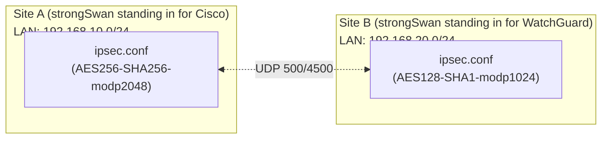

## Introduction

- **What You'll Learn From This Article**: This hands-on reproduces, using two strongSwan servers, the specific errors that a cross-vendor IPsec tunnel build covered in [Understanding Site-to-Site VPN From a "Top 1%" Perspective](/en/articles/site-to-site-vpn-guide) actually runs into. You'll see, firsthand, the two errors most commonly hit when connecting devices from different vendors in real work: `NO_PROPOSAL_CHOSEN` from an IKE Phase 2 cipher-suite mismatch, and `TS_UNACCEPTABLE` from a traffic-selector mismatch.
- **Intended Audience**: Readers who've already read [Understanding Site-to-Site VPN](/en/articles/site-to-site-vpn-guide) and understand terms like IKE Phase 1, Phase 2, and traffic selectors, but have never experienced where a cross-vendor connection actually goes wrong.
- **Estimated Reading Time**: About 70 minutes, including environment setup

This article is part of the [Top 1% Series Complete Article Guide](/en/sitemap).

## Prerequisite Knowledge

- **IKE Phase 1/Phase 2, SA (Security Association)**: This assumes the roles of the IKE SA and IPsec SA covered in [Understanding Site-to-Site VPN](/en/articles/site-to-site-vpn-guide).
- **Basic strongSwan Operations**: Editing `ipsec.conf`/`ipsec.secrets`, and running `ipsec restart`/`ipsec statusall`. If you're not comfortable with these, read [The Top 1% Hands-On for Building an L2TP/IPsec Server Yourself](/en/articles/l2tp-ipsec-lab-guide) first.

## The Big Picture

Since you can't realistically get your hands on an actual Cisco device at a Japanese office and a WatchGuard device overseas, install strongSwan on two Linux VMs instead, and give each **a cipher suite modeled on a different vendor's defaults** to reproduce the pitfalls unique to cross-vendor connections.



## Hands-On Steps

### Step 1: Install strongSwan on Both Sides, With a Deliberate Cipher Suite Mismatch

Install strongSwan on both VMs.

```bash
sudo apt update && sudo apt install -y strongswan
```

On Site A (`/etc/ipsec.conf`), configure a relatively strong cipher suite, close to a Cisco device's default.

```
conn site-a-to-b
    left=%defaultroute
    leftsubnet=192.168.10.0/24
    right=<Site B's global IP>
    rightsubnet=192.168.20.0/24
    authby=secret
    ike=aes256-sha256-modp2048!
    esp=aes256-sha256!
    auto=start
```

On Site B (`/etc/ipsec.conf`), deliberately configure a different cipher suite.

```
conn site-b-to-a
    left=%defaultroute
    leftsubnet=192.168.20.0/24
    right=<Site A's global IP>
    rightsubnet=192.168.10.0/24
    authby=secret
    ike=aes128-sha1-modp1024!
    esp=aes128-sha1!
    auto=start
```

Set the same PSK in `/etc/ipsec.secrets` on both, and run `ipsec restart`.

### Step 2: Observe the NO_PROPOSAL_CHOSEN Error

Check the log on Site A.

```bash
sudo journalctl -u strongswan-starter -f
```

After a moment, a log like this appears:

```
received proposals: AES_CBC_128/HMAC_SHA1_96/PRF_HMAC_SHA1/MODP_1024
configured proposals: AES_CBC_256/HMAC_SHA2_256_128/PRF_HMAC_SHA2_256/MODP_2048
no acceptable proposal found
```

**IKE Phase 1 (or 2) can never establish an SA unless there's at least one exact match between the cipher-suite candidates it can offer and the candidates the other side offers.** That's `NO_PROPOSAL_CHOSEN`. The assumption "they're both using roughly similar-strength encryption, so it should connect" doesn't hold — **the algorithm, key length, and DH group all need to match, literally.**

### Step 3: Align the Cipher Suites and Establish Phase 1/Phase 2

Bring Site B's config in line with Site A.

```
    ike=aes256-sha256-modp2048!
    esp=aes256-sha256!
```

After restarting, confirm `ipsec statusall` shows an `ESTABLISHED` state, with both sides' traffic selectors displayed.

```bash
sudo ipsec statusall
```

### Step 4: Misalign the Traffic Selectors and Reproduce TS_UNACCEPTABLE

Even with matching cipher suites, there's still another pitfall. On Site A's config, deliberately rewrite `rightsubnet` to a range narrower than Site B's actual LAN.

```
    rightsubnet=192.168.20.0/25
```

Restart and check the log, and you'll see a message like this:

```
CHILD_SA site-a-to-b{1} establishing failed, TS_UNACCEPTABLE
```

**Phase 2 doesn't negotiate cipher suites alone. Which local subnet gets paired with which remote subnet through this tunnel — the traffic selector itself — also needs to match (or one side needs to contain the other) between what both sides declare.** Confirm that setting `rightsubnet` back to `192.168.20.0/24` returns the state to `ESTABLISHED`.

## What a Pro Sees Here (Top 1% Understanding)

### A Setting That "Implicitly Matches Between the Same Vendor" Surfaces When Vendors Differ

Between devices of the same vendor (Cisco to Cisco, for example), the management console's wizard often proposes the same default cipher suite to both sides, so this kind of mismatch rarely surfaces. **But mix vendors — a Cisco device at a Japanese office, a WatchGuard device overseas — and each device's different default values and supported algorithm candidates make the mismatch reproduced in Step 2 a genuinely frequent occurrence in real work.** When handed a cross-vendor IPsec build, the standard practice of a top-1% engineer is to start from the assumption that the cipher suite needs to be explicitly agreed on, literally matching, between both administrators.

### Traffic Selector "Narrowing," a Vendor-Specific Behavioral Difference

Some vendors' implementations automatically narrow the range of the actually-established SA, during Phase 2 negotiation, to **only the intersection** of the subnets both sides declared. **Not knowing about this behavior leads to an even harder-to-spot failure than Step 4: "the config should specify matching /24s on both sides, yet only some hosts can actually communicate."** When suspecting a traffic-selector mismatch, it's important to build the habit of cross-checking the actually-established range shown in `ipsec statusall`'s output (the post-narrowing value) against what's actually written in the config file.

## Common Misconceptions and Pitfalls

- **Misconception 1: "As long as the encryption algorithms are roughly similar in strength, a connection can be established even with some differences."**
  Establishing an IKE/IPsec SA requires a literally exact match across the algorithm, key length, and DH group.
- **Misconception 2: "Phase 2 negotiates the cipher suite alone."**
  The traffic selector (which subnets get paired with which) is also an independent item negotiated during Phase 2.
- **Misconception 3: "NO_PROPOSAL_CHOSEN and TS_UNACCEPTABLE happen for the same underlying reason."**
  The former comes from a cipher-suite mismatch; the latter comes from a traffic-selector (subnet declaration) mismatch — two entirely different causes.

## Troubleshooting Perspective

1. **You see NO_PROPOSAL_CHOSEN**: Cross-check both sides' `ike=`/`esp=` lines and confirm the algorithm, key length, and DH group match literally.
2. **You see TS_UNACCEPTABLE**: Check whether both sides' `leftsubnet=`/`rightsubnet=` correctly pair up with each other.
3. **The connection establishes, but only some hosts can communicate**: Check `ipsec statusall` to see whether the actually-established traffic selector range has been narrowed to something smaller than what's written in the config.

## Summary

- Establishing an IKE/IPsec SA requires both sides' cipher suites (algorithm, key length, DH group) to match literally; a mismatch produces a NO_PROPOSAL_CHOSEN error.
- Phase 2 also negotiates traffic selectors (the subnet pairing) in addition to the cipher suite; a mismatch there produces a TS_UNACCEPTABLE error.
- Cross-vendor connections hit these mismatches more often than same-vendor ones, due to differing default values.

**Takeaways to Apply Today**
1. When building IPsec across vendors, explicitly align the cipher suite between both administrators.
2. Even after the connection establishes, check the actual traffic selector range in `ipsec statusall` and confirm no narrowing has occurred.

## References

- [strongSwan Documentation: IKEv2 Cipher Suites](https://docs.strongswan.org/docs/latest/config/IKEv2CipherSuites.html)
- [strongSwan Documentation: Traffic Selectors](https://docs.strongswan.org/docs/latest/config/trafficSelectors.html)
