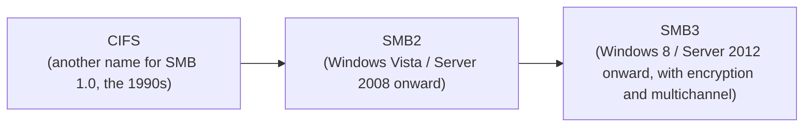

## Introduction

- **What you'll get from this article**: A systematic understanding of the difference between the terms "CIFS share" and "SMB share," and **the mechanism that lets file sharing work between two different operating systems, Windows and Linux.**
- **Intended audience**: Anyone who has read [Understanding Windows Server SMB File Sharing from a "Top 1%" Perspective](/en/articles/smb-file-sharing-guide) and understands SMB itself, but wonders how it relates to the other name "CIFS," or how file sharing between Windows and Linux actually works.
- **Estimated reading time**: About 13 minutes

This article is part of the [Top 1% Series' full article guide](/en/sitemap), the 8th in the [Windows Server Operations Series](/en/sitemap#series-list). SMB's own fundamentals and its connection-cache mechanism are covered in [Understanding Windows Server SMB File Sharing](/en/articles/smb-file-sharing-guide).

## Prerequisite Knowledge

- **Protocol**: The agreed-upon "contract" itself between parties communicating. See [What Is a Protocol?](/en/articles/protocol-design-guide) for details.

## Getting the Big Picture

### SMB and CIFS are the same "protocol" in substance, but they refer to different scopes

**SMB (Server Message Block) is the name of the Windows file-sharing protocol itself, and it has gone through version upgrades over time. CIFS (Common Internet File System) is Microsoft's own name for one specific version within that family — specifically, the early version of SMB (SMB 1.0) that Microsoft published in the 1990s.**



In other words, the relationship is: **"SMB" is the umbrella name for the whole protocol family, while "CIFS" is just another name for its early version.** The reason people still commonly say "CIFS share" in practice is that the terminology from the era when SMB1.0 was dominant simply stuck around as a habit. **What actually gets negotiated today is, in most cases, SMB2 or SMB3 — technically, it isn't "CIFS" at all.**

<details>
<summary>Why SMB1.0 (CIFS) is disabled by default</summary>

SMB1.0 (CIFS) has an old design with weaknesses — no encryption support, poor performance — and its security risks became widely known when **the vulnerability (EternalBlue) exploited by the "WannaCry" ransomware, which caused worldwide damage in 2017, existed specifically in this SMB1.0 implementation.** In response, Windows 10 (version 1709 and later) and Windows Server 2019 and later have the SMB1.0 (CIFS) client/server feature disabled by default.

</details>

## A Thorough, Grounds-Up Explanation

### Why file sharing works between different operating systems

As covered in [What Is a Protocol?](/en/articles/protocol-design-guide), file sharing between two completely different operating systems, Windows and Linux, works because **SMB is "a documented communication contract (a protocol specification)," not "one specific implementation."** Microsoft publishes the protocol specification for SMB2 and later as a technical document called `MS-SMB2`, and **any software capable of assembling and interpreting byte sequences according to that specification can, in principle, communicate — regardless of which OS it's implemented on.**

This structure — "the implementation is free, as long as the specification is met" — is fundamentally the same idea as multiple browsers all implementing the same HTTP specification, letting them all talk to any web server.

### Samba: the open-source project that implements SMB on Linux

**Samba** is the open-source project, running since 1992, used to handle SMB on Linux. Samba is a set of software that implements the SMB protocol on Linux (and other Unix-like OSes), and it plays two major roles.

| Component | Role |
|---|---|
| **`smbd`/`nmbd` (the Samba server)** | Makes Linux act as an SMB server, exposing a folder on Linux as a share visible to Windows clients |
| **`cifs-utils` (`mount.cifs`)** | Makes Linux act as an SMB client, mounting a share exposed by Windows (or Samba) onto the Linux side |

The name `cifs-utils` carries a historical remnant from the era when SMB1.0 (CIFS) was the norm, but **the current version can specify SMB2 or SMB3 too, via the `vers=` option — it isn't actually a tool limited to CIFS (SMB1.0).**

### A concrete configuration example

**To expose a folder on Linux as a share visible from Windows** (a Samba server), add configuration like the following to `/etc/samba/smb.conf`.

```ini
[shared]
   path = /srv/shared
   browsable = yes
   read only = no
   valid users = alice
```

**To mount a share exposed by Windows (or Samba) onto the Linux side**, use the `mount` command like this.

```bash
sudo mount -t cifs //192.168.1.10/shared /mnt/winshare \
  -o username=alice,password=xxxxx,vers=3.0
```

The key point is that you can **explicitly specify which SMB version to use**, like `vers=3.0`. If the server side only has the old SMB1.0 (CIFS) enabled, you'd need to set this to `vers=1.0` — but as noted above, this isn't recommended for security reasons.

## The View From the Top 1% Perspective

### When you encounter "CIFS," question the actual version first

In practice, it's not uncommon for the word "CIFS" to keep appearing in old documentation or internal conventions, unchanged. **When you encounter the word "CIFS," it's important to determine whether it's really referring to literal SMB1.0, or is simply being used colloquially as shorthand for "Windows file sharing" in general.** To check the actual SMB version in use, on the Windows side you can use `Get-SmbConnection` (PowerShell); on the Linux side, you can check the output of `/proc/mounts` or `dmesg` after running `mount`.

## Common Misconceptions and Pitfalls

- **Misconception 1: "SMB and CIFS are completely unrelated, separate protocols"**
  CIFS is Microsoft's own name for one specific early version (SMB1.0) within the SMB protocol family. They aren't unrelated at all.
- **Misconception 2: "File sharing between Windows and Linux requires dedicated conversion software"**
  Samba isn't conversion software — it's software that implements the SMB protocol specification directly on Linux. As long as the protocol specification is met, they can communicate directly, with no conversion needed.
- **Misconception 3: "Because it's named `cifs-utils`, it only supports SMB1.0 (CIFS)"**
  The name is just a historical holdover — the `vers=` option means it also supports SMB2 and SMB3.

## The Troubleshooting Perspective

1. **Mounting from Linux fails**: Check the `mount` command's error message and the output of `dmesg` to see whether an SMB version mismatch (between what the server requires and the `vers=` option specified) is the cause.
2. **Can't communicate with old equipment that only supports SMB1.0**: Understand the security risk involved, and treat allowing `vers=1.0` — limited to a segment with a constrained blast radius — as a stopgap, not a permanent operational practice.

### Preventive Measures and Permanent Fixes

- When introducing new Linux equipment, explicitly set `cifs-utils`'s version option (`vers=`) to prevent an unintended fallback to an old version.
- If the word "CIFS" appears in internal documentation, check which SMB version is actually in use, and update the wording if needed.

## Summary

- SMB is the name for the entire protocol family, and CIFS is Microsoft's own name for one early version within it (SMB1.0).
- SMB1.0 (CIFS) is disabled by default in current Windows, following its history as fertile ground for a vulnerability (EternalBlue).
- Samba is an open-source project that implements the SMB protocol specification on Linux, letting Linux act as either a server or a client.
- File sharing works between different operating systems because SMB is a documented "protocol" — any OS can implement it, as long as it meets the specification.

**What to Keep in Mind From Today**
1. When you see or hear the word "CIFS," determine whether it's referring to literal SMB1.0 or is just colloquial shorthand.
2. When configuring a mount from Linux, make a habit of explicitly specifying the SMB version to use via the `vers=` option.

## References

- [[MS-SMB2]: Server Message Block (SMB) Protocol Versions 2 and 3 | Microsoft Learn](https://learn.microsoft.com/en-us/openspecs/windows_protocols/ms-smb2/5606ad47-5ee0-437a-817e-70c366052962)
- [SMB security enhancements | Microsoft Learn](https://learn.microsoft.com/en-us/windows-server/storage/file-server/smb-security)
- [Samba Project](https://www.samba.org/)
