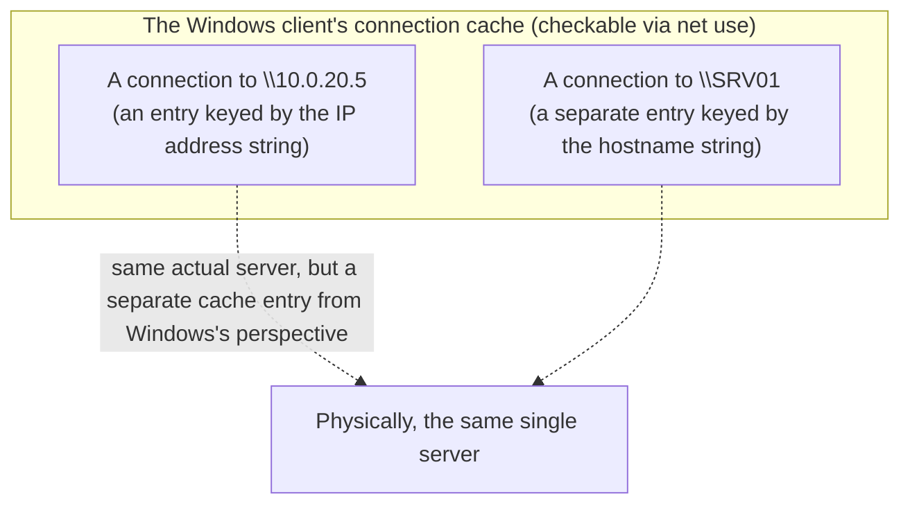
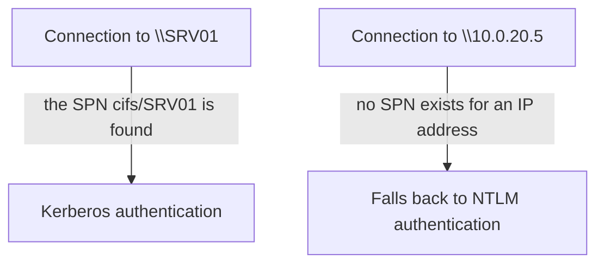

## Introduction

- **What You'll Learn From This Article**: This article answers a puzzling, real-world Windows Server file sharing (SMB) question: **a whole C drive was shared, and a specific subfolder within it was also confirmed accessible. After that share for the entire C drive was stopped, accessing `\\IPaddress\SpecificFolder` from another server stopped working — but `\\hostname\SpecificFolder` still worked fine. Why?** This article unravels this phenomenon through the mechanism of the SMB client's connection cache. Along the way, it also organizes the role of the administrative shares — `C$`, `IPC$`, and `ADMIN$` — shown by `net share`.
- **Intended Audience**: This article is aimed at engineers who operate Windows Server file sharing (SMB) but who've run into a hard-to-diagnose issue where access results differ between an IP address and a hostname.
- **Estimated Reading Time**: About 18 minutes

This article is part of the [Top 1% Series' full article guide](/en/sitemap), and the fifth article in the [Windows Server Operations Series](/en/sitemap#series-list). DC-specific NETLOGON and SYSVOL shares are covered in [Understanding DC Health Checks from a "Top 1%" Perspective](/en/articles/dc-health-check-guide), and the difference between SMB and the term "CIFS," along with Windows-Linux file sharing, is covered in [What's the Difference Between SMB and CIFS? Understanding Windows-Linux File Sharing from a "Top 1%" Perspective](/en/articles/smb-cifs-linux-interop-guide).

## Prerequisites

- **SMB (Server Message Block)**: The standard protocol used for Windows file sharing.
- **Share permissions and NTFS permissions**: A Windows file server has two independent layers of access control: "share permissions," set per shared folder, and "NTFS permissions," set at the file system (NTFS) level. When both are configured, **the stricter (more restrictive) of the two is what actually applies as the effective permission.**

## Getting the Big Picture

### The Role of Administrative Shares (C$, IPC$, ADMIN$)

Separately from any explicitly created shared folders, Windows Server has **administrative shares set up automatically by default.**

| Share name | What it points to | Purpose |
|---|---|---|
| `C$` (and similarly `D$`, and so on, per drive letter) | The entire `C:\` drive | A share for a user with administrator privileges to access that entire drive remotely |
| `ADMIN$` | `%SYSTEMROOT%` (typically `C:\Windows`) | A share for remote administrative operations |
| `IPC$` | Not a folder with actual content — a named pipe for inter-process communication | A special share for carrying inter-process communication, such as RPC, over SMB |

These administrative shares aren't specific to AD DS or DCs — they're **automatically created by default across Windows Server generally** (see [Understanding DC Health Checks from a "Top 1%" Perspective](/en/articles/dc-health-check-guide) for NETLOGON and SYSVOL, which are added in an AD DS environment).

## Fundamentals, Explained Thoroughly

### The Mechanism of the SMB Client's Connection Cache

Here's the crux of the matter. **Windows's file sharing client (the SMB redirector) internally caches and reuses a connection (session) once it's established to a server.** You can check the state of these connections with the `net use` command, which lists every currently established connection.

**What matters critically here is that Windows's connection cache is managed based on the literal string used to specify the destination — whether that's an IP address string or a hostname string.** In other words, `\\10.0.20.5\ShareName` and `\\SRV01\ShareName`, even if they point to **exactly the same physical server, are treated by Windows as separate "destinations" — cached and managed as separate entries.**



### Diagnosing the Case: Why Only Access via IP Address Failed

Diagnosing the real-world example above through this connection-cache lens, it breaks down as follows:

1. **The moment `\\IPaddress\c$` and `\\IPaddress\c$\SpecificFolder` were first accessed, an SMB connection (session) keyed by the string `IPaddress` gets established and cached on the accessing client.**
2. **After that, the server's share for the C drive itself (`C$`) is stopped — but the connection to that IP address already established and cached on the client side lingers on, unless explicitly disconnected.**
3. **When `\\IPaddress\SpecificFolder` is then attempted, it conflicts with the state of that already-cached connection (established under the old sharing configuration) to that IP address, causing the access to fail.** (This typically surfaces as an error stemming from the SMB client's restriction against establishing multiple simultaneous connections to the same server using different credentials.)
4. **`\\hostname\SpecificFolder`, on the other hand, is treated as an entirely new connection, keyed by a string different from `IPaddress`, so it connects cleanly, unaffected by the old cache.**

**In other words, the essence of this phenomenon isn't the server-side configuration change (stopping the C$ share) itself — it's the old connection cache, keyed by the IP address, that lingered on the accessing client's side.** Access via hostname succeeded simply because it was **a fresh connection, unaffected by that cache.**

### Why Cache by String at All? A Deeper Reason: the Authentication Protocol Itself Can Change

You might feel that "caching by string, even for the same server, sounds like a sloppy implementation choice" — but there's actually a more fundamental reason behind it: **the authentication protocol used can genuinely differ.**

An SMB connection in an AD environment tries to use **Kerberos authentication** whenever possible. As covered in [Understanding SPNs (Service Principal Names) from a "Top 1%" Perspective](/en/articles/ad-spn-guide), a Kerberos service ticket is issued against an **SPN** (a hostname-based identifier, like `cifs/SRV01`). The critical point here is that **an SPN for an IP address typically doesn't exist.** That means a connection to `\\SRV01\share` can successfully match a Kerberos SPN, while a connection to `\\10.0.20.5\share` has no matching SPN at all, so it **can't use Kerberos and falls back to NTLM authentication.**



In other words, accessing by IP address versus hostname isn't just about a different connection-cache key — **the authentication protocol used under the hood can genuinely differ.** Understanding that the connection cache is managed per server-name string because it needs to hold this authentication context (which SPN, and which authentication method, a given session was established against) independently for each destination reveals that this isn't just "an implementation quirk" — it's **a design rooted in the structure of the authentication model itself.**

<details>
<summary>The "multiple connections... using more than one user name" error</summary>

The SMB client has a restriction: **it can't establish multiple simultaneous connections to the same server using different credentials.** This is a known constraint documented even in `net helpmsg`, and can surface as an error message about a "multiple connections" restriction. As in the case above, if some change in authentication state occurs around a change to the sharing configuration, this restriction can be triggered, causing the connection to be refused.

</details>

### The Fix: Explicitly Disconnecting the Cached Connection

The practical fix when you run into this kind of issue is to use the `net use` command to **explicitly disconnect the cached connection, then reconnect.**

```powershell
# Check the list of currently established connections
net use

# Disconnect the connection to a specific server (specified by IP address)
net use \\10.0.20.5 /delete

# To disconnect every cached connection
net use * /delete
```

Disconnecting the cached connection and then accessing it again resolves this kind of "fails via IP address but succeeds via hostname (or vice versa)" phenomenon in most cases.

## The View From the Top 1% Perspective

### Which Should You Use to Access a Server: IP Address or Hostname?

In practice, **it's not uncommon to deliberately access the same server both by IP address and by hostname** (a monitoring tool checks reachability by IP address, while day-to-day operations access it by hostname, for example). Given that connection caches are managed separately as described above, it's useful in troubleshooting to keep in mind that **a problem that occurs with one connection method doesn't directly affect the other (but can conversely be used to help isolate the cause).** When trouble occurs connecting to a server, **trying both the IP address and hostname and checking whether the results differ** is itself a simple and effective diagnostic technique for isolating whether the cause lies in the server-side configuration or the client-side connection cache.

## Common Misconceptions and Pitfalls

- **Misconception 1: "Since an IP address and a hostname point to the same server, Windows always treats them as one and the same connection"**
  Windows's SMB client caches and manages connections separately, keyed by the string used to specify the destination (whether an IP address or a hostname). Even for the same physical server, these are treated as separate connections.
- **Misconception 2: "Changing the sharing configuration on the server side automatically resets the connection state on the client side too"**
  A change to the server-side sharing configuration doesn't affect a connection already established and cached on the client side. The old cache can linger and affect subsequent access.
- **Misconception 3: "If access fails, there must always be a problem with the server-side permission settings"**
  Access can fail due to the client-side connection cache even when the permission settings have no problem. It's important to check the client-side `net use` state alongside the server-side configuration.

## The Troubleshooting Perspective

For SMB share-related issues, the basic approach is to **isolate whether the problem is on the server-side configuration, or the client-side connection cache.**

1. **Access fails only via one specific connection method (IP address or hostname)**: Check the connections cached on the client side with `net use`, explicitly disconnect the relevant destination with `net use /delete`, and try accessing it again.
2. **Access stopped working right after changing the sharing configuration**: Check the server-side changes to share permissions and NTFS permissions, and also suspect the client-side cached connection.
3. **An error occurs trying to simultaneously connect to multiple servers with different credentials as the same user**: Check whether you're running into the SMB client's restriction against multiple simultaneous connections to the same server using different credentials.

### Preventive Measures and Permanent Fixes

- Before making a major change to a sharing configuration, run `net use * /delete` on the key client machines ahead of time to clear old cached connections before starting the work.
- If a monitoring tool and day-to-day operations use different connection methods (IP address/hostname), recognize that this difference can complicate future troubleshooting.
- If you run into a phenomenon like "fails via IP address but succeeds via hostname," build the habit of first suspecting the client-side connection cache.

## Summary

- `C$`, `IPC$`, and `ADMIN$` aren't specific to AD DS or DCs — they're administrative shares automatically created by default across Windows Server generally.
- Windows's file sharing client internally caches and manages connections separately, keyed by the string used to specify the destination (an IP address or a hostname).
- Even for the same physical server, an IP address and a hostname are cached as separate connections, creating an asymmetry where a past connection state that occurred with one doesn't affect the other.
- Much of the "fails via IP address but succeeds via hostname" phenomenon is caused by an old connection cache lingering on the client side, and can be resolved by explicitly disconnecting it with `net use /delete`.
- The connection cache being managed per string isn't just an implementation detail — it's rooted in the structure of the authentication model: Kerberos authentication based on an SPN only works against a hostname, while a connection to an IP address falls back to NTLM.

**What to Keep in Mind From Today**
1. When you run into a phenomenon where access results differ between an IP address and a hostname, first suspect the client-side connection cache (`net use`) rather than the server side.
2. Before and after making a major change to a sharing configuration, clear the client-side cached connections before verifying it works.

That's all 5 articles in the Windows Server Operations series. If you'd like to review the whole thing by ear during a commute or while doing chores, check out [[Listen] The Windows Server Operations Series, Fully Recapped](/en/articles/windows-server-audio-review-guide).

## References

- [Net use | Microsoft Learn](https://learn.microsoft.com/en-us/windows-server/administration/windows-commands/net-use)
- [Overview of problems that are caused by disabling NTLM or administrative shares | Microsoft Learn](https://learn.microsoft.com/en-us/troubleshoot/windows-server/networking/disable-administrative-shares)
- [Access-Based Enumeration and Share/NTFS Permissions | Microsoft Learn](https://learn.microsoft.com/en-us/windows-server/storage/file-server/ntfs-overview)
