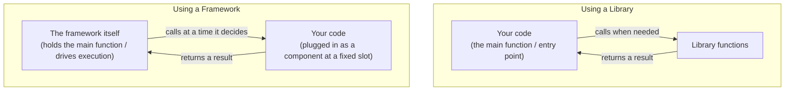

## Introduction

- **What you'll get from this article**: A systematic understanding of five terms that constantly show up in software explanations — **framework**, **library**, **runtime**, **SDK**, and **API** — organized along a single axis: "whose code calls whose," with concrete examples for each.
- **Intended audience**: Anyone who has read explanations like "ASP.NET is a framework" or "install the .NET Framework," but can't quite articulate what actually separates a framework from a library, or how those relate to an SDK or a runtime.
- **Estimated reading time**: About 14 minutes

This article is part of the [Top 1% Series: Full Article Guide](/en/sitemap), the 11th in the [Linux/OS Fundamentals Series](/en/sitemap#series-list). This confusion isn't specific to any one OS or language, so it's treated as its own independent topic.

## Prerequisite Knowledge

- **Library basics**: Reading [What Is a Library? Understanding Static and Dynamic Linking from a "Top 1%" Perspective](/en/articles/software-library-guide) first will make this article easier to follow.

## Getting the Big Picture

### Every one of these distinctions comes down to "who calls whom"

**The difference between a library and a framework isn't about how much functionality it has or how complex it is — it comes down to a single point: which direction the flow of control points.** This idea is called **Inversion of Control (IoC)**, and in software engineering it's sometimes explained with a phrase borrowed from a Hollywood audition: **"Don't call us, we'll call you."**

- **Using a library**: **Your code is the protagonist.** Within the flow of the program you wrote, you call the library's functions whenever you need them. Control always stays with your code.
- **Using a framework**: **The framework is the protagonist.** Within the execution framework the framework provides (like an HTTP request-receiving loop), the framework calls the code you wrote (like a controller method) at a time it decides. Control stays with the framework.

## A Thorough, Grounds-Up Explanation

### Confirming this concretely with ASP.NET, a framework

Using ASP.NET — which came up in [Understanding How IIS and ASP.NET Work from a "Top 1%" Perspective](/en/articles/iis-fundamentals-guide) — as an example makes this distinction clear. A developer using ASP.NET **never writes the sequence "receive an HTTP request, open a TCP socket, ..." themselves.** Instead, they only supply **the component** ("when this URL pattern comes in, run this method") and **leave the timing and order of when it's called entirely up to ASP.NET.** That's the substance behind saying "ASP.NET is a framework."

By contrast, the encryption or string-processing libraries covered in [What Is a Library?](/en/articles/software-library-guide) are things **your code actively decides to call, and when** — control is never handed over.

### What is a runtime? The ground a framework stands on

**Runtime** is another important concept, distinct from both frameworks and libraries. A runtime refers to **the actual environment required to execute code that has been compiled (or converted to an intermediate language).**

A representative example is .NET's **CLR (Common Language Runtime)**. Code written in C# simply won't run without the CLR as its execution environment. ASP.NET, as a framework, itself runs on top of the CLR runtime internally. In other words, it helps to picture it this way: **a framework is "the blueprint for a building constructed on the foundation," while a runtime is "the ground the building actually stands on."**

### What is an SDK? A toolbox packaged together

An **SDK (Software Development Kit)** operates on **a different dimension entirely** from frameworks, libraries, or runtimes. An SDK doesn't refer to a particular execution model — it refers to **"a single package that bundles together all the tools needed to develop software for a specific platform."**

Installing the `.NET SDK` bundles together everything you need for development: the CLR (a runtime), the framework class library (a set of libraries), a compiler, command-line tools, and more. **This is a containment relationship — the SDK bundles a runtime and libraries inside it** — not something that itself gets called at runtime.

### What is an API? Not software, but a "contract"

Finally, **API (Application Programming Interface)**. Unlike the previous four, **an API isn't a piece of software at all — it's the promise itself** ("call it this way, and it'll respond like this") — the interface specification.

- A library implements concrete behavior internally, while exposing an API (function signatures) for calling it from outside.
- A framework likewise provides slots for your code to plug into — interfaces or base classes exposed as its API.
- What "Web API" refers to — an HTTP-based contract you call over a network — is also just one kind of the same "API" concept.

**In other words, an API is the "interface specification" that an entity like a library or framework exposes externally** — it isn't the entity itself.

### A summary table of all five terms

| Term | What it actually is | Who holds control |
|---|---|---|
| **Library** | A collection of functional components your code actively calls | Your code |
| **Framework** | An execution framework that plugs your code in as a component | The framework |
| **Runtime** | The actual environment needed to execute code | (A foundation that sits outside the calling/called concept) |
| **SDK** | A package bundling the tools needed for development (runtime, libraries, compiler, etc.) | (A containment relationship — the concept of "control" doesn't apply) |
| **API** | Not a piece of software, but the contract for how to call something | (Not an entity — the concept of "control" doesn't apply) |

## The View From the Top 1% Perspective

### Why this distinction is directly tied to real-world architecture decisions

This distinction isn't just terminology-sorting — it's **directly tied to a genuinely important real-world question: how much does it cost to switch to something else later?**

- **Swapping out a library**: Since control stays with your code, swapping in a different library with the same function signatures (API) often gets away with comparatively small changes.
- **Swapping out a framework**: Because your code itself is written to fit that framework's execution model (inheriting base classes, using fixed method names, following a fixed directory layout), migrating to a different framework almost always requires **substantially rewriting the structure of that code itself.**

When adopting a new technology, figuring out whether it's a "library" or a "framework" is an essential perspective for **estimating how much future technical debt you're taking on.**

## Common Misconceptions and Pitfalls

- **Misconception 1: "A library and a framework only differ in scale"**
  It's not about scale — it's a structural difference in which side holds control. Small frameworks and huge libraries both exist.
- **Misconception 2: ".NET Framework is just another name for an SDK"**
  .NET Framework is the name of an execution environment containing a runtime (the CLR) and the framework class library — a different concept from an SDK, which refers to a bundle of development tools.
- **Misconception 3: "API only refers to a Web API"**
  A Web API is just one kind of API. A locally-called library's function signature is also called an API.

## The Troubleshooting Perspective

Confusing these terms shows up in practice as **misjudging how much needs to change, and where, to fix a problem.**

1. **"Upgrading this library's version broke things"**: In most cases, this comes from a change to a published API (function signature), and the blast radius is limited to the places that call that library.
2. **"Upgrading the framework's major version broke a huge amount of code"**: Because a framework holds control, a change to its internal execution model can affect the very structure of your code.
3. **"It won't start because the runtime version doesn't match"**: This isn't a framework or library problem at all — the foundation that actually executes the code (the runtime) doesn't meet the required version.

### Preventive Measures and Permanent Fixes

- Before adopting a new technology, confirm whether it's a "library" or a "framework," and factor that into your estimate of switching cost.
- When upgrading versions, first isolate which layer changed — runtime, framework, or library — before investigating the blast radius.

## Summary

- The difference between a library and a framework comes down to Inversion of Control (IoC) — which side holds control — not the scale of functionality.
- A runtime is the actual environment needed to execute code, and a framework is built on top of that runtime.
- An SDK operates on a different dimension: it's a package bundling the tools needed for development, such as a runtime, libraries, and a compiler.
- An API isn't a piece of software — it's the contract itself for how to call something.

**What to Keep in Mind From Today**
1. When you encounter a new technology, build the habit of first judging whether it's a library or a framework, based on which side holds control.
2. When you encounter the words "SDK," "runtime," or "API," keep in mind that each refers to something on a different dimension.

## References

- [Inversion of Control Containers and the Dependency Injection pattern | Martin Fowler](https://martinfowler.com/articles/injection.html)
- [.NET architecture guides | Microsoft Learn](https://learn.microsoft.com/en-us/dotnet/architecture/)
- [What is an SDK? | Microsoft Learn](https://learn.microsoft.com/en-us/windows/apps/desktop/modernize/desktop-to-uwp-supported-api)
