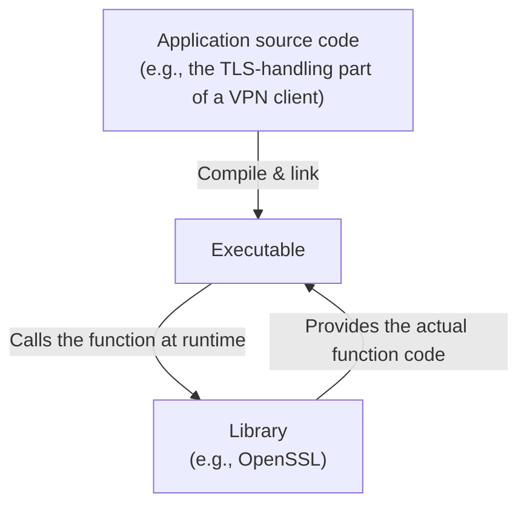
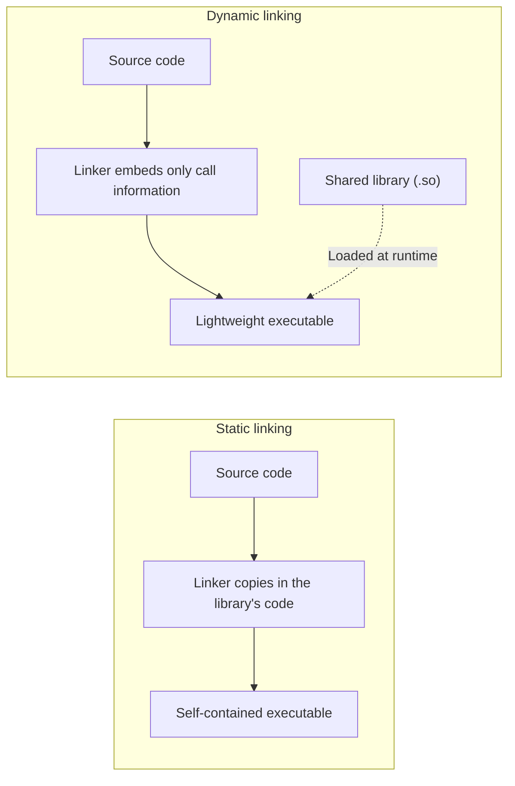

## Introduction

- **What You'll Learn From This Article**: What a "library" actually is — how a program calls into a library's code, how static linking differs from dynamic linking (shared libraries), and why "library version mismatch" failures happen in the first place.
- **Intended Audience**: This article is aimed at infrastructure engineers who manage servers and application runtime environments, who use the word "library" all the time but, when pressed to explain it, can't get past "a convenient bundle of routines a program calls."
- **Estimated Reading Time**: About 15 minutes

This article is part of the [Top 1% Series' full article guide](/en/sitemap).

## Prerequisites

- **Compile**: The process of translating source code (e.g., in C) into machine code that the CPU can execute directly.
- **Executable**: A file, produced by compiling and linking, that can be run directly on the OS.
- **Process**: The running instance of a program. Covered in more detail in [What Is a Daemon?](/en/articles/linux-daemon-guide).

## Getting the Big Picture

### In a Nutshell

**A library is a file containing pre-compiled routines (functions) meant to be shared across multiple programs, so that no single program has to reimplement that logic from scratch.** The general idea of "package up commonly used logic and reuse it" applies to programming in general, but the specific word "library" refers to the case where **that packaged logic is delivered as an independent file and gets incorporated into another program through the compiling and linking process** — a mechanism that operates at the level of the OS and the build system.



Instead of implementing a cryptographic algorithm from scratch, a program can simply call functions provided by a cryptography library like OpenSSL to get secure TLS communication — this is the most basic value a library provides.

## The Fundamentals, Explained Thoroughly

### Static Linking and Dynamic Linking: Two Ways to "Incorporate" a Library

From the perspective of how a library's contents (the compiled machine code for its functions) end up in an executable, libraries fall broadly into two categories.

| Type | File format (Linux) | When it's incorporated | Characteristics |
|---|---|---|---|
| Static library | `.a` (archive) | At compile/link time | The library's code is copied directly into the executable, producing one self-contained file |
| Dynamic / shared library | `.so` (shared object) | At runtime (or partly at startup) | The executable only records "how to call it"; the actual code is loaded from a separate file at runtime |



**Static linking makes an executable self-contained (it runs fine even if the target system lacks the library), but the file gets larger and multiple programs using the same library each end up with a duplicate copy of that code. Dynamic linking lets multiple programs share a single copy of the shared library, both on disk and in memory**, which is efficient in terms of both disk space and memory usage. Most of the programs shipped by mainstream Linux distributions use dynamic linking (shared libraries) for this reason.

### How a Program Finds a Library's Functions

When a dynamically linked executable starts up, the OS doesn't just run the executable itself — it goes through a separate program called the **dynamic linker (`ld.so`/`ld-linux.so` on Linux)** to load whatever shared libraries are needed.

1. The executable itself only records "which shared libraries are needed" and "which functions (symbols) from them are used."
2. The dynamic linker searches for the required `.so` files, using search paths specified in `/etc/ld.so.conf` or the `LD_LIBRARY_PATH` environment variable.
3. It maps the shared libraries it finds into the process's memory space and wires up each function call in the executable to the actual address of that code inside the shared library — this is called **symbol resolution**.

```bash
# Check which shared libraries an executable depends on
$ ldd /usr/sbin/openvpn
        linux-vdso.so.1
        libssl.so.3 => /lib/x86_64-linux-gnu/libssl.so.3
        libcrypto.so.3 => /lib/x86_64-linux-gnu/libcrypto.so.3
        liblzo2.so.2 => /lib/x86_64-linux-gnu/liblzo2.so.2
        libc.so.6 => /lib/x86_64-linux-gnu/libc.so.6
```

As this shows, the OpenVPN executable itself doesn't contain any TLS/cryptography code. **It only becomes capable of encrypted communication once it loads OpenSSL (`libssl`/`libcrypto`) as a shared library at startup.** This is the mechanical, execution-level reality behind the common description that "OpenVPN reuses the TLS library, OpenSSL."

<details>
<summary>Aside: Header files versus the library itself</summary>

When using a library from a language like C, source code needs to include a **header file** such as `#include <openssl/ssl.h>`. The header file only contains declarations of a function's interface — its name, parameter types, and return type — and none of the actual implementation. The implementation itself lives inside a `.a` or `.so` library file. The compiler checks against the header that calls are made correctly, and the linker later wires up the actual code from the library file — a clean division of labor between the two.

</details>

### How Package Managers Relate to Libraries

A Linux distribution's package manager (`apt`, `dnf`, etc.) commonly splits a library into a "runtime package" and a "development package" (with a `-dev`/`-devel` suffix).

- **Runtime package (e.g., `libssl3`)**: Contains only the compiled shared library (`.so`) itself. This is all you need to run an already-compiled program.
- **Development package (e.g., `libssl-dev`)**: Additionally contains header files, static `.a` files, and symbolic links. You need this if you're compiling a program that uses the library yourself.

Not knowing this distinction is a classic source of confusion — trying to build software from source and hitting an error like `fatal error: openssl/ssl.h: No such file or directory` almost always means the development package was never installed.

## What the Top 1% Sees

### ABI Compatibility: Why "the Same Library" Sometimes Doesn't Work

A shared library is tied to executables through its **ABI (Application Binary Interface)** — the agreed-upon calling convention and in-memory data layout for its functions. When a library's major version bumps and existing function signatures (parameter types, counts) or data structures change, **an already-compiled executable can fail to work correctly with the newer library version, even if the source code itself would technically still be compatible (ABI incompatibility).**

This is exactly why Linux shared library filenames embed a version number, as in `libssl.so.3`. Because the executable records "I need `libssl.so.3`," it won't accidentally be loaded against a hypothetical future `libssl.so.4` that isn't ABI-compatible. Conversely, **a lot of "the library is installed, but this one application fails to start" incidents come down to the required major version of that library simply not being present.**

### The Performance Trade-off of Dynamic Linking

Dynamic linking incurs an overhead that static linking doesn't have: the symbol-resolution step described above happens at runtime. Many implementations mitigate the startup-time cost of this by using **lazy binding** — resolving a symbol only the first time that function is actually called, rather than resolving everything up front. In scenarios that launch enormous numbers of very short-lived programs, this dynamic-linking overhead becomes non-negligible, and that's a real reason some tools deliberately choose static linking instead (Go binaries defaulting to static linking is one well-known example of this trade-off).

## Common Misconceptions and Pitfalls

- **Misconception 1: "A library and a daemon are basically the same kind of thing."**
  A library is a "component" that gets incorporated into a program and called from within it; it doesn't run as a standalone resident process on its own. A [daemon](/en/articles/linux-daemon-guide) — a process that stays resident in the background — is started in a fundamentally different way. A daemon program can, internally, call any number of libraries while it runs.
- **Misconception 2: "As long as some version of the library is installed, the program will run."**
  Because of the ABI-compatibility issue described above, most programs require a specific major version (or a version at or above some minimum) of a library. A version that's too old or too new can both cause failures.
- **Misconception 3: "Static linking is always the better choice."**
  Static linking's self-containment is a real benefit, but it comes with downsides: multiple programs can't share memory/disk usage for the same library, and rolling out a security fix in the library requires rebuilding every single program that uses it. With dynamic linking, updating a single shared library file propagates the fix to every program that uses it.

## A Troubleshooting Perspective

Library-related failures are best triaged by asking **whether the needed library can't be found at all, or whether it was found but isn't the expected version/doesn't have the expected feature.**

1. **A program fails to start with `error while loading shared libraries`**: Run `ldd <executable>` to see which shared library is reported as "not found." A missing package or a misconfigured `LD_LIBRARY_PATH` are the typical causes.
2. **A build fails with a "No such file or directory" for a header file**: The development package (`-dev`/`-devel`) hasn't been installed. It's separate from the runtime package.
3. **The library seems to be present, but a specific function can't be found**: The installed version of the library may be older (or otherwise incompatible) and lack the function (symbol) the program requires. Check the installed version with something like `dpkg -l | grep <library name>`.

### Preventive Measures and Long-Term Fixes

- Pin library versions explicitly in container images or configuration management tools (like Ansible) to avoid "it works on one environment but not another" surprises.
- Before upgrading an OS or package, check whether any dependent library is about to get a major version bump, and identify the risk of ABI-incompatibility-driven application outages ahead of time.
- When distributing your own application, either document its library version requirements clearly, or bundle its dependencies into a fixed environment, such as a Docker container.

## Summary

- A library is a file containing pre-compiled routines shared across multiple programs, so that no program has to reimplement that logic from scratch.
- Static linking copies a library's code directly into the executable, making it self-contained; dynamic linking (shared libraries) loads it from a separate file at runtime — each has different trade-offs.
- A dynamically linked program relies on the dynamic linker to perform symbol resolution, wiring up function calls to the shared library's code at runtime.
- A lot of "the library is there, but it doesn't work" failures come down to ABI incompatibility — the required major version of the library simply isn't present.

**Things to Keep in Mind Starting Today**
1. When you hit a startup error, get in the habit of running `ldd` first to check which shared library couldn't be found.
2. If a build from source fails because a header file is missing, remember that the development package (`-dev`/`-devel`) is separate from the runtime package and needs to be installed too.

## References

- [ld.so(8) — Linux manual page](https://man7.org/linux/man-pages/man8/ld.so.8.html)
- [ldd(1) — Linux manual page](https://man7.org/linux/man-pages/man1/ldd.1.html)
- [Program Library HOWTO — The Linux Documentation Project](https://tldp.org/HOWTO/Program-Library-HOWTO/index.html)
