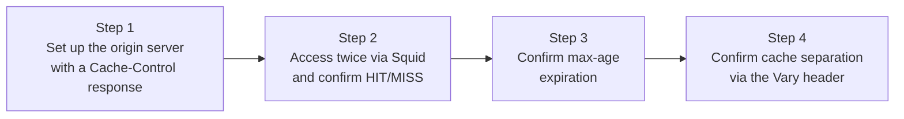

## Introduction

- **What You'll Learn From This Article**: Verify what you learned in [Cache-Control and the Vary Header](/en/articles/cache-control-vary-guide) by **actually building Squid as a caching proxy and confirming HIT/MISS behavior, expiration via max-age, and cache separation via the Vary header, with your own hands.**
- **Intended Audience**: Readers who've experienced URL-level access control in [the Squid hands-on](/en/articles/squid-proxy-handson-guide), but have never used Squid's actual caching feature, and want to confirm what Cache-Control and Vary do in theory as actual, concrete behavior.
- **Estimated Reading Time**: About 25 minutes, including the hands-on exercise

This article is part of the [Top 1% Series Complete Article Guide](/en/sitemap), and the seventh article in the [Web Proxy/Caching Fundamentals Series](/en/sitemap#series-list). You can follow along with two of the Ubuntu Server environments set up in the [Hands-On Prep Manual](/en/articles/handson-prep-guide) (one for the proxy, one for the origin server).

## Prerequisite Knowledge

- **Squid's Basic Setup**: Installing Squid and configuring the client side, covered in [the Squid Explicit Proxy Hands-On](/en/articles/squid-proxy-handson-guide).
- **Cache-Control and Vary in Theory**: The meaning of each directive, covered in [Cache-Control and the Vary Header](/en/articles/cache-control-vary-guide).

## Getting the Big Picture

This hands-on covers four steps.



## Hands-On Steps

### Step 1: Set Up the Origin Server With a Cache-Control Response

On the Ubuntu Server acting as the origin, start a simple server that responds with a `max-age` and a Vary header.

```python
import time
from http.server import BaseHTTPRequestHandler, HTTPServer

class Handler(BaseHTTPRequestHandler):
    def do_GET(self):
        self.send_response(200)
        self.send_header('Cache-Control', 'max-age=10')
        self.send_header('Vary', 'Accept-Language')
        self.end_headers()
        lang = self.headers.get('Accept-Language', 'default')
        body = f"Response generated at {time.time():.2f}, lang={lang}"
        self.wfile.write(body.encode())

HTTPServer(('0.0.0.0', 8080), Handler).serve_forever()
```

```bash
python3 origin_server.py &
```

This server **includes the time it generated the response in the body**, letting you tell with your own eyes whether a given response came from the cache or was freshly generated by the origin.

### Step 2: Access Twice Through Squid, and Confirm HIT/MISS

Use the Squid you built in [the previous Squid hands-on](/en/articles/squid-proxy-handson-guide) as an explicit proxy to this origin server.

```bash
curl -x http://<Squid's address>:3128 -s -D - http://<origin server's address>:8080/ -o /dev/null | grep -i x-cache
sleep 2
curl -x http://<Squid's address>:3128 -s -D - http://<origin server's address>:8080/ -o /dev/null | grep -i x-cache
```

**Output:**

```
X-Cache: MISS from squid
X-Cache: HIT from squid
```

**The first access shows `MISS` — it wasn't in the cache, and a real query to the origin server happened. The second access shows `HIT` — Squid answered instantly from its own held cache, never querying the origin server at all.** Checking the body confirms the exact same response-generation timestamp both times, backing this up.

### Step 3: Confirm Expiration via max-age

Since you set `max-age=10` (the cache goes stale after 10 seconds), **wait over 10 seconds and access it again.**

```bash
sleep 11
curl -x http://<Squid's address>:3128 -s -D - http://<origin server's address>:8080/ -o /dev/null | grep -i x-cache
```

**Output:**

```
X-Cache: MISS from squid
```

**Accessing it again past the 10-second mark shows `MISS` once more, confirming a real query to the origin server happened.** This confirms, concretely, that the `max-age` value [covered in the lecture](/en/articles/cache-control-vary-guide) actually functions inside Squid as this exact expiration check.

### Step 4: Confirm Cache Separation via the Vary Header

**Access the same URL with different `Accept-Language` headers.**

```bash
curl -x http://<Squid's address>:3128 -s -D - -H "Accept-Language: ja" http://<origin server's address>:8080/ -o /tmp/res_ja.txt | grep -i x-cache
curl -x http://<Squid's address>:3128 -s -D - -H "Accept-Language: en" http://<origin server's address>:8080/ -o /tmp/res_en.txt | grep -i x-cache
cat /tmp/res_ja.txt
cat /tmp/res_en.txt
```

**Output:**

```
X-Cache: MISS from squid
X-Cache: MISS from squid
Response generated at 1760000001.23, lang=ja
Response generated at 1760000001.45, lang=en
```

**You confirmed accessing with `Accept-Language: ja` and `Accept-Language: en` each produced a `MISS`, treated as two separate responses (with different generation timestamps).** This confirms, concretely, that [the Vary header covered in the lecture](/en/articles/cache-control-vary-guide) — "treat this as a separate cache whenever a specified header's value differs, even for the same URL" — is actually what's driving Squid's behavior here.

<details>
<summary>What Happens If You Remove the Vary Specification?</summary>

Try removing the `self.send_header('Vary', 'Accept-Language')` line from the origin server's code, restart the server, and try the exact same steps again. **After caching a response for `Accept-Language: ja`, accessing with `Accept-Language: en` now returns `X-Cache: HIT`, serving the `lang=ja` response as-is — content that was never meant for an English-speaking user.** This is a concrete reproduction of exactly [the common real-world failure covered in the lecture](/en/articles/cache-control-vary-guide), caused by forgetting to specify Vary.

</details>

## What a Pro Sees Here (Top 1% Understanding)

### The X-Cache Header Is Debug-Only Information That Never Existed in the Original Response

The `X-Cache` header you confirmed in this hands-on **was never generated by the origin server — Squid itself attaches it to the response, purely for debugging and operational investigation.** Whenever caching behavior looks suspicious in real-world practice, the first step is checking whether a debug header like `X-Cache` is enabled, and **isolating "is the server slow," "is the cache perpetually missing," or "is the cache unintentionally hitting" based on the concrete evidence of that header's value, rather than guesswork.** That's the first step of troubleshooting.

## Common Misconceptions and Pitfalls

- **Misconception 1: "HIT and MISS are information the origin server itself decides and returns."**
  The HIT/MISS judgment and the X-Cache header's attachment are done by the caching proxy (Squid) itself. The origin server never participates in this judgment.
- **Misconception 2: "Once max-age expires, the cache gets deleted instantly."**
  An expired cache entry only triggers a re-fetch from the origin the next time a request actually arrives. There's no always-running process actively monitoring and deleting it the moment it expires.
- **Misconception 3: "The more conditions you specify in Vary, the more efficient caching becomes."**
  The more conditions you specify in Vary, the more finely the cache gets split, which actually lowers the probability of the same content landing a cache hit. Specifying only the conditions genuinely necessary matters.

## Troubleshooting Perspective

1. **The cache isn't hitting as expected**: Check the actual judgment via the `X-Cache` header, and revisit your `Cache-Control` settings for `max-age` or `no-store`.
2. **Users under different conditions get served the same cached response**: Check whether your `Vary` header specification covers every condition (language, device, and similar) that actually changes the response.
3. **Cache efficiency (the hit rate) is low**: Check whether the conditions specified in `Vary` have become excessively granular.

## Summary

- Squid uses its own header, `X-Cache`, to explicitly signal HIT (answered from cache) or MISS (queried the origin), as debug information.
- Once the expiration set via Cache-Control's `max-age` passes, the next access returns `MISS` again, triggering a query to the origin server.
- Specifying the `Vary` header correctly separates the same URL into distinct caches whenever the value of a specified request header differs.
- Forgetting to specify `Vary` causes responses that should genuinely be separate to get incorrectly served from the same cache.

**Takeaways to Apply Today**
1. When investigating caching behavior, build the habit of first checking for a debug header like X-Cache.
2. When configuring the Vary header, narrow it down to only the conditions that genuinely change the response, at the minimum necessary.

## References

- [Squid: Configuring Cache Peers and Debugging | Squid Wiki](https://wiki.squid-cache.org/)
- [RFC 7234 - HTTP/1.1 Caching](https://datatracker.ietf.org/doc/html/rfc7234)
