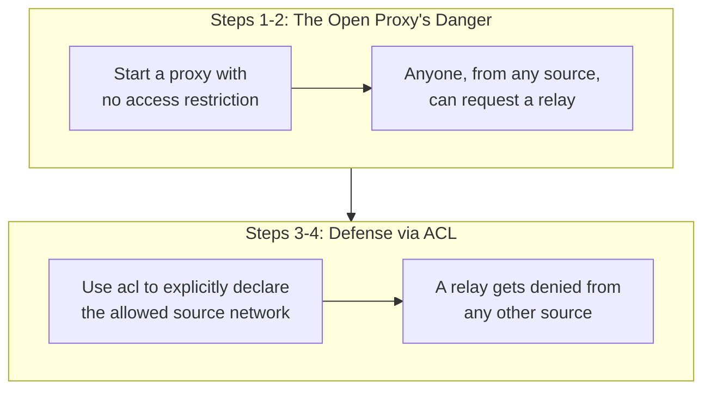

## Introduction

- **What You'll Learn From This Article**: Reproduce — inside a safe, controlled test environment — the danger that **the proxy you built in [the Squid explicit-proxy hands-on](/en/articles/squid-proxy-handson-guide) becomes an "open proxy," accepting a relay request from anyone on the internet, if you configure zero access restriction at all**, and confirm the defense achieved with **Squid's `acl` configuration**, explicitly allowing or denying by source network.
- **Intended Audience**: Readers who understand Squid's basic configuration, but can't explain exactly what configuration achieves access restriction on a proxy.
- **Important Note**: **This hands-on exercise is for educational and defensive purposes — to strengthen the defenses of an environment you yourself control.** Never run this procedure against someone else's live environment without authorization. The test environment used here only ever communicates with a server you set up yourself, and contains no attack procedure directed at any third-party system whatsoever.
- **Estimated Reading Time**: About 22 minutes, including the hands-on exercise

This article is part of the [Top 1% Series Complete Article Guide](/en/sitemap), and the tenth article in the [Web Proxy/Caching Series](/en/sitemap#series-list). You can follow along with one of the Ubuntu Server environments set up in the [Hands-On Prep Manual](/en/articles/handson-prep-guide).

## Prerequisite Knowledge

- **Basic Squid Operations**: The basic Squid configuration covered in [the Squid explicit-proxy hands-on](/en/articles/squid-proxy-handson-guide).

## Getting the Big Picture

This hands-on covers two stages.



## Hands-On Steps

### Step 1: Start Squid With Zero Access Restriction Configured

```bash
sudo apt install -y squid
```

Deliberately disable every one of the default access-restriction rules in `/etc/squid/squid.conf` related to source networks (other than rules like `http_access deny !Safe_ports`).

```
http_access allow all
http_port 3128
```

```bash
sudo systemctl restart squid
```

### Step 2: Request a Relay From a Separate Test Network

From a network separate from where this proxy was built (a second test client), attempt to communicate through this proxy.

```bash
curl -x http://<the proxy's IP address>:3128 http://example.com/ -o /dev/null -s -w "%{http_code}\n"
```

**Output:**

```
200
```

**A request from an entirely unrelated network, from anyone other than this proxy's own builder, just got relayed with no restriction whatsoever.** This is an **open proxy.** If this proxy were exposed on the internet, there's a real danger it could get abused as **a stepping stone for a third party to make an unauthorized access against some other server while hiding their own identity (IP address) behind this proxy.**

<details>
<summary>Why an Open Proxy Gets Created Unintentionally</summary>

**Squid's configuration takes the form of explicitly adding what to allow, and forgetting to write a restriction on the source can, depending on the default behavior, result in a configuration that unintentionally allows access from the entire world.** The typical path to an open proxy is temporarily setting an overly broad allowance, like `http_access allow all`, for the sake of "just getting it working" during testing, then forgetting to revert it before going into production.

</details>

### Step 3: Explicitly Declare the Allowed Source Network via ACL

```bash
sudo tee /etc/squid/squid.conf << 'EOF'
acl allowed_network src 192.168.1.0/24
http_access allow allowed_network
http_access deny all
http_port 3128
EOF
sudo systemctl restart squid
```

**`acl allowed_network src 192.168.1.0/24` is a definition: "identify only traffic from this IP address range under the name `allowed_network`."** Then `http_access allow allowed_network` allows only traffic from that range, and `http_access deny all` explicitly denies everything else.

### Step 4: Confirm Access From an Unauthorized Network Gets Denied

```bash
curl -x http://<the proxy's IP address>:3128 http://example.com/ -o /dev/null -s -w "%{http_code}\n"
```

**Output:**

```
403
```

**Unlike before, a request from an unauthorized network got denied, as a 403 (Forbidden).** Confirm, too, that the same request, sent from a client inside the network range specified in `allowed_network`, still gets relayed normally.

## What a Pro Sees Here (Top 1% Understanding)

### Access Control Is Premised on "Closing With a Final Deny-All," Not Just "Adding Allow Rules"

The biggest lesson from this hands-on is that **merely listing the rules you want to allow is never enough to reliably deny access from an unexpected source, without an explicit final deny rule (`http_access deny all`).** **Access-control rules get evaluated top to bottom, and the first matching rule applies, so you always need to explicitly define how a source gets handled in the end, when it matches none of your intended allow rules.** This shares the same underlying risk structure as [DNS amplification defense (response rate limiting)](/en/articles/dns-amplification-rrl-handson-guide) and [mail open-relay hardening](/en/articles/mail-open-relay-handson-guide): **"a configuration that opens a service up to third parties without limit gets created easily, regardless of the builder's actual intent" — a risk structure common across relay-type services in general, whether proxies, DNS, or mail.** A top-1% engineer, every time they build a new relay-type service, explicitly confirms "who is this service meant to serve, and is everyone else genuinely denied?"

## Common Misconceptions and Pitfalls

- **Misconception 1: "Installing Squid automatically applies an access restriction."**
  Access-restriction configuration only takes effect when explicitly written. Forgetting to tighten a loose test-time configuration before production is the typical cause of an open proxy.
- **Misconception 2: "Writing only the rule for the network you want to allow means everything else gets denied automatically."**
  Without an explicit final deny rule (`http_access deny all`), the behavior could end up unintended.
- **Misconception 3: "An open proxy only ever harms the proxy server itself."**
  An open proxy's real danger is getting abused as a stepping stone, letting a third party hide their identity while attacking some other third party through it.

## Troubleshooting Perspective

1. **Access even from an intended source gets denied**: Check whether the IP address range defined in `acl` actually matches the real source's IP address.
2. **Behavior doesn't change despite a configuration change**: After changing Squid's configuration, run `systemctl restart squid` (or `reload`) and confirm the change actually took effect.
3. **You suspect abuse of a proxy exposed externally**: Check the access log for a large volume or an abnormal pattern of requests from an unexpected source.

## Summary

- A proxy with zero access restriction configured becomes an "open proxy," accepting a relay request from anyone, regardless of source.
- An open proxy carries a real danger of getting abused as a stepping stone, letting a third party hide their identity while making an unauthorized access against another server.
- Squid's `acl` configuration prevents this danger, by explicitly defining the allowed source network and explicitly denying everything else.
- Access-control rules are premised on closing with an explicit final deny rule, not just listing allow rules.

**Takeaways to Apply Today**
1. When building a new proxy or any other relay-type service, always build in access-restriction rules from the initial design stage.
2. When writing access-control rules, always explicitly confirm "how does a source get handled in the end, if it matches none of these rules?"

## References

- [Squid: ACLs](https://wiki.squid-cache.org/SquidFaq/SquidAcl)
- [Open Proxy | OWASP](https://owasp.org/www-community/attacks/Open_Proxy)
