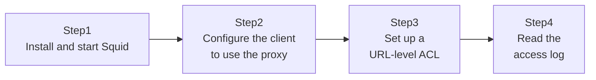

## Introduction

- **What You'll Learn From This Article**: [Understanding When to Use a Proxy vs. a Firewall from a "Top 1%" Perspective](/en/articles/proxy-firewall-guide) covered how a proxy understands and controls traffic based on its content (a URL, for example) — this article builds that hands-on, using the open-source proxy software **Squid.** You'll configure a client to route through it, set up an ACL (access control list) that permits or denies access based on URL, and read the access log to see exactly which traffic was relayed and which was denied.
- **Intended Audience**: Readers who understand the concept of a proxy, but have never actually built a proxy server and used it from a client.
- **Estimated Reading Time**: About 25 minutes (about 45 minutes if you build along with the hands-on)

This article is part of the [Top 1% Series Complete Article Guide](/en/sitemap), the 3rd article in the [Web Proxy/Caching Fundamentals Series](/en/sitemap#series-list). You can do this on an Ubuntu Server environment built from the [Hands-On Prep Manual](/en/articles/handson-prep-guide).

## Prerequisite Knowledge

- [Understanding When to Use a Proxy vs. a Firewall from a "Top 1%" Perspective](/en/articles/proxy-firewall-guide): The difference between an explicit proxy and a transparent proxy is a prerequisite for this article.

## The Big Picture

This hands-on consists of four steps.



## Hands-On Steps

### Step 1: Install and start Squid

Install Squid on your Ubuntu Server.

```bash
sudo apt update
sudo apt install -y squid
sudo systemctl status squid
```

**Even with the default config, Squid is already running as an explicit proxy on port 3128.** By default, though, only a limited scope is permitted — access from `localhost`, for example.

### Step 2: Configure the client to use the proxy

From a separate machine (or a different terminal on the same VM), configure it to use this Squid server as an explicit proxy.

```bash
export http_proxy="http://<Squid server's address>:3128"
export https_proxy="http://<Squid server's address>:3128"
curl http://example.com/
```

**As covered in [Understanding When to Use a Proxy vs. a Firewall](/en/articles/proxy-firewall-guide), this is an "explicit proxy."** The client (`curl`, in this case) explicitly recognizes it's going through Squid, via an environment variable. With no ACL configured yet, whether access succeeds as expected depends on the default config.

### Step 3: Set up a URL-level ACL

Edit `/etc/squid/squid.conf` and add an ACL that denies access to just one specific domain.

```bash
sudo nano /etc/squid/squid.conf
```

```
acl blocked_sites dstdomain .blocked-example.test
http_access deny blocked_sites
http_access allow localnet
http_access allow localhost
http_access deny all
```

**`acl blocked_sites dstdomain .blocked-example.test` defines the domain `blocked-example.test` (and its subdomains) as a group named `blocked_sites`.** `http_access deny blocked_sites` then denies access to that group. **Note that `http_access` rules are evaluated top to bottom, and the first matching rule is the one applied.** Apply the config.

```bash
sudo systemctl reload squid
```

### Step 4: Read the access log

Try accessing both an allowed site and the denied one, through Squid.

```bash
curl http://example.com/
curl http://blocked-example.test/
```

The second command should fail with something like `403 Forbidden`. Check Squid's access log.

```bash
sudo tail -f /var/log/squid/access.log
```

**Each log line records a timestamp, the client's IP address, the result (`TCP_DENIED`, for example), and the accessed URL.** If you see a line for `blocked-example.test` with a `TCP_DENIED` result, that confirms the ACL is working as intended.

## What a Pro Sees Here (Top 1% Understanding)

### http_access Rule Evaluation Order — a Common Real-World Gotcha

The `http_access` rules set up in Step 3 are **evaluated top to bottom, and the very first matching rule decides the outcome immediately. No rule after it is ever evaluated.** This is a very similar idea to the ACL evaluation order covered in labs like [The Top 1% Hands-On for Reproducing Kerberoasting](/en/articles/ad-kerberoasting-handson-guide). Write a broad rule like `http_access allow all` before a `deny` rule, and every `deny` rule after it never gets evaluated at all, leaving you with an unintended allow-everything state. **If access control in a Squid config isn't behaving as intended, the first thing to suspect is the order the rules are written in.**

### A Proxy's ACL Only Works Because It Has "Application-Layer Knowledge"

The `dstdomain`-based ACL set up in this hands-on is a concrete implementation of what [Understanding When to Use a Proxy vs. a Firewall](/en/articles/proxy-firewall-guide) covered: "a proxy actually understands the content of an HTTP request (in this case, a hostname) and controls based on it." Where a firewall only judges by IP address, Squid can decide allow or deny at the domain-name level, based on the request's `Host` header or SNI (for TLS), even for servers sharing the same IP address. This exact difference is the fundamental difference in role between a proxy and a firewall.

## Common Misconceptions and Pitfalls

- **Misconception 1: "http_access rules are all evaluated, and the strictest judgment applies."**
  In reality, they're evaluated top to bottom, and the first matching rule decides the outcome immediately. The order the rules are written in determines the result.
- **Misconception 2: "Access to a domain denied by an ACL becomes unreachable at the network level."**
  What Squid returns is an HTTP-level denial response (like 403) — a separate path that doesn't go through the proxy (a direct connection, say) could still potentially reach it.
- **Misconception 3: "Once Squid is running, the default config alone is safe enough for production use."**
  The default config is a minimal one meant for testing purposes — real-world operation requires explicitly configuring things like the permitted source network range, based on your actual purpose.

## Troubleshooting Perspective

1. **`curl` gets `Connection refused`**: Check with `sudo systemctl status squid` whether the Squid service is actually running. Also check whether a firewall (like ufw) is blocking port 3128.
2. **A site an ACL should deny is still reachable**: Check the order of the `http_access` rules. If an allow rule is written before a deny rule, that deny rule never gets evaluated.
3. **The ACL doesn't take effect after reload**: Check the config file for syntax errors with `squid -k parse` (or a syntax check before `squid -k reconfigure`).

## Summary

- Squid is open-source proxy software that relays traffic from clients as an explicit proxy.
- An ACL like `dstdomain` enables access control at the domain-name level, rather than by IP address.
- `http_access` rules are evaluated top to bottom, and the first matching rule applies — so the order they're written in matters enormously.
- The access log records exactly which traffic was permitted or denied, letting you confirm an ACL's actual behavior.

**Takeaways to Apply Today**
1. When writing Squid's `http_access` rules, build the habit of writing more specific deny rules before broader allow rules.
2. Always confirm an ACL is working as intended by checking the actual result in the access log.

## References

- [Squid: ACLs](https://www.squid-cache.org/Doc/config/acl/)
- [Squid: http_access](https://www.squid-cache.org/Doc/config/http_access/)
