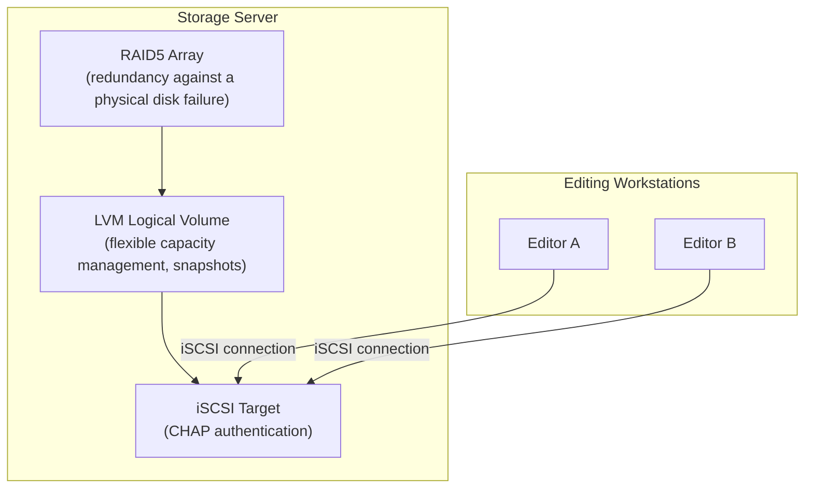

## Introduction

- **What You'll Learn From This Article**: This is the Storage Department's capstone project, where you'll **integrate, on your own, the techniques you've learned one at a time in earlier hands-on labs** (redundancy and parity via RAID1 and RAID5, SAN construction and CHAP authentication via iSCSI, logical volume management and snapshots via LVM) **into a single fictional video production studio's shared storage infrastructure.** Where earlier articles aimed at "following steps to reliably master one technique," this article takes a format much closer to real-world work: **presenting only requirements, and leaving you to design which techniques to combine, and how.**
- **Intended Audience**: Readers who've worked through the Storage Department's Junior, Senior, and Graduate School content and can execute each individual hands-on lab, but have never designed a single storage infrastructure combining them.
- **Estimated Reading Time**: Expect several days to about a week, including design, building, and documentation (the heaviest single hands-on in this series).

This article is part of the [Top 1% Series Complete Article Guide](/en/sitemap). It's positioned as the capstone project within the [Storage Department's full curriculum](/en/university#storage-department).

## Prerequisite Knowledge

This hands-on doesn't teach new techniques. **It combines techniques you've already mastered in the following hands-on labs.**

- [Understanding the Relationship Between RAID and Windows Disk Management From a Top 1% Perspective](/en/articles/disk-raid-fundamentals-guide)
- [A Top 1% Hands-On for Building a Linux Software RAID1 Array With mdadm and Reproducing a Disk Failure and Rebuild Yourself](/en/articles/mdadm-raid-handson-guide)
- [Understanding RAID5 and RAID6 Parity Calculation From a Top 1% Perspective](/en/articles/raid5-parity-guide)
- [A Top 1% Hands-On for Building RAID5 With mdadm and Confirming Parity-Based Data Recovery Yourself](/en/articles/mdadm-raid5-handson-guide)
- [Understanding How iSCSI Works From a Top 1% Perspective](/en/articles/iscsi-guide)
- [Understanding Thin Provisioning From a Top 1% Perspective](/en/articles/thin-provisioning-guide)
- [A Top 1% Hands-On for Creating an LVM Snapshot Yourself and Confirming What Copy-on-Write Really Is](/en/articles/lvm-snapshot-handson-guide)
- [A Top 1% Hands-On for Reproducing an Unauthenticated iSCSI Takeover Yourself and Confirming CHAP Authentication's Defense](/en/articles/iscsi-chap-hardening-handson-guide)

## The Challenge: A Fictional Video Production Studio's Shared Storage Infrastructure

**You're an infrastructure engineer at a fictional video production studio, "KoiKoi Studio." Until now, editors have each hoarded footage on their own laptop's local disk, creating two problems: material gets lost whenever a disk fails, and multiple people can't edit the same material at once. Your assignment is to build, with your own hands, a storage infrastructure that multiple editing workstations can share, satisfying every one of the following requirements.**

### Requirement 1: Prevent Footage Data From Being Lost if a Single Disk Fails

**Build a configuration where the service keeps running, and video footage data is never lost, even if one physical disk fails.** Be ready to explain, in terms of both capacity efficiency and recovery-time computational cost, why you chose the method you chose — whether that's RAID1, or why not RAID1.

### Requirement 2: Let Multiple Editing Workstations Safely Connect to the Same Storage

**Build a mechanism letting editing workstations connect to the storage over the network.** Restrict who can connect to only those workstations holding the correct credentials.

### Requirement 3: Allow Flexible Capacity Management for Future Growth in Footage Data

**Build a configuration where storage capacity can be flexibly expanded and reorganized later.** Rather than simply using the RAID array directly as a filesystem, consider a design that inserts an intermediate layer, adding flexibility.

### Requirement 4: Establish a Way to Safely Revert Before a Risky Operation

**Before performing a risky operation, such as a filesystem conversion or a large-scale data migration, prepare a mechanism that lets you quickly revert to the state right before that operation.** Also, explicitly state in your design document that this mechanism is never a defense against a physical failure itself.

### Requirement 5: Weigh Storage Utilization Efficiency Against the Risk of Running Out of Capacity

**You want to allocate each of several editing projects a volume with ample capacity, but you know the capacity each project actually ends up using varies widely.** Consider what capacity-allocation policy to adopt for this situation, together with its risk.

### Requirement 6: Establish a System Where Operators Notice When a Failure Occurs

**Make sure a RAID array entering a degraded state never goes unnoticed by operators.** Document the concrete detection method in your design document.

## Deliverable Requirements: Assemble It as a Portfolio

**This hands-on's final deliverable isn't just a confirmation that the configuration worked.** Assemble the following into a repository, such as on GitHub.

- **README.md**: An overview of this scenario, and the overall picture of the storage infrastructure you adopted (including a diagram, such as a mermaid chart)
- **A Record of Design Decisions**: The reasoning behind "why you chose that particular technique or configuration" — especially where a trade-off arose, such as your RAID method selection and capacity efficiency
- **Execution Steps**: A record of the configuration and verification commands you actually ran
- **An Incident Response Runbook**: The concrete steps an operator should take upon detecting a degraded state
- **A Retrospective**: Challenges you discovered while doing this, and what you'd additionally need to consider in real-world practice (dividing responsibilities with backups, integrating with monitoring tools, and similar)

**This deliverable is exactly the concrete achievement you can present in a job search or as a portfolio.** Simply explaining "I built RAID with mdadm" is far less persuasive than being able to demonstrate that, "under the realistic constraint of a live environment shared by multiple workstations, I designed by combining several techniques, and can articulate the trade-off between capacity efficiency and safety."

## What a Pro Sees Here (Top 1% Understanding)

### "The Ability to Follow Steps" and "the Ability to Design From Requirements" Are Entirely Different Skills

Every hands-on so far has taken the format of following a fixed set of steps: "Step 1, Step 2...." **But what actually gets evaluated in real-world work is never the ability to execute a procedure exactly as written — it's the ability to design, on your own, which techniques to combine and how, starting from given requirements** (what this article calls "Requirements 1 through 6"). These two are entirely different skills, despite looking similar. Even having completed every individual hands-on, without the experience of combining them into one coherent storage infrastructure design, you're not yet immediately effective in real-world work. This capstone project is deliberately designed to bridge that gap.

### Why This Scenario — "Shared by Multiple Workstations, With Future Growth"

There's a reason this hands-on, rather than being a one-off technical demo, is deliberately modeled on a realistic project — one where "multiple users access it simultaneously, and the data keeps growing over time." **Most real-world storage infrastructure builds never serve a single purpose in isolation — they need to simultaneously satisfy multiple axes at once: redundancy against a physical failure, safe access control, future scalability, and operational safety.** Knowing RAID's basic redundancy alone isn't enough for a real project — you also need to see through to safe sharing via iSCSI, flexible capacity management via LVM, and safe operation via snapshots. The ultimate goal of this capstone project is to elevate your knowledge of individual techniques into **design skill that sees through a storage infrastructure's entire lifecycle.**

## Common Misconceptions and Pitfalls

- **Misconception 1: "This hands-on has one single, fixed, correct configuration."**
  There's no single correct answer to this hands-on. Multiple valid approaches exist, as long as the design satisfies the requirements. What matters is recording, in your README.md, the design you chose and why.
- **Misconception 2: "A deliverable confirming it worked is sufficient on its own."**
  Confirming it works matters, but isn't sufficient on its own. Being able to articulate the reasoning behind your design decisions is this hands-on's real value.
- **Misconception 3: "Having completed every individual hands-on means this one will be easy too."**
  There's a large gap between knowing individual techniques and integrating them into one coherent design. Expect this to take considerable time.

## Troubleshooting Perspective

For this hands-on, **design-level rework** is the main challenge, more than individual technical troubleshooting.

1. **You think you've satisfied the requirements, then later notice a contradiction**: Before starting implementation, write up only the design portion of your README.md first, and confirm, at the writing stage, that you've satisfied every one of Requirements 1 through 6.
2. **You've forgotten the steps from an individual hands-on**: Don't hesitate to go back and reread the linked prerequisite article for each requirement. This capstone tests design skill, not memorization.
3. **You're not sure how much detail is enough**: Use "could I show this README.md to an interviewer I'm meeting for the first time, in a job search, and explain my design decisions?" as your benchmark for completeness.

## Summary

- This capstone project is an integrative exercise, combining techniques you've mastered individually in the Storage Department into a single fictional video production studio's shared storage infrastructure.
- What's required is never the ability to follow steps — it's the ability to design, on your own, from requirements.
- Assemble your deliverable as a portfolio document that articulates the reasoning behind your design decisions, not just a confirmation that it worked.

**Takeaways to Apply Today**
1. Even while learning an individual hands-on, build the habit of asking "under what future requirements would I actually end up using this?"
2. Beyond technical deliverables, build the habit of articulating the trade-off between capacity efficiency and safety in your day-to-day work too.

## References

- [The Storage Department's Full Curriculum](/en/university#storage-department)
