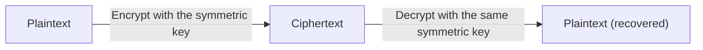
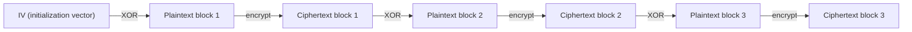
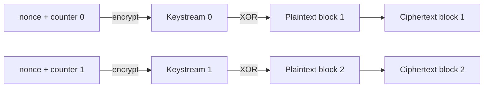
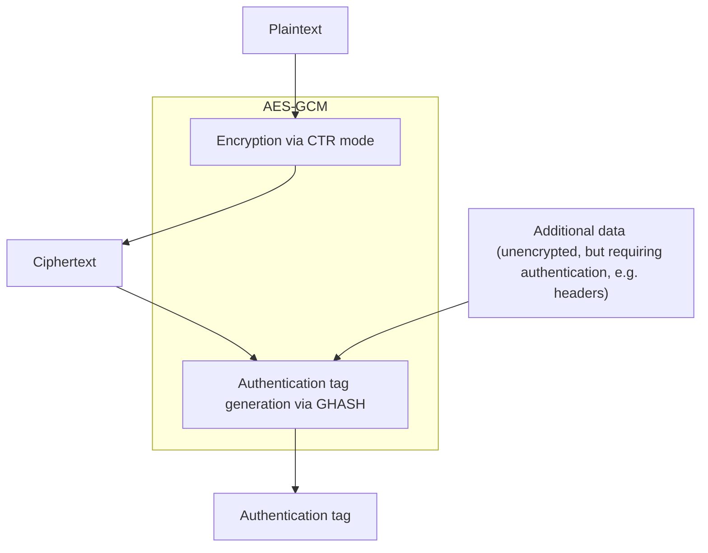

## Introduction

- **What You'll Learn From This Article**: You'll gain a systematic understanding of what symmetric-key encryption (AES) — the workhorse of real-data encryption in TLS and VPNs (IPsec) — is actually encrypting and how: the mechanism of block-by-block encryption, why the same plaintext produces a different ciphertext every time (block cipher modes and IVs), the differences between the CBC, CTR, and GCM modes, and how you confirm "it's encrypted, but has it also not been tampered with" (HMAC, AEAD).
- **Intended Audience**: Infrastructure engineers who know the phrases "it's encrypted with AES" or "tampering is detected with HMAC" but can't explain what's happening underneath — block cipher modes, the role of IVs/nonces, and authenticated encryption.
- **Estimated Reading Time**: About 20 minutes

This article is part of the [Top 1% Series' full article guide](/en/sitemap).

## Prerequisites

- **Public-key cryptography (asymmetric-key cryptography)**: An encryption scheme that uses separate keys (a public key and a private key) for encryption and decryption. It has a higher computational cost, but in exchange lets you start communicating securely with a party you haven't previously shared a key with.
- **Hash function**: A one-way function that generates a fixed-length hash value from data of arbitrary length. The same input always produces the same output, and changing even a single bit of the input produces a completely different hash value.
- **XOR (exclusive OR)**: An operation that compares two bit strings bit by bit, returning 1 where they differ and 0 where they match. The property that XORing the same value twice returns the original value (`A XOR B XOR B = A`) underlies many cryptographic algorithms.

## Getting the Big Picture

### In a Nutshell

**Symmetric-key encryption is an encryption scheme that uses one single key for both encryption and decryption.** Its flagship example, **AES (Advanced Encryption Standard)**, has an overwhelmingly lower computational cost than public-key cryptography (RSA, ECDSA, etc.), and is the standard choice in scenarios that need to **encrypt large volumes of data at high speed** — such as TLS's actual data payload and the contents of a VPN tunnel.

Behind the simplicity of using the same key for encryption and decryption, two practical challenges arise. **The first is: "is it okay for encrypting the same plaintext twice to produce the same ciphertext both times?"** — this is answered by the **block cipher mode of operation**, covered below. **The second is: "even though it's encrypted, how do we confirm not even a single bit was tampered with along the way?"** — this is answered by **HMAC** and **AEAD (authenticated encryption)**. This article digs into these two topics in particular.

## Fundamentals, Thoroughly Explained

### What Is a Block Cipher?

AES is a type of cryptographic algorithm called a **block cipher**. A block cipher divides data into **fixed-length blocks** (128 bits = 16 bytes, in AES's case) and encrypts block by block.

The AES encryption process itself thoroughly scrambles the patterns in the plaintext by repeating four types of transformations as a "round," multiple times (10 rounds for a 128-bit key, 14 rounds for a 256-bit key).

| Operation | Role |
|---|---|
| SubBytes | Non-linearly substitutes each byte in the block according to a predetermined lookup table (the S-box) |
| ShiftRows | Treats the block as a matrix and shifts each row, permuting the positions of the bytes |
| MixColumns | Mathematically mixes the bytes of each column so that a change in one byte propagates across the entire block |
| AddRoundKey | XORs the "round key" derived from the key with the contents of the block |

This series of operations is based on a design philosophy called the **SP network (Substitution-Permutation Network)**. By repeatedly applying **substitution (SubBytes) to break up regularity, and diffusion (ShiftRows/MixColumns) to propagate a single byte's change across the whole**, it becomes extremely difficult to statistically infer information about the plaintext or key from the ciphertext. This property — where a difference of a single input bit propagates through the entire output in an unpredictable way — is called the **avalanche effect**, and it's considered a prerequisite for any good block cipher.

Why a Longer Key Length Is Considered More Secure

AES standardizes three key lengths: 128, 192, and 256 bits. Since the computational effort required for a brute-force attack against the key grows exponentially with the number of bits in the key length, a longer key length gives higher theoretical security. However, a longer key length also means more rounds, which slightly increases the computational cost of encryption and decryption, so in practice the judgment comes down to a balance: "secure the key length appropriate for the use case, without going longer than necessary." AES-128 is currently considered to have sufficient strength for practical purposes, but AES-256 is chosen in situations that prioritize longer-term security (in view of future increases in computational power, or post-quantum considerations).

### Block Cipher Modes: How to Chain Blocks Together

Since plaintext is usually longer than 16 bytes, it needs to be split into multiple blocks for encryption. What determines "how the blocks are chained together for processing" is the **block cipher mode of operation**. The choice of mode has a major impact on security.

#### ECB Mode (as an Example of What You Should Never Use)

The simplest idea is to **encrypt each block completely independently, with the same key**. This is called **ECB (Electronic Codebook) mode**.

ECB mode has a fatal weakness. Because **an identical plaintext block always produces the identical ciphertext block**, repeating patterns in the original data (such as a solid-colored background region in image data) show straight through in the ciphertext. This phenomenon is widely known through a famous example called the "ECB penguin" (when an image of a penguin is encrypted in ECB mode, the penguin's silhouette remains clearly visible even after encryption). ECB mode is almost never chosen in practice; the CBC, CTR, and GCM modes covered below are used instead.

#### CBC Mode: Mixing the Previous Block into the Next Encryption Step

**CBC (Cipher Block Chaining) mode** resolves ECB's weakness by introducing a "chaining" mechanism: **the ciphertext result of one block is XORed into the next block before it's encrypted**.

Since the first block has no "previous block," a random value called the **IV (Initialization Vector)** is XORed in its place instead. By varying the IV every time, **encrypting the same plaintext with the same key produces a completely different ciphertext each time**, resolving ECB's pattern-leakage problem. The IV itself doesn't need to be kept secret and is typically sent to the peer alongside the ciphertext (though, as discussed below, there are scenarios where the IV needs to be "unpredictable").

In CBC mode, when the plaintext's length isn't a multiple of the block size (16 bytes), **padding** (filler data) must be appended at the end to align it to a block boundary. The widely used **PKCS#7 padding** scheme repeats the numeric value of "how many bytes of padding are needed" as the filler value itself (for example, if 3 bytes are needed, `0x03 0x03 0x03` is appended).

The Classic Weakness Known as the Padding Oracle Attack

In implementations that use padding with CBC mode, if an attacker can determine — from differences in error messages or response timing — "whether the padding on the decrypted data is in the correct format," this enables a technique known as a **padding oracle attack**, which allows an attacker to gradually decrypt ciphertext without ever knowing the key (this was pointed out in the 2000s and affected TLS implementations, including via the POODLE attack). Countermeasures include implementations that don't leak details of decryption errors externally, and migrating to AEAD (authenticated encryption), covered below.

#### CTR Mode: Using a Block Cipher Like a Stream Cipher

**CTR (Counter) mode** takes a different approach. Rather than encrypting the plaintext directly, it **encrypts a "key + counter value" and uses the result as a disposable keystream that's XORed with the plaintext**.

The advantage of CTR mode is that **keystream generation for each block is independent of the others**. Unlike CBC, there's no chaining that requires waiting for the previous block's result before processing the next, so multiple blocks can be processed in parallel, making it fast. Each block also doesn't need to be a multiple of the block size (a partial final block can simply be XORed as-is), so no padding is required.

The **absolute requirement** in CTR mode is that **the same "nonce + counter" combination must never be reused under the same key**. If the same keystream ends up being used for two different plaintexts, simply XORing the two ciphertexts together yields the XOR of both plaintexts, and the cipher's security collapses entirely.

### HMAC: A Mechanism for Detecting Tampering

Everything covered so far provides **confidentiality** (not being read by a third party), but **integrity** (not being tampered with in transit) needs to be confirmed by a separate mechanism. This role is filled by a **MAC (Message Authentication Code)**, and a MAC built using a hash function is called an **HMAC (Hash-based MAC)**.

HMAC computes a hash value by combining a **shared key known only to the sender and receiver** with the **message**.

1. The sender computes an HMAC value from the message and the shared key, and sends it along with the message.
2. The receiver recomputes an HMAC value using the same procedure, from the received message and their own copy of the same shared key.
3. If the received HMAC value matches the one the receiver recomputed, it proves that **"this message was indeed created by someone holding the shared key (validity of the source), and has not been altered by even a single bit since it was sent (integrity)."**

Note that **a simple hash value (without a shared key) alone is not enough for tamper detection**. Since anyone can recompute a hash value that doesn't involve a shared key, an attacker could tamper with the message, recompute the hash value, and swap it in, and the tampering would go undetected. By incorporating the shared key into the computation, HMAC establishes the property that **an attacker who doesn't know that key cannot recompute the correct HMAC value for the tampered content**.

### AEAD: Combining Encryption and Tamper Detection into One

Encryption (confidentiality) and HMAC (integrity) are inherently separate operations, but **AEAD (Authenticated Encryption with Associated Data)** achieves both efficiency and security by performing them **simultaneously within a single algorithm**. The representative example is **AES-GCM (Galois/Counter Mode)**.

Internally, GCM performs encryption using the **CTR mode** described above, while a dedicated computation called **GHASH** generates an **authentication tag** from the entire ciphertext (and any unencrypted additional data). This authentication tag plays the same role as the HMAC value in a CBC + HMAC combination.

What makes AEAD excellent is that it can **fold in "data that isn't encrypted but must not be tampered with" (Associated Data, such as header information like a destination address) into the authentication tag in a single pass**. This makes it possible to guarantee the integrity of a whole packet — even one containing a mix of encrypted and unencrypted portions (such as an ESP header) — with a single algorithm.

Like CTR mode, GCM mode also inherits the constraint that **the same nonce must never be reused under the same key**. In GCM's case, reusing a nonce doesn't just break the confidentiality of the ciphertext — it's known to lead to an even more serious consequence than with CTR alone: **the authentication tag can be forged** (meaning tamper detection itself stops functioning).

## The View from the Top 1% (What Experts See)

### Encrypt-then-MAC, MAC-then-Encrypt, Encrypt-and-MAC

Before AEAD became widespread, many protocols combined "encryption" and "HMAC" as two separate operations. There are three ways of combining them, and they differ in security.

| Scheme | Procedure | Assessment |
|---|---|---|
| MAC-then-Encrypt | Attach a MAC to the plaintext, then encrypt the whole thing | You can't tell whether tampering occurred until you decrypt and verify the MAC, making this fertile ground for the padding oracle attack discussed above |
| Encrypt-and-MAC | Encrypt the plaintext while, in parallel, computing a MAC of the plaintext itself, attached separately from the ciphertext | The MAC itself may leak information about the plaintext, and a security proof can be difficult depending on the specific scheme |
| Encrypt-then-MAC | Encrypt the plaintext, then compute a MAC **over the resulting ciphertext** | The receiver can verify the MAC to check for tampering before decrypting, so tampered data never gets passed to the decryption process. Currently considered the safest scheme |

Current cryptographic design best practice is consistently to use **Encrypt-then-MAC**, or **AEAD**, which integrates it into a single algorithm. The property of "being able to confirm no tampering occurred before decryption" is a fundamental countermeasure against the entire class of attacks — like the padding oracle attack — where "information leaks from differences in the behavior of the decryption process."

### Why Reusing a Nonce/IV Is So Catastrophic

Let's go one level deeper into why reusing a nonce in modes like CTR/GCM causes security to collapse. The essence of CTR mode — "XOR a keystream with the plaintext" — is, in principle, **structurally identical to a one-time pad** (a cipher scheme that achieves perfect security using a disposable key). A one-time pad's security rests entirely on the premise that "the keystream is truly used only once." When that premise breaks down (i.e., the same keystream is used for two plaintexts), simply XORing the two ciphertexts `C1 = P1 XOR K` and `C2 = P2 XOR K` together yields `C1 XOR C2 = P1 XOR P2`, leaking the relationship between the two plaintexts without ever going through the key `K`. Since natural-language text and structured data such as XML — the kinds of data used in practice — have significant statistical bias, once `P1 XOR P2` is obtained, it's known that `P1` and `P2` can be recovered with considerable accuracy. The seemingly contradictory requirement that **"a nonce doesn't need to be secret, but must never be reused under the same key"** stems from exactly this mathematical structure.

## Common Misconceptions and Pitfalls

- **Misconception 1: "If it's encrypted, it must not have been tampered with"**
  Encryption (confidentiality) and tamper detection (integrity) are separate properties. In modes like CTR, where flipping a specific bit of the ciphertext causes the corresponding bit of the decrypted output to flip as well (i.e., the change is predictable at the bit level), an attacker can deliberately tamper with the ciphertext in a controlled way even without knowing the plaintext content. Without an explicit integrity mechanism like HMAC or AEAD, tampering goes undetected.
- **Misconception 2: "The IV/nonce must be kept secret"**
  Most IVs/nonces don't need to be kept secret and are typically sent alongside the ciphertext in plaintext. What matters is "unpredictability" (in CBC's case) or "no duplication under the same key" (in CTR/GCM's case) — not confidentiality itself.
- **Misconception 3: "A longer key length is unconditionally better"**
  A longer key length increases theoretical resistance to brute-force attacks, but it also increases computational cost. Moreover, mistakes in the choice of block cipher mode or nonce management are, in real-world incidents, far more likely to lead to serious vulnerabilities than key length is — so judging security based on key length alone is insufficient.

## Troubleshooting Perspective

The basic approach to encryption-related issues is to isolate **whether decryption itself is failing, or decryption succeeds but the result is rejected by tamper detection**.

1. **Decryption itself fails**: Typical causes include a key mismatch, a mismatched IV/nonce, or a mode configuration mismatch (e.g., the sender uses GCM while the receiver tries to decrypt as CBC).
2. **Decryption succeeds, but the authentication tag/HMAC doesn't match**: In addition to actual tampering or corruption in transit, this is often caused by implementation bugs (such as differing interpretations of the range of additional data), where the computation on the sending and receiving sides ends up misaligned.
3. **Only some sessions fail even with identical configuration**: There may be an issue with nonce/IV counter management, with duplicates occurring rarely. If it happens reproducibly, suspect the counter management logic in the implementation.

### Prevention and Long-Term Countermeasures

- For new implementations, choose an AEAD such as AES-GCM or ChaCha20-Poly1305 wherever possible, and avoid rolling your own combination of encryption and MAC.
- When using CTR/GCM-family modes, review nonce generation and management at a very early stage of the implementation, designing so duplication simply cannot occur (guarantee monotonic increment of the counter, use a sufficiently long random value, etc.).
- If you're forced to use CBC + padding, implement it so that no details of decryption errors are ever leaked externally.

## Summary

- AES (a block cipher) repeats SubBytes/ShiftRows/MixColumns/AddRoundKey in 16-byte units, thoroughly scrambling the patterns in the plaintext via the avalanche effect.
- The choice of block cipher mode determines security. ECB shouldn't be used because it lets patterns show through; CBC solves this via IV-based chaining, and CTR/GCM solve it via keystream generation driven by a nonce + counter.
- HMAC is a mechanism that uses a shared key to detect tampering with a message, providing an integrity guarantee independent of encryption (confidentiality). AEAD (such as AES-GCM) integrates the two into a single algorithm.
- In CTR/GCM-family modes, reusing a nonce under the same key leads to a catastrophic outcome — not just a loss of confidentiality, but a collapse of integrity as well, in the form of the ability to forge the authentication tag.

**Starting Today**
1. When you see the phrase "it's encrypted," consciously distinguish whether that refers to confidentiality alone, or whether it also covers integrity (tamper detection).
2. Whenever you have the opportunity to look at encryption-related configuration, build the habit of checking which block cipher mode is in use (CBC/CTR/GCM, etc.) and how the nonce/IV is generated.

## References

- [Advanced Encryption Standard (AES) | NIST FIPS 197](https://nvlpubs.nist.gov/nistpubs/FIPS/NIST.FIPS.197.pdf)
- [Recommendation for Block Cipher Modes of Operation | NIST SP 800-38A](https://nvlpubs.nist.gov/nistpubs/Legacy/SP/nistspecialpublication800-38a.pdf)
- [Recommendation for Block Cipher Modes of Operation: Galois/Counter Mode (GCM) | NIST SP 800-38D](https://nvlpubs.nist.gov/nistpubs/Legacy/SP/nistspecialpublication800-38d.pdf)
- [HMAC: Keyed-Hashing for Message Authentication | RFC 2104](https://datatracker.ietf.org/doc/html/rfc2104)
- [PKCS #7: Cryptographic Message Syntax | RFC 2315](https://datatracker.ietf.org/doc/html/rfc2315)
- [AES-GCM Authenticated Encryption in the Internet Key Exchange Protocol Version 2 (IKEv2) | RFC 5282](https://datatracker.ietf.org/doc/html/rfc5282)
