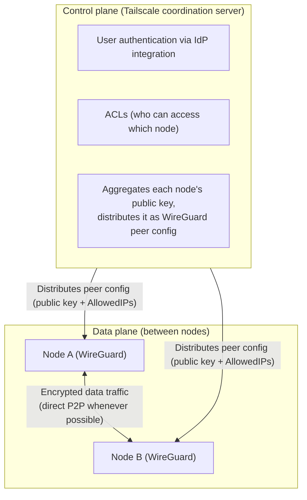
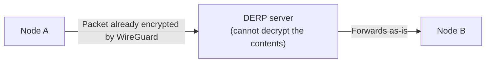

## Introduction

- **What You'll Learn From This Article**: Tailscale uses [WireGuard](/en/articles/wireguard-internals-guide) as its internal protocol, yet lets you set up a VPN mesh across multiple devices almost automatically, without hand-writing a single config file. This article explains why, covering the design that **separates the control plane (key distribution, access control, authentication) from the data plane (the actual encrypted traffic)**, **NAT hole punching** for establishing direct connections between devices behind NAT, and the **DERP relay** mechanism used when that fails.
- **Intended Audience**: This article is aimed at readers who've set up Tailscale between a home PC and a home server, confirmed it works, but can't explain what's actually happening beyond "it uses WireGuard internally."
- **Estimated Reading Time**: About 18 minutes

This article is part of the [Top 1% Series' full article guide](/en/sitemap).

## Prerequisites

- **WireGuard**: A modern VPN protocol that handles routing through Cryptokey Routing, a mapping between public keys and AllowedIPs. Covered in depth in [How WireGuard Works](/en/articles/wireguard-internals-guide).
- **NAT (Network Address Translation)**: A mechanism that translates private IP addresses into global IP addresses. Covered in depth in [How NAT/NAPT Works](/en/articles/nat-guide).
- **IdP (Identity Provider)**: An external service — Google Workspace, Okta, Microsoft Entra ID, and the like — that centrally handles user authentication.

## Getting the Big Picture

### In a Nutshell

**Tailscale's core idea is that it leaves WireGuard — the "mechanism that encrypts and carries data" (the data plane) — untouched, and instead builds an entirely new layer in front of it: a mechanism that decides who is allowed to access which device, and how far, and keeps distributing that decision to every device as WireGuard configuration (the control plane).** It solves the operational problem covered in [the article on WireGuard's internals](/en/articles/wireguard-internals-guide) — who handles pre-distributing public keys, and how — through IdP-integrated user authentication and automatic key distribution via a coordination server.



## Fundamentals, Thoroughly Explained

### The Design: Separating the Control Plane from the Data Plane

Every device that joins Tailscale (a **node**, or a member of a **tailnet** in Tailscale terminology) generates its own WireGuard key pair. **The private key never leaves that device.** Only the public key is sent to Tailscale's coordination server, which checks it against an ACL (access control list) — who's allowed to join this tailnet, and which nodes are allowed to reach which — and computes exactly what each node needs to be handed: the public keys and AllowedIPs of the other nodes it's permitted to talk to.

The Tailscale client running on each node (`tailscaled`) takes this information from the coordination server and **continuously rewrites the OS's WireGuard interface peer configuration behind the scenes.** A command like `tailscale up` that the user actually types is just a shorthand for kicking off this whole exchange — the traffic itself is still encrypted and carried by the exact same mechanism as bare WireGuard. **"Don't replace WireGuard — just take over the operational weak points of WireGuard (key distribution, ACL management) in a separate layer"** is the actual essence of Tailscale's design.

### NAT Hole Punching: Establishing a Direct P2P Connection Wherever Possible

Most home and office devices sit behind NAT, so you can't send a packet directly to their private IP address from the internet. Even so, Tailscale **prioritizes exchanging WireGuard packets directly between two nodes whenever it can (without going through a relay server)**. This is achieved through **NAT hole punching**.

```mermaid
sequenceDiagram
    participant A as Node A (behind NAT)
    participant Server as STUN-like role<br/>(also served by a DERP server)
    participant B as Node B (behind NAT)

    A->>Server: Ask what its own global IP:port is
    Server-->>A: Reports the post-NAT IP:port
    B->>Server: Ask what its own global IP:port is
    Server-->>B: Reports the post-NAT IP:port
    Note over A,Server,B: Exchange each other's IP:port info<br/>via the coordination server
    A->>B: Send a packet directly (punches a hole in NAT)
    B->>A: Send a packet directly (punches a hole in NAT)
    Note over A,B: Once packets have arrived both ways,<br/>a direct P2P path is established
```

Each node uses a mechanism similar to STUN (Session Traversal Utilities for NAT) to find out "what IP address and port does the outside world see me as, after my NAT rewrites it," and exchanges that information with the other node via the coordination server. From there, **both sides send a packet to the other's (post-NAT) address at the same time** — since most home and corporate NAT implementations let through response packets to a destination they've previously sent traffic to, this ends up "punching a hole" in both NATs and establishing a direct path.

<details>
<summary>Aside: Hole punching doesn't always succeed against every NAT</summary>

Depending on the NAT implementation — particularly a design known as symmetric NAT, common in corporate environments — some combinations of nodes will fail to punch a hole. What Tailscale does in that case is exactly what the next section, on DERP relays, covers.

</details>

### DERP Relays: A "Zero-Knowledge" Fallback for When a Direct Connection Fails

For combinations where NAT hole punching fails (both sides behind strict symmetric NAT, for instance), Tailscale falls back to routing traffic through a relay server called **DERP (Designated Encrypted Relay for Packets)**.

A DERP server does nothing more than **forward packets that have already been encrypted by WireGuard, straight through from one side to the other.** The DERP server itself never holds the WireGuard private keys used by Tailscale nodes, so it has no way to decrypt the contents (the encrypted payload) of the traffic it's relaying. This property is why DERP is called a **zero-knowledge relay**.



That said, **even though a DERP server can't see the contents of the traffic, it's still in a position to observe metadata — when which nodes talked to each other, and how much traffic passed between them.** It's not a mechanism that provides full anonymity — it's best understood as an availability-first fallback that preserves the confidentiality of encrypted traffic content while keeping connectivity working.

### IdP Integration and ACLs: Declaratively Managing Who Can Access What

The biggest reason Tailscale gets used in enterprise settings is **user authentication integrated with an IdP** (Google Workspace, Okta, Microsoft Entra ID, and so on). A user signs into their Tailscale client via SSO using their existing corporate account, and their nodes (their PC, a server, and so on) get registered to the tailnet tied to that account.

Access control is managed through an ACL configuration (in JSON) that declaratively describes **who (a user, group, or tag) can access which node, on which port**, and the coordination server translates this configuration into actual WireGuard AllowedIPs and firewall rules, distributing them to each node. With bare WireGuard, an administrator had to manually reflect every new hire or departing employee's key revocation into a config file. With Tailscale, **simply disabling a user on the IdP side automatically revokes that user's nodes' access across the entire tailnet.**

## The View from the Top 1% (What Experts See)

### Why "Separating the Control Plane from the Data Plane" Is the Real Essence of Tailscale

The networking world has long had a design philosophy — SDN (Software-Defined Networking) being the classic example — of separating "the process that actually forwards packets" (the data plane) from "the process that decides how they should be forwarded" (the control plane). Understanding Tailscale as an application of this idea to VPN meshes situates it not as a standalone product, but as one instance of a broader, more general design pattern. **Leaving WireGuard's implementation of the data plane completely untouched, and making only the control plane sitting above it swappable**, is exactly why Tailscale can inherit WireGuard's security properties as-is (the Noise-framework-based handshake, ChaCha20-Poly1305 encryption) while solving only its operational weaknesses.

### Where DERP Makes a Deliberate Tradeoff for Availability

Even though DERP relays are zero-knowledge, it's a design tradeoff worth understanding clearly: communication metadata is visible to whoever operates the DERP server — Tailscale the company, or your own organization if you self-host. In environments demanding extremely high confidentiality — financial institutions, government agencies — this calls for additional consideration: self-hosting the DERP server within your own organization, or prioritizing a network design where NAT hole punching reliably succeeds (avoiding symmetric NAT, for instance).

## Common Misconceptions and Pitfalls

- **Misconception 1: "Using Tailscale means all traffic always goes through Tailscale's relay servers."**
  Direct P2P connections (via NAT hole punching) are the default and take priority; DERP relaying is a fallback for when that fails. Run `tailscale status` to check whether a given peer connection is `direct` or going through a `relay`.
- **Misconception 2: "Tailscale uses its own proprietary encryption protocol."**
  The encryption itself is the exact same mechanism as bare WireGuard. What Tailscale adds are control-plane functions — key distribution, NAT traversal, and ACL management.
- **Misconception 3: "Tailscale is closed-source commercial software, so it's a black box."**
  The client software itself is published as open source. There's also **Headscale**, an open-source, compatible reimplementation of the coordination server, which lets you self-host without depending on Tailscale's own servers (the managed coordination-server service itself is a commercial offering).

## Troubleshooting Perspective

Tailscale connection issues are best approached by first isolating **whether you're actually connected directly, or going through DERP.**

1. **The connection works, but throughput is extremely slow**: Check with `tailscale status` or `tailscale ping <peer's hostname>` whether the connection is going through a `relay`. Traffic relayed through DERP can slow down if it has to route through a geographically distant DERP server, or when the DERP server itself is bandwidth-limited.
2. **A specific node is unreachable**: A mistake in the ACL configuration (a missing tag or group assignment) is the typical cause. Use the ACL simulation/validation feature in the coordination server's admin console to confirm the permissions are actually what you intended.
3. **Connectivity only fails from within the corporate network**: The corporate firewall may be blocking the port DERP uses (TCP 443, for instance) or the UDP ports used for NAT hole punching. DERP is designed to fall back to TCP 443 (the same port as HTTPS), so checking this usually resolves the connectivity problem.

### Prevention and Long-Term Countermeasures

- In environments with high confidentiality requirements, evaluate self-hosting the DERP server ahead of time, to minimize what communication metadata is visible to outside third parties.
- Establish an operational rule that every ACL change gets checked with the admin console's simulation feature before it's applied.
- When an employee leaves or changes roles, periodically audit that disabling their account on the IdP side actually revokes their nodes' access on the Tailscale side as expected.

## Summary

- Tailscale solves the operational weaknesses bare WireGuard carries (manually managing key distribution and revocation) by leaving WireGuard's data-plane implementation untouched and building an entirely new control plane (key distribution, ACL management, IdP integration) in front of it.
- Traffic between nodes prioritizes a direct P2P connection via NAT hole punching, and only falls back to a DERP relay (a zero-knowledge relay server that simply forwards already-encrypted packets) when that fails.
- DERP can't decrypt traffic contents, but it can still observe communication metadata (who talked to whom, and when) — it's not a mechanism that provides full anonymity.
- IdP integration is the main reason for enterprise adoption: it automates granting and revoking access as employees join and leave, a substantial improvement over managing bare WireGuard configs by hand.

**Things to Keep in Mind Starting Today**
1. If you notice Tailscale slowing down, make it a habit to check `tailscale status` first to see whether you're going through DERP.
2. When designing an environment that demands high confidentiality, factor in that DERP relays can observe communication metadata, and evaluate whether self-hosting is warranted.

## References

- [How Tailscale works | Tailscale documentation](https://tailscale.com/blog/how-tailscale-works/)
- [How NAT traversal works | Tailscale blog](https://tailscale.com/blog/how-nat-traversal-works/)
- [Encrypted TCP relays (DERP) | Tailscale documentation](https://tailscale.com/kb/1232/derp-servers)
