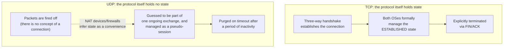
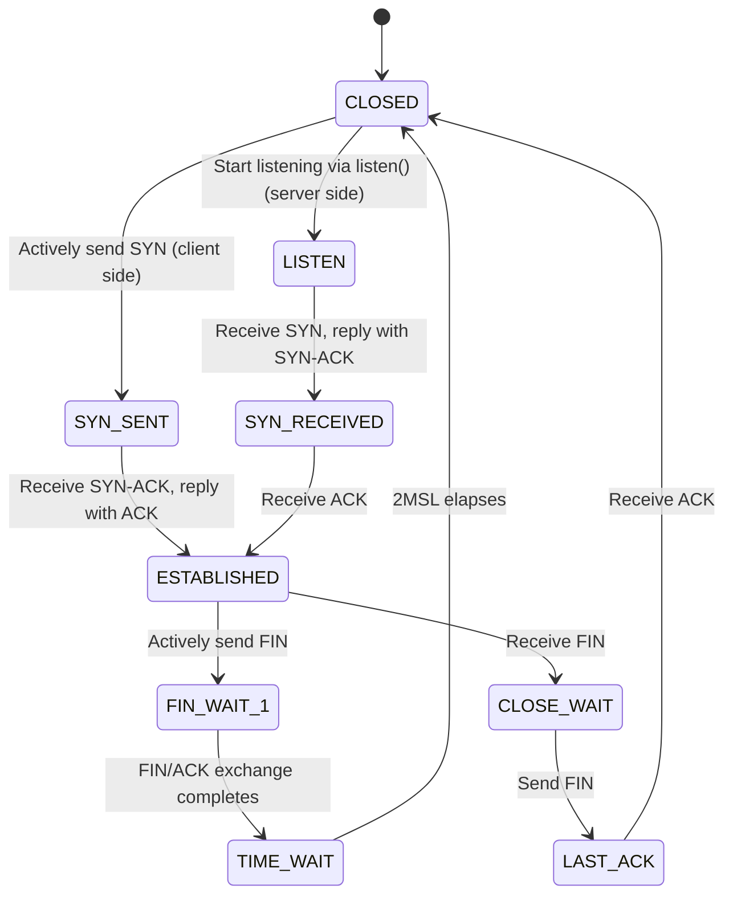

## Introduction

- **What You'll Learn From This Article**: What's really inside the phrase "TCP/UDP session"—why and how TCP connections manage state, why the word "session" gets used even for UDP, which has no connection at all, and how "protocols and port numbers" actually relate to each other (they're not a 1:1 mapping, and some protocols have no port number whatsoever).
- **Intended Audience**: This article is aimed at infrastructure engineers who know that "TCP is connection-oriented and UDP is connectionless," but who have been confused by the word "session" meaning different things in different contexts, or who can't explain why you can't simply assign an arbitrary port number to a protocol that has none, like ESP.
- **Estimated Reading Time**: About 20 minutes

This article is part of the [Top 1% Series' full article guide](/en/sitemap).

## Prerequisites

- **The basic difference between TCP and UDP**: TCP is connection-oriented, with acknowledgment and retransmission; UDP is connectionless and "fire and forget." The details of this distinction are covered in [Understanding How the Network Stack Works from a "Top 1%" Perspective](/en/articles/network-stack-guide), in its "Transport Layer" section.
- **Encapsulation**: Wrapping a piece of data inside another protocol by attaching a header (control information) before and after it.
- **The IP Header**: Along with the source and destination IP addresses, the IP header carries an 8-bit **Protocol** field that indicates "what protocol the payload is" (e.g., TCP = 6, UDP = 17).

## Getting the Big Picture

### In a Nutshell

**A "session" is the state—or a stand-in for that state—used to manage an ongoing exchange between two communicating parties as a single unit.** What matters here is that **who** holds that state, and **how**, differs completely from one layer to the next. TCP itself, as a protocol, manages a connection as a genuine state machine. UDP has no protocol-level state whatsoever; any "session" you hear about for UDP is a pseudo-session that a NAT device or firewall maintains purely as a matter of operational convenience.

### Protocol Numbers and Port Numbers Are Different Things

There's a second point this article wants to make clear: **protocol numbers and port numbers belong to entirely different headers in the first place.** The protocol number is an 8-bit field in the IP header that says "is the payload TCP, UDP, or ESP?" The port number is a 16-bit field that TCP and UDP headers each carry independently, saying "which application is this TCP (or UDP) payload destined for?" These two live at different layers. "Protocols and port numbers" aren't even really a 1:1 relationship—the starting point is instead the premise that **a port number is a purely local field that exists only inside TCP/UDP as protocols**.

## Fundamentals, Thoroughly Explained

### TCP's "Session (Connection)": The Reality of a State Machine

The TCP specification (RFC 9293) doesn't formally use the word "session"—it uses **"connection."** A TCP connection is uniquely identified by the combination of source IP, source port, destination IP, destination port, and protocol number (TCP = 6)—the so-called **5-tuple** (this same 5-tuple also shows up as the key NAT devices use to manage their session tables; see the "NAPT Translation Table" section of [Understanding How NAT/NAPT Works from a "Top 1%" Perspective](/en/articles/nat-guide) for details).

The substance of a TCP connection is a **state machine that both the sending and receiving OSes hold in kernel space**. The main state transitions are as follows.

**Why do both OSes have to keep holding onto this state for as long as the connection is open?** This is exactly why TCP has the most faithful claim to what the word "session" really means. Acknowledgment (ACK), retransmission, ordering guarantees, and congestion control are all functions that presuppose state—"how much data has been sent/received so far in this connection, and how much room is left in the send window." Only as long as this state is held can TCP behave as "one continuous conversation."

Why is TIME_WAIT necessary? (What does the 2MSL wait actually mean?)

The side that actively closes a connection doesn't immediately discard its state after sending the final ACK—it lingers for a while in the **TIME_WAIT** state. This wait time is traditionally **2MSL (twice the Maximum Segment Lifetime, i.e., twice the maximum time a packet can plausibly still be alive on the network)**, which in practice is anywhere from tens of seconds to a few minutes depending on the implementation.

This serves two purposes. First, **it accounts for the case where the final ACK never reached the peer.** If the peer (in the LAST_ACK state) doesn't receive that ACK and retransmits its FIN, a side that has already discarded its state would treat the retransmitted FIN as belonging to an unknown connection and respond with a TCP RST, breaking the normal close sequence. Second, **it prevents a new connection reusing the same 5-tuple from mistakenly receiving a stray, delayed packet left over from the previous connection** (one that was still wandering the network). Waiting 2MSL rests on the assumption that, by then, any old packet belonging to that connection is guaranteed to have vanished from the network.

On a server handling a huge volume of short-lived connections (as in early HTTP implementations), sockets piling up in TIME_WAIT can exhaust the ports available for new connections—an operational problem that socket options such as `SO_REUSEADDR` can partially mitigate.

### UDP Has No "Session"—Which Is Exactly Why a Pseudo-Session Emerges

UDP is a connectionless protocol, and nothing resembling TCP's state machine exists anywhere in its specification (RFC 768). A single UDP packet is handled as a self-contained, independent datagram; UDP itself has no notion that "the previous packet and this one belong to the same conversation."

And yet, in practice, people casually talk about "UDP sessions" all the time. That's because **NAT devices and stateful firewalls observe the back-and-forth of UDP packets and, as a matter of convenience, maintain something that resembles a "session."** Specifically, if a given combination of source IP:port and destination IP:port is observed repeatedly within a certain window of time, it's treated as a single pseudo-session, and the entry is discarded once a certain period of inactivity (tens of seconds to a few minutes, depending on the implementation) has elapsed. This mechanism itself is covered in detail in the "NAPT Translation Table" section of [Understanding How NAT/NAPT Works from a "Top 1%" Perspective](/en/articles/nat-guide), but the point worth underscoring here is: **this "UDP session" is not state that UDP itself, as a protocol, possesses—it's merely state inferred from the outside, by an intermediary device (a NAT or firewall), out of operational necessity.** Because UDP has no signaling whatsoever for establishing or ending a connection, an intermediary device has no way of knowing precisely when a session has ended, and has no choice but to rely on a timeout as a guess.

### Why Does the Same Word "Session" Mean Different Things in Different Contexts?

With the above in mind, it becomes clear that the word "session" gets used across multiple, quite different layers in practice.

| Context It's Used In | What It Actually Is | Who Holds the State |
|---|---|---|
| TCP connection | A state machine, identified by the 5-tuple, managed by both OS kernels | TCP itself (both the sending and receiving OSes) |
| NAT/firewall "session" | An entry in a translation or permission table keyed on the 5-tuple (a term used regardless of TCP or UDP) | An intermediary device (a NAT device, a stateful firewall) |
| The OSI model's session layer (L5) | A textbook layer concept covering the start, maintenance, and end of a communication | A theoretical classification (in practice, usually absorbed into TCP or the application layer) |
| An application's "login session" | A user's logged-in state, managed server-side via a cookie (session ID) or token | Application-layer software (e.g., a web application) |

The third one is especially prone to confusion. As shown in the OSI reference model diagram in [Understanding How the Network Stack Works from a "Top 1%" Perspective](/en/articles/network-stack-guide), the OSI model formally defines a separate "session layer (L5)"—but in actual TCP/IP stack implementations, there's rarely any explicit, standalone implementation of this layer. The starting, maintaining, and ending of a session is instead handled by TCP itself (connection management) or by an application-layer protocol (e.g., HTTP cookies). The word "session" ends up referring to four things that are fundamentally different in nature—**a genuine protocol state machine (TCP), an intermediary's convenient guess (NAT/firewall), a theoretical classification (OSI L5), and an application's own custom implementation (cookies)**—and this is exactly why saying "session" without specifying the context so often leads to two people talking past each other.

### Digging into the Relationship Between Protocol Numbers and Port Numbers

Let's now turn to the other main theme of this article: the relationship between **"protocol numbers"** and **"port numbers."**

The **protocol number** is an 8-bit field in the IP header, formally called the **Protocol** field, whose values are assigned in the [Protocol Numbers](https://www.iana.org/assignments/protocol-numbers/) registry maintained by IANA. Representative values include:

| Protocol Number | Protocol | Notes |
|---|---|---|
| 1 | ICMP | The control-message protocol used by tools like ping |
| 6 | TCP | The connection-oriented transport-layer protocol |
| 17 | UDP | The connectionless transport-layer protocol |
| 47 | GRE | A general-purpose tunneling protocol |
| 50 | ESP | IPsec's encryption and integrity-protection protocol (covered in the article group referenced above) |
| 51 | AH | IPsec's tamper-detection and source-authentication protocol (no encryption) |

**Port numbers**, on the other hand, are 16-bit fields that each of the TCP and UDP headers carries independently, stored as "source port" and "destination port." There are two important facts about ports that are easy to overlook here.

1. **A port number isn't a single, shared namespace across the whole IP protocol suite—TCP and UDP each maintain their own, completely independent namespace of port numbers.** "TCP port 80" and "UDP port 80" just happen to use the same number; they are, at bottom, unrelated identifiers (in practice, HTTP = TCP/80 and DNS = UDP/53 are the well-known pairing, but DNS also uses TCP/53 for zone transfers, so there are cases where the same number carries meaning on both TCP and UDP).
2. **Port numbers only exist for protocols that actually have a port-number field—TCP and UDP, plus a small handful of others such as SCTP.** ICMP, GRE, ESP, and AH, all listed in the table above, simply have no field called "port number" anywhere in their headers.

In other words, the statement "protocols and port numbers aren't 1:1" is, more precisely, better understood as: **"port numbers only exist in the first place as a local, internal field belonging to a handful of protocols (TCP/UDP)."** There is indeed a "many-to-one" relationship in the sense that a single protocol (TCP) has 65,536 port numbers, and many application protocols—HTTP, SSH, SMTP, and so on—each ride on a different one of those port numbers. But that relationship is entirely **internal** to TCP or UDP as protocols.

### Why Does ESP Have No Port Number, and Why Can't It Just Be Assigned One?

With all of the above as background, we can answer head-on the question that comes up naturally when reading about "ESP itself has no concept of a port number" in [Understanding How L2TP/IPsec Works from a "Top 1%" Perspective](/en/articles/l2tp-ipsec-guide) or [Understanding How NAT/NAPT Works from a "Top 1%" Perspective](/en/articles/nat-guide): **"If protocols and port numbers aren't 1:1 anyway, why not just assign ESP an arbitrary port number?"**

The answer is that **a port number isn't a general-purpose identifier that can be bolted onto a protocol from the outside after the fact—it's simply one of the fields predefined as part of the TCP or UDP header format.** ESP's header format (RFC 4303) is made up of fields like the SPI (Security Parameters Index), Sequence Number, Payload Data, Padding, and Next Header—and nowhere among them is there a field called "port number." "Assigning ESP a port number" would, in effect, mean rewriting ESP's own specification (the header structure defined in RFC 4303) to add a brand-new field—it isn't as simple as just handing it an unused number. A port number is information tied to the TCP or UDP header structure; it isn't external metadata shared across the entire IP protocol suite that can be attached to anything.

This is exactly why NAT-T (covered in the article group referenced above) doesn't take the approach of "assign ESP a port number." Instead, it **wraps the entire ESP packet inside a UDP header—a header format that already has a port-number field—encapsulating it.** ESP's own specification isn't touched at all; instead, an extra "layer of skin that carries a port number" (the UDP header) is added on the outside, letting the packet ride on the existing port-based NAPT translation table. Rather than adding a new field to ESP, NAT-T reuses an existing protocol (UDP) and effectively "borrows" its port number—that's the key idea behind this design.

## The View from the Top 1% (What Experts See)

### The Three Categories: Well-Known, Registered, and Dynamic Ports

IANA divides the port-number space (0–65535) for both TCP and UDP into three categories based on intended use.

| Range | Name | Use |
|---|---|---|
| 0–1023 | Well-Known Ports | Reserved for widely agreed-upon standard services such as HTTP (80), HTTPS (443), SSH (22), and DNS (53). On most OSes, binding to a port below 1024 requires root/administrator privileges |
| 1024–49151 | Registered Ports | Ports registered with IANA for specific applications or services |
| 49152–65535 | Dynamic/Private Ports (Ephemeral Ports) | Not fixed to any particular use; used temporarily by a client as its source port each time it initiates a connection |

**The reason a client's source port ends up being a seemingly random value** comes down to this dynamic (ephemeral) port mechanism. When a client connects to a server's well-known port (say, HTTPS/443), the OS automatically hands the client an unused ephemeral port to use as its own source port. This means that even if the same client opens multiple simultaneous connections to the same port on the same server, as long as the source ports differ, the 5-tuples never collide, and each connection can be distinguished as a separate one.

### Multiplexing a Connection: Packing Multiple "Exchanges" into a Single TCP Connection

Even a single TCP connection (one 5-tuple) can, in practice, have multiple independent exchanges multiplexed inside it. This is another example of the granularity that the word "session" can refer to being subdivided even further.

- **HTTP/1.1 Keep-Alive**: Keeps a single TCP connection open and streams multiple HTTP request/response pairs through it in sequence. This avoids paying the cost of connection establishment (the three-way handshake) every time, but requests are, in essence, processed one after another (head-of-line blocking, or HoL blocking).
- **HTTP/2 and later's stream multiplexing**: Lets a single TCP connection carry multiple independent logical units of communication called "streams," allowing requests and responses to be exchanged concurrently. TCP itself remains a single connection, but the application layer (HTTP/2) implements its own multiplexing and prioritization on top.

### QUIC/HTTP3: A New Approach That Implements Its Own Connection Management on Top of UDP

Modern QUIC (the transport protocol underlying HTTP/3) is deliberately built on top of UDP rather than TCP. UDP itself, as noted above, has no concept of a connection—but QUIC manages its own **connection ID** at a layer just above transport (or, depending on the implementation, in a user-space transport implementation), reworking the connection identification that TCP had tied to its 5-tuple (particularly source IP and port) into something that can persist even as the IP address or port changes. This gives QUIC the advantage of being able to keep a connection (session) alive across client-side IP address changes, such as switching from Wi-Fi to a mobile connection. "Implementing your own session management on top of UDP, in a way fundamentally different from TCP" is a recent, concrete example of the very principle this article has traced throughout: that sessions are implemented differently by every protocol that needs one.

## Common Misconceptions and Pitfalls

- **Misconception 1: "Port numbers form a single namespace shared across the entire network."**
  In reality, TCP and UDP each maintain their own independent namespace of port numbers. "TCP port 80" and "UDP port 80" merely share the same number; they're otherwise unrelated.
- **Misconception 2: "Every protocol has a port number, no matter what."**
  Port numbers are a field specific to the header format of TCP/UDP (and a few other protocols). Protocols such as ICMP, GRE, ESP, and AH have no concept of a port number at all—this is far from rare.
- **Misconception 3: "Session" always means a TCP connection.**
  In practice, the word "session" is used to refer to several distinct things—TCP connections, NAT devices' pseudo-sessions, and applications' login sessions among them. Without confirming the context, conversations easily talk past each other.

## Troubleshooting Perspective

Troubles involving "sessions" or "ports" are best approached by first **identifying which layer's "session" is actually at issue.**

1. **Firewall rule misconfiguration**: Mistakes like "TCP port 80 was allowed, but UDP port 80 was accidentally left blocked (or vice versa)" are a classic symptom of not fully grasping that TCP and UDP are separate port namespaces. When writing rules, always explicitly confirm both the protocol type and the port number.
2. **NAT device session table exhaustion**: Cases where a huge backlog of UDP pseudo-sessions exhausts the table are covered in the "Troubleshooting Perspective" section of [Understanding How NAT/NAPT Works from a "Top 1%" Perspective](/en/articles/nat-guide).
3. **Port exhaustion from a pileup of TCP connections stuck in TIME_WAIT**: On a server handling a large volume of short-lived connections, source (ephemeral) ports can temporarily run out, making new connections impossible. Commands like `ss -tan | grep TIME-WAIT | wc -l` can be used to check the size of the backlog.
4. **Investigating the wrong notion of "session"**: A report of "the application's login session dropped" won't yield any useful leads if you investigate at the TCP-connection level (with `ss -tunp`, say). That's because it's actually an application-layer session-management issue (a cookie or token expiring, for instance)—you're simply looking at the wrong layer entirely.

### Prevention and Long-Term Countermeasures

- When designing firewall/NAT rules, always specify both the protocol type (TCP/UDP/ESP, etc.) and the port number together, and review them as a pair.
- On servers that handle a large volume of short-lived TCP connections, check the ephemeral port range setting (`net.ipv4.ip_local_port_range`) and TIME_WAIT behavior (e.g., `net.ipv4.tcp_tw_reuse`) ahead of time.
- When investigating an incident, first determine whether you're dealing with a TCP connection, a NAT/firewall pseudo-session, or an application login session, and only then dig in using the logs and commands appropriate to that layer.

## Summary

- TCP's "session (connection)" is identified by the 5-tuple and is genuine state, managed as a state machine by both OS kernels—a real state that the protocol itself possesses.
- UDP has no protocol-level state whatsoever; the "UDP session" people refer to in practice is merely a pseudo-state that a NAT device or firewall maintains for convenience, using a timeout.
- The word "session" is used to refer to several fundamentally different things: a TCP connection, a NAT/firewall pseudo-session, the OSI model's session layer, and an application's login session.
- Protocol numbers (in the IP header) and port numbers (in the TCP/UDP header) belong to different layers of information; port numbers are simply a field specific to the header format of a handful of protocols like TCP/UDP. A protocol without a port number, like ESP, can't just be handed an arbitrary one—NAT-T solves this instead by wrapping it in a UDP header.

**Starting Today**
1. Whenever the word "session" comes up, get in the habit of first asking whether it's about a TCP connection, a NAT/firewall pseudo-session, or an application login session.
2. When writing firewall or NAT rules, always confirm the protocol type and port number together, and remember that some protocols simply have no port number at all.

## References

- [Transmission Control Protocol | RFC 9293](https://datatracker.ietf.org/doc/html/rfc9293)
- [User Datagram Protocol | RFC 768](https://datatracker.ietf.org/doc/html/rfc768)
- [IP Encapsulating Security Payload (ESP) | RFC 4303](https://datatracker.ietf.org/doc/html/rfc4303)
- [Protocol Numbers | IANA](https://www.iana.org/assignments/protocol-numbers/)
- [Service Name and Transport Protocol Port Number Registry | IANA](https://www.iana.org/assignments/service-names-port-numbers/service-names-port-numbers.xhtml)
- [QUIC: A UDP-Based Multiplexed and Secure Transport | RFC 9000](https://datatracker.ietf.org/doc/html/rfc9000)
