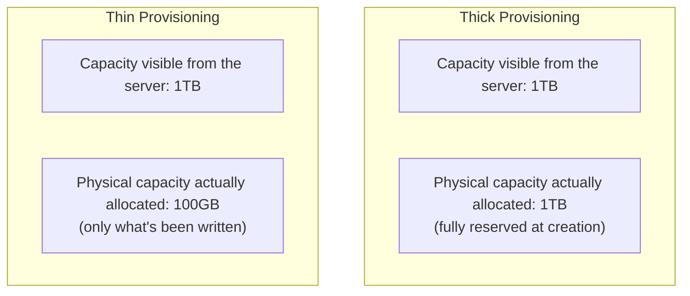

## Introduction

- **What You'll Learn From This Article**: Building on the concept of a formatted volume, covered in [How the NTFS Filesystem Works](/en/articles/ntfs-mft-internals-guide), a systematic understanding of **how thin provisioning separates "the capacity shown to the server" from "the capacity the storage device actually allocates,"** and the risk this mechanism creates: **"overcommit."**
- **Intended Audience**: Readers who've heard the term "thin provisioning," but can't explain exactly what mechanism achieves this "apparent capacity."
- **Estimated Reading Time**: About 16 minutes

This article is part of the [Top 1% Series Complete Article Guide](/en/sitemap), and the eighth article in the [Storage Fundamentals Series](/en/sitemap#series-list).

## Prerequisite Knowledge

- **Volumes and Formatting Fundamentals**: The fundamentals covered in [The Relationship Between RAID and Windows Disk Management](/en/articles/disk-raid-fundamentals-guide) — the unit called a volume, and formatting writing the filesystem's own structure. This article covers how that volume's "capacity" itself gets managed.

## Getting the Big Picture

With the traditional approach, **thick provisioning**, the instant you instruct "create a 1TB volume," the storage device **reserves and allocates the full 1TB of physical space outright, right then.** **Thin provisioning**, by contrast, only declares "make this appear as a 1TB volume," and **allocates physical space gradually, afterward, only for the portion where data is actually written.**

## Deep Dive Into the Fundamentals

### Apparent Capacity and Actual Consumption Are Managed Separately

For a thin-provisioned volume, the server (OS) side **recognizes and uses it exactly like an ordinary volume, as "a 1TB disk."** But **inside the storage device, only the blocks where data has actually been written consume real physical space.** A part that's never had anything written to it occupies zero physical space inside the storage device at all.

**The key to how this works is that the storage device internally manages two separate numbers individually: "the logical capacity the server side recognizes" and "the physical capacity the storage device actually consumes."** Any query from the server side always gets answered with the logical capacity, "1TB," while internally, a separate ledger keeps tracking only the physical capacity actually in use.

What Idea Does This Share With NTFS's "Resident Attribute"?

The mechanism covered in [How the NTFS Filesystem Works](/en/articles/ntfs-mft-internals-guide) — a small file's data sitting directly inside the MFT record, rather than having its real body stored somewhere else — shares an underlying idea with thin provisioning: **"manage the apparent structure (the premise that a file has a real body / the premise that a volume holds 1TB) separately from the actual data's placement (where, and how much data, genuinely exists)."** Across storage in general, the design pattern of separating "the surface-visible capacity/structure" from "the resource actually being consumed," and only allocating a real entity once it's actually needed, recurs across layers.

### Overcommit: When "the Sum of Apparent Capacities" Exceeds "the Real Total Capacity"

Thin provisioning's biggest risk is **overcommit.** Even though a storage device's actual total capacity is only 10TB, **thin provisioning lets you create twenty separate "1TB volumes."** Each volume appears as "1TB," but since only a small fraction of each is actually in use so far, a combined "apparent capacity" of 20TB can coexist, without issue, on top of a mere 10TB of real capacity.

**But if these volumes' users all simultaneously start genuinely writing a full 1TB of data each, the real total capacity of 10TB gets exhausted almost immediately.** What happens then is a serious failure: **the server side still sees "plenty of free space on the disk" (in logical capacity terms), while the storage device's real physical capacity has actually run dry, and the write itself fails.**

## What a Pro Sees Here (Top 1% Understanding)

### Thin Provisioning Is Both an "Efficiency Technology" and a Technology That Demands Monitoring

Thin provisioning greatly improves storage utilization efficiency by never reserving unused capacity ahead of time. **But this efficiency always comes bundled with an operational responsibility: continuously monitoring how real physical capacity is actually being consumed, and adding real capacity, or restricting users' writes, before it runs dry.** Neglecting this monitoring runs you straight into a failure — capacity exhaustion from overcommit — that's completely unpredictable if you only ever look at the server side's logical capacity display. **"Never feel safe just looking at the apparent number" is the single most important premise for operating thin provisioning safely.**

## Common Misconceptions and Pitfalls

- **Misconception 1: "A thin-provisioned volume behaves somehow differently from a thick-provisioned one, from the server's perspective."**
  From the server's (OS's) perspective, thin- and thick-provisioned volumes behave identically under normal use. The only difference is how the storage device manages capacity internally.
- **Misconception 2: "If the logical capacity has free space, a write always succeeds."**
  In an environment with overcommit happening, a write still fails if the storage device's real physical capacity has run dry, even with logical capacity free.
- **Misconception 3: "Using thin provisioning eliminates the need for storage monitoring."**
  Thin provisioning trades efficiency for an even greater need for monitoring, not less.

## Troubleshooting Perspective

1. **Writes fail even though the server side shows free capacity**: Check whether the storage device side has run out of real physical capacity due to overcommit.
2. **Overall storage utilization is rising faster than expected**: Check the combined real consumption of multiple thin-provisioned volumes individually. Looking only at the sum of logical capacities never reveals this trend.
3. **Write performance has degraded on one specific volume**: With thin provisioning, allocating new physical space (a step that normally never happens with thick provisioning) can add overhead on every write.

## Summary

- Thin provisioning manages the logical capacity shown to the server separately from the physical capacity the storage device actually consumes.
- Physical space only gets allocated afterward, for the portion where data is actually written, significantly improving storage utilization.
- Overcommit is the state where the combined "apparent capacity" of multiple volumes exceeds the real total capacity.
- As overcommit progresses, a write can fail from real physical capacity exhaustion, even while the server side's logical capacity still appears to have room.

**Takeaways to Apply Today**
1. For storage using thin provisioning, always monitor real physical capacity consumption separately, not just logical capacity's apparent free space.
2. Whenever you see a "disk has free space" indicator, always be conscious of, and distinguish, whether it's logical capacity or real physical capacity.

## References

- [Thin Provisioning | VMware Docs](https://docs.vmware.com/)
- [Storage Overcommit | SNIA Dictionary](https://www.snia.org/education/dictionary)
