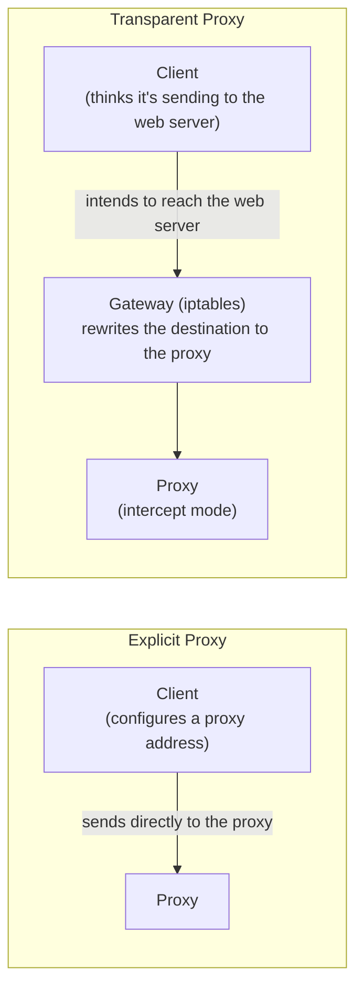

## Introduction

- **What You'll Learn From This Article**: Unlike [the explicit proxy you built in the Squid hands-on](/en/articles/squid-proxy-handson-guide) — where **the client itself configures a proxy address** — build, with your own hands, by combining iptables's traffic interception with Squid's intercept mode, **a "transparent proxy," which forces traffic through a proxy with zero configuration on the client's side at all.**
- **Intended Audience**: Readers who've worked through the explicit-proxy hands-on, but can't explain exactly what mechanism lets a "transparent proxy" force traffic through a proxy with no client configuration.
- **Estimated Reading Time**: About 25 minutes, including the hands-on exercise

This article is part of the [Top 1% Series Complete Article Guide](/en/sitemap), and the ninth article in the [Web Proxy/Caching Series](/en/sitemap#series-list). You can follow along with one of the Ubuntu Server environments set up in the [Hands-On Prep Manual](/en/articles/handson-prep-guide).

## Prerequisite Knowledge

- **Basic Squid Operations**: The basic Squid configuration covered in [the Squid explicit-proxy hands-on](/en/articles/squid-proxy-handson-guide).
- **iptables Fundamentals**: The packet-filtering fundamentals covered in [iptables (netfilter)](/en/articles/linux-iptables-guide).

## Getting the Big Picture

With an explicit proxy, **the client itself needed to know "HTTP traffic to this address goes to the proxy server."** A transparent proxy flips this premise entirely. **The client keeps thinking it's communicating directly with the destination web server, exactly as usual, while that traffic gets intercepted into the proxy midway through the network (at the gateway), without the client ever noticing.**



## Hands-On Steps

### Step 1: Start Squid in Intercept Mode

```bash
sudo apt install -y squid
```

Add the intercept mode configuration to `/etc/squid/squid.conf`.

```
http_port 3129 intercept
```

**An ordinary Squid handles requests that arrive addressed explicitly "to the proxy," but specifying `intercept` lets Squid itself correctly relay a request even when its destination was disguised (it was actually addressed to a web server).**

```bash
sudo systemctl restart squid
```

### Step 2: Intercept HTTP Traffic Into Squid With iptables

```bash
sudo iptables -t nat -A PREROUTING -i eth0 -p tcp --dport 80 -j REDIRECT --to-port 3129
sudo iptables -t nat -L PREROUTING -n -v
```

**Output (relevant part):**

```
REDIRECT   tcp  --  eth0   *       0.0.0.0/0            0.0.0.0/0            tcp dpt:80 redir ports 3129
```

**This rule forwards every piece of traffic arriving on `eth0`, addressed to port 80 (HTTP), to the local port 3129 (Squid).** This is exactly the registration of a rule with netfilter you learned in [How iptables Works](/en/articles/linux-iptables-guide).

### Step 3: Confirm Communication From the Client Side, With No Proxy Configuration at All

From a separate machine (the client), configure it to route through this gateway, and communicate with no proxy configuration at all.

```bash
curl -v http://example.com/ 2>&1 | grep -E "Connected to|X-Cache"
```

**Output (relevant part):**

```
* Connected to example.com (203.0.113.1) port 80
```

**The client side still thinks it's connecting directly to `example.com`.** But checking Squid's log reveals that Squid actually relayed this traffic.

```bash
sudo tail -f /var/log/squid/access.log
```

**Output (relevant part):**

```
... TCP_MISS/200 ... GET http://example.com/ ...
```

**The log confirms that, entirely invisible to the client, Squid received this traffic, checked its cache, and relayed it to the real web server.**

<details>
<summary>Why the Client Never Notices the Destination Got Rewritten</summary>

**iptables's REDIRECT target rewrites a packet's destination IP address and port inside the kernel, but the client side's own TCP connection keeps being recognized by the client's OS as a connection established to `example.com`.** This rewrite happens after the client sends the packet, as it passes through the gateway, so **the client itself normally has no way to participate in, or even notice, this rewrite.** That's exactly why it's called "transparent."

</details>

## What a Pro Sees Here (Top 1% Understanding)

### A Transparent Proxy Trades "Convenience" for "Communication Trustworthiness"

A transparent proxy's biggest advantage is **forcing proxy-routed traffic across every device inside an organization in one shot, without configuring each one individually.** But this convenience comes at a cost. **Because the client can never be aware it's being routed through this proxy, encrypted traffic like HTTPS can't, in principle, have its destination rewritten and its contents inspected (certificate validation would fail).** A transparent proxy only works for unencrypted HTTP traffic, or when combined with a separate TLS decryption mechanism. **A top-1% engineer understands that the design advantage of "the client never notices" always sits right next to a trustworthiness trade-off: "the client has no way to verify its traffic is being intercepted at all."**

## Common Misconceptions and Pitfalls

- **Misconception 1: "A transparent proxy is always superior to an explicit proxy."**
  A transparent proxy has the advantage of skipping client-side configuration, but it also carries constraints an explicit proxy doesn't have, like how it handles encrypted traffic.
- **Misconception 2: "iptables's REDIRECT rewrites the packet's content itself."**
  REDIRECT only rewrites the packet's destination IP address and port number. The packet's payload (the actual data) is never changed.
- **Misconception 3: "Building a transparent proxy lets you automatically relay and cache HTTPS traffic too."**
  Because the client validates the destination's certificate for HTTPS, silently rewriting the destination causes certificate validation to fail, and the communication itself breaks down entirely.

## Troubleshooting Perspective

1. **HTTPS traffic started failing after configuring a transparent proxy**: Check whether a certificate validation error is occurring. A transparent proxy is a mechanism premised on unencrypted HTTP traffic.
2. **Traffic isn't reaching Squid despite configuring the iptables rule**: Check whether `intercept` is correctly specified on Squid's `http_port`. With an ordinary port specification, intercepted traffic can't be processed correctly.
3. **Unintended traffic is also getting forwarded to the proxy**: Check whether the iptables rule's interface and port number are scoped precisely to what you intended.

## Summary

- A transparent proxy intercepts HTTP traffic into a proxy midway through the network, with no client-side configuration.
- iptables's REDIRECT target rewrites a packet's destination to the local Squid instance, and Squid's intercept mode correctly processes that rewritten traffic.
- The client side normally has no way to notice its traffic is being intercepted.
- A transparent proxy trades convenience for a constraint: it can't handle encrypted traffic.

**Takeaways to Apply Today**
1. When considering a transparent proxy, always confirm upfront that its scope is limited to HTTP traffic.
2. Whenever you encounter a design that rewrites network traffic with iptables, always ask yourself "how does this look from the client's side?"

## References

- [Squid: Feature: Transparent Proxying / Interception Proxying](https://wiki.squid-cache.org/Features/Tproxy4)
- [iptables(8) Manual Page](https://man7.org/linux/man-pages/man8/iptables.8.html)
