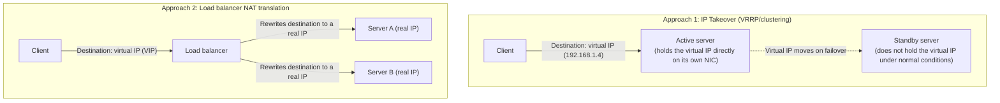
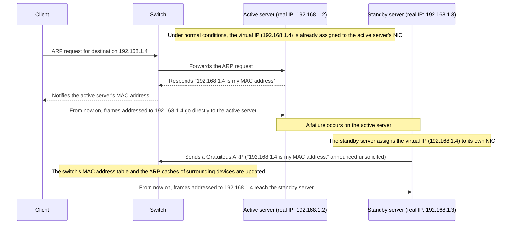
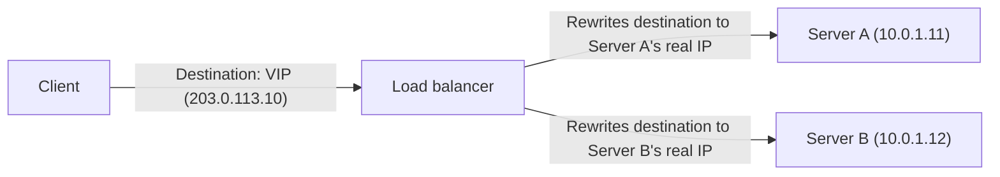
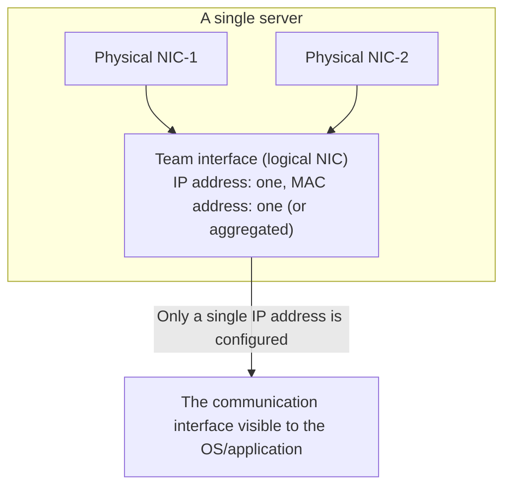

## Introduction

- **What You'll Learn From This Article**: How does the "virtual IP (VIP, Virtual IP Address)" that clients use to access a group of redundant servers correspond to the IP addresses of the physical servers actually running behind it? You'll come away with a systematic understanding that there are two approaches with fundamentally different characteristics: realizing this correspondence through "translation" (NAT), versus having "the IP address itself assigned directly to the active server" (IP takeover)—as well as how NIC teaming, another kind of "virtual IP," works, and how it differs from the two approaches above.
- **Intended Audience**: This article is aimed at infrastructure engineers who have used redundant servers (clustered configurations, or server groups behind a load balancer) but can't concretely explain how traffic addressed to the virtual IP actually reaches a specific server.
- **Estimated Reading Time**: About 20 minutes

This article is part of the [Top 1% Series' full article guide](/en/sitemap).

## Prerequisites

- **IP Address / MAC Address**: An IP address is a logical address at the network layer (L3); a MAC address is a physical address assigned to a NIC at the data link layer (L2). When communicating within the same L2 segment, the sender resolves the MAC address corresponding to the destination IP address using ARP (Address Resolution Protocol).
- **Default Gateway**: The IP address of the router that a device designates as the first hop when sending a packet addressed to a network other than its own.
- **High Availability (HA)**: A design philosophy in which a standby system is prepared in advance so that the overall service can continue even if a single device or link fails.

## Getting the Big Picture

### In a Nutshell

**A virtual IP (VIP) is an IP address that makes multiple physical servers (or multiple physical NICs) appear to clients as "a single logical destination."** There are two approaches with fundamentally different characteristics for achieving this.

**In Approach 1 (IP takeover), there is no "translation" whatsoever between the virtual IP and the real IP.** The virtual IP itself is simply assigned directly to the NIC of whichever physical server happens to be active at that moment. **In Approach 2 (load balancer NAT translation), packets addressed to the virtual IP are literally rewritten to a real IP through NAT (destination address translation).** Both approaches produce the same result—"clients see a single virtual IP"—but the underlying mechanisms are fundamentally different. Being able to distinguish between them is the core of this article.

## Fundamentals, Thoroughly Explained

### Approach 1: IP Takeover — The Active Server Holds the Virtual IP Directly

**IP takeover** is the approach used by Windows Server Failover Clustering, Linux's Keepalived (VRRP), and Cisco's HSRP, among others. Here, there is no translation process between the virtual IP and the real IP at all; in reality, **the virtual IP address itself is additionally assigned to the NIC of the active server**.

There are two key points:

1. **Under normal conditions, the virtual IP is always held by exactly one server (the active one) at a time.** Two servers never simultaneously claim the same IP address (doing so would trigger the "IP address conflict" problem discussed later); clustering software (Windows Server Failover Clustering, keepalived, etc.) continuously monitors "which server is currently active" and exclusively controls the assignment of the virtual IP.
2. **When failover (a switchover) occurs, the newly active server adds the virtual IP to its own NIC and sends a Gratuitous ARP** (an unsolicited ARP—an ARP packet sent proactively, without having been requested, announcing "this IP is my MAC address"). This immediately updates the switch's MAC address table and the ARP caches of surrounding devices, so that traffic addressed to the virtual IP thereafter reaches the newly active server.

**In this approach, there is no such thing anywhere as a "translation table between the virtual IP and the real IP."** At any given moment, the virtual IP (192.168.1.4) simply is one of the active server's own IP addresses; its relationship to the real IPs (192.168.1.2 and 192.168.1.3) is that **multiple IP addresses are simultaneously assigned to the same NIC**.

VRRP/HSRP: A Standardized Protocol

**VRRP (Virtual Router Redundancy Protocol, RFC 5798)** is a protocol standardized primarily for router/gateway redundancy, and is based on nearly the same idea as Cisco's proprietary HSRP (Hot Standby Router Protocol). Multiple routers form a single logical entity called a "virtual router," and the one with the highest priority acts as the master, holding the virtual IP (the VIP) and a virtual MAC address. If the advertisements (liveness announcements) the master sends at regular intervals stop arriving, the router with the next-highest priority becomes the new master and takes over the virtual IP and virtual MAC address. Here too, Gratuitous ARP plays the key role of propagating the switchover immediately. Server clustering and router redundancy serve different purposes, but they share the same basic structure: "multiple entities exclusively share a single virtual address, and Gratuitous ARP announces the switchover."

### Is the Real IP Actually Necessary, and Where Is "Which Server Is Active" Decided?

Given everything above, you might wonder: if the active server simply holds the virtual IP directly, is a separate real IP even necessary? Couldn't the server just run on the virtual IP alone? In practice, the real IP is essentially never omitted, for two reasons.

- **The virtual IP can move to a different server at any moment.** If you managed the active server itself (SSH/RDP logins, health monitoring from a monitoring agent, patching, and so on) through the virtual IP, then the moment a failover occurs, the machine you're actually managing would silently switch to a different physical server, and you'd lose track of which physical box you're actually talking to. The real IP, by contrast, always points at that specific physical server regardless of the virtual IP's current state — it's a fixed destination.
- **The heartbeat traffic that clustering software uses to monitor liveness between nodes runs over the real IP, not the virtual IP.** Each server periodically sends liveness packets to the other server's real IP to determine which of them is currently alive. If that monitoring traffic itself depended on the virtual IP — which is exactly the thing that might be moving — the whole basis for the decision would be undermined.

The determination of "which server is active" isn't made by some external management server or central database. **Each server in the cluster determines this itself, in a distributed (autonomous) fashion, through this heartbeat traffic.** The specific election algorithm differs by implementation — VRRP elects a master by comparing each router's configured "priority"; Windows Server Failover Clustering manages resource ownership based on maintaining a quorum (a majority) of the cluster — but in every case, this is **not a centralized scheme where one server manages everything; it's a distributed-systems design in which peer servers exchange messages and reach agreement on equal footing.**

What Happens with Cold Standby (Where the Standby Server Is Powered Off Under Normal Conditions)?

In a "cold standby" configuration, where the standby server itself is powered off under normal conditions, the heartbeat traffic described above isn't running on the standby side at all, so an autonomous, immediate failover like VRRP/HSRP can't happen. In this case, switching the virtual IP is handled not by autonomous agreement between clustering software instances, but by an outer orchestration layer: **an external monitoring system (or an operator) detects that the active server has gone down, and powers on the standby server.** The standby server has both its real IP and virtual IP assignment already configured in advance — while it's powered off, that configuration simply isn't active yet. Once the OS and clustering software come up after boot, both the real IP and the virtual IP are bound to that NIC at the same time, and a Gratuitous ARP is sent. In other words, even here, the virtual IP itself isn't literally handed off between machines as data — what changes is which server currently has that address bound — the same underlying structure as hot standby.

### Approach 2: Load Balancer NAT Translation — Rewriting the Virtual IP to a Real IP

By contrast, the approach used by **load balancers (F5 BIG-IP, HAProxy, cloud-managed load balancers, etc.)** is literally the NAT (Network Address Translation) described earlier. The load balancer itself holds the virtual IP (VIP); after receiving a packet from a client, it **rewrites the destination IP address to the real IP address of whichever server it wants to actually process the request**, then forwards it.

This approach has characteristics that the IP takeover approach does not:

- **Traffic can be distributed across multiple real servers simultaneously** (load balancing). IP takeover essentially performs a 1-to-1 switchover, since "only one server ever holds the virtual IP at a time," but a load balancer can distribute traffic addressed to a single virtual IP to a different real server each time.
- **The load balancer itself can become a single point of failure.** For this reason, it's common to make the load balancer itself redundant as a pair, with the pair using the IP takeover approach described above to hand off the virtual IP between them—**a configuration that combines both approaches** ("the load balancer's virtual IP uses IP takeover, and distribution to the servers behind it uses NAT translation," a two-layer design).

### Why "Translation" and "Takeover" Are Easy to Confuse

Observed from the outside, a redundant system looks the same under either approach: "the client sees only a single virtual IP and is unaware of which server is actually responding." But **the mechanism underneath is completely different**.

| Aspect | IP Takeover (VRRP/clustering) | Load Balancer NAT Translation |
|---|---|---|
| What the virtual IP actually is | At any given moment, one of the active server's own IP addresses | An IP address the load balancer holds, separate from the real servers |
| Translation process | None (the virtual IP is used directly as the server's own IP) | Present (the destination address is rewritten to a real IP each time) |
| Number of servers that can respond on the virtual IP simultaneously | Always exactly one | Multiple (load balancing possible) |
| Switchover mechanism | Announcing the MAC address via Gratuitous ARP | The load balancer's internal distribution table (based on health check results, etc.) |

The **cluster IP address (Client Access Point)** in Windows Server Failover Clustering falls under Approach 1 (IP takeover). To the question "how is the virtual IP actually translated into a real IP?", the practically accurate answer is often: **depending on the configuration, no translation exists at all—the virtual IP itself is simply assigned directly to the active server.**

### NIC Teaming's Virtual IP: Making Multiple Physical NICs Look Like One

Everything discussed so far as "virtual IP" has been about making **multiple physical servers (or physical routers) appear as one**. Separately from this, there's a technology for making **the multiple physical NICs on a single server appear as a single logical NIC to layers above the OS**—this is **NIC teaming** (called **LBFO: Load Balancing/Failover** in Windows Server, **bonding** in Linux, and standardized as **IEEE 802.3ad (LACP)**).

What's visible to the OS and applications with NIC teaming is **always a single logical interface with a single IP address, regardless of how many physical NICs there are**. The multiple physical NICs are used "underneath" this logical interface for load balancing (distributing traffic across NICs based on source, etc.) and redundancy (continuing communication using the remaining NICs even if one cable/NIC fails), but **from the standpoint of IP address management, no translation or switchover is ever visible to the client—it always behaves as a single IP address.**

There are broadly two configuration modes for teaming:

- **Switch-independent mode**: Teaming is configured entirely on the server side, with no special configuration required on the connected switch. Typically, only one physical NIC actively sends and receives at a time, with the rest acting as standby (or receive-only), which makes this mode's behavior similar in nature to the IP takeover approach described above.
- **Switch-dependent mode (e.g., LACP)**: Teaming is also configured on the connected switch side (a port channel/LAG), and both the switch and the server recognize "multiple physical links bundled into a single logical link." Multiple physical NICs can be actively used simultaneously, distributing load per flow, which effectively expands available bandwidth.

In switch-independent mode, "which NIC is active" isn't decided through a protocol that negotiates with other servers over the network, the way VRRP/HSRP does. **It's the server's own OS/NIC driver (the teaming driver) that decides locally, based solely on its own link state (detecting a cable unplug or link-down)** — this is the decisive difference from the IP takeover used by a virtual IP. If you configure a "primary/preferred adapter" in advance, that one is preferentially chosen as active under normal conditions, but there's no notion of "normal" versus "abnormal" here — the teaming driver makes a purely mechanical decision based on just two things: the administrator-configured priority, and whether the link is actually up. IP takeover is a case of "multiple separate servers negotiating over the network to decide who holds the address," whereas switch-independent teaming is "a purely local switchover decision that's entirely contained within a single server" — keeping that difference in scope in mind makes the two much harder to confuse.

**NIC teaming's virtual IP and the virtual IP (VIP) discussed earlier share the same underlying idea of "making multiple entities appear as one," but what they're abstracting (multiple NICs within a single server, versus multiple servers) is completely different**—be sure to distinguish them as technologies operating at different layers.

## The View from the Top 1% (What Experts See)

### Why Can Multiple IP Addresses (Real IP + Virtual IP) Coexist Within the Same Segment?

You might feel it's odd that, under the IP takeover approach, a single server (a single NIC) simultaneously holds multiple IP addresses—its real IP and the virtual IP. But this isn't anything special in terms of IP address assignment. Assigning multiple IP addresses to a single physical NIC (**IP aliasing**—in Windows, simply "adding multiple IP addresses"; in Linux, assigning multiple addresses to a single interface with `ip addr add`) is a standard, well-supported feature, and a NIC will process any frame addressed to any of its own IP addresses, regardless of which one. In reality, the active server is simultaneously accepting "traffic addressed to its own real IP" and "traffic addressed to the virtual IP" on the very same NIC.

It's worth distinguishing what a virtual IP actually relies on here: **"IP aliasing" — multiple IP addresses coexisting on the same physical NIC** — from a different arrangement: "provisioning multiple (physical or virtual) network interfaces on a single server, each with its own dedicated IP address." For example, the gateway-side IP address a VPN server hands out to a client isn't added as an IP alias on an existing physical NIC — it's assigned to a dedicated virtual network interface (one end of a point-to-point link) that the OS creates dynamically, which is an example of the latter pattern. Both result in "a single server handling multiple IP addresses at once," but they play different roles: the former (IP aliasing) behaves as an alias on the same L2 segment, while the latter (a dedicated interface) behaves as the entry point to an entirely different link (or segment).

### Why Can an Application Be Reached at an IP the Physical NIC Didn't "Originally" Have?

The property we just saw — that a single physical NIC can hold multiple IP addresses at once (IP aliasing) — isn't limited to cluster use cases like a virtual IP. It's also exactly what's used when you want to **publish a web server or application under an IP address other than the "main" one the NIC originally had.** An IP address isn't physical wiring; it's simply a logical value the OS assigns to a network interface, and an application (a web server, say) can bind its listening socket to any IP address **the OS recognizes as belonging to that host**, whether or not it happens to be the NIC's original "first" address.

There's no restriction that this "locally recognized IP address" has to fall within a particular range like 192.168.x.x. Whether it's a private IP or a public (global) IP, as long as it's actually configured on one of that host's network interfaces, the OS recognizes it as one of its own. Conversely, if you try to bind a socket to an IP address that isn't configured on any interface (one the OS doesn't yet know about), the OS rejects it — on Linux this surfaces as `EADDRNOTAVAIL`, on Windows as the equivalent `WSAEADDRNOTAVAIL`. So if there's an IP address you want to use, you first need to explicitly register it in the OS's network configuration (adding it to a NIC, for instance) — whether at server build time or later — since that's the only way to put the OS into a state where it "recognizes" the address. That's why a request addressed to a secondary IP added later, or to a virtual IP, is still received by that same physical NIC, with the OS's TCP/IP stack dispatching it to the correct socket (application) based on the destination IP address.

### Why Can There Be a "Lag Before It Takes Effect" After Failover?

Gratuitous ARP is a mechanism for actively updating the switch's MAC address table and the ARP caches of devices within the same segment, but **there is no guarantee it will reliably reach every device**. Due to packet loss, or because some devices/network equipment don't immediately update their cache upon receiving a Gratuitous ARP (or ignore it outright), such devices may continue sending traffic to the old MAC address (the former active server) until that device's ARP cache times out (typically a few minutes). The phenomenon where only some clients are unable to connect for tens of seconds to a few minutes right after a failover is often rooted in this lag in ARP cache propagation.

### Beyond Redundancy, Is There a Reason to Split IP Addresses Across Separate Physical NICs and Cables?

Even though multiple IP addresses can coexist on a single NIC, in practice it's also common to **deliberately separate IP addresses by purpose onto physically distinct NICs, cables, and switches, for reasons other than redundancy.** The typical reasons include:

- **Physical traffic separation**: Separating a management interface (such as an iDRAC or IPMI management port) from an interface carrying production data onto physically distinct NICs and switches, so congestion on production traffic doesn't affect management access.
- **Security zone separation**: Physically separating the NIC facing a DMZ exposed to the internet from the NIC facing the internal LAN provides defense in depth—even if a VLAN or firewall rule is misconfigured, there's simply no physical path to communicate over, no matter how hard you try.
- **Physically guaranteed bandwidth**: Dedicating one physical link to a specific purpose (backup traffic, storage traffic, and so on) structurally avoids contention for bandwidth with other traffic.

In every case, it's worth noting that **logically, a VLAN or firewall rule alone can sometimes achieve the same result** — but physically separating the wiring itself provides the reassurance of eliminating the risk of misconfiguration-driven cross-talk between paths at the cabling level itself, which is why physical separation tends to be favored especially for management networks and environments with strict security requirements.

## Common Misconceptions and Pitfalls

- **Misconception 1: "A virtual IP is always implemented via NAT (address translation)."**
  In IP takeover approaches like Windows Server Failover Clustering or keepalived (VRRP), no translation occurs at all—the virtual IP itself is simply assigned directly to the active server's NIC. NAT translation only occurs in approaches that use a load balancer.
- **Misconception 2: "NIC teaming's virtual IP and a cluster's virtual IP are the same mechanism."**
  NIC teaming is a technology for making multiple physical NICs within a single server appear as one logical NIC, while a virtual IP (VIP) is a technology for making multiple servers appear as a single logical destination—they operate at different layers of abstraction.
- **Misconception 3: "As soon as failover happens, all clients immediately connect to the new server."**
  There is no guarantee that Gratuitous ARP propagation reliably and instantly reaches every device on the path. Depending on device implementation and network configuration, a lag of tens of seconds to a few minutes can occur while waiting for an ARP cache to time out.

## Troubleshooting Perspective

Virtual-IP-related troubles are best approached by identifying **"whether the problem is with the IP address assignment itself, or with propagation (ARP)."**

1. **Cannot connect to the virtual IP after a failover**: Check whether the virtual IP has actually been assigned to the new active server (using a command equivalent to `ipconfig`/`ip addr`), and whether the failover itself completed successfully on the clustering software side.
2. **Only some clients keep sending to the old server**: This suggests the ARP cache propagation lag described above. Manually clearing the ARP cache on the affected client (using a command equivalent to `arp -d`) can often restore connectivity immediately, and this can also be used to help isolate the cause.
3. **Communication is unstable even under normal conditions, or errors indicating an IP address conflict appear**: This suggests a fault in the clustering software's exclusive control, where two servers are simultaneously claiming the virtual IP (a split-brain condition). Check the cluster service state on both servers and whether the heartbeat traffic (the network path used for liveness monitoring) is functioning normally.
4. **A specific server behind the load balancer is never selected for distribution**: Check the load balancer's health check configuration and the target server's response (the state of the health check endpoint).

### Prevention and Long-Term Countermeasures

- In a clustering configuration, separate heartbeat traffic onto a dedicated network path apart from business traffic, to prevent false split-brain determinations.
- Perform failover verification (actually triggering a switchover and confirming it takes effect as intended) not just at build time, but as a recurring drill.
- Make the load balancer itself redundant as a standard practice, so it doesn't become a single point of failure.

## Summary

- There are two approaches with fundamentally different characteristics for implementing a virtual IP (VIP): "IP takeover," which assigns the virtual IP directly to the active server, and "NAT translation," in which a load balancer rewrites the destination to a real IP.
- Under the IP takeover approach, there is no translation process between the virtual IP and the real IP—a single NIC simply holds multiple IP addresses simultaneously. Switchover is achieved by announcing the MAC address via Gratuitous ARP.
- NIC teaming's virtual IP is a technology for making multiple physical NICs within a single server appear as a single logical NIC, and operates at a different layer than the virtual IP that makes multiple servers appear as one.
- Temporary connectivity issues right after a failover are, in many cases, caused by a lag in Gratuitous ARP propagation.

**Starting Today**
1. Whenever you encounter the term "virtual IP," first determine whether it's implemented via IP takeover or via a load balancer's NAT translation.
2. When you run into a failover-related issue, first determine whether it's a problem with the IP address assignment itself, or a problem with ARP cache propagation lag.

## References

- [Virtual Router Redundancy Protocol (VRRP) Version 3 | RFC 5798](https://datatracker.ietf.org/doc/html/rfc5798)
- [IEEE Standard for Link Aggregation (802.1AX, LACP)](https://standards.ieee.org/ieee/802.1AX/7237/)
- [Failover Clustering Overview | Microsoft Learn](https://learn.microsoft.com/en-us/windows-server/failover-clustering/failover-clustering-overview)
- [NIC Teaming Overview | Microsoft Learn](https://learn.microsoft.com/en-us/windows-server/networking/technologies/nic-teaming/nic-teaming)
