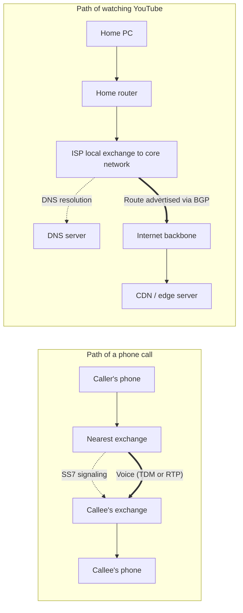
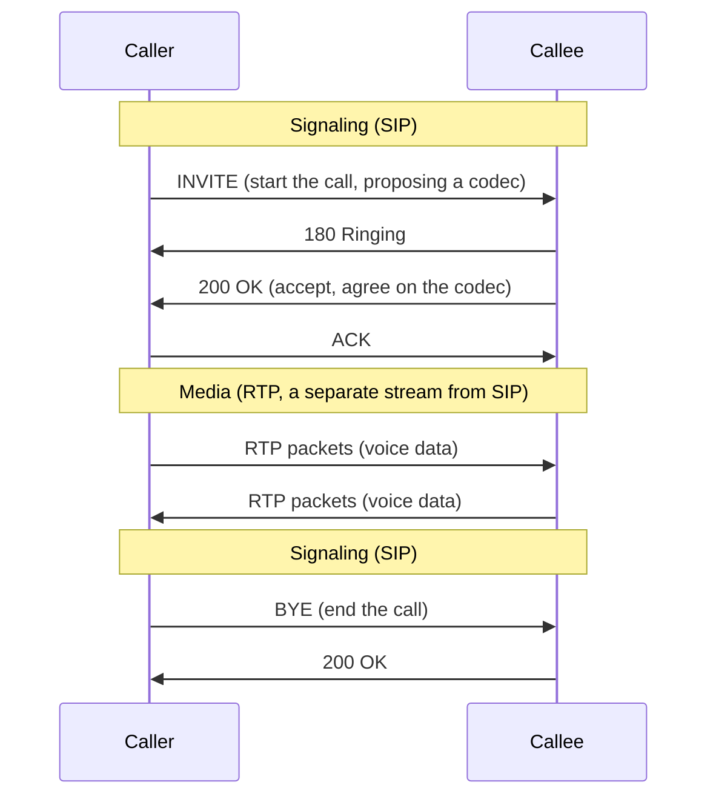

## Introduction

- **What You'll Learn From This Article**: How VoIP technology digitizes and packetizes voice for transmission over an IP network (codecs, RTP, SIP); how SS7 (Signaling System No. 7) handles call setup, teardown, billing, and number management — the "call control" (signaling) side of a telephone network; and the design philosophy behind why signaling (control) and the actual voice (media) are kept on separate channels. You'll also come away with a systematic understanding of exactly what path and protocol stack your home PC actually goes through to reach a service on the internet, contrasted against the path of an ordinary phone call.
- **Intended Audience**: This article is written for infrastructure engineers who've heard the terms "VoIP" and "SS7" but couldn't explain exactly what each one does, and for anyone who wants to sit down once and map out the path and protocol stack behind the internet connections they use every day without thinking about it.
- **Estimated Reading Time**: About 20 minutes

This article is part of the [Top 1% Series' full article guide](/en/sitemap).

## Prerequisites

- **Codec**: A scheme for converting (encoding) an analog voice signal into digital data, and back again (decoding). There's a trade-off between compression ratio and voice quality/latency.
- **UDP/TCP**: Both are transport-layer protocols that run on top of IP. TCP guarantees order and retransmits lost data, at the cost of added latency. UDP skips ordering and retransmission in exchange for low latency, making it preferred for real-time traffic like voice and video.
- **DNS (Domain Name System)**: The hierarchical name-resolution system that translates a human-readable domain name like `youtube.com` into the IP address actually needed for communication.
- **BGP (Border Gateway Protocol)**: The routing protocol through which the countless networks that make up the internet (ISPs and others) exchange route information with each other — essentially, "to reach this block of IP addresses, go through me."

## Getting the Big Picture

### In a Nutshell

**In the core of a modern telephone network (the backbone linking exchanges), either the traditional common-channel signaling system SS7, or SIP, a call-control protocol built for IP networks, handles "call setup and management" (signaling), while the actual voice is packetized as IP traffic and carried by a protocol called RTP (this is VoIP).** What's consistent throughout is a design philosophy of **keeping "the messages that control the path" (signaling) and "the data actually being carried" (media) on separate channels.** Meanwhile, the everyday internet use we take for granted — watching a YouTube video, say — travels a completely different path from the telephone network: home router → access line → ISP → internet backbone → CDN. Contrasting the two deepens your understanding of what a "communication path" even means.

## Fundamentals, Thoroughly Explained

### What Is SS7? A Telephone Network's "Common-Channel Signaling System"

**SS7 (Signaling System No. 7)** is the umbrella name for the group of protocols dedicated to handling a telephone network's "call control" (signaling) — establishing, answering, and tearing down calls, querying number portability, and relaying billing information. SS7 is made up of several components, the two most notable being **MTP (Message Transfer Part)**, which handles the delivery of messages themselves, and **ISUP (ISDN User Part)**, which handles the call-setup/teardown procedures specific to telephone service.

A key design feature of SS7 is that it runs over a **dedicated signaling link, physically separate from the channel that actually carries voice (the bearer channel)** — this is known as out-of-band signaling. This lets exchanges exchange call-control information as messages even before a voice circuit has been established at all. Older telephone networks used in-band signaling, sending the dialed number itself as an audio-band tone signal (MF signaling) — an inefficient approach, since it occupies the voice circuit to carry control information, and one with a well-known vulnerability where an audio signal mimicking that tone could be used to illicitly manipulate an exchange (so-called "phreaking"). The move to SS7 solved both problems.

An easily overlooked fact: SS7 itself is "message switching," not "circuit switching"

Because "telephone network = circuit switching" is such a strong mental image, it's easy to overlook that **SS7 itself is a message-switched protocol stack, relayed message by message from exchange to exchange, rather than flowing over a pre-reserved fixed path.** In other words, while the part of the telephone network that actually carries voice (the bearer) is genuinely circuit-switched via TDM, the part that controls the path — call control (signaling) — has, since very early on, been built around an idea close to packet switching: a message carrying destination information, relayed node by node to the next node along the way. It's easy to miss that "even inside a circuit-switched telephone network, packet-switching-like elements have existed for a long time." Framing it this way makes the contrast between the telephone network and an IP network much richer.

### What Is VoIP? Carrying Voice as IP Packets

**VoIP (Voice over IP)** is often mistaken for the name of an "internet phone service" like Skype or LINE calling, but it more precisely refers to **the entire category of technology that digitizes and packetizes voice for transmission over an IP network.** The fact that a carrier's core network transmits voice over IP internally is also VoIP, in this broader sense.

Two component technologies underpin VoIP:

- **Codecs**: Schemes for converting analog voice into digital data. **G.711**, traditionally used in telephone networks, applies almost no compression and prioritizes voice quality (64kbps), while **G.729** and **Opus** compress more aggressively to reduce the bandwidth required. There's a trade-off between bandwidth, CPU load, and voice quality.
- **RTP (Real-time Transport Protocol, RFC 3550)**: The protocol that actually carries the codec-encoded voice data as IP packets. It runs on top of UDP to prioritize low latency, attaching a sequence number and timestamp to each packet so the receiving side can detect and correct for lost packets, out-of-order arrival, and jitter (variation in playback timing). Its companion protocol, **RTCP (RTP Control Protocol)**, periodically exchanges statistics on communication quality, such as packet loss rate and delay.

### SIP: The IP-Network Equivalent of "Call Control"

The role SS7 plays in a telephone network — establishing and managing a call (signaling) — is played, in the world of IP networks, by **SIP (Session Initiation Protocol, RFC 3261)**. SIP manages a call session from start to finish by exchanging HTTP-like, text-based messages: `INVITE` (start the call), `200 OK` (accept), `ACK` (confirm), and `BYE` (end).

**Notice that the same design philosophy as SS7 shows up again here.** SIP is only responsible for controlling the session (signaling) — deciding who to call, and which codec to use — while the actual voice data flows as an RTP stream established separately from the SIP exchange. This separation of control (SIP) from data (RTP) rests on a strikingly similar idea to the telephone network's separation of "SS7 (signaling) from the TDM bearer channel (data)."

How do traditional SS7 networks and IP-based SIP networks actually connect to each other?

Even though fixed-line and mobile switching networks have largely moved their core to IP, plenty of SS7-based equipment and interconnecting carriers still exist. In real carrier networks, a device called a **signaling gateway** acts as the bridge, translating between SS7 messages and SIP messages. In the mobile world, this idea has been taken further with **IMS (IP Multimedia Subsystem)**, a framework that unifies voice calling and every other service onto a single IP-based architecture, and which underpins voice calling (VoLTE/VoNR, etc.) on 4G/5G networks.

### A Concrete Example of the Real Path: Watching a YouTube Video on Your Home PC

Contrasting with the telephone-network story above, let's walk through exactly what path and protocol stack something we do every day — watching a YouTube video on a home PC — actually travels through.

1. **Inside the home (L1/L2)**: The PC connects to the home router over Wi-Fi or an Ethernet cable. L2 forwarding based on MAC addresses happens here.
2. **Through the access line to the ISP (L1/L2)**: The home router connects, over an access line such as ADSL or fiber, to the local exchange of the subscribed ISP (internet service provider).
3. **DNS resolution (L7)**: The PC first queries a DNS server to resolve the domain name `youtube.com` into an IP address. In most cases a mechanism called Anycast routes this query to a geographically nearby, fast-responding DNS server.
4. **From the ISP's core network to the internet backbone (L3)**: Packets that traverse the ISP's internal network are forwarded onto the internet backbone following route information exchanged worldwide via **BGP (Border Gateway Protocol)**.
5. **Reaching a CDN (Content Delivery Network) (L3–L7)**: A large-scale service like YouTube caches its content on **CDN edge servers** distributed around the world (in Google's case, a mechanism called GGC, or Google Global Cache, among others), and the user is directed — either at DNS-resolution time or via an HTTP-level redirect — to the edge server that's geographically and network-topologically closest.
6. **TLS handshake and HTTPS traffic (L4–L7)**: A connection to the edge server is established over TCP (or, increasingly, QUIC/HTTP3), an encrypted TLS handshake follows, and the actual video data is exchanged over HTTPS.

**Comparing this with the path of a phone call makes the difference in design philosophy stand out.** In a telephone network, SS7 signaling relays exchange by exchange, within the dedicated namespace of phone numbers, to establish and maintain a single path to the callee for the duration of one call. The internet's path, by contrast, is determined dynamically, per destination and per packet, through the combination of several independent mechanisms: hierarchical name resolution via DNS, dynamic route advertisement between countless networks via BGP, and geographic optimization via a CDN. Where a telephone network is built around the idea of "one dedicated path per call," the internet has no such concept at all — there is no "dedicated path for this particular communication." Keeping this contrast in mind makes the difference in design philosophy between the two much clearer.

## The View from the Top 1% (What Experts See)

### SS7's Vulnerabilities: Why It's Said a Phone Number Alone Can Enable Tracking or Interception

SS7 was designed in the 1970s **on the premise that it would only ever run over a closed network connecting a small set of trusted operators.** As a result, it has no built-in mechanism to strongly authenticate the origin of a message or to encrypt its contents. Today, however, the expansion of international interconnection and the existence of operators offering access to SS7 networks mean that third parties never envisioned in the original design have, in reported cases, been able to inject messages into SS7 networks — enabling attacks (so-called SS7 hacks) that **obtain a user's approximate location, or intercept two-factor authentication codes sent via SMS.** This is a textbook example of a pattern that recurs throughout infrastructure history: an assumption baked in at design time (that it would only ever be used within a closed, trusted relationship) eroding as interconnection expanded in later years.

### VoIP Call Quality Depends on Prioritization at the Network Level

Because RTP runs on top of UDP, it gets none of TCP's congestion control or retransmission. That means when voice traffic shares an IP network with other bulk traffic — a large file transfer, say — voice packets can get deprioritized, worsening **jitter (variation in arrival timing), delay, and packet loss**, and degrading call quality. This is exactly why, when deploying VoIP (IP telephony) within an organization, it's often necessary to configure **QoS (Quality of Service)** mechanisms — such as priority marking via DiffServ — to give voice traffic preferential treatment.

## Common Misconceptions and Pitfalls

- **Misconception 1: "VoIP refers only to internet phone services like Skype or LINE calling."**
  VoIP is the umbrella term for technology that packetizes voice for transmission over IP, and carriers' core networks increasingly transmit voice this way internally too. Some of the calls you think of as ordinary "landline" calls are, internally, carried over VoIP.
- **Misconception 2: "SS7 is circuit switching itself, and has nothing to do with packet switching."**
  SS7 itself is a message-switched protocol, relayed between exchanges message by message rather than over a fixed path. A telephone network splits into "the part that carries voice" (circuit-switched) and "the part that handles call control" (an idea close to message switching).
- **Misconception 3: "The internet's communication path is a single fixed route, like a phone call."**
  The internet's path is determined dynamically, per destination and per packet, through the combination of several independent mechanisms — DNS name resolution, dynamic BGP route advertisement, and geographic optimization via a CDN. There's no equivalent, on the internet, to a telephone network's "one dedicated path per call."

## Troubleshooting Perspective

### Isolating VoIP Call-Quality Degradation

When calls drop or sound poor, the fix depends on the cause, so start by **identifying which of jitter, packet loss, or delay is dominant.** Check whatever admin console exposes the statistics RTCP periodically exchanges (packets received, loss rate, jitter value), or capture packets directly with `tcpdump` and look for gaps in the RTP stream's sequence numbers or irregular timestamp spacing. From there, isolate further: if the cause is network congestion, revisit your QoS configuration; if it's delay in a specific segment, check the route with a traceroute.

### Isolating Internet Connectivity Failures

For "I can't reach the site" symptoms too, first isolate **which stage is failing: DNS resolution, reachability somewhere along the path, or the TLS handshake.** Check whether DNS resolution succeeds with `nslookup`/`dig`, check where along the path responses stop coming back with `traceroute`/`mtr`, and if that still doesn't resolve it, check higher-layer causes such as an expired TLS certificate or an SNI misconfiguration. That's the standard order of isolation.

## Summary

- SS7 is the group of protocols that handles a telephone network's call control (signaling), operating as a message-switched protocol over a link separate from the actual voice channel. A telephone network splits into "the part that carries voice" (circuit switching) and "the part that handles call control" (an idea close to message switching).
- VoIP isn't the name of a service like Skype — it's the umbrella term for technology that digitizes and packetizes voice for transmission over an IP network, and it's used inside carriers' core networks too. RTP carries the voice data; SIP handles call control, playing the role SS7 plays in a telephone network.
- SIP/RTP repeat the same design philosophy as SS7/TDM: keeping control (signaling) and data (media) on separate channels.
- Using the internet from a home PC involves a path determined per destination through the combination of DNS name resolution, dynamic BGP route advertisement, and geographic optimization via a CDN — there's no equivalent, on the internet, to a telephone network's "one dedicated path per call."

**Starting Today**
1. When you see the word "VoIP," remember it refers to the entire category of technology that packetizes voice for transmission over IP, not just internet phone services.
2. When you hit a communication problem, get in the habit of first isolating whether it's happening at the "signaling" stage (establishing the path/session) or the "actual data transfer" stage.

## References

- [SIP: Session Initiation Protocol | RFC 3261](https://datatracker.ietf.org/doc/html/rfc3261)
- [RTP: A Transport Protocol for Real-Time Applications | RFC 3550](https://datatracker.ietf.org/doc/html/rfc3550)
- [Signalling System No. 7 (SS7); Overview | ITU-T Q.700](https://www.itu.int/rec/T-REC-Q.700)
- [ISDN User Part (ISUP) | ITU-T Q.761-Q.767](https://www.itu.int/rec/T-REC-Q.761)
