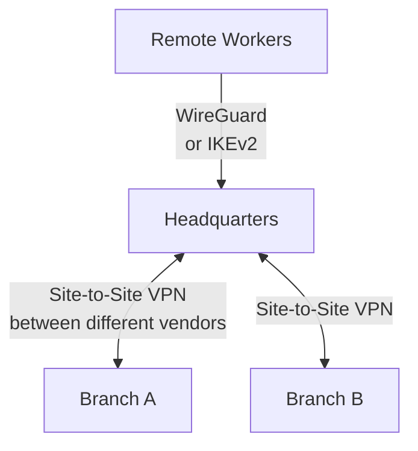

## Introduction

- **What You'll Learn From This Article**: This is the VPN Department's capstone project, where you'll **integrate, on your own, the techniques you've learned one at a time in earlier hands-on labs** (Site-to-Site VPN, WireGuard, L2TP/IPsec, PSK hardening via IKEv2, troubleshooting on failure) **into a single fictional multi-site company's VPN infrastructure.** Where earlier articles aimed at "following steps to reliably master one technique," this article takes a format much closer to real-world work: **presenting only requirements, and leaving you to design which techniques to combine, and how.**
- **Intended Audience**: Readers who've worked through the VPN Department's Junior, Senior, and Graduate School content and can execute each individual hands-on lab, but have never designed a single VPN infrastructure combining them.
- **Estimated Reading Time**: Expect several days to about a week, including design, building, and documentation (the heaviest single hands-on in this series).

This article is part of the [Top 1% Series Complete Article Guide](/en/sitemap). It's positioned as the capstone project within the [VPN Department's full curriculum](/en/university#vpn-department).

## Prerequisite Knowledge

This hands-on doesn't teach any new technique. **You'll combine and use the techniques you've already mastered in the following completed hands-on labs.**

- [The Top 1% Hands-On for Building Your Own L2TP/IPsec Server and Verifying the Theory With Your Own Eyes](/en/articles/l2tp-ipsec-lab-guide)
- [The Top 1% L2TP/IPsec Troubleshooting Exercise](/en/articles/l2tp-ipsec-troubleshooting-lab)
- [The Top 1% Hands-On for Building a WireGuard Tunnel Yourself and Experiencing Cryptokey Routing](/en/articles/wireguard-handson-guide)
- [The Top 1% Hands-On for Simulating a Site-to-Site IPsec Tunnel Between Different Vendors With strongSwan](/en/articles/site-to-site-vpn-handson-guide)
- [The Top 1% Hands-On for Reproducing an Offline Dictionary Attack on IKE Aggressive Mode and PSK, and Defending With a Move to IKEv2](/en/articles/ike-psk-cracking-handson-guide)
- [Understanding SD-WAN and Edge Router Selection From a Top 1% Perspective](/en/articles/sdwan-edge-router-guide)

## The Assignment: a Fictional Multi-Site Company's VPN Infrastructure

**You're a network engineer at a fictional logistics company, "KoiKoi Logistics." The company has a headquarters and two branch offices, and recently adopted remote work, creating a need to securely connect multiple sites and remote workers. Your assignment is to build, on your own, a VPN infrastructure that satisfies all of the following requirements.**

### Requirement 1: Connect Headquarters and a Branch Even Across Different Vendors' Devices

**Headquarters and Branch A use VPN equipment from different vendors. Build a vendor-neutral, standards-based Site-to-Site tunnel.**

### Requirement 2: Provide a Modern, Lightweight VPN for Remote Workers

**For remote workers' devices, adopt a lighter, faster, more modern VPN technology instead of the older VPN clients that are complex to configure and slow to connect.**

### Requirement 3: Account for Coexistence With Legacy Clients

**Some older devices don't support the newer VPN technology. Maintain the traditional mechanism in parallel so those devices can still connect.**

### Requirement 4: Eliminate the Risk of an Offline Dictionary Attack Against the Pre-Shared Key (PSK)

**In the older IKE phase, a weak implementation can expose the PSK to an offline dictionary attack. Adopt an approach that structurally eliminates this risk.**

### Requirement 5: Establish a Setup Where You Can Isolate the Cause of a Failure From Logs, Yourself

**Document, as a runbook, which logs to check and in what order, so you can rapidly identify the cause when a VPN connection issue occurs.**

### Requirement 6: Show a Direction for Network Design That Anticipates Future Site Growth

**More branches may be added in the future. Document a design direction that anticipates the point where manually adding individual VPN tunnels per site, one at a time, eventually hits a wall.**

## Deliverable Requirements: Assemble It as a Portfolio

**This hands-on's final deliverable isn't just a record confirming the connection worked.** Put together a repository, on GitHub or similar, containing:

- **README.md**: An overview of this scenario, and the full picture of the VPN infrastructure you adopted (including diagrams, such as Mermaid).
- **A record of your design decisions**: Why you chose that specific technology or protocol — especially anywhere a cross-vendor compatibility versus security-strength trade-off came up.
- **The steps you actually took**: A record of the configuration commands and config files you actually used (be sure to remove any sensitive information, such as pre-shared keys or private keys).
- **A retrospective**: What challenges you discovered while doing this, and what you'd additionally consider in genuine real-world work (a centrally managed VPN concentrator, migrating to ZTNA, and similar).

**This deliverable itself is a concrete accomplishment you can present in a job search or as a portfolio piece.** Being able to show "I designed a solution combining multiple technologies under the realistic constraints of a multi-site company with mixed remote workers, and can articulate the compatibility-versus-security trade-offs" is far more persuasive than simply saying "I did the WireGuard hands-on."

## What a Pro Sees Here (Top 1% Understanding)

### "Following Steps" and "Designing From Requirements" Are Entirely Different Skills

Every earlier hands-on in this series took the form of "Step 1, Step 2, ..." — following a fixed, predetermined sequence. **But what actually gets valued in real-world work isn't the ability to execute a procedure exactly as written — it's the ability to look at given requirements (Requirements 1 through 6 in this article) and design, yourself, which technologies to combine, and how.** These are similar-looking but entirely different skills. Completing every individual hands-on doesn't make you immediately effective in real work if you've never designed one coherent VPN infrastructure combining them. This capstone project is deliberately designed to bridge exactly that gap.

### Why a "Multi-Site Plus Remote Work" Setting?

There's a reason this hands-on deliberately models a realistic project with multiple sites and multiple generations of clients coexisting, instead of a single-shot technical demo. **Most real-world VPN rollouts never wrap up with a single technology alone — they need to simultaneously satisfy multiple constraints: cross-vendor compatibility, differences between client generations, and future extensibility.** Knowing how to build a Site-to-Site VPN alone doesn't help in a real project if you can't also see ahead to remote-access technology selection, legacy coexistence, and future design. The ultimate goal of this capstone is elevating your knowledge of individual technologies into **the design ability to satisfy multiple constraints at once.**

## Common Misconceptions and Pitfalls

- **Misconception 1: "This hands-on has one fixed, correct technology choice."**
  There's no single correct answer here. Multiple valid approaches exist as long as they satisfy the requirements. Recording the design you chose, and why, in README.md is what matters.
- **Misconception 2: "A confirmation that the connection worked is sufficient as a deliverable."**
  Confirming it works matters, but it's not enough on its own. Being able to articulate the reasoning behind your design decisions is this hands-on's real value.
- **Misconception 3: "Having completed every individual hands-on means this one will go quickly too."**
  There's a real gap between knowing individual techniques and integrating them into one coherent design. Expect this to take considerable time.

## Troubleshooting Perspective

This hands-on's main challenge isn't individual technical troubleshooting — it's **design rework.**

1. **You thought you satisfied the requirements, but notice a contradiction later**: Before starting implementation, write out only the design section of README.md first, and confirm on paper that all six requirements are genuinely satisfied.
2. **You've forgotten the steps for an individual hands-on**: Don't hesitate to go back and re-read the prerequisite article for that requirement. This capstone tests design ability, not memorization.
3. **You're not sure how thorough to make this**: Use "could I show this README.md to an interviewer I've never met and explain my design decisions" as your bar for completeness.

## Summary

- This capstone project is an integrative exercise combining the techniques you've learned individually in the VPN Department, into a single fictional multi-site company's VPN infrastructure.
- What's being tested is the ability to design from requirements yourself, not the ability to follow a procedure.
- Assemble your deliverable as a portfolio piece — a document articulating the reasoning behind your design decisions, not just confirmation it worked.

**Takeaways to Apply Today**
1. Even while learning individual hands-on labs, build the habit of asking "under what future requirements would I actually use this?"
2. Beyond the technical deliverable itself, build the habit of articulating compatibility-versus-security trade-offs in your day-to-day work too.

## References

- [The VPN Department's Full Curriculum](/en/university#vpn-department)
